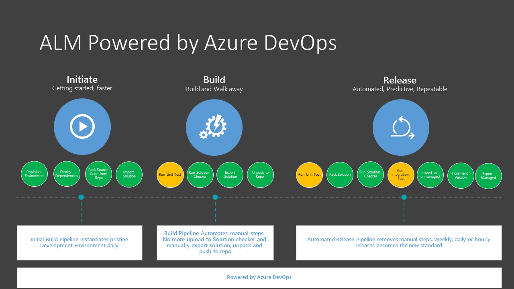
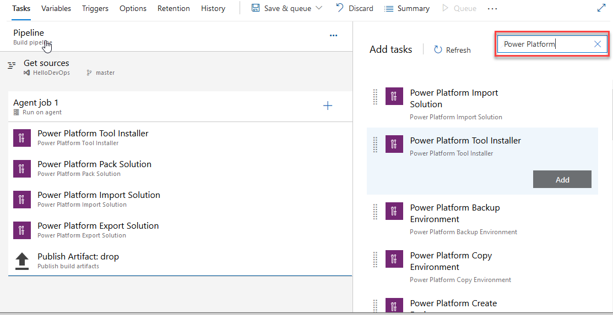

# Microsoft Power Platform Build Tools for Azure DevOps

Use Microsoft Power Platform Build Tools to automate common build and deployment tasks related
to apps built on the Power Platform. These tasks include: 

<ul><li>Synchronization of solution metadata (also known as
solutions) that contains the various platform components such as customer engagement apps (Dynamics 365 Sales, Customer Service, Field Service, Marketing, and Project Service Automation), canvas apps, model-driven apps, UI flows, virtual agents, AI Builder models, and connectors between development environments and source control</li></ul>
<ul><li>Generating build artifacts</li></ul>
<ul><li>Deploying to downstream environments</li></ul>

<ul><li>Provisioning or de-provisioning
environments</li></ul>

<ul><li>Perform static analysis checks against solutions by using the Power Apps checker service</li></ul>

Microsoft Power Platform Build Tools tasks can be used along with any other available
Azure DevOps tasks to compose your build and release pipelines. Pipelines
that teams commonly put in place include Initiate, Export from Dev, Build, and Release.

> [!NOTE] 
> Microsoft Power Platform Build Tools are supported only for a Microsoft Dataverse environment with a database. More information: [Create an environment with a database](/power-platform/admin/create-environment#create-an-environment-with-a-database)

## What are Microsoft Power Platform Build Tools?

Microsoft Power Platform Build Tools are a collection of Power Platform&ndash;specific Azure DevOps
build tasks that eliminate the need to manually download custom tooling and
scripts to manage the application lifecycle of apps built on the Power Platform. The tasks can be used
individually to perform a simple task, such as importing a solution into a
downstream environment, or used together in a pipeline to orchestrate a
scenario such as "generate a build artifact", "deploy to test", or "harvest maker
changes." The build tasks can largely be categorized into four types:

- Helper

- Quality check

- Solution

- Environment management

For more information about the available tasks see [Microsoft Power Platform Build Tools tasks](devops-build-tool-tasks.md). 

## Get Microsoft Power Platform Build Tools

Microsoft Power Platform Build Tools can be installed into your Azure DevOps organization
from [Azure Marketplace](https://marketplace.visualstudio.com/items?itemName=microsoft-IsvExpTools.PowerPlatform-BuildTools).

After installation, all tasks included in the Microsoft Power Platform Build Tools will be
available to add into any new or existing pipeline. You can find them by
searching for "Power Platform".

## Connection to environments

To interact with the Power Platform environment, a connection must be established that enables the various build tool tasks to perform the required actions. Two types of connections are available:

- Username/password: Configured as a generic service connection with username and password. Note that username/password does not support multi-factor authentication.
- Service principal and client secret: (recommended) This connection type uses service principal based authentication and supports multi-factor authentication.

## Configure service connections using a service principal

To configure a connection using service principal, you must first create an application registration in Azure Active Directory (AAD) with the required permissions and then create the associated Application User in the Power Platform environment you want to connect to. We have offered a script to facilitate some of the steps required in the section below, while detailed information with manual step-by-step instructions are available [here](https://docs.microsoft.com/powerapps/developer/common-data-service/use-single-tenant-server-server-authentication#azure-application-registration).

### Create service principal and client secret using PowerShell

This PowerShell script assists in creating and configuring the service principal to be used with the Microsoft Power Platform Build Tools tasks. It first registers an Application object and corresponding Service Principal Name (SPN) in AAD.

This application is then added as an administrator user to the Power Platform tenant itself.

**Installation**

Download the following PowerShell cmdlet: https://pabuildtools.blob.core.windows.net/spn-docs-4133a3fe/New-CrmServicePrincipal.ps1

<ul><li>Open a regular Windows PowerShell command prompt (standard, not PS core)
</li></ul> 
<ul><li>Navigate to the folder where you saved the script, and unblock the script using the following command: `Unblock-File New-CrmServicePrincipal.ps1`
</li></ul>
<ul><li>Run the script: `.\New-CrmServicePrincipal.ps1`</li></ul>

The script will prompt two times with AAD login dialogs:

<ul><li>1st prompt: to login as administrator to the AAD instance associated with the Microsoft Power Platform tenant
</li></ul> 
<ul><li>2nd prompt: to login as tenant administrator to the Microsoft Power Platform tenant itself
</li></ul>

Once successful, 3 columns are displayed:

<ul><li>Power Platform TenantId</li></ul>
<ul><li>Application ID</li></ul>
<ul><li>Client Secret (in clear text)</li></ul>

Use the information displayed to configure the Power Platform service connection. 

> [!IMPORTANT]
> Keep the client secret safe and secure. Once the PowerShell command prompt is cleared, you cannot retrieve the same client secret again.

### Configure environment with the Application ID
The Application ID must be added as an Application User in the Power Platform environment you are connecting to. Information on how to add an application user is available [here](https://docs.microsoft.com/powerapps/developer/common-data-service/use-single-tenant-server-server-authentication#application-user-creation) 

Ensure that the added Application User has the system administrator role assigned (available from “Manage Roles” in the security settings for the application user).

## Frequently asked questions (FAQs)

**Do the Microsoft Power Platform Build Tools only work for Power Apps?**  

*The build tools work for both canvas and model-driven apps, Power Virtual Agents, UI Flows and traditional flows, AI Builder, custom connectors and dataflows, all of which can now be added to a solution. This also includes customer engagement apps (Dynamics 365 Sales, Customer Service, Field Service, Marketing, and Project Service Automation). Separate build tasks are available for Finance and Operations applications.*

**I had previously installed the preview of the Build Tools - can I upgrade from the preview of Power Apps Build Tools to Power Platform Build Tools?**

*You cannot upgrade from the preview version as we had to introduce some breaking changes in the Generally Available release. To move from the preview version, you have to install the Microsoft Power Platform Build Tools and either re-build your pipelines, or re-configure your existing pipelines to use the new Build Tools tasks. This includes creating new Service connections as well.*

**Can I include flow and canvas apps?**

*Yes, flows and canvas apps are solution aware so if these are added to your solution, they can participate in the lifecycle of your app.  However, some steps still require manual configurations. This will be addressed later this year when we introduce environment variables and connectors A list of current limitations are available here: [Known limitations](/powerapps/maker/common-data-service/use-solution-explorer#known-limitations).*

**How much do the Microsoft Power Platform Build Tools cost?**

*The build tools are available at no cost. However, a valid subscription to Azure DevOps is required to utilize the Build Tools. More information is available [Pricing for Azure DevOps](https://azure.microsoft.com/pricing/details/devops/azure-devops-services/).*

**I can see the extension, but why don’t I have an option to install it?**

*If you do not see the **install** option then you most likely lack the necessary install privileges in your Azure DevOps organization. More info available [Manage extension permissions](https://docs.microsoft.com/azure/devops/marketplace/how-to/grant-permissions?view=azure-devops).*

**How can developers use the results of the Checker task?**

*The output of the Checker task is a [Sarif file](https://sarifweb.azurewebsites.net/) and both VS Code and Visual Studio extensions are available for viewing and taking action on Sarif files.*

### See Also

[Build tool tasks](devops-build-tool-tasks.md)
