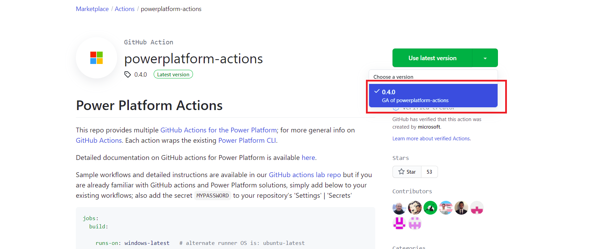

# GitHub Actions for Microsoft Power Platform 

[GitHub Actions](https://help.github.com/articles/about-github-actions) enable developers to build automated software development lifecycle workflows. With [GitHub Actions for Microsoft Power Platform](https://github.com/marketplace/actions/powerplatform-actions), you can create workflows in your repository to build, test, package, release, and deploy apps; perform automation; and manage bots and other components built on Microsoft Power Platform. 

GitHub Actions for Microsoft Power Platform include the following capabilities:

- Importing and exporting application metadata (also known as solutions) that contain various platform components such as canvas apps, model-driven apps, UI flows, Power Virtual Agents chatbots, AI Builder models, customer engagement apps (Dynamics 365 Sales, Dynamics 365 Customer Service, Dynamics 365 Field Service, Dynamics 365 Marketing, and Dynamics 365 Project Service Automation), and connectors between development environments and source control.

- Deploying to downstream environments.

- Provisioning or de-provisioning environments 

- Performing static analysis checks against solutions by using [Power Apps solution checker](/powerapps/maker/data-platform/use-powerapps-checker).

You can use GitHub Actions for Microsoft Power Platform along with any other available GitHub Actions to compose your build and release workflows. Workflows that teams commonly put in place include provisioning development environments, exporting from a development environment to source control, generating builds, and releasing apps.
GitHub Actions for Microsoft Power Platform are available at <https://github.com/marketplace/actions/powerplatform-actions>.

> [!IMPORTANT]
> GitHub Actions for Microsoft Power Platform are supported only for a Microsoft Dataverse environment with a database. More information: [Create an environment with a database](/power-platform/admin/create-environment#create-an-environment-with-a-database)

## Key concepts

GitHub Actions enable you to create custom software development lifecycle workflows directly in your GitHub repository. For an overview of GitHub Actions and core concepts, review the following articles:

- [About GitHub Actions](https://help.github.com/actions/getting-started-with-github-actions/about-github-actions)

- [Core concepts](https://help.github.com/actions/getting-started-with-github-actions/core-concepts-for-github-actions)

- [About packaging with GitHub Actions](https://help.github.com/en/actions/publishing-packages-with-github-actions/about-packaging-with-github-actions)

## What are GitHub Actions for Microsoft Power Platform?

GitHub Actions for Microsoft Power Platform is a collection of Microsoft Power Platform&ndash;specific GitHub Actions that eliminate the need to manually download custom tooling and scripts to manage the application lifecycle of apps built on Microsoft Power Platform. The tasks can be used individually, such as importing a solution into a
downstream environment, or used together in a workflow to orchestrate a scenario such as "generate a build artifact," "deploy to test," or "harvest maker changes." The build tasks can largely be categorized into four types:

- Helper

- Quality check

- Solution

- Environment management

For more information about individual tasks, go to [GitHub Actions for Microsoft Power Platform](devops-github-available-actions.md).

## Get GitHub Actions for Microsoft Power Platform

You can use GitHub Actions for Microsoft Power Platform by adding the actions in your workflow definition file (.yml). Sample workflow definitions are available 
from the [GitHub Actions lab](https://github.com/microsoft/powerplatform-actions-lab).

## Connection to environments

To interact with a Dataverse environment, a secret must be created that enables the various GitHub Actions to perform the required task. Two types of connections are available:

- Username/password: Configured as a generic service connection with username and password. Username/password authentication doesn't support multifactor authentication.
- Service principal and client secret: This connection type uses service principal&ndash;based authentication and supports multifactor authentication. Service principal authentication

## Available runners

GitHub Actions for Microsoft Power Platform can run on both Microsoft Windows agents and Linux agents. 

## Frequently asked questions

***How do I get started with GitHub actions?***

*[GitHub Actions Hands on Lab](./tutorials/github-actions-start.md) is available right now for you try out. The labs show how to use Service Principal authentication and standard username/password authentication.*

***How do I get GitHub Actions for Microsoft Power Platform working in my repository?***

*Go to the [GitHub Marketplace for Actions](https://github.com/marketplace/actions/powerplatform-actions) and search for Power Platform. When you arrive on the page, select the green button to instatiate the actions into your repository.*

***Do GitHub Actions only work for Power Apps?***

*GitHub Actions work for both canvas and model-driven apps, Power Virtual Agents, UI flows and traditional flows, AI Builder, custom connectors, and dataflows, all of which can now be added to a solution. Also included are customer engagement apps.*

***Can I include flow and canvas apps?***

*Yes, flows and canvas apps are solution-aware, so if these components are added to your solution they can participate in the lifecycle of your app. However, some steps still require manual configuration, which will be addressed later this year when we introduce environment variables and connectors. For a list of current limitations, go to [Known limitations](/powerapps/maker/common-data-service/use-solution-explorer#known-limitations).*

***How much does GitHub Actions for Microsoft Power Platform cost?***

*GitHub Actions are available at no cost. However, a valid GitHub subscription is required to use the actions on GitHub. To get started, 2,000 action minutes/month are available for free. More information: [GitHub pricing](https://github.com/pricing/)*

### See also

[Available GitHub Actions Hands on Lab](./tutorials/github-actions-start.md)

[Available GitHub Actions](devops-github-available-actions.md)

[!INCLUDE[footer-include](../includes/footer-banner.md)]
