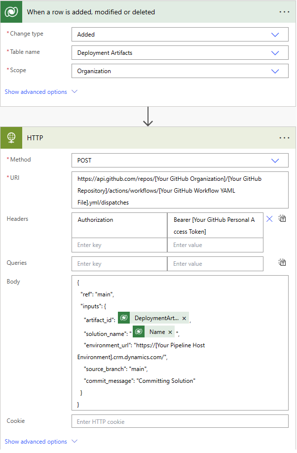

# Extend pipelines using GitHub Actions

This article demonstrates using [GitHub Actions](https://docs.github.com/en/actions/quickstart) and Power Automate cloud flows for extending pipelines in Power Platform. When a pipelines deployment is submitted, a cloud flow triggers the GitHub workflow to download, unpack, and commit the artifact's source code to a GitHub branch.

## Workflow details

The workflow is triggered via a `workflow_dispatch` event. The workflow runs on `ubuntu-latest` and has the `contents: write` permission to be able to commit changes to the GitHub repository branch.

The workflow consists of the following steps:

1. `actions/checkout@v3`: Checks out the repository.
1. `create new branch if specified`: Creates a new branch if a `target_branch` is specified in the inputs.
1. `download solution from artifact`: Downloads the solution from the artifact created by pipelines.
1. `unpack solution`: Unpacks the solution.
1. `commit changes`: Commits changes to the existing or new branch.
1. `push to branch`: Pushes the committed changes to the source branch.

## Workflow inputs

The following workflow inputs are required or optional:

- `artifact_url` (required): The URL of the Microsoft Dataverse row (record) ID for the artifact created by the pipelines.
- `solution_name` (required): Name of the solution in the Dataverse environment.
- `source_branch` (required): Branch for the solution commit.
- `target_branch` (optional): Branch to create for the solution commit. If not specified, the `source_branch` is used.
- `commit_message` (required): Message to provide for the commit.

## Workflow secrets

The following secrets are required to connect to Dataverse using an Application User configured in Dataverse and in Microsoft Entra ID (AD). Configure these secrets in the GitHub repository settings.

- `CLIENT_ID`: The client ID of the registered Microsoft Entra application.
- `TENANT_ID`: The tenant ID of the Microsoft Entra directory associated with the Microsoft Entra application.
- `CLIENT_SECRET`: The client secret of the registered Microsoft Entra application.

For more information, go to [Creating and using encrypted secrets](https://docs.github.com/actions/reference/encrypted-secrets) and [Create an application user](/power-platform/admin/manage-application-users#create-an-application-user).

## Workflow code

Listed below is the GitHub Actions workflow code.

```makefile
name: Download, unpack and commit the solution to git
run-name: Getting ${{ github.event.inputs.solution_name }} from pipelines host environment and committing
on:
  workflow_dispatch:
    inputs:
      artifact_url:
        description: "The url of the Dataverse record ID for the artifact created by the pipelines (Example: https://[your-env].crm.dynamics.com/api/data/v9.0/deploymentartifacts([your-artifact-id])/artifactfile/$value)."
        required: true
      solution_name:
        description: "Name of the Solution in Dataverse environment"
        required: true
      user_name: 
        description: "User name for the commit"
        required: true
      source_branch:
        description: "Branch for the solution commit"
        required: true
      target_branch:
        description: "Branch to create for the solution commit"
        required: false
      commit_message:
        description: "Message to provide for the commit"
        required: true
permissions:
  contents: write
jobs:
  export-unpack-commit:
    runs-on: ubuntu-latest

    steps:
      - uses: actions/checkout@v3
        with:
            ref: ${{ github.event.inputs.source_branch }}

      # Commit changes to the existing or new branch
      - name: create new branch if specified
        shell: pwsh
        run: |
            if('${{ github.event.inputs.target_branch }}' -ne '') {
                git checkout -b ${{ github.event.inputs.target_branch }} ${{ github.event.inputs.source_branch }}
            }

      # Export the solution from the artifact created by pipelines
      - name: download solution from artifact
        env:
            CLIENT_ID: ${{secrets.CLIENT_ID}}   
            TENANT_ID: ${{secrets.TENANT_ID}}   
            CLIENT_SECRET: ${{secrets.CLIENT_SECRET}}
        shell: pwsh
        run: |
            $aadHost = "login.microsoftonline.com"
            $url = "${{ github.event.inputs.artifact_url }}"
            $options = [System.StringSplitOptions]::RemoveEmptyEntries
            $dataverseHost = $url.Split("://", $options)[1].Split("/")[0]

            $body = @{client_id = $env:CLIENT_ID; client_secret = $env:CLIENT_SECRET; grant_type = "client_credentials"; scope = "https://$dataverseHost/.default"; }
            $OAuthReq = Invoke-RestMethod -Method Post -Uri "https://$aadHost/$env:TENANT_ID/oauth2/v2.0/token" -Body $body
            $spnToken = $OAuthReq.access_token
            $headers = New-Object "System.Collections.Generic.Dictionary[[String],[String]]"
            $headers.Add("Authorization", "Bearer $spnToken")
            $headers.Add("Content-Type", "application/json")

            # Download the managed solution
            $response = Invoke-RestMethod "${{ github.event.inputs.artifact_url }}" -Method 'GET' -Headers $headers
            $bytes = [Convert]::FromBase64String($response.value)
            [IO.File]::WriteAllBytes("${{ github.event.inputs.solution_name }}_managed.zip", $bytes)

            # Download the unmanaged solution (for now we will need to use string manipulation to get the unmanaged solution URL, until the API provides this value)
            $unmanaged_artifact_url = "${{ github.event.inputs.artifact_url }}".Replace("artifactfile", "artifactfileunmanaged")
            $response = Invoke-RestMethod "$unmanaged_artifact_url" -Method 'GET' -Headers $headers
            $bytes = [Convert]::FromBase64String($response.value)
            [IO.File]::WriteAllBytes("${{ github.event.inputs.solution_name }}.zip", $bytes)

      # Unpack the solution
      - name: unpack solution
        uses: microsoft/powerplatform-actions/unpack-solution@v0
        with:
          solution-file: "${{ github.event.inputs.solution_name }}.zip"
          solution-folder: "${{ github.event.repository.name }}"
          solution-type: 'Both'
          process-canvas-apps: false
          overwrite-files: true

      # Commit changes to the existing or new branch
      - name: commit changes
        shell: pwsh
        run: |
          rm -rf ${{ github.event.inputs.solution_name }}.zip
          rm -rf ${{ github.event.inputs.solution_name }}_managed.zip
          git config user.name ${{ github.event.inputs.user_name }}
          git pull 
          git add --all
          git commit -am "${{ github.event.inputs.commit_message }}" --allow-empty

      # Push the committed changes to the source branch
      - name: push to branch
        shell: pwsh
        run: |
          if('${{ github.event.inputs.target_branch }}' -ne '') {
              git push origin ${{ github.event.inputs.target_branch }}
          } else {
              git push origin ${{ github.event.inputs.source_branch }}
          }
```
> [!NOTE]
> The Dataverse web API used to download the solution artifact has a maximum file size limit of 16 MB.

## Example Power Automate flow

To call a GitHub workflow, you can create a Power Automate flow that is triggered when a deployment request is made in Dataverse. The flow can be configured to pass the required inputs to the GitHub workflow. For more information on how to create a Power Automate flow, go to [Create a flow](/power-automate/getting-started#create-a-flow).

## Flow details

The flow triggers when the `OnDeploymentRequested` action is run in Dataverse. The flow calls the HTTP connector to trigger the GitHub workflow. The flow passes the required inputs to the GitHub workflow. Include the following inputs in the request body:

- `artifact_url`: URL of the Dataverse solution artifact created by the pipelines.
- `solution_name`: Name of the solution in the Dataverse environment.
- `user_name`: User name for the commit.
- `source_branch`: Source branch for the solution commit.
- `target_branch`: Branch to create for the solution commit.
- `commit_message`: Message to provide for the commit.

The values passed into the `artifact_url`, `solution_name`, and `user_name` are pulled from the outputs of the action that triggered the pipeline. The `commit_message` is pulled from the deployment stage run row in Dataverse.

- `artifact_url`: `@{triggerOutputs()?['body/OutputParameters/ArtifactFileDownloadLink']}`
- `solution_name`: `@{triggerOutputs()?['body/OutputParameters/ArtifactName']}`
- `user_name`: `@{triggerOutputs()?['body/OutputParameters/DeployAsUser']}`
- `commit_message`: `@{outputs('Retrieve_the_Deployment_Stage_Run')?['body/deploymentnotes']}`

The flow also uses a personal access token (PAT) to authenticate with GitHub. For more information on how to create a GitHub personal access token, go to [Creating a personal access token](https://docs.github.com/github/authenticating-to-github/creating-a-personal-access-token). The PAT is passed in the `Authorization` header of the HTTP request.

Update the following values in the Flow:

- `[GitHub Personal Access Token]` - Replace with your GitHub personal access token.
- `[GitHub Organization]` - Replace with your GitHub organization name.
- `[GitHub Repository]` - Replace with your GitHub repository name.
- `[GitHub Workflow YAML File]` - Replace with your GitHub workflow YAML file name.
- `[Source Branch]` - Replace with the Git branch to commit the solution.
- `[Target Branch]` - Replace with the Git branch to create for the solution commit. `Target Branch` is optional. If you don't specify a target branch, then your solution is committed to the `Source Branch`.



## Next steps

[Run pipelines in Power Platform](run-pipeline.md)

### See also

[Quickstart for GitHub Actions](https://docs.github.com/en/actions/quickstart)<br/>
[Extend pipelines in Power Platform](extend-pipelines.md)<br/>
[What are cloud flows?](/power-automate/overview-cloud)
