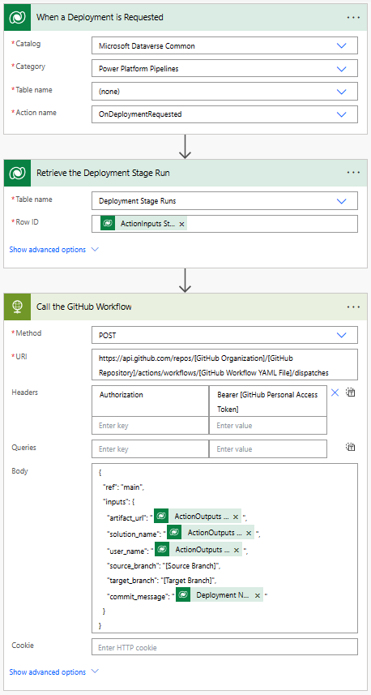

# Download, Unpack and Commit a Pipeline Artifact to a GitHub Repository

This GitHub workflow downloads a pipeline artifact from Dataverse and unpacks and commits the source code to a branch in GitHub when a pipeline artifact is created in Dataverse. The workflow can be invoked manually or triggered by a pipeline artifact creation event in Dataverse as shown in the example Power Automate Flow. For more information on how to create a GitHub workflow, see [Quickstart for GitHub Actions](https://docs.github.com/en/actions/quickstart).

## Workflow Details

The workflow is triggered via a `workflow_dispatch` event. The workflow runs on `ubuntu-latest` and has the `contents: write` permission to be able to commit changes to the GitHub repository branch.

The workflow consists of the following steps:

1. `actions/checkout@v3`: Checks out the repository.
2. `export-managed-solution-from-artifact`: Exports the managed solution from the artifact created by pipelines.
3. `unpack-managed-solution`: Unpacks the solution.
4. `commit changes`: Commits changes to the existing or new branch.
5. `push to`: Pushes the committed changes to the source branch.

## Workflow Inputs

The following inputs are required:

- `artifact_url`: The url of the Dataverse record ID for the artifact created by the pipelines.
- `solution_name`: Name of the Solution in Dataverse environment.
- `source_branch`: Branch for the solution commit.
- `target_branch`: Branch to create for the solution commit. If not specified, the source_branch is used.
- `commit_message`: Message to provide for the commit.

## Workflow Secrets

The following secrets are required to connect to Dataverse using an Application User configured in Dataverse and in Azure Active Directory. Configure these secrets in the GitHub repository settings. For more information, see [Creating and using encrypted secrets](https://docs.github.com/en/actions/reference/encrypted-secrets) and [Create an application user](/power-platform/admin/manage-application-users#create-an-application-user)

- `CLIENT_ID`: The client ID of the registered Azure AD application
- `TENANT_ID`: The tenant ID of the Azure AD directory associated with the Azure AD application
- `CLIENT_SECRET`: The client secret of the registered Azure AD application

## Workflow Code

```github-actions-workflow
name: Export, unpack and commit the solution to git
run-name: Getting ${{ github.event.inputs.solution_name }} solution from environment ${{ github.event.inputs.environment_url }} environment and committing
on:
  workflow_dispatch:
    inputs:
      artifact_url:
        description: "The url of the Dataverse record ID for the artifact created by the pipelines."
        required: true
        default: "https://[your-env].crm.dynamics.com/api/data/v9.0/deploymentartifacts([your-artifact-id])/artifactfile/$value"
      solution_name:
        description: "Name of the Solution in Dataverse environment"
        required: true
        default: "[your-solution-name]"
      source_branch:
        description: "Branch for the solution commit"
        required: true
        default: main
      target_branch:
        description: "Branch to create for the solution commit"
        required: false
      commit_message:
        description: "Message to provide for the commit"
        required: true
permissions:
  contents: write
jobs:
  export-unpack-commit:
    runs-on: ubuntu-latest

    steps:
      - uses: actions/checkout@v3
        with:
            ref: ${{ github.event.inputs.source_branch }}

      # Commit changes to the existing or new branch
      - name: create new branch if specified
        shell: pwsh
        run: |
            if('${{ github.event.inputs.target_branch }}' -ne '') {
                git checkout -b ${{ github.event.inputs.target_branch }} ${{ github.event.inputs.source_branch }}
            }

      # Export the managed solution from the artifact created by pipelines
      - name: export-managed-solution-from-artifact
        env:
            CLIENT_ID: ${{secrets.CLIENT_ID}}   
            TENANT_ID: ${{secrets.TENANT_ID}}   
            PowerPlatformSPN: ${{secrets.PowerPlatformSPN}}
        shell: pwsh
        run: |
            $aadHost = "login.microsoftonline.com"
            $clientId = "$env:CLIENT_ID"
            $clientSecret = "$env:PowerPlatformSPN"
            $tenantId = "$env:TENANT_ID"
            
            $url = "${{ github.event.inputs.artifact_url }}"
            $options = [System.StringSplitOptions]::RemoveEmptyEntries
            $dataverseHost = $url.Split("://", $options)[1].Split("/")[0]

            $body = @{client_id = $clientId; client_secret = $clientSecret; grant_type = "client_credentials"; scope = "https://$dataverseHost/.default"; }
            $OAuthReq = Invoke-RestMethod -Method Post -Uri "https://$aadHost/$tenantId/oauth2/v2.0/token" -Body $body
            $spnToken = $OAuthReq.access_token
            $headers = New-Object "System.Collections.Generic.Dictionary[[String],[String]]"
            $headers.Add("Authorization", "Bearer $spnToken")
            $headers.Add("Content-Type", "application/json")
            
            $response = Invoke-RestMethod "${{ github.event.inputs.artifact_url }}" -Method 'GET' -Headers $headers
            $bytes = [Convert]::FromBase64String($response.value)
            [IO.File]::WriteAllBytes("${{ github.event.inputs.solution_name }}_managed.zip", $bytes)
      # Unpack the solution
      - name: unpack-managed-solution
        uses: microsoft/powerplatform-actions/unpack-solution@v0
        with:
          solution-file: "${{ github.event.inputs.solution_name }}_managed.zip"
          solution-folder: "${{ github.event.repository.name }}"
          solution-type: 'Managed'
          process-canvas-apps: true
          overwrite-files: true

      # Commit changes to the existing or new branch
      - name: commit changes
        shell: pwsh
        run: |
          rm -rf ${{ github.event.inputs.solution_name }}_managed.zip
          git config user.name "GitHub Actions Bot"
          git config user.email "<>" 
          git pull 
          git add --all
          git commit -am "${{ github.event.inputs.commit_message }}" --allow-empty

      # Push the committed changes to the source branch
      - name: push to ${{ github.event.inputs.source_branch }}
        shell: pwsh
        run: |
          if('${{ github.event.inputs.target_branch }}' -ne '') {
              git push origin ${{ github.event.inputs.target_branch }}
          } else {
              git push origin ${{ github.event.inputs.source_branch }}
          }
```

## Example Power Automate Flow

To call this GitHub workflow, you can create a Power Automate Flow that is triggered when a pipeline artifact is created in Dataverse. The Flow can be configured to pass the required inputs to the GitHub workflow. For more information on how to create a Power Automate Flow, see [Create a flow](/power-automate/getting-started#create-a-flow).

## Flow Details

The Flow is triggered when a pipeline artifact is created in Dataverse. The Flow calls the HTTP connector to trigger the GitHub workflow. The Flow passes the required inputs to the GitHub workflow. Include the following inputs in the request body:

- `artifact_url`: Url of the Dataverse solution artifact created by the pipelines.
- `solution_name`: Name of the Solution in Dataverse environment.
- `source_branch`: Branch for the solution commit.
- `commit_message`: Message to provide for the commit.

The values passed into the `artifact_url` and `solution_name` are pulled from the outputs of the action that triggered the pipeline.

- `artifact_url`: `@{triggerOutputs()?['body/OutputParameters/ArtifactFileDownloadLink']}`
- `solution_name`: `@{triggerOutputs()?['body/OutputParameters/ArtifactName']}`

The Flow also uses a GitHub Personal Access token to authenticate to GitHub. For more information on how to create a GitHub Personal Access token, see [Creating a personal access token](https://docs.github.com/en/github/authenticating-to-github/creating-a-personal-access-token). The PAT is passed in the `Authorization` header of the HTTP request.

Update the following values in the Flow:

- `[Your GitHub Personal Access Token]` - Replace with your GitHub Personal Access Token.
- `[Your GitHub Organization]` - Replace with your GitHub organization name.
- `[Your GitHub Repository]` - Replace with your GitHub repository name.
- `[Your GitHub Workflow YAML File]` - Replace with your GitHub workflow YAML file name.
- `[The Git Branch to Commit the Solution]` - Replace with the Git branch to commit the solution. You can also create a new branch from an existing branch by adding the `target_branch` input to the GitHub workflow body parameters JSON.


## Next step

[Run pipelines in Power Platform](run-pipeline.md)

### Related content

[Quickstart for GitHub Actions](https://docs.github.com/en/actions/quickstart)<br/>
[Extend pipelines in Power Platform](extend-pipelines.md)<br/>
[What are cloud flows?](/power-automate/overview-cloud)
