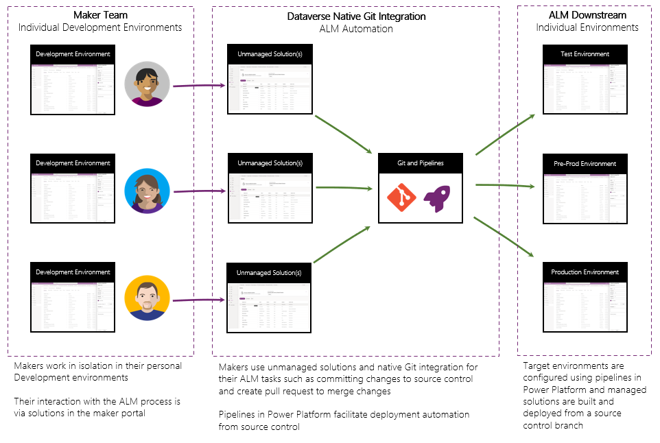

# Overview of Dataverse Git integration

Git integration in Dataverse is used to create source control friendly representations of solutions and solution components in your Dataverse environment and store them in Azure DevOps. Using source control as the source of truth for your solutions allows you to track changes, collaborate with team members, and manage deployments to different environments from a central location while also providing traceability and auditability of changes. Git integration in Dataverse is intended to be used with developer environments and not in your test or production environments where deployments can be made using builds to create solution artifacts and pipelines to deploy. Here we look at some of the key concepts and benefits to using Git enabled source control with your Dataverse environments and solutions.

## ALM in the Power Platform and Dataverse

The Power Platform provides many out of the box capabilities that enable organizations to manage Application Lifecycle Management (ALM) for their solutions. Included are the ability to package solutions as containers for the many different types of components in the platform, manage environments involved in the application lifecycle, and deploy solutions using [pipelines](/power-platform/alm/pipelines.md). There are also several ways to integrate Git repositories with Power Platform using developer tooling. With native integration of Git in Dataverse, the process is simplified and streamlined for makers to work with their solutions in a familiar way and interact with source control through simplified interfaces in the maker portal.

## Benefits

- Source control as source of truth: Within some organizations, the source of truth for deployments in Dataverse is the maker environments in which solutions are built. The primary driver for this behavior is the non-native Git integration uses advanced techniques and tools, which required professional IT expertise to get started with. With the native integration of Git in Dataverse source control can be enabled in only a few steps and provides a familiar interface for makers to work with their solutions.
- Safety, auditing, and compliance using SDLC best practices: Software development lifecycle (SDLC) best practices are a set of guidelines and processes that help you manage your software development projects effectively. By using Git integration in Dataverse, you can follow SDLC best practices such as version control, code reviews, and static source code analysis to ensure the quality, reliability, and security of your solutions. Git integration in Dataverse also provides features such as auditing, compliance, and traceability that help you track changes to your solutions and collaborate with other team members effectively.
- Short lived dev environments: By storing a copy of your environments' customizations and configurations in source control, you can rehydrate development environments from source control quickly and easily in Dataverse. This allows you to create short lived environments for development and testing purposes. Short-lived environments allow you to free up storage, experiment with new features, test, and iterate on your solutions without relying on permanent environments.
- Fusion Development teams: Fusion development teams are teams that consist of both developers and makers who work together to build solutions. By using Git integration in Dataverse, you can bring developers and makers together in a single environment and collaborate on the same codebase. Source control integration allows you to use the skills and expertise of both developers and makers to build high-quality solutions that meet the needs of your organization and meet your makers where they're comfortable working.
- Disaster recovery: Similar to the benefits of short lived dev environments, using source control as the source of truth for your solutions allows you to recover from disasters quickly and easily. Dataverse environment backups are more time consuming, and as a result more infrequent, than committing changes to source control. By storing your solutions in source control, you can restore to a previous state if there's data loss, corruption, or other disasters.

## Key Concepts

### Unmanaged vs Managed Solutions

When you're using Git integration in Dataverse, solutions stored in source control come from unmanaged solutions in a maker's environment. Unmanaged solutions allow makers to add, remove, and update components that are synced with source control when you commit and push changes. Managed solutions are built from source control and deployed into downstream environments (example: test, production) and aren't editable in those environments. Managed solutions are used to ensure that the source of truth for your solutions is always source control and that changes are only made in a maker's environment before they're added to source control and deployed elsewhere.

### File formatting for solution components

With the introduction of Git integration in Dataverse, there are changes to the way that solutions and solution components are represented in source control. When you commit and push changes to source control, the solution components are stored in a specific format that is compatible with Git. This format is used to represent the solution components in a way that is easy to read and understand and can be used to track changes to the solution components over time. The file format for solution components is designed to be human-readable and can be used to view changes to the solution components in source control. Additionally, to allow for multiple solutions to be stored in the same repository/folder, the solution components in source control are no longer duplicated for each solution. Instead, the solution components are stored in a single location and can be shared across multiple solutions in the same repository/folder.

### Related content

[Common Dataverse Git integration Scenarios](/power-platform/alm/git-integration/common-scenarios)  
[Getting started with Git integration](/power-platform/alm/git-integration/connecting-to-git)

[!INCLUDE[footer-include](../../includes/footer-banner.md)]
