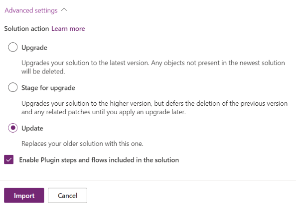

# Maintain managed solutions

Before any solution release occurs a team should develop a plan for maintaining the health of their solutions over their lifetime. Uninstalling and reinstalling a managed solution, as an example, is not a practical approach to a healthy development and deployment practice as it can have consequences such as deleting tables, columns, etcetera and their associated data. Fortunately, there are healthy solution deployment practices that can ensure efficient and effective change deployment while maintaining the integrity of data. Exactly how a team manages their solutions will depend on the characteristics of their solutions, their solution architecture, and development methodology. 

## Version compatibility

Please note the following with regards to solution version compatibility.

- Solutions can be exported from older versions of a Microsoft Dataverse environment (or Dynamics 365) and imported into newer environments, but not the reverse.
- As additional service updates are applied to Dataverse, solutions exported from environments with those updates cannot be imported into environments which do not have those updates. More information: [Solution concepts](solution-concepts-alm.md).  

- The `<ImportExportXml>` root element uses a `SolutionPackageVersion` attribute to set the value for the version that the solution is compatible with. You should not manually edit this value.  

## Create managed solution updates

 There are a few basic approaches to deploying changes to solutions to downstream environments:  

- Release an modified version of an existing solution and perform an *upgrade*, which allows for component deletion.
  
- Release an modified version of an existing solution and perform an *update*, which does NOT allow for component deletion. 
  
- Create a new solution with the same publisher leveraging [solution layering concepts](solution-layers-alm.md) and [solution segmentation](segmented-solutions-alm.md) to add or modify components. 
### Release an upgrade to an existing solution

Importing a solution as an upgrade is the default import option and with good reason. Importing a solution with the upgrade option performs operations most teams would expect. All solution components are updated with changes and any components removed that do not exist in the new version of the managed solution will be removed from the target environment. to an existing managed solution removes unused components and implements upgrade logic. 

### Release an update for your managed solution

The update option may be leveraged during a managed solution import to process a solution importing only the changes made during development. Where a full solution upgrade will process all metadata changes and allow for deleting of components an update is purely additive. If a team has deleted a component during an import with the update option the deletion will not be processed. The result is that the will component remaining in the target environment. To handle deleting solution components on import see the [Release an upgrade to an existing solution](#release-an-upgrade-to-an-existing-solution) section.

... TODO add more

### Create a new solution with the same publisher to modify components

When only a small subset of solution components urgently requires a change you can release an update to address the issue. To release an update, create a new unmanaged solution and add any components from the original unmanaged source solution that you want to update. You must associate the new unmanaged solution with the same publisher record as was used for the original solution. After you finish with your changes, package the new solution as a managed solution.  

When the update solution is installed in an environment where the original solution was installed the changes included in the update will be applied to the environment. If you needs to ‘roll back’ to the original version you can simply uninstall the update.  

Any customizations applied to the solution components in the update will be overridden. When you uninstall the update they will return.  

### See also  

[Publish your app on AppSource](/powerapps/developer/common-data-service/publish-app-appsource)

[!INCLUDE[footer-include](../includes/footer-banner.md)]