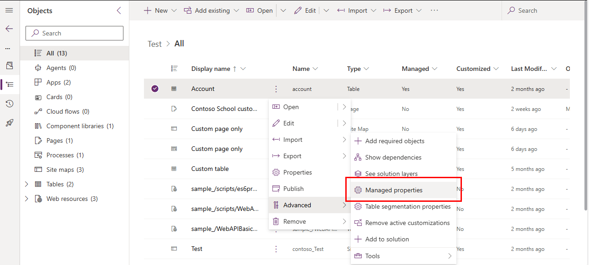

# Managed properties 

You can use managed properties to control which of your managed solution components can be customized. If you're creating solutions for other organizations, you should allow them to customize solution components where it makes sense for their unique requirements. However, you have to be able to predictably support and maintain your solution, so you should never allow any customization of critical components that provide the core functionality of your solution.

Consider using managed properties to lock down your components unless you want them customizable in the destination environment. For example, imagine a scenario where your users might want to change many of the labels to fit their own business requirements.

Managed properties are intended to protect your solution from modifications that might cause it to break. Managed properties don't provide digital rights
management (DRM), or capabilities to license your solution or control who might import it.

You apply managed properties when the solution is unmanaged in the unmanaged layer of your development environment. The managed properties take effect
after you package the managed solution and install it in a different environment. After the managed solution is imported, the managed properties can't be updated except by an update of the solution by the original publisher.

Most solution components have a **Managed properties** menu item available in the list of solution components. When you import the managed solution that
contains the components, you can view&mdash;but not change&mdash;the managed properties.

## View and edit table managed properties

1. Sign in to [Power Apps](https://make.powerapps.com/?utm_source=padocs&utm_medium=linkinadoc&utm_campaign=referralsfromdoc) or [Power Automate](https://flow.microsoft.com) and select **Solutions** from the left pane.
1. Open the solution that you want.
1. From the list of components in the solution, select the three vertical dots next to the table where you want to view the managed properties, and then select **Advanced** > **Managed properties**.

    > [!div class="mx-imgBorder"] 
    > 

    The managed properties page is displayed.

    > [!div class="mx-imgBorder"] 
    > 

Tables have more managed properties than any other type of solution component. If the table is customizable, you can set the following options:  

|Option|Description|
|--|--|
|**Allow customizations** |Controls all the other options. If this option is `False`, none of the other settings apply. When it's `True`, you can specify the other customization options. When `False`, it's equivalent to setting all other options to false.|
|**Display name can be modified**|Whether the table display name can be modified.|
|**Can Change Additional Properties** |Applies to anything not covered by other options.|
|**New forms can be created**|Whether new forms can be created for the table.|
|**New charts can be created**|Whether new charts can be created for the table.|
|**New views can be created** |Whether new views can be created for the table.|
|**Can Change Hierarchical Relationship**|Whether hierarchical relationships settings can be changed. More information: [Define and query hierarchically related data](/powerapps/maker/common-data-service/define-query-hierarchical-data)|
|**Can Change Tracking Be Enabled** |Whether the table **Change Tracking** property can be changed.|
|**Can Enable sync to external search index** |Whether the table can be configured to enable Dataverse search. More information: [Configure Dataverse search to improve search results and performance](../admin/configure-relevance-search-organization.md) |

## View and edit column managed properties

Next to a custom column in a solution select the three vertical dots, and then select **Advanced** > **Managed properties**.

The **Managed Properties** pane opens.
> [!div class="mx-imgBorder"] 
> 

The **Allow customizations** option controls all the other options. If this option is disabled, none of the other settings apply. When it's enabled, you can specify the other customization options.  
  
If the column is customizable, you can enable the following options.  
  
- **Display name can be modified**
- **Can change additional properties**: This property controls any other customizations that don't have a specific managed property. 
- **New forms can be created** 
- **New charts can be created** 
- **New views can be created** 
- **Can change hierarchical relationship** 
- **Can change tracking be enabled** 
- **Can enable sync to external search index**

Disabling all the individual options is equivalent to disabling **Allow customizations**.  

Apply your choices and select **Done** to close the pane.

> [!NOTE]
> If this column is a **Date and Time** column, an additional **Can change date and time behavior** property is available. More information: [Behavior and format of the Date and Time field](/powerapps/maker/portals/configure/behavior-format-date-time-field) 

Go to [Update of delete a column](/powerapps/maker/common-data-service/data-platform-manage-fields#update-or-delete-a-field) for information about how to edit columns.

## View and edit other component managed properties

You can view and edit managed properties for many other solution components, such as a web resource, process, chart, or dashboard. Next to the component in a solution select the three vertical dots, and then select **Advanced** > **Managed properties**.

## View and edit relationship managed properties

While viewing table relationships in a solution, select a relationship from an unmanaged solution, select the three vertical dots, and then select **Advanced** > **Managed Properties**.
  
With relationships, the only managed property is **Allow customizations**. This single setting controls all changes that can be made to the table relationship. 

### See also

[Use segmented solutions](segmented-solutions-alm.md)

[!INCLUDE[footer-include](../includes/footer-banner.md)]
