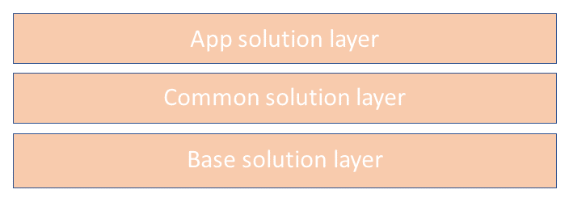

# Scenario 3: Moving from unmanaged to managed solutions in your organization
This scenario aims at a situation where your production environment
contains several unmanaged solutions or your customizations were done in the default solution.

With the exception of your development environment, the end result is to only have managed solutions in your environments. More information: [Managed and unmanaged solutions](solution-concepts-alm.md#managed-and-unmanaged-solutions).

You can take either of the unmanaged to managed conversion approaches described here.

## Small project conversions

For smaller, less complex projects, you can consolidate all your unmanaged solutions into a single unmanaged solution. Then, export the unmanaged solution as managed to import into your test and production environments. 

## Large or complex project conversions

Larger, more complex projects require the following tasks.

1. Plan carefully, especially when the outcome you want is to use solution layering properly.

2. Identify and remove unnecessary tables and components.
   - Look for tables that can be deleted from the environment. Here's some examples:
      - Tables with no new records created within in last 18 months.
      - Tables and components that have no dependencies. More information: [View dependencies for a component](/powerapps/maker/data-platform/view-component-dependencies)
      - Components, such as forms, views, and charts, that are associated with deleted or unused tables and don't have any data.
   - Be aware that some [System tables don’t support unmanaged layers](#system-tables-that-dont-support-unmanaged-layers).
   - Be aware that there are a few system tables that can lead to issues when you customize them and later import them as managed. More information: [Customization of deeply integrated system tables](#customization-of-deeply-integrated-system-tables)
   - For Power Apps portals app conversions, consider building a tool to search for components to eliminate, such as components without dependencies.
      - For example, the tool can be a console app that generates a .CSV output file, which displays table forms and views used by portals apps by checking the entity forms and entity lists tables. The output file can be used to determine dependencies between a portals app and table forms and views.

3. Understand and identify the base, common, and app solution layers.

    

   Then, create solutions that adhere to the following structure:
   - Base layer. This temporary solution will provide the foundation for entities with lookup columns on other attributes. The base solution should contain just entity and entity metadata without entity components, such as columns and table relationships. The base solution can be used for the deployment of multiple apps.
   - Common layer. Components that are common and/or shared across multiple apps are contained in the common solution.
   - App layer. These solutions include just the components specific to the apps. Each app should be structured so that the solution includes all app components in one solution. This solution will contain the tables and components for the app, such as columns, forms, views, and charts. We recommend that you don’t share these components across different apps.
   
4. Generate the base solution.
   - The purpose of the base solution is to work around cross-component dependencies during an unmanaged to managed solution conversion.
   - The base solution can also contain tables and columns that are not currently in use by any development team. The tool includes a master exclusion list of tables and columns that will be used to ignore tables owned by other teams. 
   - Tables with `AddRequiredComponents = False` and  `DoNotIncludeSubcomponents = True` must be added into the solution. The solution name and publisher should be predefined. <!-- link for more info to dev docs for this? -->
   - Consider building a tool to generate the base solution. The tool can include a master exclusion list of tables and columns owned by current development teams.
   - The base solution will be the first solution converted as managed in all environments except the base solution development environment. No other solutions will be added to the base solution development environment.

<<<<<<< HEAD
5. Build a common solution
   - This solution contains components that are shared across apps.
   - Obtain sign-off from every solution owner that no components exclusively owned by their app will be included in the common solution. This is an important clarification that can help you avoid layering complexities.
   - The common solution will be the second solution converted to managed in all environments except the base and common development environments.
=======
5. Build the common solution
   - This solution contains components that are shared across apps.
   - Obtain sign-off from every solution owner that their components will not be included in the common solution. It is important to pay close attention to avoid layering complexities.
   - The common solution will be the second solution converted to managed in all environments except the base and common solution development environments.
>>>>>>> 5b00555edf71fa64b2abff53bf5e221aab8a438b

6. Use a wave conversion model.
   - If you have 10 or more solutions to convert from unmanaged to managed, group the solutions together and import them in waves. 
   - The base solution followed by the common solution should be in the group for the first wave, so that they can be imported as managed solutions in all development environments before you convert your app solutions to managed.
   - The development environment refresh process should include the common solution imported as managed to all development environments. This should be done after every wave deployment. 
   - Group any solutions that cause downtime during trials into the final wave. Then, you will only have a single downtime event for the entire conversion process.

7. Complete one or more trial conversions of each solution prior to conversion in production.
   - If converting in waves, group the trial runs by wave.
   - The trial conversion environment should be as similar to the production environment as possible. Ideally, a copy of production along with portals configured, if any.
   - Conversion integration scheduling:
      - Plan to run your trial and production conversions outside of scheduled integration windows.
      - Schedule the conversion outside normal business hours.
   - If there's any app downtime during the unmanaged to managed conversion from the development environment to the test environment, make a note of it. This helps you determine how much time to allot for when you deploy to production. Check the following for potential impact during conversion:
      - App being converted to managed.
      - Other apps affected by the conversion.
      - Portals affected by the conversion.
   - Considerations when importing a managed solution to convert unmanaged components to managed:
      - If components are held in unmanaged solutions that still exist in the environment, all references will have to be removed before the managed solution can be imported.
      - Removing unmanaged solutions causes the loss of the reference container. Without a good understanding of what has been customized, you risk that components become orphaned in the default solution and possibly become hard to track.

<!-- 7. Test the managed solution.
   - The test environment should be as similar to the production environment as possible.
   - If there's any app downtime during the unmanaged to managed conversion from the development environment to the test environment, make a note of it. This helps you determine how much time to a lot for when deploying to production:
      - App that's imported.
      - Other apps affected by the conversion.
      - Portals affected by the conversion.
   - Integration scheduling:
      - Schedule outside of unmanaged to managed conversion window.
      - Schedule outside hours for regular deployments as well.  -->

8. Create new development environments after the conversion of the base and common solutions as managed on production. 
   - For each app create a new development environment with the following:
      - Base and common solutions as managed.
      - Any other dependent managed solution required.
      - The app solution as an unmanaged solution.

<!-- 8. Repeat steps 5-7 for any modular solutions that extend the common components layer.

    -   Create a copy of the original development environment, and remove the unmanaged solutions that hold references to the common components.

    -   Next, import a copy of a managed solution exported from the isolated base solution development environment to convert the unmanaged common
        components to managed. Doing so prevents the creation of cyclical dependencies and prevents solutions from becoming bloated with duplicate references to components.

    -   Considerations when importing a managed solution to convert unmanaged components to managed: 
        -   If components are held in unmanaged solutions that still exist in the environment, all references will have to be removed before the managed solution can be imported.

        -   Removing unmanaged solutions causes the loss of the reference container. Without a good understanding of what has been customized, you risk that components become orphaned in the default solution and possibly become hard to track.

    -   Converting solutions to managed in a development environment that's completely unmanaged effectively creates a snapshot of the current
        behavior. To prune unnecessary components that were added when multiple unmanaged solutions were developed in one environment, you need to remove the unneeded components in an isolated development environment.

        For example, assume the Customer entity is created in an unmanaged solution named *base*, then extended in another unmanaged solution. Any new components added to the Customer entity in the extension solution are automatically added to the *base* solution. This is the expected outcome, because when an entity is created the behavior is to include all assets and entity metadata. -->

## Limitations
 
-   In the second approach, it can be very time-consuming to remove components
    to isolate the base solution or modular solutions. It can be a challenge to determine where dependencies reside and how best to remove them.

-   It's difficult to migrate to a managed solution and
    develop a final solution architecture at the same time. Consider breaking the migration into phases such as moving to managed solutions, then establishing a new solution architecture. Isolated development is needed first to effectively create layered solutions.

### System tables that don’t support unmanaged layers

If customized in unmanaged solutions, the managed component must be deleted for the following system tables:

- Attribute maps.
- Access team templates.

### Customization of deeply integrated system tables

Some system tables have many relationships and dependencies with other tables that make them difficult to import to other environments:
- User.
- Contact. Similar to system user for Power Apps but can cause complication when you import  portals apps.

###  See also

[Scenario 4: Supporting team development](team-development-alm.md)

[!INCLUDE[footer-include](../includes/footer-banner.md)]
