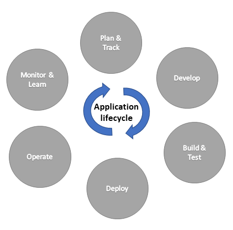

# Overview of application lifecycle management with Microsoft Power Platform

The articles in this section describe how you can implement application lifecycle management (ALM) using Power Apps, Power Automate, Power Pages, Microsoft Copilot Studio, and Microsoft Dataverse.

## What is ALM?

ALM is the lifecycle management of applications, which includes governance development and maintenance. Moreover, ALM includes these disciplines: requirements management, software architecture, development, testing, maintenance, change management, support, continuous integration, project management, deployment, release management and governance. ALM tools provide a standardized system for communication and collaboration between software development teams and related departments, such as test and operations. These tools can also automate the process of software development and delivery. To that end, ALM combines the disciplines concerned with all aspects of the process to achieve the goal of driving efficiency through predictable and repeatable software delivery.

## Key areas of ALM

- **Governance** includes requirements management, resource management, nurturing and system administration such as data security, user access, change tracking, review, audit, deployment control, and rollback.
- **Application development** includes identifying current problems, and planning, design, building, and testing the application and its continuous improvements. This area includes traditional developer and app maker roles.
- **Maintenance** includes deployment of the app, and maintenance of optional and dependent technologies.

The *application lifecycle* is the cyclical software development process that involves these areas: plan and track, develop, build and test, deploy, operate, monitor, and learn from discovery.

 

## ALM for Power Apps, Power Automate, Microsoft Copilot Studio, and Dataverse

[Dataverse](/powerapps/maker/data-platform/data-platform-intro) in Microsoft Power Platform lets you securely store and manage data and processes that are used by business applications. To use the Power Platform features and tools available to manage ALM, all environments that participate in ALM must include a Dataverse database.

The following concepts are important for understanding ALM using the Microsoft Power Platform.

- *Solutions* are the mechanism for implementing ALM; you use them to distribute components across environments through export and import. A component represents an artifact used in your application and something that you can potentially customize. Anything that can be included in a solution is a component, such as tables, columns, canvas and model-driven apps, Power Automate flows, agents, charts, and plug-ins.
- *Dataverse* stores all the artifacts, including solutions and in-product deployment [pipelines](pipelines.md)
- *Source control* should be your source of truth for storing and collaborating on your components.
- *Continuous integration and continuous delivery (CI/CD) platform* such as [Azure DevOps](/azure/devops/user-guide/what-is-azure-devops) that allows you to automate your build, test, and deployment pipeline. Can also be used in with in-product [pipelines.](pipelines.md)

For more information about how ALM and Azure DevOps technologies&mdash;combined with people and processes&mdash;enable teams to continually provide value to customers, go to [DevOps tools on Azure](https://azure.microsoft.com/solutions/devops/).

### Related articles

- [ALM basics with Microsoft Power Platform](basics-alm.md)
- [Set up pipelines in Power Platform](set-up-pipelines.md)
- [What is Dataverse?](/powerapps/maker/data-platform/data-platform-intro) 
- [Application lifecycle management for Finance and Operations apps](/training/modules/application-lifecycle-finance-operations/)
- [ALM for copilots in Copilot Studio](/power-virtual-agents/authoring-export-import-bots)
- [Using solutions with Power Pages](/power-pages/configure/power-pages-solutions)

[!INCLUDE[footer-include](../includes/footer-banner.md)]
