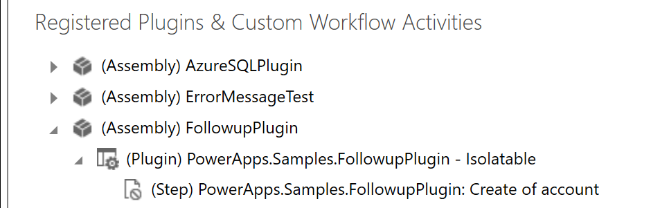
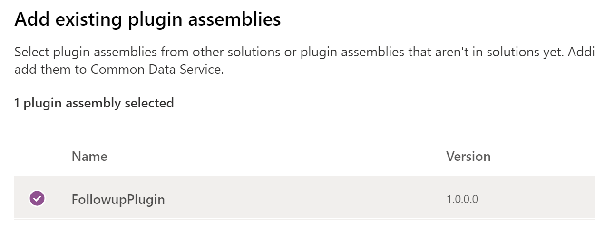
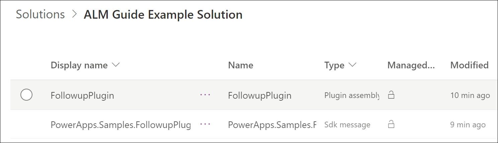

# Plug-ins

A solution is used to package and deploy plug-ins and custom workflow activities
to other environments. For example, the sequence below defines a simplistic
development and deployment sequence.

1.  Create a [custom publisher](solution-concepts-alm.md#solution-publisher) and
    [unmanaged](solution-concepts-alm.md#managed-and-unmanaged-solutions) solution in your DEV environment.

2.  Write one or more
    [plug-ins](/powerapps/developer/common-data-service/tutorial-write-plug-in)
    or [custom workflow activities](/powerapps/developer/common-data-service/workflow/tutorial-create-workflow-extension).

3.  [Register](#bkmk_register) the plug-ins or custom workflow activities in the unmanaged solution you created in step 1.

4.  [Export](devops-build-tool-tasks.md#power-platform-export-solution) the unmanaged solution as a managed solution.

5.  Import the managed solution into another environment (that is, TEST or PROD).

In the real world, you debug the code in the TEST environment, go back and
update the unmanaged solution with the revised code, and export to a managed
solution. Along the way you use revision control to manage the code
updates and solution versions. For more information about revision control and
versioning of solutions, see [Source control](basics-alm.md#source-control).

When planning your solution design, consider whether you'll place your custom
code and other customizations (customized entities, forms,
views, and so on) in the same solution or you'll divide these customizations among multiple
solutions, where one solution contains the custom code and another solution contains
the other customizations (customized entities, forms, views, and so on).

> [!TIP]
> Start with a custom publisher and unmanaged solution, and then
> develop and test the plug-in or custom workflow activity in that solution.
> We recommend against developing a plug-in or custom workflow activity in the default solution and
> then adding it to a custom solution.

 

## Register a plug-in or custom workflow activity in a custom unmanaged solution

After you've created a custom publisher and unmanaged solution, and have
written the custom code, you're ready to register the code in the unmanaged
solution and begin testing it.

### Register a custom workflow activity assembly

To distribute a custom workflow activity in a solution, you must add the
registered assembly that contains it to an unmanaged solution.
First, [register](/powerapps/developer/common-data-service/workflow/tutorial-create-workflow-extension#register-your-assembly)
the custom workflow assembly, and then add the assembly to a solution by
following these steps.

1.  Create a new solution in the Power Apps [maker portal](https://make.powerapps.com), or use an existing solution. To create a new solution, select **Solutions** > **New solution**, and then enter the required information for your solution.

2.  With **Solutions** selected in the left navigation pane, select the solution name in the list, and then select **Add existing** \> **Other** \> **Plug-in assembly**.

3.  Search for the compiled custom workflow assembly by name.

4.  Select the custom workflow activity assembly, and then select **Add**.

### Register a plug-in assembly and step

The procedure to register a plug-in is similar to registering a custom workflow
activity assembly, except you must also register one or more *steps* which
identify the conditions under which the plug-in should be executed by Microsoft Dataverse.

To begin, follow these instructions to [register a plug-in and step](/powerapps/developer/common-data-service/register-plug-in) by using the Plug-in Registration tool. Next, we'll create a solution and then add the plug-in assembly and step to the solution by using the modern maker interface. The example "Followup" plug-in and step registration we'll use is shown in the following illustration.

  

Let's get started adding those components to our solution.

1.  Create a new solution in the Power Apps [maker portal](https://make.powerapps.com), or use an existing solution. To create a new solution, select **Solutions** > **New solution**, and enter the required information for your solution.

2.  With **Solutions** selected in the left navigation panel, select the solution name in the list, and then select **Add existing** \> **Other** \> **Plug-in assembly**.

3.  Search for the compiled plug-in assembly by name.

4.  Select the plug-in assembly, and then select **Add**.

    

5. Add a step to the solution by selecting **Add existing** \> **Other** \> **Plug-in step**.

    > [!TIP]
    > In the Plug-in Registration tool, a step is called a **step**. In the classic interface **Solution Explorer**, a step is called an **Sdk message processing step**. In the modern maker interface, a step is called an **Plug-in step**.

6. Search for the registered step, select it, and then select **Add**.

    

The resulting solution with the two components is shown in the following illustration.

It's possible to add the step to the solution before (or without) adding the related plug-in assembly. To add the assembly, select the option (...) menu next to the plug-in step name, select **Add required components**, and then select **OK**. This automatically adds the related plug-in assembly. Don't add the plug-in assembly to the solution if you intend to provide that assembly in another solution that the current solution will be dependent on.

Note that removing the plug-in assembly from the solution won't
remove any steps that depend on it. You must remove those steps individually.

### See also

[Web resources](web-resource-component.md)
