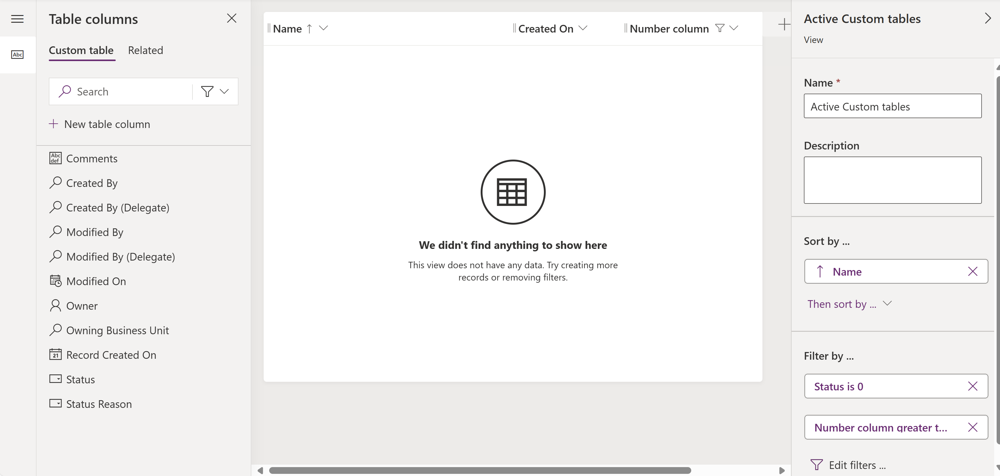

# Remove dependencies between columns and views

To remove dependencies between columns (formerly fields and also known as attributes) and views (saved queries), locate the view in the table and open it.

In the view editor, find the reference to the component you no longer want the view to depend on. In this example, you observe the column named **Number column** being used as a view column and a filter.

Remove both the filter and column, save, and then publish the view.

## Related articles

- [Removing dependencies overview](removing-dependencies.md)
- [Remove dependencies between fields and workflows](remove-field-workflow.md)
- [Remove dependencies between tables and model-driven apps](remove-table-app.md)