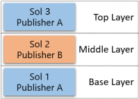

# Removing dependencies overview

Solution components often depend on other solution components. You can’t delete any solution component that has dependencies from another solution component. Dependencies are records created automatically by the solutions framework to prevent required components from being deleted while one or more dependent components still include references to them. An example of a dependency is as follows: given a field is required for a form to function, if you ever try to execute an action that will result in the deletion of that field, the form will stop working.

> [!NOTE]
> In this article, *delete* means that the component is completely removed from the system.

In this article, we discuss how to handle these dependencies and the strategies you can use to remove dependencies that you no longer need.

## Dependencies of unmanaged vs. managed components

First, it's important to understand that dependencies only prevent operations that will delete a required component. The actions that can delete a component are different, depending on whether it's unmanaged or managed.

### Unmanaged components

These components are represented by a single layer in the active solution. Any **Delete** operation on such a component results in the complete removal of the component.

### Managed components

The deletion of managed components depends on multiple factors: the number of solution layers, the relative position of the layer that's being uninstalled, and the component publishers. For example, when a component is deleted, consider the following scenarios and what will be the expected behavior when you uninstall the various layers.

### Example scenarios

The following example scenarios illustrate what happens to solution layers when solutions are uninstalled.
 
#### Scenario 1: Uninstall a single solution layer<!--Is this what "Uninstall with a single layer" means?-->

  

Uninstalling Solution 1 causes a component deletion because it's the only layer for the component.

#### Scenario 2: Uninstall solution layers from different publishers

 

   - Uninstalling Solution 2 doesn't cause a component deletion. Only that layer will be removed.
   - Uninstalling Solution 1 causes a component deletion, because the action happens in the base layer. In fact, Solution 1 can't be uninstalled in this scenario, because a solution from a different publisher extends the component.

#### Scenario 3: Uninstall multiple solution layers from different publishers

   
    
   - Uninstalling Solution 3 doesn't cause a component deletion. Only that layer will be removed.
   - Uninstalling Solution 2 doesn't cause a component deletion. Only that layer will be removed.
   - Uninstalling Solution 1 doesn't cause a component deletion, because in this case there's another solution from the same publisher (Publisher A = Publisher C)). The platform removes the layer from Solution 1 and replaces it with the layer from Solution 3.

#### Scenario 4: Uninstall solution layers in an unmanaged customization

   

   - Uninstalling the Active (unmanaged) layer doesn't cause a component deletion. Only that layer will be removed. Note that you can't uninstall the Active solution, but you can remove components by using the **Remove Active Customization** feature.
   - Uninstalling Solution 1 causes a component deletion. The action happens in the base layer. Unlike scenario 2, you can uninstall Solution 1. The Active solution isn't considered an extension, and both layers will be removed.

## Show dependencies page

The **Show dependencies** command lists the dependencies for the selected solution or solution component. It can be invoked by:

- Selecting **Show dependencies** on the solution page.
- Selecting **Advanced** > **Show dependencies** within a solution when a solution component is selected.
- Trying to uninstall a solution, which will cause the platform to detect that dependencies exist.

From the Dependencies page you can open, remove, or delete, the component. More information: [View dependencies for a component](/power-apps/maker/data-platform/view-component-dependencies)

## Diagnosing dependencies

Let's consider the following scenario. The organization below has two solutions: **Solution - Workflow** and **Solution - Custom Entity**.

The owner of the organization decided that they no longer require **Solution - Custom Entity**, tried to delete it, and was presented with the following page:

Without going into detail, we can conclude that the uninstall of the solution is trying to delete an entity named **Custom Entity** and three fields&mdash;**Custom Entity**, **Name**, and **Number Field**&mdash;and all four components have dependencies.

> [!NOTE]
> Uninstalling the solution might potentially delete more components, but because they don't have dependencies, they won't appear on the list.

The next step is to check the **Solution Layers** link (rightmost column) for each dependency. That will help you decide what to do to remove the dependency.

The following figure shows dependency details between the Entity (Custom Entity) and Process (Test Workflow).

Based on the data displayed, you can see that the dependent component belongs to a solution named SolutionWorkflow. To remove this dependency, we can either:

- Update the definition of the workflow in SolutionWorkflow by removing any references to the entity or its subcomponents. Then **Update** or **Upgrade** the solution.
- Uninstall the SolutionWorkflow solution.
- Remove the workflow from a new version of the SolutionWorkflow solution, and then perform an **Upgrade**.

Because any one dependent component can prevent the removal of the solution, we recommend that you check all the dependencies and make all the required changes in a single operation.

The following figure shows dependency details between the Entity (Custom Entity) and a model-driven App (My App).

 and App (My App)")

Based on the data displayed, you can see that the dependent component belongs to a solution named Active. This indicates that the dependency was created by importing an unmanaged solution, or through an unmanaged customization that was executed through the modern UI or API.

To remove this dependency, you can either:

- Edit the definition of the model-driven app to remove any reference to the entity or its subcomponents. Because model-driven apps support publishing, you must publish your changes.
- Delete the model-driven app.

> [!NOTE]
> Uninstalling an unmanaged solution isn't an option for removing this dependency, because unmanaged solutions are just a means to group components.

## Actions to remove a managed dependency

Managed dependencies are the ones where the dependent component is associated to a managed solution. To resolve this kind of the dependency, you must act on the solution where the component was added. That action can be different depending on what you're trying to do.

**If you're trying to uninstall a solution**

Follow these steps:

  1. In the target organization, inspect the **Solution Layers** link to find what is the topmost solution on the list of the dependent component.
  1. In the source organization, prepare a new version of that solution where the solution either doesn't contain the dependent component, or has an updated version of the dependent component that doesn't contain references to the required component. Your goal is to remove any reference to the required components in the new version of the solution.
  1. Export the new version of the solution.
  1. In the target organization, **Upgrade** that solution.
  1. Retry the uninstall.

**If you're trying to upgrade a solution**

In this case, you must confirm that you wanted to delete the required component (remember that dependencies are enforced only on components that are being deleted).

If you didn't want to delete the component, you can fix the new version of the solution by adding the component back by doing the following:

   1. In the target organization, uninstall the staged solution (the solution that ends in _Upgrade).
   2. In the source organization, add the required component(s) back to the solution.
   3. Export the new version.
   4. Retry the upgrade.

If the deletion is intentional, you must remove the dependency. Try the steps outlined in the preceding section, "If you're trying to uninstall a solution."

### Layers and dependencies

The dependent components can be layered, so you might need to change more than one solution to completely remove a dependency. The dependency framework only calculates dependencies between the topmost layers for the required and dependent components. That means you need to work your way from the top to the bottom of the solutions of the dependent component.

Consider the following scenario:

You try to uninstall **Solution - Custom Entity**, and the operation is blocked by dependencies.

You start diagnosing the dependency by selecting **Solution Layers** on the **new_numberfield** attribute. You see the following screen:

Because dependencies are created only between the topmost layers of each component, the first step is to deal with the dependency between the **new_numberfield** attribute in SolutionCustomEntity and the **Test Workflow** workflow in SolutionWorkflow3.

To remove the dependency, you decide to uninstall SolutionWorkflow3. You do so, but when you try to uninstall the solution once more, you're presented by the same page of dependencies:

However, the **new_numberfield** attribute is no longer listed, even if it existed in more layers.

## Actions to remove an unmanaged dependency

To remove unmanaged dependencies, you need to act directly on the components, not in the solutions they belong to. For example, if you want to remove the dependencies between an attribute and a form, you must edit it in the Form Editor and remove the attribute from the form. The dependency will be removed after you select **Save** and **Publish**.

> [!NOTE]
> 
> - The **Show dependencies** command lets you take action to view, remove the dependency, edit the component, or delete the component. More information: [View dependencies for a component](/power-apps/maker/data-platform/view-component-dependencies)
> - You can also delete the dependent component. That action deletes all dependencies, along with the component.

To view the dependencies of a component, from the **Solutions** area, open the solution you want, select the vertical ellipses next to the component, and then select **Advanced** > **Show dependencies**.

The page of dependencies has two distinct parts:

  - Dependent components: A list of components that depend on the selected field. In other words, these components will have this field as their required component.
  - Required components: A list of components that this field requires in order to work. In other words, these components will have this field as their dependent component.

### See also

- [Remove dependencies between fields and workflows](remove-field-workflow.md)
- [Remove dependencies between fields and views](remove-field-view.md)
- [Remove dependencies between tables and model-driven apps](remove-table-app.md)

[!INCLUDE[footer-include](../includes/footer-banner.md)]
