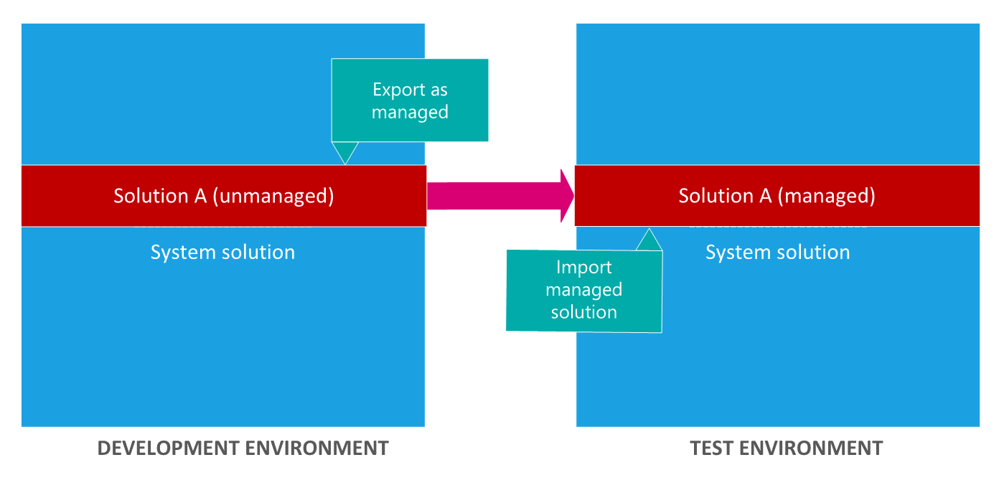
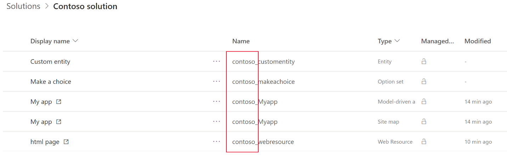

# Solution concepts 
Solutions are the mechanism for implementing ALM in Power Apps and Power Automate. This article describes the following key solution concepts:
- Two types of solutions
- Solution components
- Lifecycle of a solution
- Solution publisher
- Solution and solution component dependencies

## Managed and unmanaged solutions

A solution is either *managed* or *unmanaged*.

-   **Unmanaged solutions** are used in development environments while you make
    changes to your application. Unmanaged solutions can be exported either as unmanaged or managed. Exported unmanaged versions of your solutions should be checked into your source control system. Unmanaged solutions should be considered your source for Microsoft Power Platform assets. When an unmanaged solution is deleted, only the solution container of any customizations included in it is deleted. All the unmanaged customizations remain in effect and belong to the default solution.

-   **Managed solutions** are used to deploy to any environment that isn't a
    development environment for that solution. This includes test, UAT, SIT, and
    production environments. Managed solutions can be serviced independently
    from other managed solutions in an environment. As an ALM best practice,
    managed solutions should be generated by exporting an unmanaged solution as managed and considered a build artifact. Additionally:    
    - You can't edit components directly within a managed solution. To edit managed components, first add them to an unmanaged solution. 
       - When you do this, you create a dependency between your unmanaged customizations and the managed solution. When a dependency exists, the managed solution can't be uninstalled until you remove the dependency. 
    - Some managed components can’t be edited. To verify whether a component can be edited, view the [Managed properties](managed-properties-alm.md). 
    - You can't export a managed solution.
    - When a managed solution is deleted (uninstalled), all the customizations and extensions included with it are removed.

    > [!IMPORTANT]
    > - You can't import a managed solution into the same environment that contains the originating unmanaged solution. To test a managed solution, you need a separate environment to import it into.
    > - When you delete a managed solution, the following data is lost: data stored in custom entities that are part of the managed solution and data stored in custom attributes that are part of the managed solution on other entities that are not part of the managed solution.

Makers and developers work in development environments using unmanaged
solutions, then import them to other downstream environments&mdash;such as test&mdash;as
managed solutions.

> [!NOTE]
> When you customize in the development environment, you're working in
> the unmanaged layer. Then, when you export the unmanaged solution as a
> managed solution to distribute to another environment, the managed solution
> is imported into the environment in the managed layer. More information:
> [Solution layers](solution-layers-alm.md)

## Solution components

A component represents something that you can potentially customize. Anything that can be included in a solution is a component. To view the components included in a solution, open the solution you want. The components are listed in the **Components** list.

> [!div class="mx-imgBorder"] 
>  

> [!NOTE]
> You can't edit components directly within a managed solution.

To view a list of component types that can be added to any solution, see [ComponentType Options](/powerapps/developer/common-data-service/reference/entities/solutioncomponent#componenttype-options). 

Some components are nested within other components. For example, an entity contains forms, views, charts, fields, entity relationships, messages, and business rules. Each of those components requires an entity to exist. A field can’t exist outside of an entity. We say that the field is dependent on the entity. There are actually twice as many types of components as shown in the preceding list, but most of them are not nested within other components and not visible in the application.  
  
The purpose of having components is to keep track of any limitations on what can be customized using managed properties and all the dependencies so that it can be exported, imported, and (in managed solutions) deleted without leaving anything behind.

## Solution lifecycle

Solutions support the following actions that help support application lifecycle
processes:

-   **Create** Author and export unmanaged solutions.

-   **Update** Create updates to a managed solution that are deployed to the parent managed solution. You can't delete components with an update.

-   **Upgrade** Import the solution as an upgrade to an existing managed solution,
    which removes unused components and implements upgrade logic. Upgrades
    involve rolling up (merging) all patches to the solution into a new version
    of the solution. Solution upgrades will delete components that existed but
    are no longer included in the upgraded version. You can choose to upgrade
    immediately or to stage the upgrade so that you can do some additional
    actions prior to completing the upgrade.

-   **Patch** A patch contains only the changes for a parent managed solution, such as adding or editing components and assets. Use patches when making small
    updates (similar to a hotfix). When patches are imported, they're layered on
    top of the parent solution. You can't delete components with a
    patch.

## Solution publisher 

Every app and other solution components such as entities you create or any customization you make is part of a solution. Because every solution has a publisher, you should create your own publisher rather than use the default. You specify the publisher when you create a solution.

> [!NOTE]
> Even if you don't use a custom solution, you'll be working in solutions which
> are known as the *Common Data Service Default Solution* and the *Default* solutions.
> More information: [Default Solution and Common Data Service Default Solution](use-solutions-for-your-customizations.md)

The publisher of a solution where a component is created is considered the owner of that component. The owner of a component controls what changes other publishers of solutions including that component are allowed to make or restricted from making. It is possible to move the ownership of a component from one solution to another within the same publisher, but not across publishers. Because of this, it's often best to define a single publisher so you can change the layering model across publishers later.

The solution publisher specifies who developed the app. For this reason, you
should create a solution publisher name that's meaningful.

### Solution publisher prefix

A solution publisher includes a prefix. The publisher prefix is a mechanism to help avoid naming collisions. This allows for solutions from different publishers to be installed in an environment with few conflicts. For example, the Contoso solution displayed here includes a solution publisher prefix of *contoso*.

> [!div class="mx-imgBorder"]
> 

> [!NOTE]
> When you change a solution publisher prefix, you should do it before
you create any new apps or metadata items because you can't change the names of
metadata items after they're created.

More information: 
- [Create a solution publisher prefix](/powerapps/maker/common-data-service/create-solution#create-a-solution-publisher)
- [Change a solution publisher prefix](/powerapps/maker/common-data-service/create-solution#change-a-solution-publisher)

## Solution dependencies  
Because of the way that managed solutions are layered, some managed solutions can be dependent on solution components in other managed solutions. Some solution publishers will take advantage of this to build solutions that are modular. You may need to install a “base” managed solution first and then you can install a second managed solution that will further customize the components in the base managed solution. The second managed solution depends on solution components that are part of the first solution.  
  
The system tracks these dependencies between solutions. If you try to install a solution that requires a base solution that isn’t installed, you won’t be able to install the solution. You will get a message saying that the solution requires another solution to be installed first. Similarly, because of the dependencies, you can’t uninstall the base solution while a solution that depends on it is still installed. You have to uninstall the dependent solution before you can uninstall the base solution. More information: [Removing dependencies](removing-dependencies.md)

## Solution component dependencies
A solution component represents something that you can potentially customize. Anything that can be included in a solution is a solution component and some components are dependant on other components. For example, the website field and account summary report are both dependant on the account entity. More information: [Dependency tracking for solution components](dependency-tracking-solution-components.md)

### See also
[Solution layers](solution-layers-alm.md)  
[Create and manage environments in the Power Platform admin center](../admin/create-environment.md)  

[!INCLUDE[footer-include](../includes/footer-banner.md)]