# Tutorial: Build a model-driven app for deployment using GitHub Actions for Microsoft Power Platform

In this tutorial, you will be creating a simple model-driven app to deploy using GitHub Actions for Microsoft Power Platform in the next tutorial.

> [!div class="checklist"]
> * Create a model-driven app

In the next tutorial, you will learn how to:

> [!div class="checklist"]
> * Export and deploy your app using application lifecycle management (ALM) automation

## Build a model-driven app

Follow the steps below to build a model-driven app.

1. In your browser, navigate to https://make.powerapps.com and sign in with your credentials.  Click the environment selector dropdown in the header and select your development environment.

    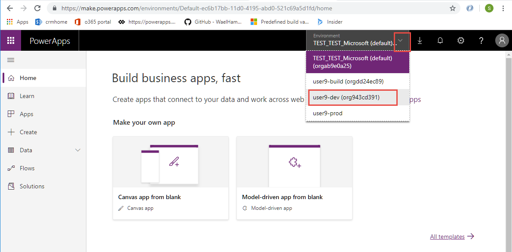

2. Click the **Solutions** area in the left navigation, and then click the **New solution** button to create a new solution.

    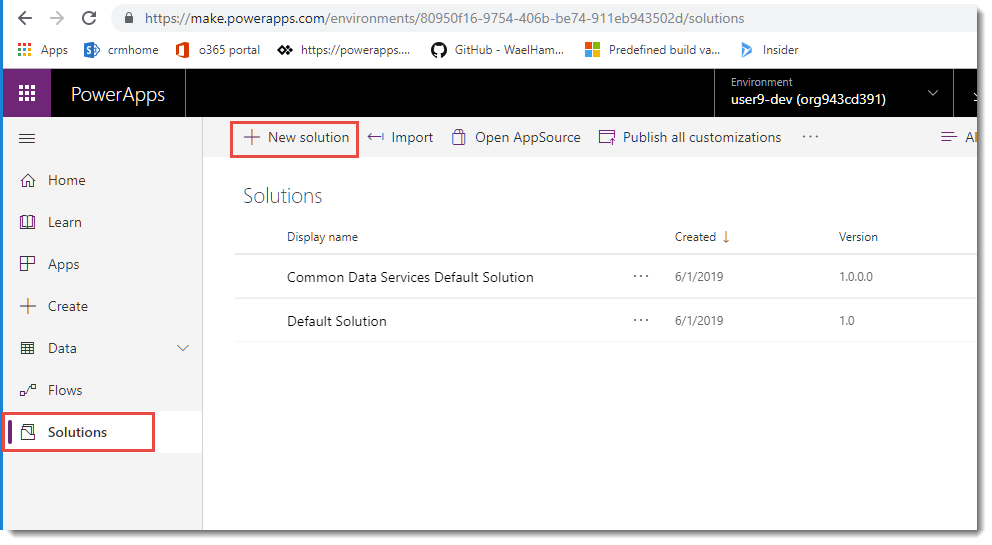
 
3. In the side panel that appears, enter a name for the application and click the dropdown for the publisher, and then click the **Add Publisher** option.

    > [!NOTE]
    > The solution publisher specifies who developed the app, so you should always create a solution publisher name that is meaningful. Furthermore, the solution publisher includes a prefix, which helps you distinguish system components or components introduced by others and is also a mechanism to help avoid naming collisions. This allows for solutions from different publishers to be installed in an environment with minimal conflicts.

    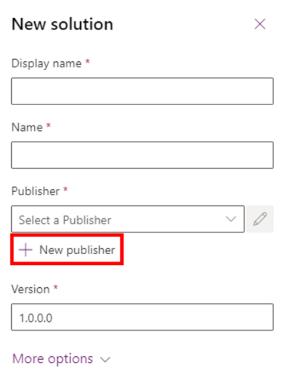

4. A new window will be displayed.  If a window does not open, check your browser's popup blocker settings.  For the purposes of this lab, enter 'ALMLab' for the display name, name, and prefix, and then choose **Save and Close**.

    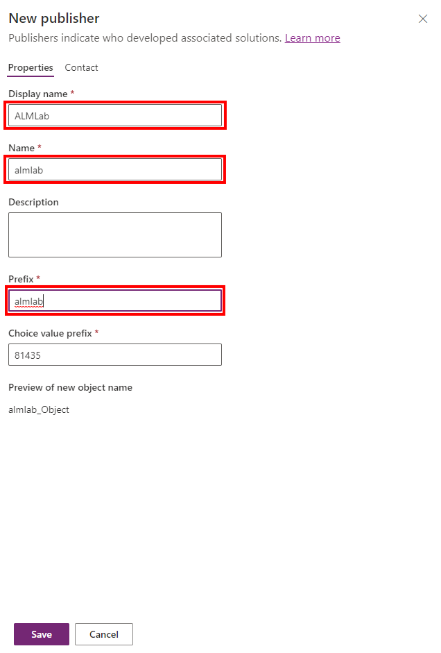

5. On the new solution panel, select the publisher that you just created, give the application a version number, and select **Create** to create a new unmanaged solution in the environment.

    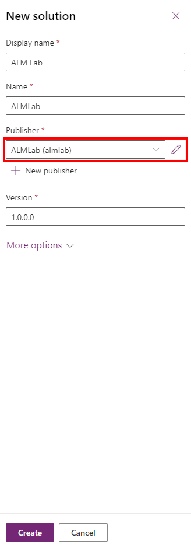

6. In the solutions list, select the solution you just created and click the **Edit** button.

    

7. Your new solution will be empty, and you need to add components to it. In this tutorial we will create a custom entity.  Click the **New** dropdown from the top navigation and then select **Entity**.

    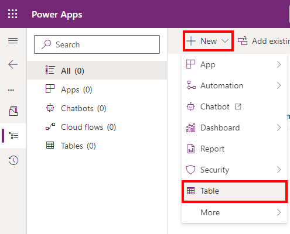

8. Enter a display name and plural name for the entity. The system will fill out the entity name and other fields for you. Click **Create** to create the entity.

    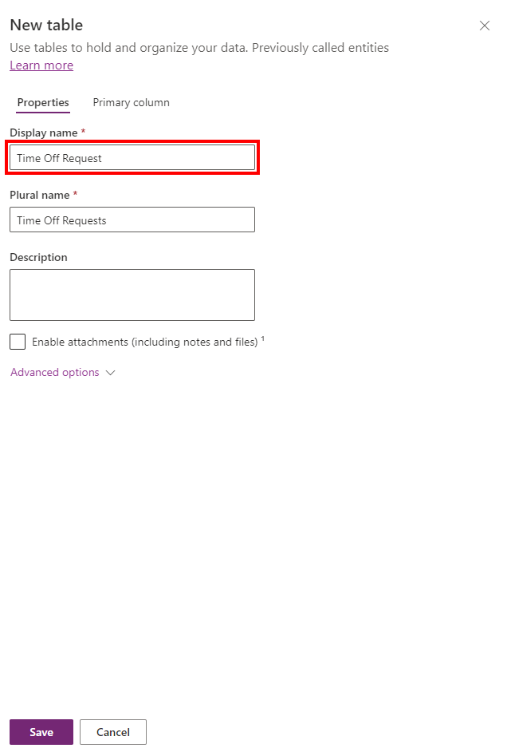

9. Once your entity is created, select the solution name again to go back to the solution view to add another component.

10. Click the **New** dropdown, then **App**, and **Model-driven app**.

    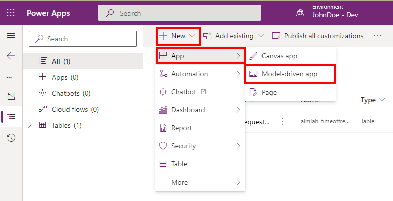

11. Enter an application name, and then click the **Done** button.

    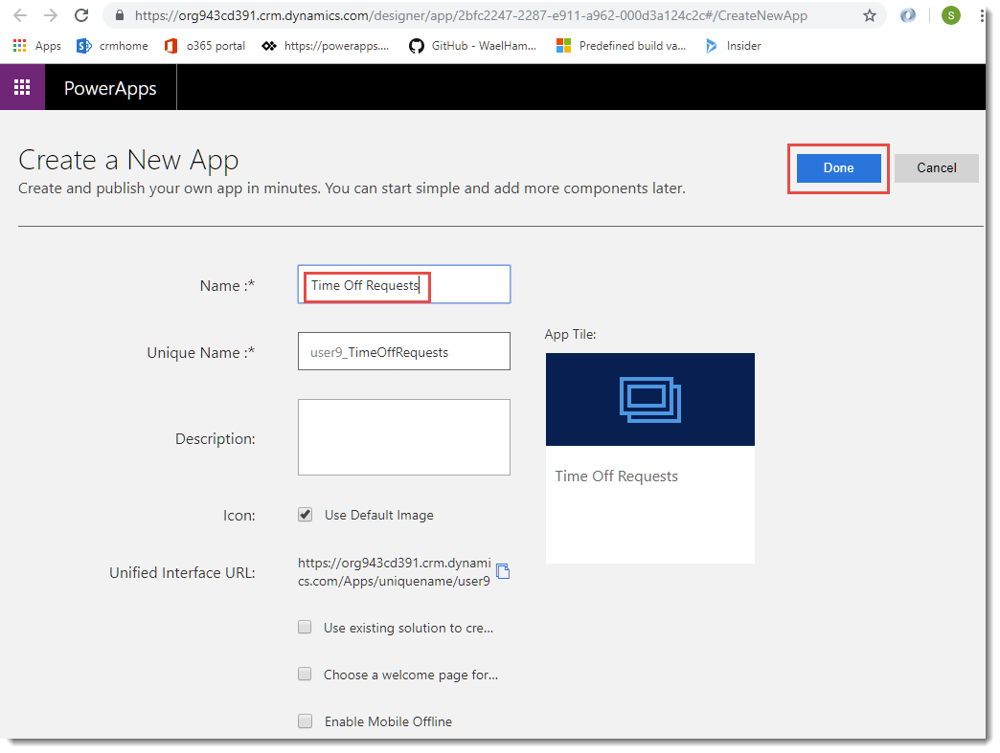

12. In the application designer, click the **Site Map** to edit it.

    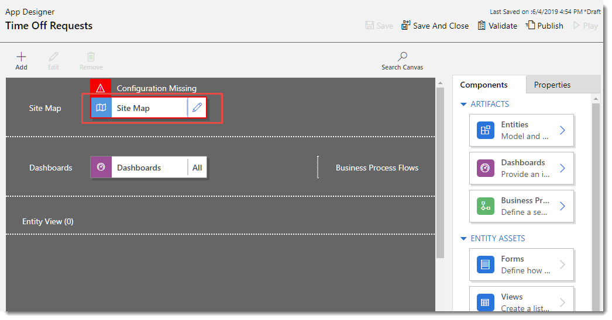

13. In the sitemap editor, select **New Subarea** to get its current properties.

    

14.	Select the **Entity** dropdown and select your custom entity to add to the sitemap.

    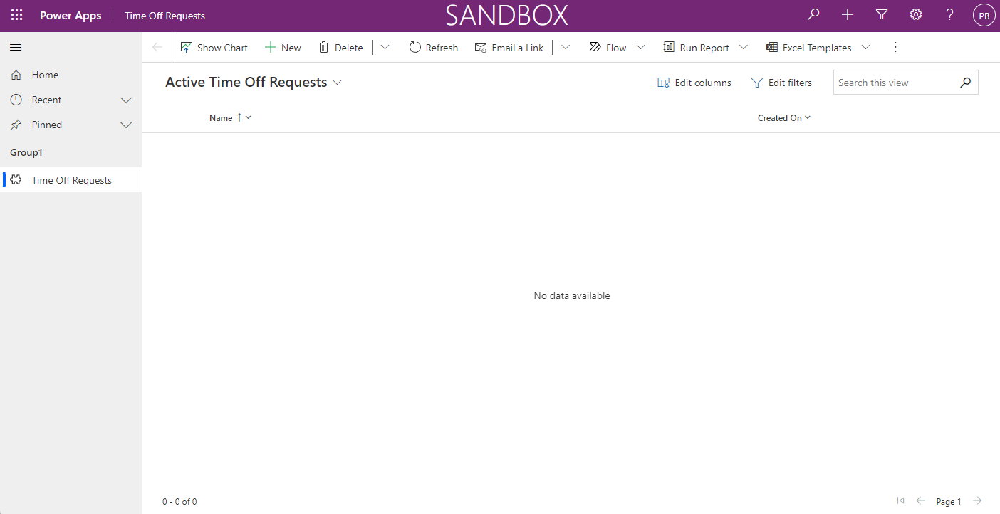

15.	Click **Save**, **Publish**, and then **Save And Close** to go back to the application designer.

    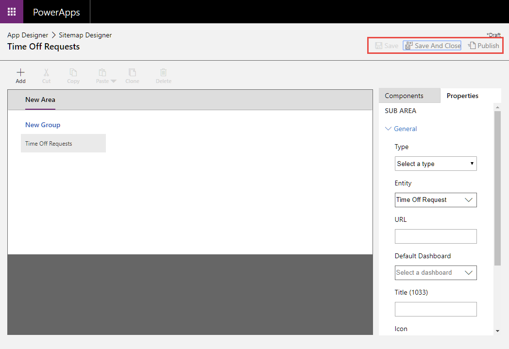

16.	Click **Save**, and then **Validate** to validate the application.

    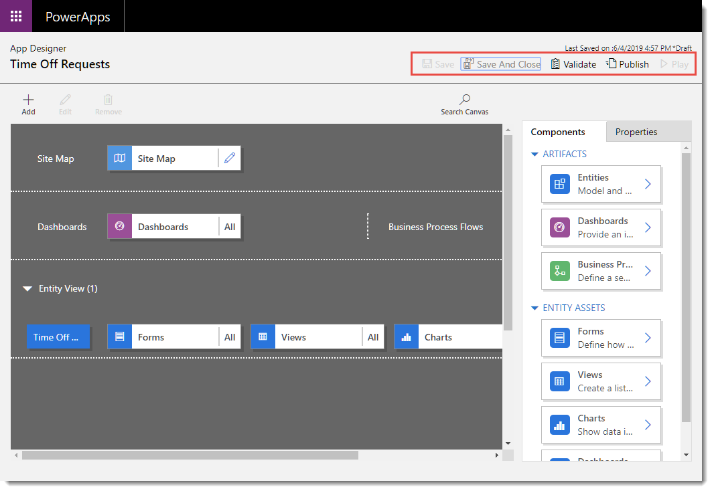

17.	You should see one warning. View the warning, select **Publish**, and then **Play**.

    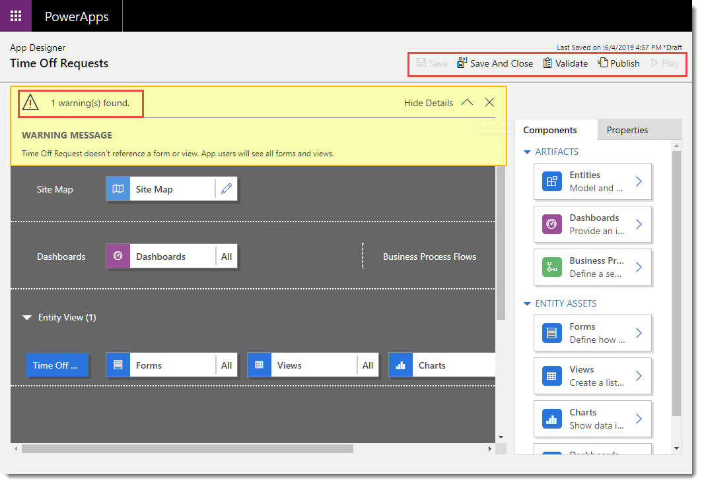

18.	You should now see how the application you just built looks.  You can use the application and close its tab when you are satisfied.

    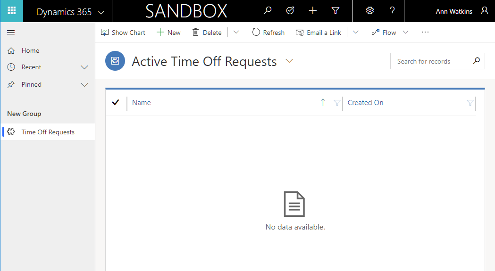

> [!div class="nextstepaction"]
> [Next steps](./github-actions-deploy.md)

### See Also

[Automate your workflow from idea to production](https://github.com/features/actions)
