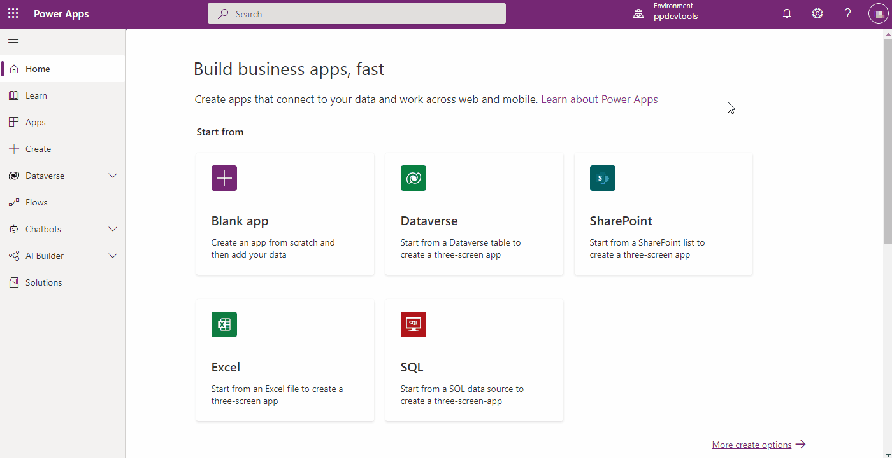
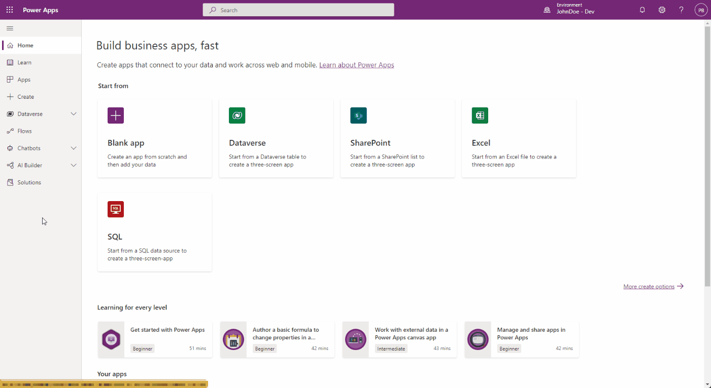
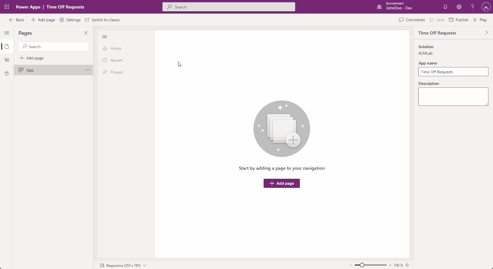

# Tutorial: Build a model-driven app for deployment using GitHub Actions for Microsoft Power Platform

In this tutorial, you will be creating a simple model-driven app to deploy using GitHub Actions for Microsoft Power Platform in the next tutorial.

> [!div class="checklist"]
> * Create a model-driven app

In the next tutorial, you will learn how to:

> [!div class="checklist"]
> * Export and deploy your app using application lifecycle management (ALM) automation

## Build a model-driven app

Follow the steps below to build a model-driven app.

1. In your browser, navigate to https://make.powerapps.com and sign in with your credentials.  Click the environment selector dropdown in the header and select your development environment.

    

2. Click the **Solutions** area in the left navigation, and then click the **New solution** button to create a new solution.

    

3. In the side panel that appears, enter a name for the application and then click the **Add Publisher** option.

    > [!NOTE]
    > The solution publisher specifies who developed the app, so you should always create a solution publisher name that is meaningful. Furthermore, the solution publisher includes a prefix, which helps you distinguish system components or components introduced by others and is also a mechanism to help avoid naming collisions. This allows for solutions from different publishers to be installed in an environment with minimal conflicts.

    

4. For the purposes of this tutorial, enter 'ALMLab' for the *display name*, *name*, and *prefix*, and then choose **Save and Close**.

    

5. On the new solution panel, select the publisher that you just created and **click** **Create** to create a new unmanaged solution in the environment.

    

6. In the solutions list, select the solution you just created and click the **Edit** button.

    

7. Your new solution will be empty, and you need to add components to it.  In this lab we will create a custom table. Click the **+ New** dropdown from the top navigation and select **Table**

    

8. Enter a **display name**, plural name will be generated for you. Click **Save** to create the table.

    

9. Once your table is created, select the solution name again to go back to the solution view to add another component.

10. Click the **+ New** dropdown, then **App**, and finally click **Model-driven app**. If you get a pop-up asking to select the creating experience choose *Modern app designer* 

    

11. Enter an app name, then click the **Create** button

     

12. In the application designer, click **+ Add page**, choose **Table based view and form**, then click **Next**. On the next screen **search by name for the table you previously created**. **Check mark the selection** and click **Add**

     * Ensure that *Show in navigation* is checked

     

13. Click **Publish**, once the publish action is complete click **Play**.

14. This will take you to the application so that you can see how it looks. You can use the application and close the tab when you are satisfied.

     

> [!div class="nextstepaction"]
> [Next steps](./github-actions-deploy.md)

### See Also

[Automate your workflow from idea to production](https://github.com/features/actions)

[!INCLUDE[footer-include](../../includes/footer-banner.md)]
