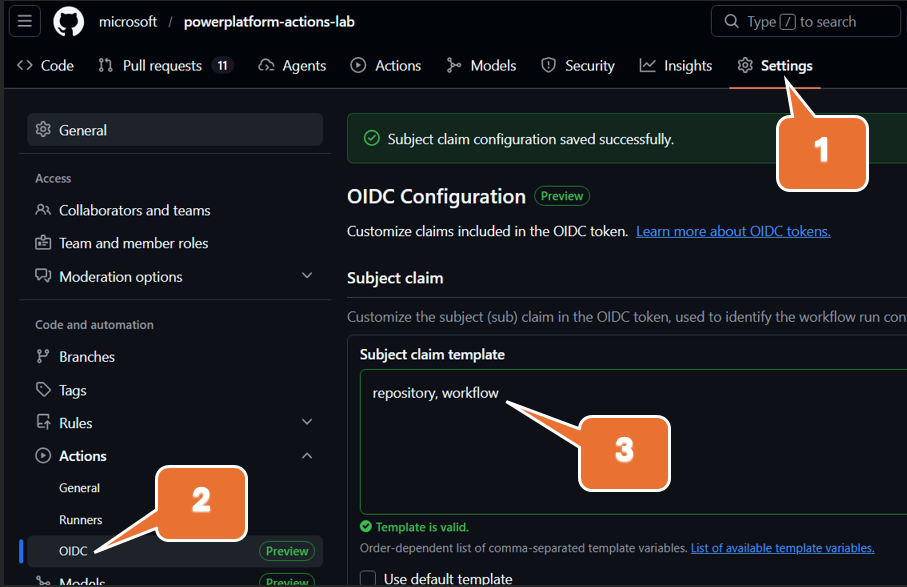
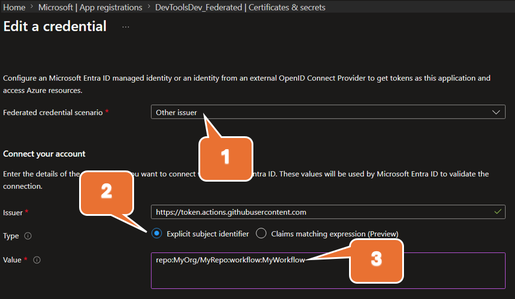

# Tutorial: Use OIDC/FIC authentication with GitHub Actions for Microsoft Power Platform

In this tutorial, you set up GitHub OIDC and Microsoft Entra federated identity credentials (FIC) so GitHub Actions can authenticate to Power Platform without storing a client secret.

In this tutorial, you will:

> [!div class="checklist"]
>
> * Configure OIDC in your GitHub repository
> * Create a Microsoft Entra app registration and configure FIC
> * Grant the app access in the Power Platform admin center
> * Create a GitHub workflow to run Power Platform actions

## Step 1: Configure OIDC in your GitHub repository

  

1. In GitHub, open your repository and make sure GitHub Actions is enabled.

   To enable GitHub Actions in the repo, select **Settings** > **Actions** and then under **General** you are presented with an option to enable. If you do not see **Actions** under **Settings**, you do not have the required repo securtity permission.

3. Review OIDC settings and subject claim customization guidance. Refer to [OpenID Connect in GitHub Actions](https://docs.github.com/en/actions/reference/security/oidc).

4. Configure the OIDC subject claim template to be `repository, workflow` for this tutorial, as shown in the figure above. It creates a unique subject claim for each workflow in your repository, which you can then reference in your federated credential configuration in Microsoft Entra ID.

   The subject format resolves to values like:

   * `repo:MyOrg/MyRepo:workflow:MyWorkflow`

5. Save your repository OIDC configuration.

## Step 2: Create a Microsoft Entra app registration and add FIC

1. In the [Azure portal](https://portal.azure.com), go to **Microsoft Entra ID** > **App registrations** > **New registration**.

2. Create the app registration and copy the **Application (client) ID** and **Directory (tenant) ID** values.

3. Open **API permissions** > **Add a permission** > **Dynamics CRM** and grant Dataverse permission.

4. Open **Certificates & secrets** (or **Federated credentials**, depending on portal experience), and select `Other` in **Federated credential scenario**.

  

1. Use this explicit subject identifier:

   `repo:MyOrg/MyRepo:workflow:MyWorkflow`

2. Save the federated credential.

> [!NOTE]
> The subject claim in GitHub and the subject identifier in your federated credential must match exactly.

## Step 3: Grant the app access in the Power Platform admin center

1. Go to the [Power Platform admin center](https://admin.powerplatform.microsoft.com/).

2. Add the Entra ID app registration as an application user and assign required security roles in each target environment.

3. For detailed steps, see [Manage application users in the Power Platform admin center](/power-platform/admin/manage-application-users).

## Step 4: Create a GitHub workflow to run Power Platform operations

1. In your repository, create or update a workflow in `.github/workflows/`.

2. Ensure the workflow requests OIDC token permissions for the job that runs Power Platform actions.

3. Configure your Power Platform GitHub Actions to use:

   * Tenant ID
   * App (client) ID
   * Environment URL
   * OIDC/FIC-based authentication parameters supported by the action

4. Paste your sample workflow YAML in this section and update placeholders for your environment.

```yaml
# https://docs.github.com/en/actions/how-tos/secure-your-work/security-harden-deployments/oidc-in-azure
name: fic-auth

on:
  # Allows you to run this workflow manually from the Actions tab
  workflow_dispatch:

jobs:
  who-am-i:

    runs-on: ubuntu-latest
    
    permissions:
      id-token: write # Grant permissions to the OIDC endpoint for federation
      contents: read
      
    steps:
    - name: Install Power Platform Tools
      uses: microsoft/powerplatform-actions/actions-install@v1
      with:
        pac-version-override: 2.4.1

    - name: WhoAmI
      uses: microsoft/powerplatform-actions/who-am-i@v1
      with:
        environment-url: https://MyOrg.crm.dynamics.com/
        app-id: 00000000-0000-0000-0000-000000000000 # Client (application) ID from your app registration
        tenant-id: 00000000-0000-0000-0000-000000000000 # Directory (tenant) ID from your app registration 

```

When the workflow runs, GitHub issues an OIDC token. Microsoft Entra validates that token against your federated credential, and the action authenticates to Dataverse/Power Platform without a client secret.

### See also

* [Use GitHub Actions for Microsoft Power Platform](../devops-github-actions.md)
* [Available GitHub Actions for Power Platform development](../devops-github-available-actions.md)

[!INCLUDE[footer-include](../../includes/footer-banner.md)]
