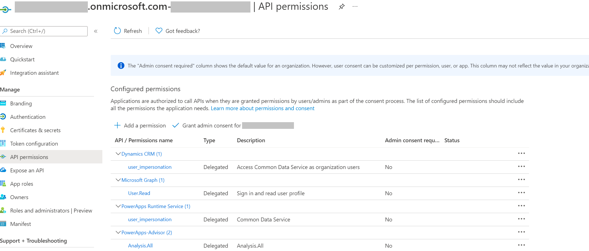
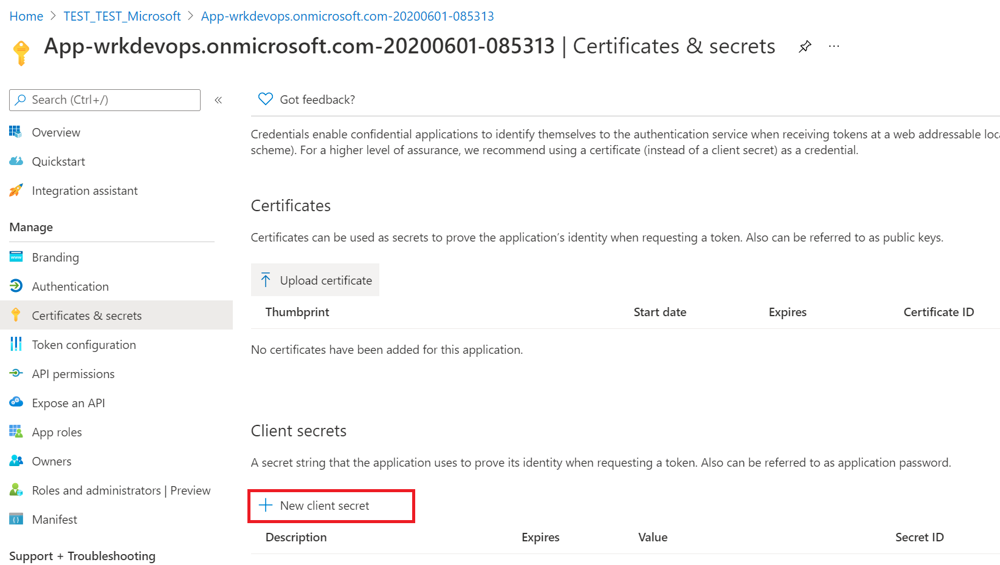
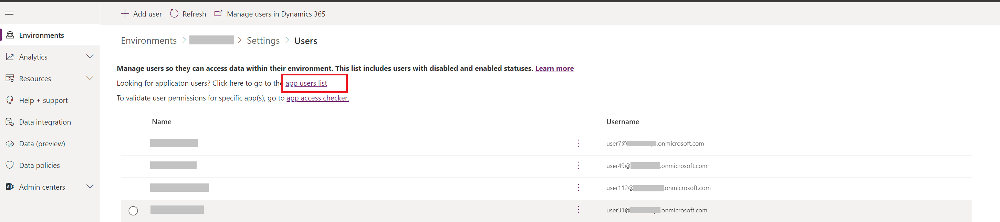
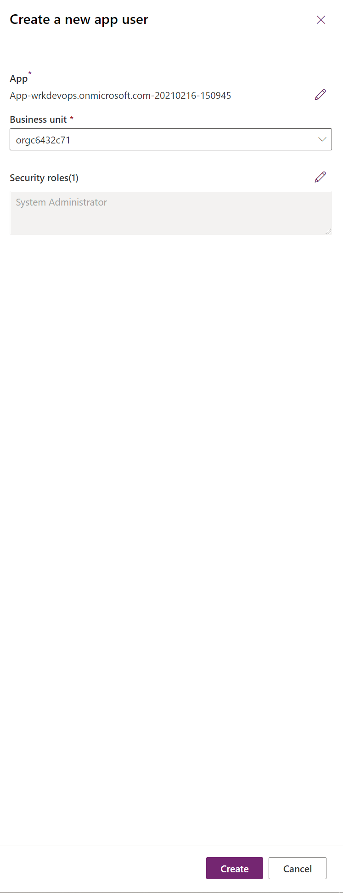

# Tutorial: Get started with GitHub Actions for Microsoft Power Platform

This three part tutorial will give you an opportunity to get hands on with best practices to automate building and deploying your app using GitHub Actions for Power Platform. The first two tutorials are all about setting up required environments and creating a solution to later use with GitHub Actions. If you are experienced with creating environments and solutions, you can follow the Tip below and skip to the third tutorial to begin using GitHub Actions for Power Platform.

> [!div class="checklist"]
> * (1) Create three Microsoft Dataverse environments in your tenant
>   (2) **Highly Recommended** Create a Service Principal and provide the appropriate permissions 
> * (3) Create a model-driven app
> * (4) Export and deploy your app using application lifecycle management (ALM) automation

> [!TIP]
> If you are already familiar with the concept of multiple Dataverse environments as well as how to use solutions to package your app, simply download and use the sample [ALMLab solution](https://github.com/microsoft/powerplatform-actions-lab/blob/main/solutions/ALMLab_1_0_0_1.zip) and then skip to the [last tutorial](github-actions-deploy.md) of this series.

Let's get started with tutorial #1 and create three Dataverse environments.

## Create required environments

You will need to create, or have access to, three Dataverse environments in your demo or customer tenant. To create these environments, follow the instructions below. Otherwise, proceed to the end of this tutorial for the next steps.

1. Sign in to the [Power Platform admin center](https://admin.powerplatform.microsoft.com/) with credentials that provide access to a tenant with a minimum 3 GB available capacity (required to create the three environments).

2. Select **Environments** in the navigation area.

3. Select **+ New** to create your first new environment.

    

4. The first environment should be named “Your Name – dev”, set the region to **United States (default)**, set the environment type to *Production* (if available),  if not use **Trial**.

    

5. Select **Yes** to create a database and then **Next**.

6. Set the currency to **USD** and language to **English**. Include the sample apps and data, provide a URL for your business organization, and then select **Save**.

    

7. Your development environment has been created, follow steps 4 – 8 above to create a second environment called “Your Name – build” , and then create a third environment called “Your Name – prod”. Note that the third environment can be a trial environment type.

You now have the development, build, and production environments needed in the following modules of this tutorial.

## Create the Service Principal account and give it rights to the environments created

1. You will need to create an Application registration within Azure Active Directory 

2. Upon creation of the Application Registration, Please note and save the tenant id and of the application and client id(app id) of the application

    

3. Back on the navigation panel, of the overview page, select API permissions

4. Choose **+ Add a Permission**, and in the Microsoft APIs tabs, Choose **Dynamics CRM**

5.  In the Request API permission form, select Delegated permissions, check **user_impersonation**, and **Add permissions**

6.  Similarly, select **PowerApps Runtime Service** and select **user_impersonation**, and select **PowerApps-Advisor** with **Analysis.All** rights 

  

7. Then proceed to create a client secret, in the navigation panel, select **Certificates & secrets**

8. Below **Client Secrets**, select **+ New client secret**

9.  In the form, enter a description and select **Add.** Record the secret string, you will not be able view the secret again once you leave the screen

  

 ###  Application user creation
 In order for the GitHub workflow to deploy solutions as part of a CI/CD pipeline and "Application User" needs to be given access to the environment. "Application user" is the App Registration done in Azure Active Directory just prior

  1. Navigate to your Dataverse environment (https://*[org]*.crm.dynamics.com)

  2. Navigate to **Settings > Security > Users.**

  3. select the link app users list
    
  
  4. Select **+ new app user**, this will open a panel on the right hand side of the screen

  5. Select **+ Add an app**, this will list out all the app registrations in your Azure AD tenant, proceed to select the Application Name that your registered

  6. Under business unit, in the drop down box, select your environment as the business unit

  7. Under Security Roles, select System administrator, and select create, this will allow the service principal access to the environment

    

Now that you have created the service principal, you can now use either the service principal or the standard username and password for your GitHub Workflow. **Note** if you have MFA enabled, then service principal authentication is the method you want to implement

> [!div class="nextstepaction"]
> [Next steps](./github-actions-build.md)

### See Also

[Automate your workflow from idea to production](https://github.com/features/actions)

[!INCLUDE[footer-include](../../includes/footer-banner.md)]