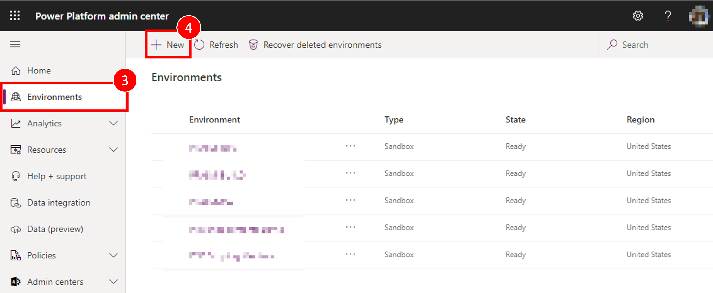
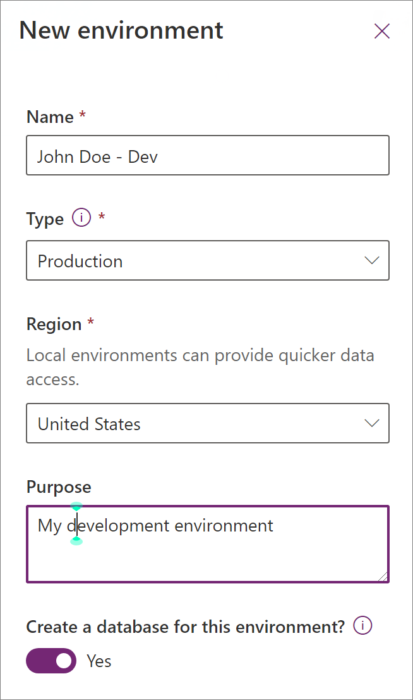
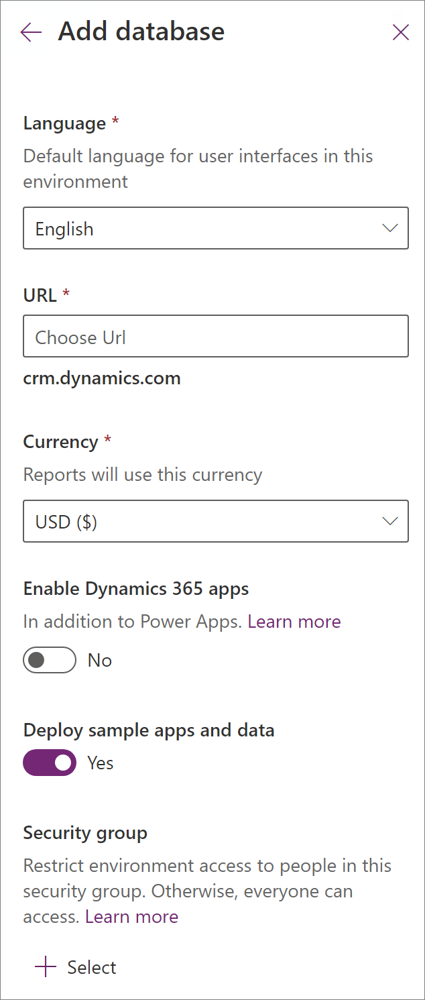

# Tutorial: Get started with GitHub Actions for Microsoft Power Platform

This three part tutorial will give you an opportunity to get hands on with best practices to automate building and deploying your app using GitHub Actions for Power Platform. The first two tutorials are all about setting up required environments and creating a solution to later use with GitHub Actions. If you are experienced with creating environments and solutions, you can follow the Tip below and skip to the third tutorial to begin using GitHub Actions for Power Platform.

> [!div class="checklist"]
> * (1) Create three Microsoft Dataverse environments in your tenant
> * (2) Create a model-driven app
> * (3) Export and deploy your app using application lifecycle management (ALM) automation

> [!TIP]
> If you are already familiar with the concept of multiple Dataverse environments as well as how to use solutions to package your app, simply download and use the sample [ALMLab solution](https://github.com/microsoft/powerplatform-actions-lab/blob/main/solutions/ALMLab_1_0_0_1.zip) and then skip to the [last tutorial](github-actions-deploy.md) of this series.

Let's get started with tutorial #1 and create three Dataverse environments.

## Create required environments

You will need to create, or have access to, three Dataverse environments in your demo or customer tenant. To create these environments, follow the instructions below. Otherwise, proceed to the end of this tutorial for the next steps.

1. Sign in to the [Power Platform admin center](https://admin.powerplatform.microsoft.com/) with credentials that provide access to a tenant with a minimum 3 GB available capacity (required to create the three environments).

2. Select **Environments** in the navigation area.

3. Select **+ New** to create your first new environment.

    

4. The first environment should be named “Your Name – dev”, set the region to **United States (default)**, set the environment type to *Production* (if available),  if not use **Trial**.

    

5. Select **Yes** to create a database and then **Next**.

6. Set the currency to **USD** and language to **English**. Include the sample apps and data, provide a URL for your business organization, and then select **Save**.

    

7. Your development environment has been created, follow steps 4 – 8 above to create a second environment called “Your Name – build” , and then create a third environment called “Your Name – prod”. Note that the third environment can be a trial environment type.

You now have the development, build, and production environments needed in the following modules of this tutorial.

> [!div class="nextstepaction"]
> [Next steps](./github-actions-build.md)

### See Also

[Automate your workflow from idea to production](https://github.com/features/actions)
