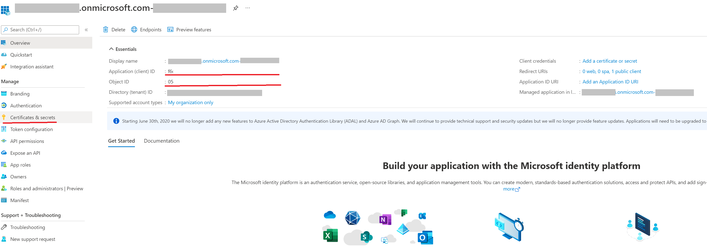

# Tutorial: Get started with GitHub Actions for Microsoft Power Platform

This three part tutorial will give you an opportunity to get hands on with best practices to automate building and deploying your app using GitHub Actions for Power Platform. The first two tutorials are all about setting up required environments and creating a solution to later use with GitHub Actions. If you are experienced with creating environments and solutions, you can follow the Tip below and skip to the third tutorial to begin using GitHub Actions for Power Platform.

> [!div class="checklist"]
> * Create three Microsoft Dataverse environments in your tenant
> * (**Highly recommended**) Create a service principal and provide the appropriate permissions 
> * Create a model-driven app
> * Export and deploy your app using application lifecycle management (ALM) automation

> [!TIP]
> If you are already familiar with the concept of multiple Dataverse environments as well as how to use solutions to package your app, simply download and use the sample [ALMLab solution](https://github.com/microsoft/powerplatform-actions-lab/blob/main/solutions/ALMLab_1_0_0_1.zip) and then skip to the [last tutorial](github-actions-deploy.md) of this series.

Let's get started with tutorial #1 and create three Dataverse environments.

## Create required environments

You will need to create, or have access to, three Dataverse environments in your demo or customer tenant. To create these environments, follow the instructions below. Otherwise, proceed to the end of this tutorial for the next steps.

1. Sign in to the [Power Platform admin center](https://admin.powerplatform.microsoft.com/) with credentials that provide access to a tenant with a minimum 3-GB available capacity (required to create the three environments).

2. Select **Environments** in the navigation area.

3. Select **+ New** to create your first new environment.

    

4. The first environment should be named "Your Name – dev", set the region to "United States (default)", set the Environment type to **Sandbox** (if available), if not use "Trial".

    - Ensure the ***Create a database for this environment*** radio toggle is set to **Yes**

    

5. **Click Next.**

6. Set the Language and currency as preferred and set the "***Deploy sample apps and data?*** " radio button to **Yes**, then **click Save**

    

7. Your development environment has been created, follow steps 2 – 7 above to create a second environment called "Your Name – build" , and then finally, create a third environment called "Your Name – prod"

Now you have the environments that we will need for this and ready to begin the next modules of this Hands-on lab.

## Create the service principal account and give it rights to the environments created

1. You will need to create an application registration within Microsoft Entra ID. Do this for all DEV/BUILD/PROD environments used. More information: [Tutorial: Register an app with Microsoft Entra ID](/powerapps/developer/data-platform/walkthrough-register-app-azure-active-directory)

2. Upon creation of the application registration, please note and save the Directory (tenant) ID and the Application (client) ID of the application.

    

3. On the navigation panel of the **Overview** page, select **API permissions**.

4. Choose **+ Add a permission**, and in the **Microsoft APIs** tab, Choose **Dynamics CRM**.

5.  In the **Request API permissions** form, select **Delegated permissions**, check **user_impersonation**, and then choose **Add permissions**.

6.  From the **Request API permissions** form, choose **PowerApps Runtime Service**, select **Delegated permissions**, check **user_impersonation**, and then choose **Add permissions**.

7.  From the **Request API permissions** form, choose **APIs my organization uses**, search for "PowerApps-Advisor" using the search field, select **PowerApps-Advisor** in the results list, select **Delegated permissions**, check **Analysis.All** rights, and then choose **Add permissions**.

  

8. Next, proceed to create a client secret, in the navigation panel, select **Certificates & secrets**.

9. Below **Client secrets**, select **+ New client secret**.

10.  In the form, enter a description and select **Add.** Record the secret string, you will not be able view the secret again once you leave the form.

  

 ###  Application user creation

 In order for the GitHub workflow to deploy solutions as part of a CI/CD pipeline an "Application user" needs to be given access to the environment. An "Application user" represents an unlicensed user that is authenticated using the application registration completed in the prior steps.

1. Sign in to [Power Platform admin center](https://aka.ms/ppac).

1. Go to **Environments** > open the environment you want > **Settings** > **Users + permissions** > **Application users**.

1. Select **+ New app user**. A panel will open on the right hand side of the screen.

1. Select **+ Add an app**. A list of all the application registrations in your Microsoft Entra tenant is shown. Proceed to select the application name from the list of registered apps.

 1. Under **Business unit**, in the drop down box, select your environment as the business unit.

 1. Under **Security roles**, select **System administrator**, and then select **create**. This will allow the service principal access to the environment.

  

Now that you have created the service principal, you can use either the service principal or the standard username and password for your GitHub Workflow. 

> [!IMPORTANT]
> If you have multi-factor authentication (MFA) enabled, service principal authentication is the authentication method you want to use.

> [!div class="nextstepaction"]
> [Next steps](./github-actions-build.md)

### See Also

[Automate your workflow from idea to production](https://github.com/features/actions)

[!INCLUDE[footer-include](../../includes/footer-banner.md)]