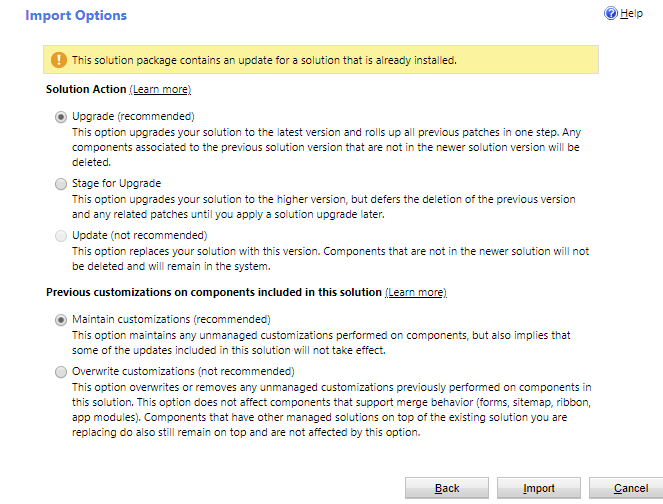

# Update a solution 

Make changes to your unmanaged solution, such as adding or removing components.
Then, when you import a managed solution that was previously imported, the
import logic detects the solution as an update and displays the following screen of options.

> [!div class="mx-imgBorder"] 
> 

More information: [Apply an update or upgrade for a solution](/powerapps/maker/common-data-service/update-solutions) 

### See also
[Overview of tools and apps used with ALM](tools-apps-used-alm.md)
