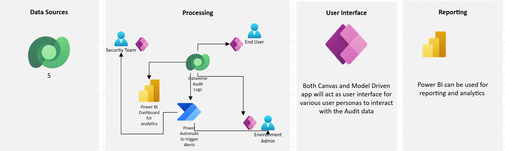
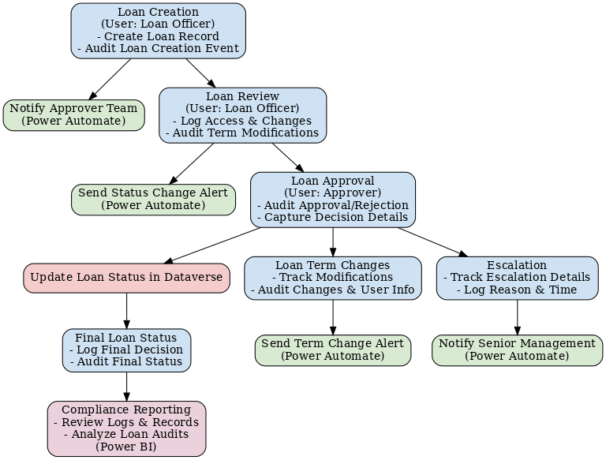

# Dataverse auditing reference architecture

## Scope

The scope of the document is to understand auditing in Dataverse with
respect to data auditing as well as business event auditing.

## Architecture diagram

## 

## Dataverse data auditing

Dataverse auditing is a feature within Microsoft Dataverse that enables
organizations to track and record changes to data, user activities, and
system events. It helps ensure data integrity, security, and compliance
by capturing operations such as record creation, updates, deletions,
security role modifications, and user access events. By maintaining a
historical log of these activities, organizations can monitor system
usage, detect unauthorized access, and meet regulatory requirements like
GDPR and HIPAA.

Auditing in Dataverse can be enabled at the environment, entity, or
field level, allowing organizations to customize their tracking needs.
Audit logs are securely stored and can be reviewed through the Power
Platform Admin Center for analysis and reporting. This feature is
essential for businesses that require transparency in data changes,
accountability in user actions, and insights into system performance to
maintain operational efficiency.

## Use case scenario

A financial institution needs to track data modifications, security
incidents, prevent unauthorized access, and ensure compliance with
security policies.

## Key interactions with different components

Dataverse is used to store and track compliance records,
incidents, and approvals. Dataverse auditing needs to be enabled to track
CRUD (create, read, update, and delete) actions and serves as the
central data source for security tracking. Additionally, role-based
security can be enabled to control access to sensitive compliance data.

**Power Apps (model-driven and canvas)**: Model-driven apps can be used
by security teams to manage policies, regulations, and audits and to
provide structured compliance review for admins via dashboards and
reports. Canvas apps allow end users to self-monitor their data access, and
report any compliance violations or incidents via a user-friendly
interface for submitting incidents.

**Power Automate** sends alerts to notify admins and security teams of suspicious activities.

**Power BI dashboard** helps admins and security teams analyze
security incident trends.

## Persona-based audit consumption

This section highlights the auditing needs of different user personas for this use case and how they can consume audit data.

### End users (self-monitoring and privacy control)

| **Role** | Employees accessing PowerApps and Dataverse for business needs |
|----------|----------------------------------------------------------------|
| **How they use audit logs** | - View who accessed their data and when - Receive notifications if their records are modified - Report unauthorized access via Canvas apps |
| **Components used** | - Canvas apps to view personal/self-service audit logs within Canvas apps and report issues - Email notifications if their data is accessed by unauthorized users |

## Security teams (threat detection and incident response)

| **Role** | Detects security threats, investigates anomalies, and prevents data breaches. |
|----------|----------------------------------------------------------------|
| **How they use audit Logs** | - Identify suspicious access patterns (for example, users accessing data outside their department). - Investigate unauthorized changes to security roles and permissions. - Track user sessions and login locations for anomalies |
| **How they use audit logs** | - Identify suspicious access patterns (for example, users accessing data outside their department). - Investigate unauthorized changes to security roles and permissions. - Track user sessions and login locations for anomalies |

### Environment admins (data governance and compliance monitoring)

| **Role** | Manages Dataverse environments and ensures compliance with security policies. |
|----------|----------------------------------------------------------------|
| **How they use audit logs** | - Monitor who accessed or modified sensitive records (for example, financial transactions, customer data). - Detect bulk data exports or deletions that may indicate data breaches. - Audit Power Apps access logs to ensure compliance with policies. |
| **Components used** | - Power BI dashboard showing user access logs and data changes. - Model-driven app to review audit logs by entity, user, and date. - Automated alerts for unauthorized modifications. |

## What it takes to get access to audit information

1.  **Enabling audit logging**:

    - Administrators must enable auditing on the Dataverse environment
      and select the entities to be logged (for example, Ticket or Case).

2.  **Configuring permissions**:

    - Ensure the appropriate roles are assigned to users (for example, Support
      Agents for ticket management, Admins for accessing audit logs).

3.  **Data retention policies**:

    - Set up retention periods for audit data based on company policies
      (this could be set via the Power Platform Admin Center).

4.  **Access tools**:

    - Admins and auditors can access logs using the Power Platform Admin
      Center or use PowerShell scripts for advanced querying.

5.  **Alerts/reporting**:

    - Set up automated alerts or reports based on specific audit data
      patterns (for example, if certain fields are updated outside of business
      hours).

# Business event auditing

In addition to Dataverse field level auditing, Business Event Auditing
involves capturing and monitoring significant business events to provide
better operational oversight, ensure compliance, and identify potential
risks. These business events can include critical actions such as
financial approvals, contract renewals, order fulfillment, policy
updates, and escalations. By auditing these events, organizations can
gain better transparency into key business processes and ensure that
they remain aligned with internal controls and external regulatory
requirements.

## Key capabilities of business event auditing

- **Tracking Event Lifecycles**: Capture the full lifecycle of a
  business event, from initiation to resolution, to ensure all actions
  are traceable.

- **Detailed Change Logs**: Maintain detailed logs of who performed each
  action, when it occurred, and what data was affected.

- **Role-Based Insights**: Enable relevant stakeholders (for example, business
  managers, auditors, compliance officers) to view and report on the
  status and history of key events.

- **Anomaly Detection**: Identify unusual or out-of-policy events (for example,
  approvals made outside of business hours or policy changes without
  proper authorization).

### Business events use cases

In the financial institution, in the loan approval process, it's
In a financial institution's loan approval process, it's important to track different business events such as who reviewed and approved the loan, changes to loan terms, and any escalations to senior management.
## Business event auditing workflow 

## Process-based audit consumption

**Loan creation**

- **Trigger**: A loan officer creates a new loan application in
  Dataverse.

- **Audit action**: Dataverse logs the creation event, capturing the
  date, time, creator’s identity, and initial loan terms (for example, amount,
  interest rate, duration).

**Loan review**

- **Trigger**: A loan officer reviews the loan application.

- **Audit action**: Dataverse logs the user’s access to the loan record
  and any modifications made during the review (for example, change in interest
  rate, loan terms).

**Loan approval**

- **Trigger**: A loan manager or senior officer approves or rejects the
  loan.

- **Audit action**: Dataverse logs the approval decision, capturing the
  date, time, and approver’s identity.

**Loan term changes (if any)**

- **Trigger**: Loan terms (for example, interest rate, repayment terms) are
  modified after initial approval.

- **Audit action**: Dataverse logs the modification, capturing what was
  changed, by whom, and when.

**Escalation to senior management**

- **Trigger**: Loan application is escalated due to exceptions (for example,
  high-value loans or policy deviations).

- **Audit action**: Dataverse logs the escalation action, capturing the
  date, time, and reason for the escalation.

**Final loan status update**

- **Trigger**: Loan status is finalized (for example, disbursed, canceled, or
  rejected).

- **Audit action**: Dataverse logs the final decision, capturing the
  date, time, and action taken.

**Compliance reporting**

- **Trigger**: Compliance officers or auditors request a report on loan
  approvals and modifications.

- **Audit action**: All audit logs related to the loan application are
  retrieved for review.
