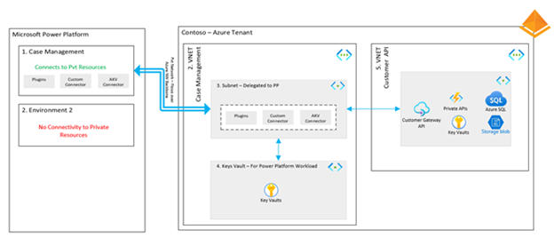
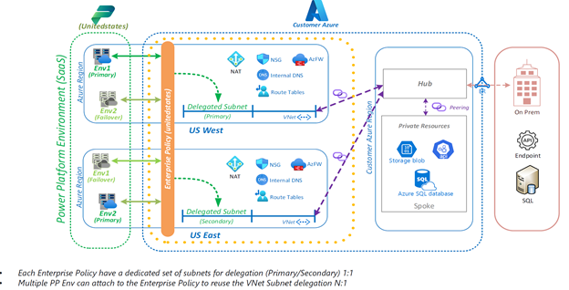
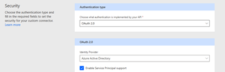

# Secure Power Platform access to Azure resources 

Use Azure Virtual Network support for Power Platform to integrate Power Platform with resources inside your virtual network without exposing them to the public internet. Virtual network support uses Azure subnet delegation to manage outbound traffic from Power Platform at runtime.

## Architecture diagram

## Workflow

1.  ​​**Case management application**: A Power Apps application uses a
    Power Platform custom connector to access a backend database or
    service hosted in Azure. 

2.  **Search request**: A search request from the application uses a
    Power Platform custom connector to access the backend API hosted in
    Azure.

3.  **Request authorization**: Microsoft Entra ID secures the backend API, and Entra ID also authenticates the user to the application. The connector is configured to use an OAuth to authorize
    on behalf of the user their access to the backend API. The connector
    is configured to get the client ID and the secret from an Azure Key
    Vault using the Power Platform environment variables support for
    Azure Key Vault.

4.  **Network access**: The backend API is hosted in an Azure Virtual Network (vNet) and doesn't allow Azure public network access. The vNet delegates a subnet for the Power Platform environment, enabling the API request and response to traverse the network without using the Azure public network.

5.  **Backend API search**: The backend API receives the search request
    and performs a database search in the context of the user that made
    the request.

## Use case details

Organizations with high security needs want to ensure safe communication between internal systems and cloud services. They use available security controls and want to use virtual network integration between Power Platform and Azure resources as part of their solution architecture.

Using the vNet capability, solutions that utilize Power Platform and
Azure components can be built without the complexity of a typical
multi-network solution. Implementing other network security
controls between application components often presents challenges,
especially when they are at differing levels of technology abstraction.
This architecture using the vNet subnet delegation allows Power Platform
and Azure resources to work together to implement solutions that
use the strengths of both products without sacrificing complexity
and security needs.​ 

## Components

 **Power Platform environment**: Contains the Power Platform resources
 such as the Power Apps that implement the Case Management user
 experience. The vNet configuration is managed at the environment level
 to connect to a specific Azure vNet. The vNet configuration can be
 enabled as required on the different Power Platform environments and
 their related Azure vNets that are part of an application's lifecycle
 management. For example, the dev environment might not have vNet
 integration enabled, but test and production do.

 **Power Apps**: Power Apps is used to implement the user experience
 of the solution. Users sign-in to the application using Entra ID.

 **Power Platform custom connectors**: Define the operations available
 to the Power Platform applications from the service they describe.
 Using Power Platform custom connectors the application uses services
 of the backend APIs that implement the organization's business logic.

 **Azure Virtual Network (vNet)**: An isolated, secure environment
 that allows Azure resources to communicate. Features to support hybrid
 connectivity with on-premises and other Azure
 networking capabilities to provide a virtual network in the cloud. The
 ability of vNets to delegate a subnetwork to Power Platform resources
 allows Power Platform and Azure resources to interact over a private
 network without sending the traffic over public networks.

 **Azure Key Vault**: Used to store the credentials required to
 connect to the backend APIs using OAuth. Similar to the backend APIs, the Power Platform resources
 access the Azure key vault by  using
 the vNet.

## Considerations

These considerations implement the pillars of Power Platform
Well-Architected, a set of guiding tenets that
improve the quality of a workload. For more information, see [Microsoft
Power Platform Well-Architected](https://aka.ms/powa).

Here's an Azure example of considerations for inspiration: [Model loan
credit risk and default
probability](https://learn.microsoft.com/en-us/azure/architecture/example-scenario/ai/loan-credit-risk-analyzer-default-modeling#considerations).

### Reliability

**​Redundancy**: Power Platform infrastructure implements a primary and
a failover region without explicit action required by the
customer. To achieve the best resilience, we recommend setting up the vNet Support in [both paired Azure
regions](https://learn.microsoft.com/en-us/power-platform/admin/business-continuity-disaster-recovery).
For example, a Power Platform environment in West US would have a
failover to East US. This requires setting up an Azure vNet in West US and another vNet in East US. You also need to establish a peering connection between them. This way ensures that if Power Platform fails over, the Azure resources are still accessible. Review [Sample scenarios for Virtual Network
setup](https://learn.microsoft.com/en-us/power-platform/admin/virtual-network-support-whitepaper#sample-scenarios-for-virtual-network-set-up-and-configuration)
for more details. The following image illustrates the use of multiple
virtual networks to provide redundancy.

### Security

​​**Data Access Control**: Using the vNet the APIs, data store and other
Azure resources for the solution are isolated and only accessible from
applications running from the Power Platform environment connected to
the vNet.

**Intentional segmentation and perimeters**: Using vNet integration
allows defining a secure way for Power Platform and Azure resources to
communicate with isolation from other cloud network interference. This way
also prevents a lower level environment for example- dev environment from
accidentally connecting to test or production Azure resources which are
important to help maintain a secure development lifecycle. With the
vNet configured on a Power Platform environment, you have control over
the outbound traffic from Power Platform. Review [securing outbound
connections](https://learn.microsoft.com/en-us/power-platform/admin/virtual-network-support-whitepaper#best-practices-for-securing-outbound-connections-from-power-platform-services)
for specific best practices.

**​Encryption**: Data transiting from Power Platform to Azure
services in the vNet isn't traversing across the public internet.

### Operational excellence

​​**Application Lifecycle Management (ALM)**: The vNet integration is
configured at the Power Platform environment level. Having corresponding
Azure vNets that make up a complete landing zone for the entire solution
and can be used to isolate development, test, and production or the
specific lifecycle stages in an organizations ALM processes.​ 

### Performance efficiency

**Collect performance data**: Azure virtual networks provide an
efficient way to integrate Power Platform and Azure resources. To help
monitor performance, vNets you can collect monitoring data from the vNet.
Review [Azure virtual Network
monitoring](https://learn.microsoft.com/en-us/azure/virtual-network/monitor-virtual-network-reference)
for more details.

## Next steps

[Setup a virtual network for Power
Platform](https://learn.microsoft.com/en-us/power-platform/admin/vnet-support-setup-configure)

With virtual network setup, use the following high-level
steps to build an end to end solution that uses the vNet.

1.  Azure hosted API: Create an Azure hosted REST API using your
    favorite technique for hosting a REST API in Azure. Protect this API
    using Entra ID. For example, see [Configure your App Service or Azure
    Functions app to use Entra
    ID](https://learn.microsoft.com/en-us/azure/app-service/configure-authentication-provider-aad?tabs=workforce-configuration).

2.  Power Platform environment variables: Create environment variables
    that hold the client ID and secret from the Azure Key Vault.
    Reference: [Use environment variables for Azure Key Vault secrets -
    Power Apps \| Microsoft
    Learn](https://learn.microsoft.com/en-us/power-apps/maker/data-platform/environmentvariables-azure-key-vault-secrets) 

3.  Custom connector [:  Create a custom
    connector](https://learn.microsoft.com/en-us/connectors/custom-connectors/learn-with-a-tutorial)
    for your API.

    a. Define the custom connector to use OAuth2.0 with Azure Active
        Directory (Entra ID) and enable service principal support 

     

    b. The client ID and client secret can be parameterized to gather the
        values from the environment variables created in step 2 like the
        example below: 

    

4.  Power Apps canvas app: This forms the search interface for the
    back-office

## Related resources

- [Virtual Network support white
paper](/power-platform/admin/virtual-network-support-whitepaper)

- [Power Platform security best
practices](/power-platform/well-architected/security)​ 

- [Use environment variables for Azure Key Vault secrets - Power Apps](/power-apps/maker/data-platform/environmentvariables-azure-key-vault-secrets)

- [Use environment variables in solution custom connectors](/connectors/custom-connectors/environment-variables)
