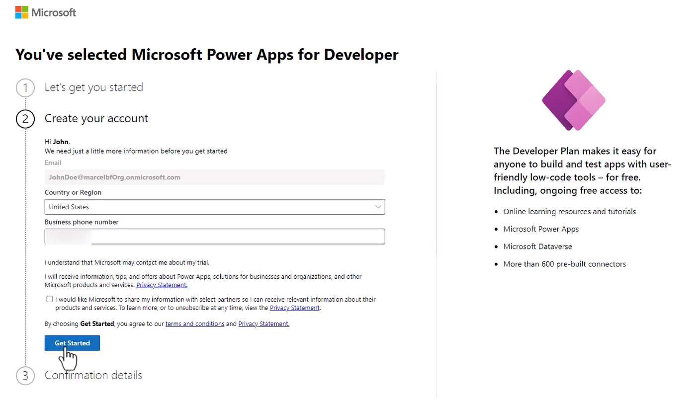
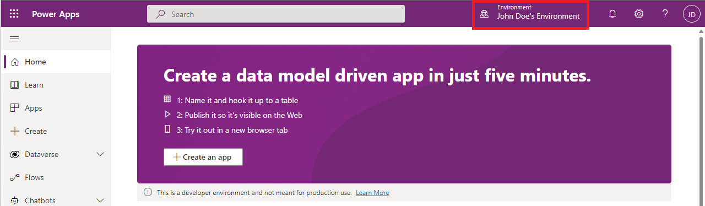

# Create a developer environment

The simplest way to get access to a power platform environment is to sign up for the Power Apps Developer plan. You can explore the power platform at full potential for learn, at no cost.

To fully use it as a developer, you'll need an Azure account and a work account. This article will guide you through the process for creating a Power Platform environment and a test tenant if needed.

## Where do I start?

If you have a work account, and want to use it to learn Power Platform, [Sign up for the Power Apps Developer Plan](#sign-up-for-the-power-apps-developer-plan).

If you don't have a work account or prefer a Sandbox tenant to learn Power Platform, [create a test tenant](#how-to-create-a-test-tenant) before signing up for the developer environment.

## Sign up for the Power Apps Developer Plan

The Power Apps Developer Plan gives you a free development environment to build and test with Power Apps, Power Automate, and Microsoft Dataverse.

It's simple to sign up for the Power Apps Developer Plan:

1. Be sure you have a work account. If you don't, [create a test tenant](#how-to-create-a-test-tenant) first.
2. Sign up on the [Power Apps Developer Plan website](https://aka.ms/PowerAppsDevPlan).

After signing up for the Developer Plan, you'll be redirected to Power Apps. The environment will be shown with your name, for example "John Doe's environment." If there's already an environment with that name, the developer new environment will be named "John Doe's (1) environment."

> [!IMPORTANT]
>
> - Use the developer environment instead of your tenant's default environment to work with certain capabilities such as premium and custom connectors.
> - You might need to select your developer environment from the top-right corner of the screen.
> - It might take a couple of minutes for the new environment to be provisioned and become available in the list of the environments. You can see the progress of the environment creation in the [Power Platform admin center](https://admin.powerplatform.com).
> - In some situations, your admin might have turned off the sign up process. In this case, please contact your administrator, or create a test tenant.
> 

For detailed information about the developer plan, visit: [Sign up for the Power Apps Developer Plan](/power-apps/maker/developer-plan).

## How to create a test tenant

If you don't already have a dedicated test tenant, you can create one for free, using the Microsoft 365 Developer Program or manually create one yourself.

The [Microsoft 365 Developer Program](https://learn.microsoft.com/office/developer-program/microsoft-365-developer-program) is free and can have test user accounts and sample data packs automatically added to the tenant.

You'll need a work account or a microsoft account to sign up. Use either your personal email address or set up a separate email address/Microsoft account to be used when you start the registration process for the Microsoft 365 Developer Program.

1. Go to [Join the Microsoft 365 Developer Program page](https://developer.microsoft.com/en-us/microsoft-365/dev-program).
2. In the upper-right corner, choose Sign in to sign in with your Microsoft account or Azure Active Directory-enabled email.
3. After signing in, choose **Join now**.
4. On the Microsoft 365 Developer Program Signup page, complete the following fields in the online form:
    - Contact Email
    - Country/Region
    - Company
5. Review the terms and conditions. You'll need to select the check box before you can join.
6. Optionally, select the I would like to hear from the Microsoft 365 Developer Program check box if you want to hear from Microsoft about new capabilities and other updates.
7. Choose Next.
8. On the Microsoft 365 Developer Program Preferences page, let us know your preferences so we can personalize your experience, including:
    - The industry that you work in.
    - The type of applications or solutions that you're interested in developing.
    - Products, technologies, and programming languages that you're interested in.
9. When you're finished, choose Join. Your preferences appear on the next page in the top right, and you will see a Welcome message and will receive a welcome email.
10. Set up a Microsoft 365 developer sandbox to build your solutions independent of your production environment.

You can also [manually create a test tenant](/azure/active-directory/develop/quickstart-create-new-tenant).

Now that you have your test tenant, [sign up for the Power Apps Developer Plan](#sign-up-for-the-power-apps-developer-plan).

### See also

[Power Platform for developers](get-started.md) 
[Fusion Development](fusion-development.md) 

[!INCLUDE[footer-include](../includes/footer-banner.md)]