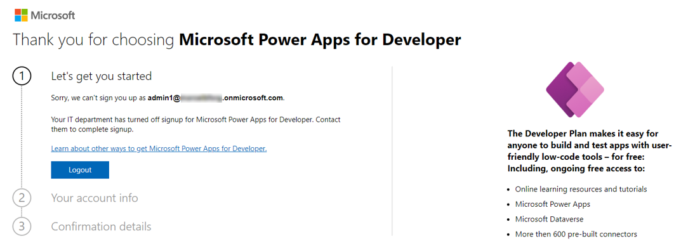

# Create a developer environment with the Power Apps Developer Plan

To fully use the [Power Apps Developer Plan](plan.md) as a developer, you need an Azure account and a work account. This article guides you through the process for creating a Power Platform environment and a test tenant if needed.

## Where do I start?

If you have a [work account](/power-apps/maker/signup-for-powerapps#what-email-address-can-i-use), and want to use it to learn Power Platform, go to the [next section](#sign-up-for-the-power-apps-developer-plan).

If you don't have a work account or prefer a Sandbox tenant to learn Power Platform, read information in the [create a test tenant](#how-to-create-a-test-tenant) section later in this article before signing up for the developer environment.

## Sign up for the Power Apps Developer Plan

The Power Apps Developer Plan gives you a free development environment to build and test with Power Apps, Power Automate, and Microsoft Dataverse.

It's simple to sign up for the Power Apps Developer Plan:

1. Ensure that you have a work account. If you don't, [create a test tenant](#how-to-create-a-test-tenant) first.
2. Sign up on the [Power Apps Developer Plan website](https://aka.ms/PowerAppsDevPlan).

    :::image type="content" source="media/create-developer-environment-devplan-signup.png" alt-text="Sign-up for the developer plan":::

    After signing up for the Developer Plan, you'll be redirected to [Power Apps](https://make.powerapps.com). The environment uses your name, for example **John Doe's environment**. If there's already an environment with that name, the developer new environment is named **John Doe's (1) environment**.

    :::image type="content" source="media/create-developer-environment-makerportal.png" alt-text="Power Apps":::

> [!IMPORTANT]
>
> - Use the developer environment instead of your tenant's default environment to work with certain capabilities such as premium and custom connectors.
> - You might need to select your developer environment from the top-right corner of the screen in Power Apps.
> - It might take a couple of minutes for the new environment to be provisioned and become available in the list of the environments. You can see the progress of the environment creation in the [Power Platform admin center](https://admin.powerplatform.com).
> - In some situations, your admin might have turned off the sign up process. In this case, please contact your administrator, or create a test tenant.
> 

For detailed information about the developer plan, go to [Sign up for the Power Apps Developer Plan](/power-apps/maker/developer-plan).

## How to create a test tenant?

If you don't already have a dedicated test tenant, you might qualify for one through the [Microsoft 365 Developer Program](https://developer.microsoft.com/microsoft-365/dev-program); for details, see the [FAQ](/office/developer-program/microsoft-365-developer-program-faq#who-qualifies-for-a-microsoft-365-e5-developer-subscription-). Alternatively, you can [sign up for a one-month free trial or purchase a Microsoft 365 plan](https://www.microsoft.com/microsoft-365/try).

You can also [manually create a test tenant](/azure/active-directory/develop/quickstart-create-new-tenant).

Now that you have your test tenant, sign up for the Power Apps Developer Plan as explained earlier in this article.

### See also

[Power Platform for developers](get-started.md) 
[Fusion Development](fusion-development.md) 

[!INCLUDE[footer-include](../includes/footer-banner.md)]
