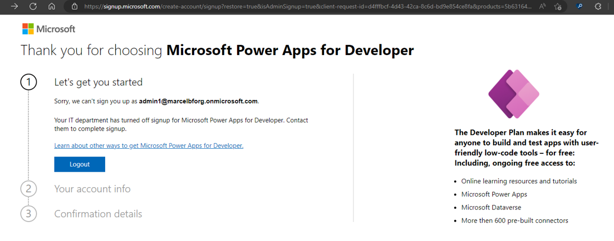

# Get started with the Power Platform

The most simple way to get access to a power platform environment is to sign up for the Power Apps Developer plan. You can explore the the power platform at full potential for learn, at no cost.

To fully use it as a developer, you will need an Azure account and a work account. This article will guide you through the process for creating a Power Platform environment and a test tenant if needed.

## Where do I start?

If you have a work account, and want to use it to test Power Platform, Sign up for the Power Apps Developer Plan.

If you don't have a work account or prefer a Sandbox tenant to learn Power Platform, create a test tenant before signing up for the developer environment.

## Power Apps Developer Plan

The Power Apps Developer Plan gives you a free development environment to build and test with Power Apps, Power Automate, and Microsoft Dataverse.

Is is simple to sign up for the Power Apps Developer Plan:

1. Be sure you have a work account. If you don't, please create a test tenant first.
2. Sign up on the [Power Apps Developer Plan website](https://aka.ms/PowerAppsDevPlan).

:::image type="content" source="./media/devplan-signup.gif" alt-text="Animation demo of developer plan sign up.":::

After signing up for the Developer Plan, you'll be redirected to Power Apps. You may need to select your developer environment from the top-right corner of the screen. The environment will be shown with your name, for example "John Doe's environment." If there's already an environment with that name, the developer new environment will be named "John Doe's (1) environment."

> [!IMPORTANT]
> It might take a couple of minutes for the new environment to be provisioned and become available in the list of the environments. You can see the progress of the environment creation in the [Power Platform admin center](https://admin.powerplatform.com).
> Use the developer environment instead of your tenant’s default environment to work with certain capabilities such as premium and custom connectors.

> [!WARNING]
> In some situations, your admin might have turned off the sign up process. In this case, please contact your administrator, or create a test tenant.
> 

For more information about the developer plan: [Sign up for the Power Apps Developer Plan](../../power-apps/maker/developer-plan.md).

## How to create a test tenant

If you don't already have a dedicated test tenant, you can create one for free using the Microsoft 365 Developer Program or manually create one yourself.

The Microsoft 365 Developer Program is free and can have test user accounts and sample data packs automatically added to the tenant.

You will need a work account or a microsoft account to sign up. Use either your personal email address or set up a separate email address/Microsoft account to be used when you start the registration process for the M365 Developer Program.

1. Click on the Join now button on the screen.
2. Sign in with a new Microsoft Account or use an existing (work) account you already have.
3. On the sign-up page select your region, enter a company name and accept the terms and conditions of the program before you click Next.
4. Click on Set Up Subscription. Specify the region where you want to create your new tenant, create a username, domain, and enter a password. This will create a new tenant and the first administrator of the tenant.
5. Enter the security information, which is needed to protect the administrator account of your new tenant. This will set up multi-factor authentication for the account.

:::image type="content" source="./media/devplan-m365signup.gif" alt-text="Animation demo of m365 dev sign up.":::

You can also [manually create a test tenant](https://learn.microsoft.com/en-us/azure/active-directory/develop/quickstart-create-new-tenant)

Now that you have your test tenant, join the Power Apps Developer Plan
