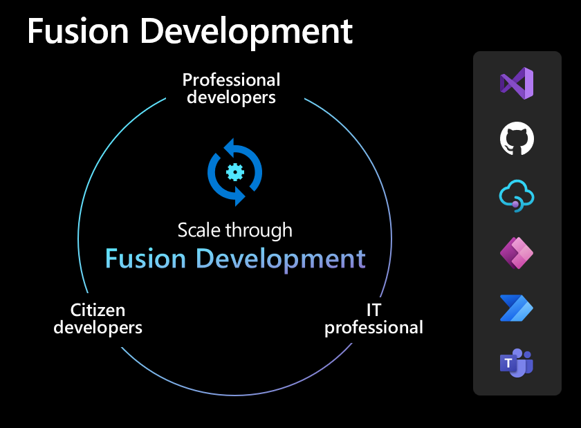
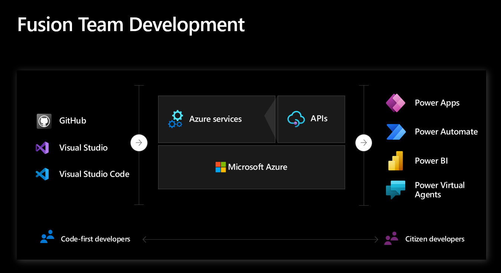

# Fusion development in Power Platform

Fusion development or fusion teams development, is defined by Gartner as "distributed and multidisciplinary digital business teams that blend technology and other types of domain expertise." (Source: 2019 Gartner Digital Business Teams Survey) 

Fusion Development is an approach with the main goal of scaling application development through low-code. Fusion development allows your business to build better applications, faster by bringing together professional developers with citizen, or low-code, developers. It can also mean using low-code capabilities and combine them with code-first components to meet business needs and create Fusion applications.

## Personas for fusion development

Below you can find the personas and the definition in a fusion team:

| Persona | Description |
| ---- | ---- | 
| Citizen developer or maker | A business user with business knowledge looking for ways to improve a business process. Use visual, drag and drop and low code tools. Usually don't have a technical background. |
| Professional developer or code-first developer | Pro devs use pro dev tools to accomplish pro dev tasks. For example, write code in Visual Studio or Visual Studio Code using programming languages like C# or JavaScript. |
| IT professional or DevOps engineer | An IT professional responsible for the application lifecycle management (ALM) of business applications. |

> [!IMPORTANT]
> Our goal is to empower diverse groups of people with different skill sets and boost velocity by scaling solution development through low-code. The Microsoft Power Platform is a tool in your tool set. We want to help you work more efficiently and focus on tasks that match your desired skill level.

Empowering citizen developer can enable pro developers to focus on specialized problems, avoiding simple and repetitive tasks that can be performed by the citizen developer.

## Collaboration

Power Platform is designed to empower fusion teams allowing three key audiences to come together.

](media/fusion-team.png "Fusion team")

> [!TIP]
> Low-code and pro-dev tools should integrate smoothly to enable different groups of people to work together effectively.

The role of the professional developer and IT professional is to create a secure and governed environment where citizen developer can be empowered to achieve more with minimum friction. Everyone should use citizen maker tools to accomplish citizen maker tasks. For example, pro devs use same visual tooling as citizen makers when creating apps on Power Platform.

### See Also

[Create a developer environment](create-developer-environment.md) 
[Fusion Development ebook](/power-apps/guidance/fusion-dev-ebook/)  
[Power Platform ALM for developers](../alm/alm-for-developers.md) 
[Power Platform for developers](get-started.md)

[!INCLUDE[footer-include](../includes/footer-banner.md)]
