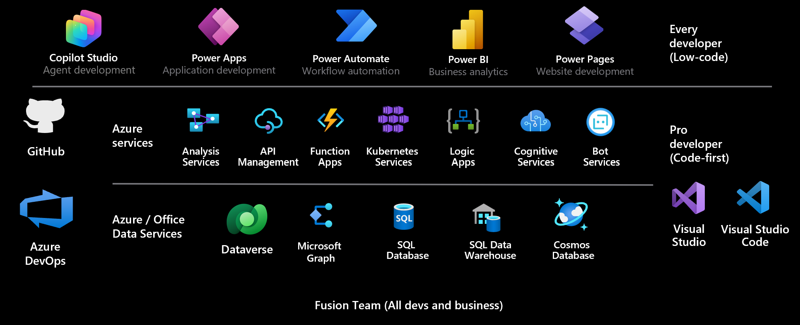

# Introduction to Microsoft Power Platform for developers

Microsoft Power Platform is a low-code platform for rapidly building customized end-to-end business solutions. It consists of four product areas: Power Apps, Power Automate, Power BI, and Power Pages. Each area can be used individually or together. United by the underlying Microsoft Dataverse technology, all areas are designed for a connected experience to achieve your business goals, whether it's creating analytics, process automation, or data-driven productivity applications.

The platform's low-code approach enables everyone in an organization&mdash;from frontline workers to professional developers&mdash;to participate in the development of business solutions that drive positive business outcomes. Developers can collaborate with citizen developers to enhance business solutions and solve complex requirements by using the platform's various extension capabilities with code. Thanks to a native integration with Azure, developers can use their cloud development skills to extend Microsoft Power Platform with different Azure services. With a low-code integrated development approach, business goals can be achieved faster and frees up time for the developers.

As a developer interacting with the platform, it's important to understand the basics of what the platform offers. In the following, you'll find a high-level overview of each of the core product areas and their key extensibility points.

## Power Apps 

Apps created with Power Apps can be shared with internal users and can be run in a browser or on a mobile device. You can create following types of apps: canvas and model-driven.

### Canvas apps

Provides the Power Apps maker with complete control over the pixel-perfect screen contents and navigation between multiple screens. Canvas applications use different connectors to work with data and services. Canvas applications can be embedded into SharePoint, Teams, Power BI, and Dynamics 365 applications.

> #### Key developer extensibility points
> - Build custom UI components using [Power Apps component framework](/power-apps/developer/component-framework/overview)
> - Create [custom connectors](/connectors/custom-connectors/) to communicate to your external data sources and services. A custom connector is a wrapper around a REST API and can be created using tools like Azure Functions and Azure API Management

### Model-driven apps  

Data-driven applications that are built on top of [Microsoft Dataverse](#dataverse). Other data sources and services can be used by model-driven applications by embedding a canvas application.

> #### Key developer extensibility points
> - Build custom UI components using [Power Apps component framework](/power-apps/developer/component-framework/overview)
> - Implement client business logic using [JavaScript and the client API](/power-apps/developer/model-driven-apps/client-scripting)
> - Build [HTML web resources](/power-apps/developer/model-driven-apps/webpage-html-web-resources)

## Power Automate

Power Automate is used to automate tasks and orchestrate activities across various services that use integrated or custom connectors. Using Power Automate you can create cloud flows or desktop flows.

| Type | Description |
| ---- | ---- |
| **Cloud flows** | Can be triggered manually, configured to run when specific events occur, such as when a record is created, or scheduled to run at a specific time. Power Automate is built on top of Azure Logic Apps but offers unique integration with Microsoft Power Platform. |
| **Desktop flows** | Used to automate repetitive interactive tasks on the web or the desktop. |

> #### Key developer extensibility points
> - Create [custom connectors](/connectors/custom-connectors/) to communicate to your external data sources and services. A custom connector is a wrapper around a REST API and can be created using tools like Azure Functions and Azure API Management
> - Use [workflow definition functions](/power-automate/developer/custom-cds-for-apps-workflow-activities) to build complex expressions

## Power BI

Power BI is Microsoft's business analytics solution that provides interactive data visualization BI tools to help users visualize and share data and insights across their organization.

> #### Key developer extensibility points
> - Embed Power BI in apps, websites, and portals
> - Create [custom visuals](/power-bi/developer/visuals/power-bi-custom-visuals) using the open-source SDK

## Power Pages

Power Pages is a secure, enterprise-grade, low-code software as a service (SaaS) platform for creating, hosting, and administering modern external-facing business websites. Low-code makers can rapidly design, configure, and publish websites that seamlessly work across web browsers and devices. Professional developers can extend these capabilities to address advanced business requirements.

> #### Key developer extensibility points
> - Custom web page templates built with HTML, CSS, and [Liquid](/power-pages/configure/liquid-overview)
> - Extend site integration with Dataverse with the [portals Web API](/power-pages/configure/web-api-overview)
> - [Use Visual Studio Code and the Power Platform CLI](/power-pages/configure/cli-tutorial) to enable metadata editing and CI/CD (Continuous Integration/Continuous Deployment) of site configurations

## Dataverse

Dataverse is a cloud scale data store that builds on Microsoft's data technologies and abstracts away data management complexity from the app maker. It lets you securely store and manage data that is used by business applications. Business data within Dataverse is stored within a set of data tables. Role-based security allows businesses to control access to the data tables and even individual records for different users within your organization. Developers can extend or customize Dataverse functionality by adding custom business logic. You can define calculated table columns, business rules, workflows, and business process flows to ensure data quality and drive business processes.

> #### Key developer extensibility points
> - Create [plug-ins](/power-apps/developer/data-platform/plug-ins), similar to event handlers, that customize or extend Dataverse data processing with custom business logic (code)
> - Use [webhooks and Azure Service Bus](/power-apps/developer/data-platform/use-webhooks) to integrate with external systems
> - Extend the Dataverse API with your own [custom API](/power-apps/developer/data-platform/custom-api) that implements your business logic
> - Use [virtual tables](/power-apps/developer/data-platform/virtual-entities/get-started-ve) to integrate data stored in external systems into Dataverse without replicating the data

### See also

[Create a developer environment](create-developer-environment.md) 
[Fusion Development](fusion-development.md) 

[!INCLUDE[footer-include](../includes/footer-banner.md)]
