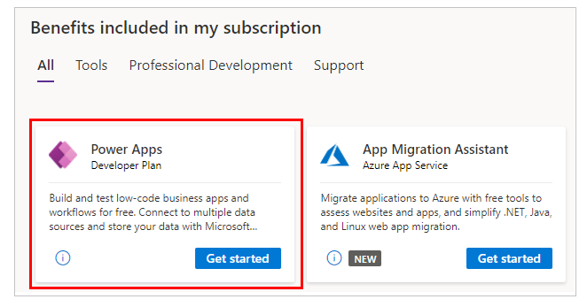

# About the Power Apps Developer Plan

The Power Apps Developer Plan gives you a free development environment to build and test with Power Apps, Power Automate, and Microsoft Dataverse. It enables you to:

- Create apps and flows without writing code, with full-featured Power Apps and Power Automate development tools. Easily share and collaborate on these solutions with others.
- Connect to any data source by using [Power Platform connectors](/connectors/connector-reference/) or by creating your own custom connectors.
- Use a fully managed, scalable data platform with Dataverse, including support for common business application actions. Use out-of-the-box common tables or build your own data schema.
- Export the solutions you create in your developer environment, and publish them on Microsoft AppSource so your customers can test-drive them.

## Who can sign up for the Power Apps Developer Plan?

Anyone with a [work or school email address](/power-apps/maker/signup-for-powerapps#faq) backed by [Microsoft Entra ID](/azure/active-directory/fundamentals/sign-up-organization) can sign up for the Power Apps Developer Plan.

## How can I get the Power Apps Developer Plan?

You can get the plan using one of the following ways:

- Sign up on the Power Apps Developer Plan [website](https://www.microsoft.com/power-platform/products/power-apps/free).
- Get the Power Apps Developer Plan with Visual Studio Dev Essentials. If you're a Visual Studio Dev Essentials user, the Power Apps Developer Plan is included in your benefits. Visit [My
benefits](https://my.visualstudio.com/benefits) and select the Power Apps tile to sign up for the Power Apps Developer Plan.

    

## Which features are included in the Power Apps Developer Plan?

With the developer environment, you get the following functionality:

| **Functionalities**| **Developer environment**|
| --- | --- |
| **Key features**||
| Create and test apps| Yes. You can create unlimited apps for development and test purposes. |
| Share apps| Yes|
| Use Dataverse| Yes|
| Model your data using Dataverse| Yes|
| Enterprise-grade administration of the environment and user policies| Yes|
| **Connectivity**||
| Connect to Office 365, Dynamics 365, and other connectors| Yes|
| Connect to cloud-based services like Azure SQL, Dropbox, Twitter, and many more| Yes|
| Use premium connectors like Salesforce, DB2 and many more| Yes|
| Access on‐premises data using an on-premises gateway| Yes|
| Create custom connectors to connect to your own systems| Yes|
| **Dataverse**||
| Create and run applications In Power Platform, Dynamics 365, Teams, or Standalone using the .NET SDK or OData Web API | Yes|
| Model your data in Dataverse| Yes|
| Create a database in Dataverse| Yes|
| Create and use dataflows| No|
| **Management**||
| Add coworkers as environment makers and admins| Yes|
| Add coworkers to the database roles| Yes|
| Supports data policies established by the Office 365 administrator| Yes|
| Establish data policies for the developer environment| Yes|

## What are the capacity limits for the developer environment?

The following capacity limits apply to the developer environments:

| **Capacity**| **Limits** |
| --- | --- |
| Flow runs/month| 750|
| Database size| 2 GB|

You can't increase capacity by applying add-ons to the quantities we include. If you hit capacity limits, we recommend purchasing the Power Apps Per User Plan. Learn more from the [Power Apps pricing page](https://powerapps.microsoft.com/pricing/).

> [!NOTE]
> The capacity entitlements of the developer environment, whether used or not, doesn't contribute to your company's overall quota.

## Publishing to Microsoft AppSource

Do you have an app that you'd like to share with customers? We now support Power Apps solutions on [Microsoft AppSource](https://appsource.microsoft.com/) as a way for you to share apps and flows with customers, and generate leads for your
business. For more information, see [Publish your app on AppSource](/power-apps/developer/data-platform/publish-app-appsource).

## FAQ

The following section lists frequently asked questions relevant to the Power Apps Developer Plan. For more information about different types of environments including the developer environment, see [Types of environments in Power Platform](/power-platform/admin/environments-overview#types-of-environments).

### What should I do if I reach the capacity limits of the environment?

There's a limited capacity provided because this environment is meant for development and test purposes, not for production use. The capacity limits are:

| **Capacity**| **Limits** |
| --- | --- |
| Flow runs/month| 750|
| Database size| 2 GB|

If you reach one or more capacity limits, we recommend you purchase a plan that
supports production use. Learn more about our plans on the [Power Apps pricing
page](https://powerapps.microsoft.com/pricing/).

### Can I transfer the apps, flows, and other resources created in the developer environment to another environment?

Yes, you should be able to export the resources from this environment to other environments. For more information,
see [Solutions](/power-apps/maker/data-platform/solutions-overview).

### Will my Power Apps Developer Plan subscription ever expire?

You can continue using your Power Apps Developer Plan for free as long as there's active usage and no abuse of the plan (for example, apps aren't used for production purposes and the capacity limits aren't exceeded). Environments created using Power Apps Developer Plan that are inactive for the last 90 days will be deleted after notifying the environment owners.

### Can I get or create multiple developer environments?

Yes. You have one developer environment, which is created for you by Power Platform when you sign up for the Developer Plan. You can create up to three environments in the [Power Platform admin center](https://admin.powerplatform.microsoft.com/).

### What's the difference between the Power Apps Plan Trial and Power Apps Developer Plan? Which one should I sign up for?

Both Power Apps Plan Trial and Power Apps Developer Plan are free, but are created for different purposes:

- **Power Apps Plan Trial** gives you the Power Apps per user plan for 30 days. This duration is meant for trying out production Power Apps applications. Once your trial
expires, you can purchase a plan. If you're already using Power Apps with Office 365 or Dynamics 365, this is the right plan to test the premium functionalities of Power Apps, which are available with paid Power Apps plans.

- **Power Apps Developer Plan** gives you access to the same Power Apps functionality available in paid plans (aligned with Trials), including Dataverse and Power Automate, but in a developer environment meant for development and test use only. A paid plan is required to deploy or run solutions in a production environment for production use.

### Can I sign up with my personal account?

No, we currently don't support signing up with a personal account. You can only sign up with your [work or school
account](/power-apps/maker/signup-for-powerapps#faq).

### Which kind of license do I need to get Developer Environment?

You need a Power Apps Developer plan to get a developer environment. This Developer plan is a viral/internal license that your admin needs to enable so that it can be assigned in the tenant. The license is assigned and verified during signup. The tenant must allow for viral or internal licenses for developer environment to be provisioned.

- To verify if the respective policy is already allowed, admin can use the [Get-AllowedConsentPlans (Microsoft.PowerApps.Administration.PowerShell)](/powershell/module/microsoft.powerapps.administration.powershell/get-allowedconsentplans) PowerShell cmdlet.
- To modify the policy, admin can use the [Add-AllowedConsentPlans (Microsoft.PowerApps.Administration.PowerShell)](/powershell/module/microsoft.powerapps.administration.powershell/add-allowedconsentplans) PowerShell cmdlet.

### Can I reset or delete my developer environment?

Yes. The owner of the developer environment, or users with the [permission to delete an environment](/power-platform/admin/use-service-admin-role-manage-tenant#service-administrator-permission-matrix) can delete a developer environment.

Makers can also reset the developer environment through the [Power Platform admin center](https://admin.powerplatform.microsoft.com/).

### Can I prevent users from creating developer environments?

Yes. To prevent users from creating developer environments, go to [Control environment creation](/power-platform/admin/control-environment-creation#developer-environments).

### Does the developer environment get auto-created with a developer plan?

Yes. A developer environment is created when the user signs up for the developer plan using any of the experiences in the [Power Apps Developer Plan website](https://www.microsoft.com/power-platform/products/power-apps/free), [Power Apps](https://make.powerapps.com), or [Power Platform admin center](https://admin.powerplatform.microsoft.com). However, when you delete a developer environment, or you need more developer environments, you need to create them manually.

### Does the Power Apps Developer plan include Power Automate RPA use rights?

No. However, users may start a Power Automate trial including RPA use rights to try out RPA capabilities. Power Apps Developer plan includes cloud flow use rights since these can be connected to an act as an extension of Power Apps apps.

### Does the Power Apps Developer plan include AI Builder use rights?

No. However, users may start an AI Builder trial to try out the AI Builder capabilities.

### Can a developer environment be a managed environment?

The developer environment can become a managed environment. However, managed environment use rights aren't included in the developer plan. As a result, end users require premium licenses in order to run their assets in a managed developer environment.

### Why does a banner appear with apps running in the developer environment?

Since developer environments aren't intended to support production scenarios, apps display a temporary banner to remind makers about them running in a developer environment. This banner will no longer appear if you move the app from a developer environment to a non-developer environment.

:::image type="content" source="media/power_apps_dev_env_app_banner.png" alt-text="Power Apps Developer Environment app banner.":::

### Can I launch a premium app with a Power Apps Developer Plan in non-Developer environments?

No. You can't use the Power Apps Developer Plan to launch premium apps that aren't in a Developer environment. You need a valid Power Apps premium entitlement. [Learn more about Power Apps plans](../admin/signup-for-powerapps-admin.md#choosing-the-right-plan).

### Are Managed Environment use rights included in the Developer Plan?

Managed Environment isn't included as an entitlement in the Developer Plan when users run their assets. In other words, users&mdash;including makers running their own apps or flows&mdash;need a premium license in addition to the developer plan to run their assets in a managed, developer environment.

### Are Dynamics 365 apps available in a developer environment?

No. Dynamics 365 apps can't be installed in a developer environment. You'll see the following message when you try to install them:

"Installing Dynamics 365 apps such as Dynamics 365 Sales and Dynamics 365 Customer Service is only supported on environments that have been created with a database with the option to Enable Dynamics 365 apps set to "Yes". Try installing this application in an environment with a database and Enable Dynamics 365 apps enabled on it."

If you want to explore Dynamics 365 apps, refer to the app-specific documentation for free trials, or to install them on existing environments.

### Are users automatically added to a developer environment?

No. Users are not automatically added to the developer environment, they need to be added manually.

## Improvements from the previous Power Apps Community Plan

In May 2021, we extended the capabilities of the Power Apps Community Plan to meet the needs of developers and rebranded it as the **Power Apps Developer Plan**.

Key changes include:

- The ability to share apps with team members for development and testing purposes
- Increased capacity allocations
- The ability to create up to three environments

> [!NOTE]
> Existing Power Apps Community Plan users will also get all of these updates.

### Next steps

> [!div class="nextstepaction"]
> [Create a developer environment with the Power Apps Developer Plan](create-developer-environment.md)

### See also

[Power Platform for developers](get-started.md)  
[Fusion Development](fusion-development.md)  

[!INCLUDE[footer-include](../includes/footer-banner.md)]
