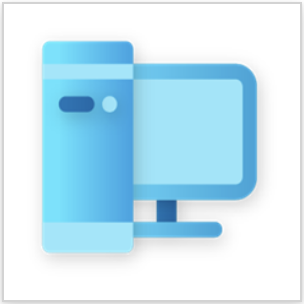
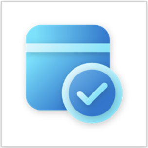

# Enterprise templates for Power Platform

Enterprise templates for [Power Platform](/power-platform/) are solutions that serve as starting points for specific use cases and outcomes. They accelerate time to value by allowing you to quickly digitize new processes or extend your technology investments in enterprise resource planning (ERP), customer relationship management (CRM), information technology (IT), and human resource (HR) systems.

Enterprise templates are built for centralized teams to locally install, extend, and deploy. You can organize an internal information technology (IT) and business operations team or select an external partner team to implement a Power Platform template project.

Enterprise templates for Power Platform help you:

- Access and organize your data in a streamlined view in Power Apps.
- Automate workflows with Power Automate cloud flows operating behind the scenes.

Additionally, you can:

- Customize your solutions
- Integrate your system of record with other features, applications, and systems
- Incorporate more controls over how your users interact with data

## Available enterprise templates

Enterprise templates for Power Platform are available on [Microsoft AppSource](https://appsource.microsoft.com/en-US/?exp=ubp8).

Be sure to check back often for new templates that become available.

:::row:::
   :::column span="":::
         Transform SAP procurement data   [SAP Procurement Learn documentation](https://aka.ms/LearnSAPProcurementTemplate)   [SAP Procurement on AppSource](https://aka.ms/AccessSAPProcurementTemplate)  
   :::column-end:::
   :::column span="":::
         Enable an employee recognition program   [Employee Kudos Learn documentation](https://aka.ms/LearnEmployeeKudosTemplate)   [Employee Kudos on AppSource](https://aka.ms/AccessEmployeeKudosTemplate)
           :::column-end:::
:::row-end:::
:::row:::
   :::column span="":::
         Facilitate an employee awards program   [Awards and Recognition Learn documentation](https://aka.ms/LearnAwardsAndRecognitionTemplate)   [Awards and Recognition on AppSource](https://aka.ms/AccessAwardsandRecognitionTemplate)
   :::column-end:::
   :::column span="":::
         Match new employees to _Buddies_   [Onboarding Buddy Learn documentation](https://aka.ms/LearnOnboardingBuddyTemplate)   [Onboarding Buddy on AppSource](https://aka.ms/AccessOnboardingBuddyTemplate)   
   :::column-end:::
:::row-end:::
:::row:::
   :::column span="":::
         Manage hardware requests and assets   [Hardware Request and Management Learn documentation](https://aka.ms/LearnHardwareRequestAndManagementTemplate)  [Hardware Request and Management on AppSource](https://aka.ms/AccessHardwareRequestandManagementTemplate)
   :::column-end:::
   :::column span="":::
         Organize the appointment booking process   [Appointment Booking Learn documentation](https://aka.ms/LearnAppointmentBookingTemplate)   [Appointment Booking on AppSource](https://aka.ms/AccessAppointmentBookingTemplate)   
   :::column-end:::
:::row-end:::

## Benefits of using enterprise templates

Implementing enterprise software use cases can be time consuming and expensive.  An enterprise template provides a foundation to help you quickly get started. You can use the full potential of Power Platform to extend the templates by connecting workflows across more systems of record and digitizing manually intensive processes.

Templates for Power Platform offer the following benefits:

- **Time to value**
  - Remove many of the upfront investments needed in traditional enterprise software development.
  - Reduce sets of resources and skills needed to deploy.
  - Gain new business insights through digitized and connected processes.

- **Maximize existing IT investments**
  - Continue to drive value out of existing major IT investments like ERP, CRM, IT, and HR systems.
  - Protect and maintain systems of record and data sources of truth.

- **Productivity**
  - Reduce inefficiencies in manual processes.
  - Connect data across multiple systems of record to complete a workflow.
  - Meet users where they are, whether in Teams or in other collaborative experiences.

> [!NOTE]
> Enterprise templates for Power Platform require Power Platform premium licensing.
> Go to [**Licensing overview for Microsoft Power Platform**](/power-platform/admin/pricing-billing-skus) for more information.

## Get started

Learn how to get started working with Enterprise templates for Power Platform. More information: [Get started with SAP Procurement template](finance/sap-procurement/administer/get-started.md), [Install and set up the Employee Kudos template](hr/employee-kudos/install-and-set-up.md), [Install and set up the Awards and Recognition template](hr/awards-and-recognition/install-and-set-up.md), [Install and set up the Onboarding Buddy template](hr/onboarding-buddy/install-and-set-up.md), [Install and set up the Hardware Request and Management template](it/hardware-request-and-management/install-and-set-up.md),[Install and set up the Appointment Booking template](it/appointment-booking/install-and-set-up.md)

## Support

Enterprise templates for Power Platform are published _as is_. However, we do provide template support to help you be successful.

Support can be accessed at [Templates for Power Platform](https://github.com/microsoft/Templates-for-Power-Platform) on GitHub. It's a dedicated support space for you to:

- log questions
- access template assets
- access template release updates
- access template support resources
