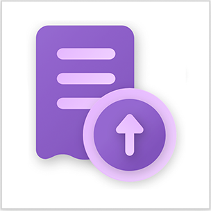
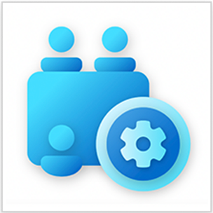
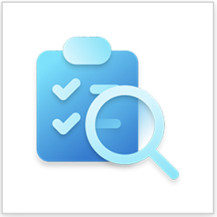

# What are Enterprise templates for Power Platform?

Enterprise templates for [Power Platform](/power-platform/) are solutions that serve as starting points for specific use cases and outcomes. They accelerate time to value by allowing you to quickly digitize new processes or extend your technology investments in enterprise resource planning (ERP), customer relationship management (CRM), information technology (IT), and human resource (HR) systems.

Enterprise templates are built for centralized teams to install, extend, and deploy. You can organize an internal information technology (IT) and business operations team or select an external partner to implement a Power Platform template project.

Enterprise templates for Power Platform help you:

- Access and organize your data in a streamlined view in Power Apps.
- Automate workflows with Power Automate cloud flows operating behind the scenes.

Additionally, you can:

- Customize your solutions.
- Integrate your system of record with other features, applications, and systems.
- Incorporate more controls over how your users interact with data.

## Available enterprise templates

Enterprise templates for Power Platform are available on [Microsoft AppSource](https://appsource.microsoft.com/en-US/?exp=ubp8).

Be sure to check back often for new templates that become available.

:::row:::
   :::column span="":::
         **SAP Procurement template**    Transform SAP procurement data   [Documentation](https://aka.ms/LearnSAPProcurementTemplate)   [AppSource](https://aka.ms/AccessSAPProcurementTemplate)  
   :::column-end:::
   :::column span="":::
         **Employee Kudos template**   Enable an employee recognition program   [Documentation](https://aka.ms/LearnEmployeeKudosTemplate)   [AppSource](https://aka.ms/AccessEmployeeKudosTemplate)
   :::column-end:::
      :::column span="":::
         **Awards and Recognition template**   Facilitate an employee awards program   [Documentation](https://aka.ms/LearnAwardsAndRecognitionTemplate)   [AppSource](https://aka.ms/AccessAwardsandRecognitionTemplate)
   :::column-end:::
:::row-end:::
:::row:::
   :::column span="":::
         **Onboarding Buddy template**   Match new employees to _Buddies_   [Documentation](https://aka.ms/LearnOnboardingBuddyTemplate)   [AppSource](https://aka.ms/AccessOnboardingBuddyTemplate)
   :::column-end:::
   :::column span="":::
         **Expense Reimbursement template**    Improve the expense reimbursement process   [Documentation](https://aka.ms/LearnExpenseReimbursementTemplate)   [AppSource](https://aka.ms/AccessExpenseReimbursementTemplate)
   :::column-end:::
   :::column span="":::
         **Hardware Request and Management template**  Manage hardware requests and assets   [Documentation](https://aka.ms/LearnHardwareRequestAndManagementTemplate)   [AppSource](https://aka.ms/AccessHardwareRequestandManagementTemplate)
   :::column-end:::
   :::column span="":::
         **Appointment Booking template**   Organize the appointment booking process   [Documentation](https://aka.ms/LearnAppointmentBookingTemplate)   
   :::column-end:::
   :::column span="":::
         **Meeting Room Services template**   Simplify meeting room management   [Documentation](https://aka.ms/LearnMeetingRoomSvcsReqTemplate)   [AppSource](https://aka.ms/AccessMeetingRoomSvcsReqTemplate)
   :::column-end:::
   :::column span="":::
         **Checklist template**   Create checklists to manage tasks and projects   [Documentation](https://aka.ms/LearnChecklistReqTemplate)   [AppSource](<https://aka.ms/AccessChecklistTemplate>)
   :::column-end:::
:::row-end:::

## SAP Procurement-related templates

There are also two templates that support the SAP Procurement template:

- [**SAP Setup Assistant**](finance/sap-procurement/administer/sap-setup-assistant/overview.md): Helps you integrate Power Platform with SAP and set up the the SAP Procurement template.
- [**SAP Supplier Self Service**](finance/sap-supplier-self-service/overview.md): Allows you to create a customizable Power Pages site to complement the SAP Procurement template.

## Benefits of using enterprise templates

Implementing enterprise software use cases is often time-consuming and expensive. An enterprise template provides a foundation to help you quickly get started digitizing manually intensive processes. You can even extend a template by connecting workflows across more systems of record to drive more value with Power Platform.

Templates for Power Platform offer the following benefits:

- **Time to value**
  - Remove many of the upfront investments needed in traditional enterprise software development.
  - Reduce sets of resources and skills needed to deploy.
  - Gain new business insights through digitized and connected processes.

- **Maximize existing IT investments**
  - Continue to drive value out of existing major IT investments like ERP, CRM, IT, and HR systems.
  - Protect and maintain systems of record and data sources of truth.

- **Productivity**
  - Reduce inefficiencies in manual processes.
  - Connect data across multiple systems of record to complete a workflow.
  - Meet users where they are, whether in Teams or in other collaborative experiences.

> [!NOTE]
> Enterprise templates for Power Platform require Power Platform premium licensing.
> Go to [**Licensing overview for Microsoft Power Platform**](/power-platform/admin/pricing-billing-skus) for more information.

## Get started

Learn how to install and set up Enterprise templates for Power Platform. More information:

- [Get started with SAP Procurement template](finance/sap-procurement/administer/get-started.md)
- [Install and set up the Employee Kudos template](hr/employee-kudos/install-and-set-up.md)
- [Install and set up the Awards and Recognition template](hr/awards-and-recognition/install-and-set-up.md)
- [Install and set up the Onboarding Buddy template](hr/onboarding-buddy/install-and-set-up.md)
- [Install and set up the Hardware Request and Management template](it/hardware-request-and-management/install-and-set-up.md)
- [Install and set up the Appointment Booking template](it/appointment-booking/install-and-set-up.md)
- [Install and set up the Expense Reimbursement template](hr/expense-reimbursement/install-and-set-up.md)
- [Install and set up the Meeting Room Services template](it/meeting-rm-serv/install-and-set-up.md)
- [Install and set up the Checklist template](it/checklist/install-and-set-up.md)

## Support

Enterprise templates for Power Platform are published _as is_. However, we do provide template support to help you be successful.

Support can be accessed at [Templates for Power Platform](https://github.com/microsoft/Templates-for-Power-Platform) on GitHub. It's a dedicated support space for you to:

- log questions
- access template assets
- access template release updates
- access template support resources
