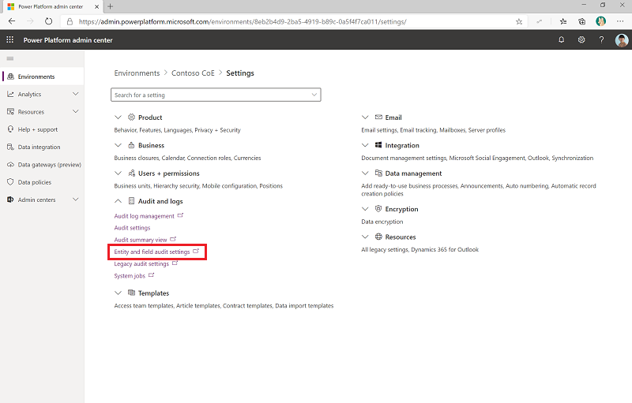
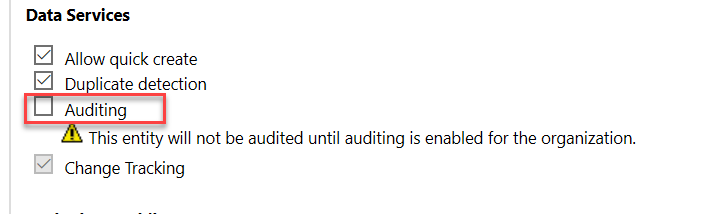
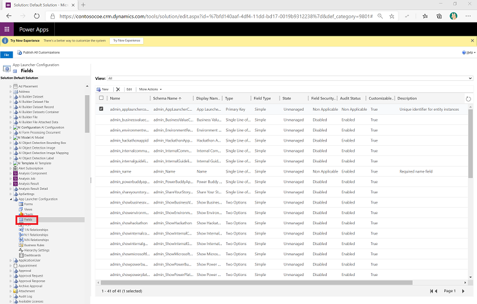
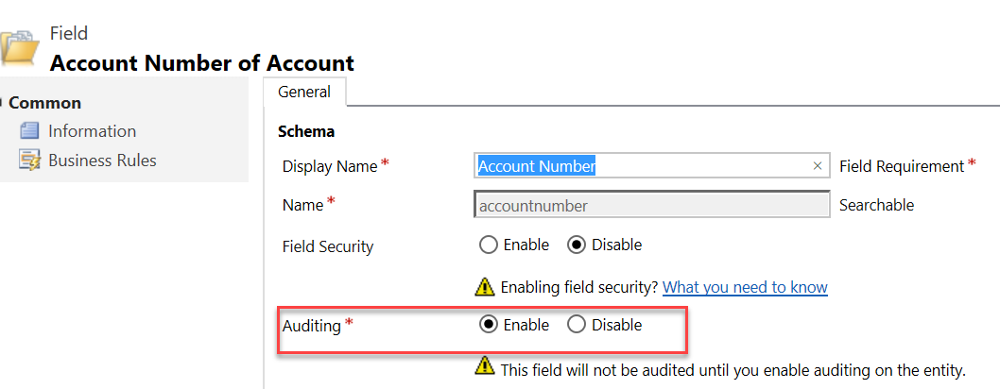

# Monitor Microsoft Dataverse usage

[!INCLUDE[cc-data-platform-banner](../../includes/cc-data-platform-banner.md)]

The Dataverse analytics in the Power Platform admin center will provide details on Dataverse usage in the selected environment. You can change environments by selecting **Change filters** and then selecting your environment. You can also adjust the date range. Only the past 28 days of data are available.

Dataverse analytics helps you monitor the following:

:::row:::
   :::column span="":::
      **Adoption**
   :::column-end:::
   :::column span="":::
      **Usage**
   :::column-end:::
   :::column span="":::
      **Health**
   :::column-end:::
:::row-end:::
:::row:::
    :::column span="":::
        - Number of active users
        - Active user trends
        - Top active users
        - Mode of access (by operating system, by device type, by browser)
   :::column-end:::
   :::column span="":::
        - Most-used out-of-the-box entities
        - Most-used custom entities
        - Activities performed (CRUD)
        - System jobs, plug-ins, and API call usage
   :::column-end:::
   :::column span="":::
        - System jobs analysis (pass rate, throughput, top failures, backlog)
        - Plug-in analysis (pass rate, execution time, top failures)
        - API calls analysis (pass rate, most-used APIs, top failures)
   :::column-end:::
:::row-end:::

As an administrator, you should:

- Monitor activities performed on the Dataverse database.
- Ensure overall health of the platform by regularly checking on system jobs operating, plug-ins being used by app makers, and API calls performed against Dataverse.

## Dataverse audit logging

You also have audit logging available for actions in Dataverse. This includes create, update, and delete operations on records in addition to changes to Dataverse metadata. More information: [Dataverse auditing overview](https://docs.microsoft.com/powerapps/developer/common-data-service/auditing-overview)

For auditing to be captured, it must be enabled in the following three places:

- In the admin portal environment settings via [aka.ms/ppac](https://aka.ms/ppac), select **Environment** > **Audit and logs** > **Audit settings**.

  

  Then [enable auditing data and user activity](https://docs.microsoft.com/power-platform/admin/audit-data-user-activity) for security and compliance.
  
  

- Enable the entity property for auditing. Select **Environment** > **Audit and logs** > **Entity and field audit settings**.

  

  Then select the entity you want to audit and enable **Auditing**.
  
  

- Enable the field on the entity for auditing. Select **Environment** > **Audit and logs** > **Entity and field audit settings** > **Your Entity** > **Fields**.

  
  
  Select the field you want to audit and select **Edit** to enable auditing.
  
  

You will need to coordinate with the app makers to ensure the entities and fields are properly configured to support auditing of the data. It is also helpful in some scenarios to turn off auditing on some fields that change frequently and aren’t significant to track because it can reduce the volume of audit data that is captured.

As an administrator, you should:

- Know that audit logging can be helpful in tracking down complex business logic problems that are a result of too many updates or conflicting updates occurring.
- Frequently review the logging data, because it can provide help in troubleshooting logic problems. So, having some level of audit logging enabled ahead of the need is helpful to expedite problem solving.
- Regularly review your audit log size, and delete audit records.
