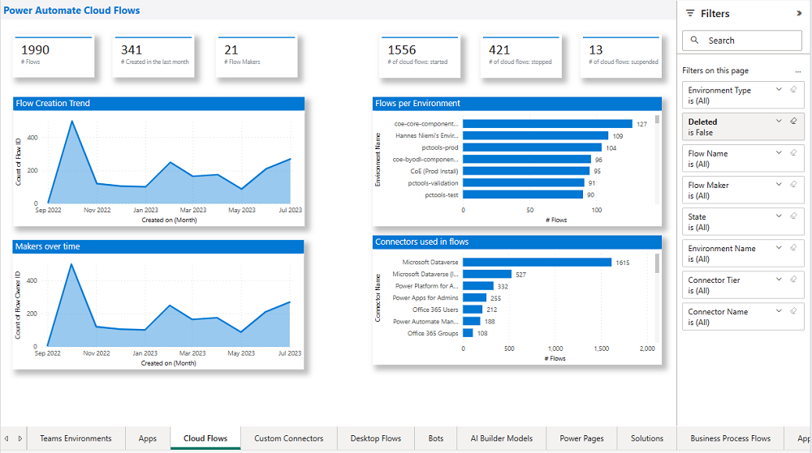
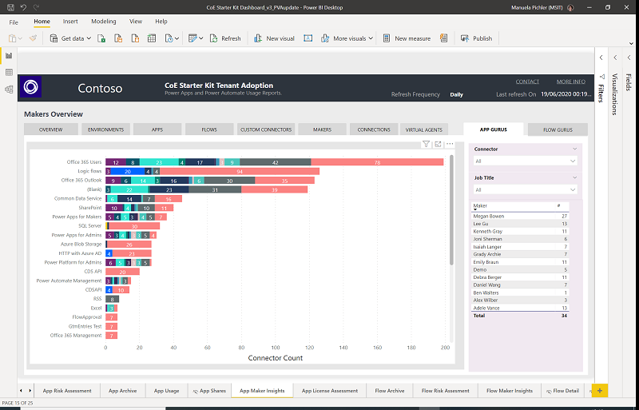

# Identify Microsoft Power Platform champions in your organization

If you have Office 365 in your organization, it’s likely some individuals already have discovered Power Apps through exploration and Power Apps popping up in Microsoft Teams, SharePoint, and OneDrive. Check analytics in the [Power Platform admin center](https://aka.ms/ppac) or make use of the [Center of Excellence Starter Kit](https://aka.ms/coestarterkit) dashboard to find your makers and learn about your app usage.

Even without organic adoption, it’s likely you already have a good idea of who your champions are. They are your Excel, Access, and SharePoint whizzes; or maybe they’re the troublemakers pushing the boundaries; or the ones who are first in line when there’s something new to learn. They question, they query, they encourage. Train those people. Make them champions and help them train others—champions aren't only passionate about what they do, but are also excited to evangelize and help their peers to learn more effective ways of working.

## Find your champions with the right tools

The out-of-the-box [Power Automate](https://docs.microsoft.com/power-platform/admin/analytics-flow) and [Power Apps](https://docs.microsoft.com/power-platform/admin/analytics-powerapps) analytics can help you identify top makers in your organization.

In addition to that, the dashboard part of the [CoE Starter Kit](https://aka.ms/coestarterkit) can give you a tenant-wide overview of makers in your environment, and what connectors they're using to create apps. You can see your top app and flow makers, what departments they are from, and identify trends over time.

You can see how many different connectors your makers are using and learn who is exploring different connectors. A great way to identify mature makers is looking at those who try out different connectors.

## How will champions support you?

Champions will evangelize and help train their teams on the new ways of working. They build awareness, understanding, and engagement throughout the community.

They will:

- Create the enthusiasm that grows adoption of improved ways of working, and evangelize Microsoft Power Platform and its value across teams.
- Build a circle of influence among their teams, and help people in their circle understand what is in it for them.
- Bring new ways of working to life across teams.
- Identify business challenges and possible solutions.
- Provide feedback to the CoE team and sponsors.

## Create a champions program

- Find enthusiastic champions who can commit time and effort.
- Design and align the champions community to organizational objectives and vision for Microsoft Power Platform in your organization. Attain sponsorship from key stakeholders and executives.
- Focus on the people—how can you help them, how can you unblock challenges, how can you celebrate them?
- Build a Yammer or Teams community for champions to share updates and successes, and to connect with each other.
- Provide materials ready to support their work (for example, access to training material and templates).
- Ensure a regular rhythm for discussions with the champions on what’s working and what’s not.
- Design a program to engage and recognize their effort, such as providing privileged access to relevant events or speaking engagements.
- Incorporate Microsoft Power Platform training resources into your own internal training site.
- Create a contest (for example, scavenger hunts and giveaways) between departments to encourage people to interact with Microsoft Power Platform.
- Encourage the sharing of stories, either through show-and-tell sessions or regular newsletters. You can lean on our [public case studies](https://powerapps.microsoft.com/blog/category/case-studies/) for ideas on how to structure those stories.
- Recognize and reward the work champions are doing. Remember, they're not a support team but business representatives. Is there a company reward or benefit program that their work could tie into? Are there vouchers or other goodies they could receive? Could the benefit even be a premium license or their own environment to play in?
