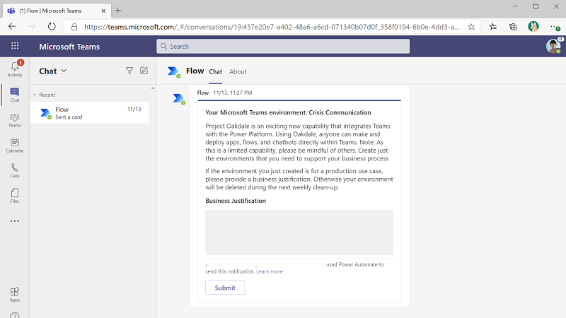
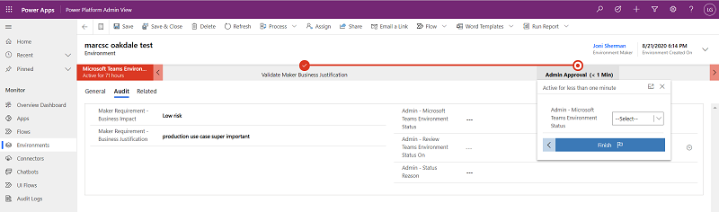
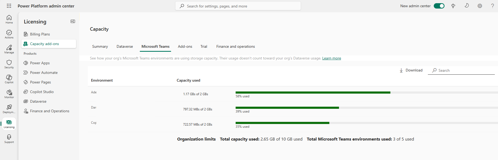
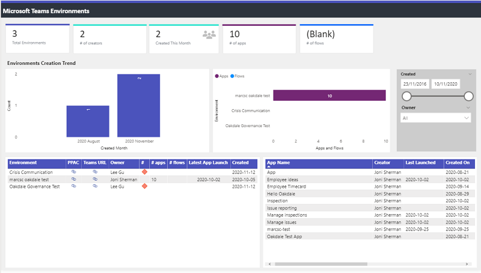

# Manage Microsoft Dataverse for Teams environments

Microsoft Dataverse for Teams empowers users to build custom apps, bots, and flows in Teams by using Power Apps, Power Virtual Agents, and Power Automate. When a team owner adds this capability to their team, a Power Platform environment with a Microsoft Dataverse for Teams database is created and linked to their team. Learn more: [About Microsoft Datverse for Teams environments](https://docs.microsoft.com/power-platform/admin/about-teams-environment).

Dataverse for Teams honors the existing data governance paradigms of Microsoft Power Platform and enables access control in the Teams Admin Center. The Power Platform admin center provides more detail, including monitoring dedicated capacity utilization and [Data Loss Prevention (DLP) policies](https://docs.microsoft.com/power-platform/admin/wp-data-loss-prevention).  

Dataverse for Teams greatly simplifies environment lifecycle management and user security role management by aligning to Teams constructs. Learn more: [User access to Microsoft Teams environments](https://docs.microsoft.com/power-platform/admin/about-teams-environment#user-access-to-project-oakdale-environments).

Dataverse for Teams is a fully embedded experience, governance controls specific to Power Platform are also provided directly in the context of the Teams admin center. Learn more: [Manage Microsoft Power Platform apps in the Microsoft Teams admin center](https://docs.microsoft.com/microsoftteams/manage-power-platform-apps).

Our philosophy is to enable you to use Power Platform to manage Power Platform - therefore, use Power Automate to send welcome emails to owners of new Dataverse for Teams environments and request a business justification for their environments. Central IT can therefore effectively engage with new makers and ensure that Dataverse for Teams capacity is used effectively in the tenant and distributed to the most effective business use cases. Similar workflows can be used to apply specific DLP policies to Dataverse for Teams environments as needed and to invoke clean-up of unused assets that can be repurposed for more compelling scenarios in the tenant.

## Govern environment creation

We recommend setting up reactive governance workflows and monitoring abilities. This will provide Team owners the ability to provide a business justification, and admins the ability to review the business justification:

1. Team owner can provide a **business justification** for their new environment within X days of creating the environment

    

1. **Admins approve or reject** the submitted business justifications, and optionally mark them for a later review.

    

1. An **automated cleanup** runs periodically and deletes rejected or unclaimed (no justification provided) environments. If needed, deleted environments can be restored within seven days using [Power Platform Admin Center - Recover environment](https://docs.microsoft.com/power-platform/admin/recover-environment#power-platform-admin-center).
1. Admins can also **review usage data and resource details** periodically, and can choose to delete unused environments to free up assets for important use cases.

The [CoE Starter Kit](https://aka.ms/coestarterkit) provides a set of templates that implement our best practices. These templates are designed to help organizations get started with developing a strategy for adopting, maintaining, and supporting the Power Platform. A template implementation of the reactive governance workflows to govern Dataverse for Teams environment creation is included in the CoE Starter Kit. As the CoE Starter Kit is a template implementation, admins can customize the conditions for deletion by creating a copy of the flows.

Dedicated Dataverse for Teams environments will be used for appropriate business use cases. Additionally, admins can choose to set up public Teams teams that are already backed by Dataverse for Teams environments where test or trial users can be directed to. A public Teams will ensure that the tenant capacity limits are applied to appropriate business use cases while still allowing individual users to test the new capabilities.  

## Monitor Dataverse in Teams capacity and usage

Admins can use Power Apps and Power Automate Analytics reports in Power Platform Admin Center to view usage, performance, and errors related to Dataverse for Teams environments.

Admins can monitor capacity usage for Teams environments using dedicated [capacity views in Power Platform Admin Center](https://docs.microsoft.com/power-platform/admin/about-teams-environment#capacity-limits). Notifications are sent to the Teams makers when the environment is nearing 80% of its capacity. Notifications are also sent to tenant admins when the tenant is reaching 80% of its capacity. These capacity limits cannot be extended. Admins can monitor inactive Microsoft Teams environments in the tenant and invoke cleanup, as well as have an automated cleanup of unused environments in place to free up capacity.

A dashboard in the CoE Starter Kit further identifies the usage of Dataverse for Teams environments, as well as inactive environments with no apps or flows.

## Set up data loss prevention policies

Manage the data governance policies for newly created Dataverse for Teams environments by selecting one of these approaches:

- Create a policy spanning all environments except selected ones. Keep the available connectors in this policy limited to those that you want to expose to makers in Dataverse for Teams environments. By setting the scope of the DLP policy to *Exclude certain environments*, this policy will apply to any new environments that will be created in your tenant – including Dataverse for Teams or Trial environments. Any other type of new environments, like a Production or Sandbox environment, can be removed explicitly from this tenant-wide DLP policy and added to appropriate dedicated DLP policies suited for their use case.

- Create a policy specific for Dataverse for Teams environments. Keep the available connectors in this policy limited to those you want Team members to have access to. Set up a script using [PowerShell cmdlets](https://docs.microsoft.com/power-platform/admin/powerapps-powershell#data-loss-prevention-dlp-policy-commands) or a flow using admin connectors that periodically adds newly created Dataverse for Teams environments to this policy and removes them from the default tenant level policy.

Learn more: [Best Practices for establishing a DLP Strategy](https://docs.microsoft.com/power-platform/guidance/adoption/dlp-strategy)

## Use Teams Admin Center controls

Global or Teams admins can use Teams app controls through Teams admin center to enable/disable Power Platform features within Teams. App controls are supported at an individual user level through Teams app permission policies and at tenant level through Teams manage apps settings.

|Teams Apps Control|Capabilities|
|------------------|---------|
|**Power Apps**|Ability to create new Power Apps using Teams embedded maker experience. This is tied to the implicit ability to create new Dataverse for Teams environments Ability to use Dataverse or Dataverse in Teams apps within Teams using Power Apps app  |
|**Power Virtual Agents**|Ability to create new Power Virtual Agents using Teams embedded maker experience. This is tied to the implicit ability to create new Dataverse for Teams environments Ability to use Dataverse or Dataverse in Teams Power Virtual Agents within Teams using Power Virtual Agent app|
|**Shared Power Apps**|Ability to use Dataverse or Dataverse in Teams Power Apps within Teams using *Built by your colleagues* catalog.|
|**Shared Power Virtual Agents**|Ability to use Dataverse or Dataverse in Teams Power Virtual Agents within Teams using *Built by your colleagues* catalog.|
|**Various Sample Apps**| Ability to create new Power Apps, Power Automate and Power Virtual Agents by using sample apps within Teams. This is tied to the implicit ability to create new Dataverse for Teams environments|

We recommend that given that these controls block environment creator, maker, user access, admins should instead use reactive constructs - either by building their own or by using the templates in the CoE Starter Kit - in order to govern Dataverse in Teams environment creation workflows.
