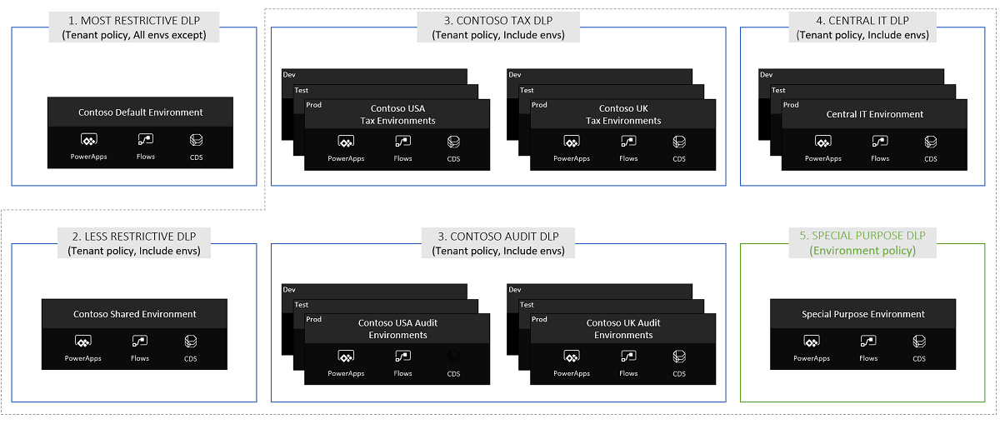

# Establishing a DLP strategy

Data loss prevention (DLP) policies act as guardrails to help prevent users from unintentionally exposing organizational data and to protect information security in the tenant. DLP policies enforce rules for which connectors are enabled for each environment, and which connectors can be used together. Connectors are classified as either **business data only**, **no business data allowed**, or **blocked**. A connector in the business data only group can only be used with other connectors from that group in the same app or flow. More information: [Administer Microsoft Power Platform: Data Loss Prevention Policies](https://docs.microsoft.com/power-platform/admin/wp-data-loss-prevention)

Establishing your DLP policies will go hand in hand with your [environment strategy](environment-strategy.md).

## Quick facts

- [Data loss prevention (DLP)](https://docs.microsoft.com/power-platform/admin/wp-data-loss-prevention) policies act as guardrails to help prevent users from unintentionally exposing data.
-	DLP policies can be scoped at the environment level and tenant level, offering flexibility to craft policies that are sensible and don't block high productivity.
-	Environment DLP policies cannot override tenant-wide DLP policies.
-	If multiple policies are configured for one environment, the most restrictive policy applies to the combination of connectors.
-	By default, no DLP policies are implemented in the tenant.
-	Policies can’t be applied at the user level, only at the environment or tenant level.
-	DLP policies are connector-aware, but don't control the connections that are made using the connector—in other words, DLP policies aren't aware of whether you use the connector to connect to a development, test, or production environment.
-	PowerShell and admin connectors can manage policies.
-	Users of resources in environments can view policies that apply.

## Connector classification

Business and non-business classifications draw boundaries around what connectors can be used together in a given app or flow. Connectors can be classified across the following groups using DLP policies:

- **Business**: A given Power App or Power Automate resource can use one or more connectors from a business group. If a Power App or Power Automate resource uses a business connector, it cannot use any non-business connector.
- **Non-business**: A given Power App or Power Automate resource can use one or more connectors from a non-business group. If a Power App or Power Automate resource uses a non-business connector, it cannot use any business connector.
- **Blocked**: No Power App or Power Automate resource can use a connector from a blocked group. All Microsoft-owned premium connectors and third-party connectors (standard and premium) can be blocked. All Microsoft-owned standard connectors and Common Data Service connectors can't be blocked.

The names "business" and "non-business" don't have any special meaning&mdash;they're simply labels. The grouping of the connectors themselves is of significance, not the name of the group they're placed in.

More information: [Administer Microsoft Power Platform: Connector classification](https://docs.microsoft.com/power-platform/admin/wp-data-loss-prevention#connector-classification)

## Strategies for creating DLP policies

As an administrator taking over an environment or starting to support use of Power Apps and Power Automate, DLP policies should be one of the first things you set up. This ensures a base set of policies is in place, and you can then focus on handling exceptions and creating targeted DLP policies that implement these exceptions once approved.

We recommend the following starting point for DLP policies for **shared user and team productivity environments**:

- Create a policy spanning all environments except selected ones (for example, your production environments), keep the available connectors in this policy limited to Office 365 and other standard microservices, and block access to everything else. This policy will apply to the default environment, and to training environments you have for running internal training events. Additionally, this policy will also apply to any new environments that will be created.
- Create appropriate and more permissive DLP policies for your [shared user and team productivity environments](environment-strategy.md#tiered-approach-to-team-and-user-productivity-environments). These policies could allow makers to use connectors like Azure services in addition to the Office 365 services. The connectors available in these environments will depend on your organization, and where your organization stores business data.

We recommend the following starting point for DLP policies for **production (business unit and project) environments**:

- Exclude those environments from shared user and team productivity policies.
- Work with the business unit and project to establish which connectors and connector combinations they'll use and create a tenant policy to include the selected environments only.
- Environment admins of those environments can use environment policies to categorize custom connectors as business-data only, if required.

Additional to the above, we also recommend:

- Creating a minimal number of policies per environment. There is no strict hierarchy between tenant and environment policies, and at design and runtime, all policies that are applicable to the environment in which the app or flow resides are evaluated together to decide whether the resource is in compliance or violation of DLP policies.  [Multiple DLP policies](https://docs.microsoft.com/power-platform/admin/wp-data-loss-prevention#combined-effect-of-multiple-dlp-policies) applied to one environment will fragment your connector space in complicated ways, and might make it difficult to understand issues your makers are facing.  
- Centrally managing DLP Policies using tenant level policies, and using environment policies only to categorize custom connectors or in exception cases.  

With this in place, plan how to handle exceptions. You can:

- Deny the request.
- Add the connector to the default DLP policy.
- Add the environments to the All Except list for the global default DLP and create a use case-specific DLP policy with the exception included.

## Example: Contoso's DLP strategy

Let’s look at how Contoso Corporation, our sample organization for this guidance, set up their DLP policies. The setup of their DLP policies ties in closely with their [environment strategy](environment-strategy.md).

Contoso admins want to support user and team productivity scenarios and business applications, in addition to Center of Excellence (CoE) activity management.

The environment and DLP strategy Contoso admins have applied here consists of:

1. A tenant-wide restrictive DLP policy that applies to all environments in the tenant except some specific environments that they have excluded from the policy scope. Admins intend to keep the available connectors in this policy limited to Office 365 and other standard micro-services by blocking access to everything else. This policy will also apply to the default environment.

1. Contoso admins have created another shared environment for users to create apps for user and team productivity use cases. This environment has an associated tenant-level DLP policy that isn't as risk-averse as a default policy and allows makers to use connectors like Azure services in addition to the Office 365 services. Because this is a non-default environment, admins can actively control the environment maker list for it. This is a tiered approach to shared user and team productivity environment and associated DLP settings.

1. In addition, for the business units to create line-of-business applications, they have created development, test, and production environments for their tax and audit subsidiaries across various countries. The environment maker access to these environments is carefully managed, and appropriate first- and third-party connectors are made available using tenant-level DLP policies in consultation with the business unit stakeholders.

1. Similarly, dev/test/production environments are created for Central IT's use to develop and roll out relevant or right applications. These business application scenarios typically have a well-defined set of connectors that need to be made available for makers, testers, and users in these environments. Access to these connectors is managed using a dedicated tenant-level policy.

1. Contoso also has a special purpose environment dedicated to their Center of Excellence activities. In Contoso, the DLP policy for the special purpose environment will remain high touch given the experimental nature of the theory teams book. In this case, tenant admins have delegated DLP management for this environment directly to a trusted environment admin of the CoE team and excluded it from a school of all tenant-level policies. This environment is managed only by the environment-level DLP policy, which is an exception rather than the rule at Contoso.

As expected, any new environments that are created in Contoso will map to the original all-environments policy.

This setup of tenant-centric DLP policies doesn't prevent environment admins from coming up with their own environment-level DLP policies, if they want to introduce additional restrictions or to classify custom connectors.

## Set up DLP policies

1. Create your policy in the [Power Platform admin center](https://aka.ms/ppac). More information: [Create a DLP policy](https://docs.microsoft.com/power-platform/admin/create-dlp-policy)

1. Use the [DLP SDK](https://docs.microsoft.com/power-platform/admin/data-loss-prevention-sdk) to add custom connectors to a DLP policy.

## Clearly communicate your organization’s DLP policies to makers

Set up a [SharePoint site or a wiki](wiki-community.md) that clearly communicates:

- Tenant-level and key environment-level (for example, default environment, trial environment) DLP policies enforced in the organization, inclusive of lists of connectors classified as business, non-business, and blocked.
- Your admin group’s email ID so that makers can make contact for exception scenarios. For example, admins can help makers get back into compliance editing an existing DLP policy, moving the solution to a different environment, creating a new environment and a new DLP policy, and moving the maker and resource to this new environment.

Also clearly communicate your organization's [environment strategy to makers](environment-strategy.md#clearly-communicate-your-organizations-environment-strategy-to-makers).
