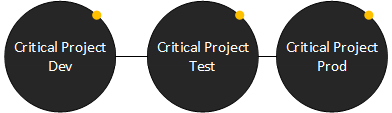
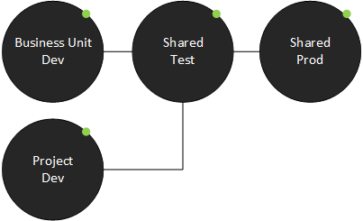

# Establishing an environment strategy

[!INCLUDE[cc-data-platform-banner](../../includes/cc-data-platform-banner.md)]

Environments are containers that administrators can use to manage apps, flows, connections, and other assets, along with permissions to allow organization members to use the resources. This article walks you through important details about environments in Microsoft Power Platform and discusses recommended ways to benefit from proactively managing them. More information: [Microsoft Power Platform environments overview](https://docs.microsoft.com/power-platform/admin/environments-overview)

Developing an environment strategy means configuring environments and other layers of data security in a way that supports productive development in your organization, while securing and organizing resources. A strategy to manage environment provisioning and access, and controlling resources within them, is important to:

- Secure data and access.
- Understand how to use the default environment correctly.
- Manage the correct number of environments to avoid sprawl and conserve capacity.
- Facilitate application lifecycle management (ALM).
- Organize resources in logical partitions.
- Support operations (and helpdesk) in identifying apps that are in production by having them in dedicated environments.
- Ensure data is being stored and transmitted in acceptable geographic regions (for performance and compliance reasons).
- Ensure isolation of applications being developed.

## Understand environments

Before we get started, let’s look at some environment and security key facts:

- Environments are tied to a [geographic location](https://docs.microsoft.com/power-platform/admin/regions-overview) that is configured at the time the environment is created.
- Environments can be used to target different audiences or for different purposes such as dev, test, and production.
- [Data loss prevention (DLP) policies](https://docs.microsoft.com/power-platform/admin/wp-data-loss-prevention) can be applied to individual environments or the tenant.
- Every tenant has a [default environment](https://docs.microsoft.com/power-platform/admin/environments-overview#the-default-environment).
- [Non-default environments](https://docs.microsoft.com/power-platform/admin/environments-overview#types-of-environments) can be created by licensed Power Apps, Power Automate, and Dynamics 365 users. Creation can be restricted to only global and service admins via a tenant setting.
- Non-default environments offer more control around [permissions](https://docs.microsoft.com/power-platform/admin/environments-overview#environment-permissions).
- An environment can have one or zero [Microsoft Dataverse instances](https://docs.microsoft.com/power-platform/admin/create-database).
- Environments include [predefined security roles](https://docs.microsoft.com/power-platform/admin/database-security) that reflect common user tasks with access levels defined to match the security best-practice goal of providing access to the minimum amount of business data required to use the app.

### Types of environments

Before you get started developing an environment strategy, ensure you understand the different [types of environments](https://docs.microsoft.com/power-platform/admin/environments-overview#types-of-environments).

## Developing a strategy

Here is a **starting point** to consider for your environment strategy.

- **Assign your admins the [Microsoft Power Platform service admin](https://docs.microsoft.com/power-platform/admin/use-service-admin-role-manage-tenant#power-platform-administrator) or Dynamics 365 service admin role.** These roles provide administrative access to Power Apps canvas apps, flows, model-driven apps, environments, custom connectors, connections, gateways, Power Apps portals, AI Builder models, and all Dataverse instances. This role should be assigned to admins who don't need global tenant admin access and are dedicated to managing Microsoft Power Platform.
  
- **Restrict the creation of net-new production environments to admins.** [Limiting environment creation](https://docs.microsoft.com/power-platform/admin/control-environment-creation) is beneficial to maintain control in general: both to prevent unaccounted capacity consumption and to reduce the number of environments to manage. If users have to request environments from central IT, it’s easier to see what people are working on if admins are the gatekeeper.

- **Treat the [default environment](https://docs.microsoft.com/power-platform/admin/environments-overview#the-default-environment) as a user and team productivity environment for your business groups.** Renaming the environment through the admin center is recommended to make the purpose of that environment self-explanatory. Clearly communicate that Default is used for user and team productivity scenarios, but not business-important or mission-critical apps. This environment can't be disabled or deleted because it hosts integration with products like SharePoint and Project. We recommend a [tiered approach to user and team productivity environments](#tiered-approach-to-team-and-user-productivity-environments).

- **Establish a process for requesting access to or creation of environments.** With environment creation locked down and default reserved for first-party integration apps, make it clear to your organization that a proper development project should be started by requesting a new dedicated environment where there is clear communication of intent and support between developers and admins. The next section has more detail about automated environment creation, which is just one way to implement an easy formal request process.

- **Dev/test/production environments for specific business groups or applications.** Having staged environments ensures that changes during development don't break the users in production and data isn't corrupted. When resources are limited, focus this pattern for mission-critical and important apps, or on business units that have the greatest need for their own dedicated space.

- **Individual-use environments for proof of concepts and training workshops.** To host workshops, hackathons, and internal training events&mdash;like App in a Day or Flow in a Day&mdash;create a new, separate environment for the event to keep everyone organized. Ask the users to save the resources they need in a short term after the event and clean up the environment, or reset it for other events. Use Trial environments that do not consume capacity for these types of activities.

- **Establish Tenant and Environment level Data Loss Prevention (DLP) policies** Data Loss Prevention (DLP) policies act as guardrails to help prevent users from unintentionally exposing organizational data and to protect information security in the tenant. An essential part of the Power Platform Admin role will be to [establish and maintain tenant and environment level DLP policies](dlp-strategy.md).

### Tiered approach to team and user productivity environments

To support integrations, reduce the number of environments needed, and accelerate onboarding, we recommend creating several shared environments that can be used by individuals and teams.

#### Default environment

Everyone in your tenant has permissions to create apps and flows here. There currently is no way to block the Environment Maker role assignment in this environment. This is also the environment that is used for first-party integrations, like creating an app from a SharePoint list. Learn more: [The default environment](https://docs.microsoft.com/power-platform/admin/environments-overview#the-default-environment)

To reduce risk to data, the types of connectors used in your apps and flows should be limited to a less permissive data loss prevention (DLP) policy. This policy should cover common individual and small team productivity use cases, like working with SharePoint data, sending emails, and having an approval workflow.

#### Power user environment

While the default environment covers many use cases, some power users will have more advanced needs for their apps and flows, like integrating with Microsoft Teams, Azure Active Directory (Azure AD), or Azure DevOps.

For this purpose, we recommend creating a power user environment. This shared environment should use mre permissive DLP policies and admins should control the maker list to this environment.

Some considerations for the power user environment:

- Review the available connectors in this environment to make sure it’s the right fit for your users.
- Document the purpose and available connectors in this environment clearly—for example, on a [SharePoint site or wiki](wiki-community.md).
- Create an automated process for makers to request access to the power user environment—for example, using Microsoft Forms, a SharePoint site, or an app. If required, this process could include approval by the line manager or IT.

### Custom environments

While the shared environments cover many use cases for applications, teams and projects might benefit from having a custom environment to support their business unit-specific use cases or application lifecycle management scenarios.

Some considerations for custom environments:

- Work with the project teams or business units to establish if they require dedicated development, test, and production environments or if a dedicated development environment and shared test and production environments are more suitable to their use case.
- Consider **dedicated** environments for critical projects and workloads. Developers have Environment Maker access in the development environment, but only user access in the test and production environments. End users only have end user access to the production solution so no one can modify the production applications.
- Consider **sharing** test and production environments between important but medium complex apps. Individual projects and business units have their own development environment to protect data, but solutions are deployed to shared test and production environments. Developers are end users in the test environment, and end users only have basic user access to solutions and data in the production environment.
- Work with the business unit to establish which connectors are required and create an exception policy.
- Work with the business unit to establish who will be a maker in this environment, and who will be the environment administrator.
- Each environment consumes 1 GB of data capacity, so manage custom environments wisely.

In addition to the above recommendations, establishing your environment strategy will also shape and direct your **[DLP strategy](dlp-strategy.md)**.

| | |
|---|---|
| Everyone is a maker. Communicate with everyone that **Default** isn't for development of critical apps |  |
| Only one user has access. **Developer** environments are completely locked for any other user except the user who subscribed to the community plan. Applications can be moved out of the environment if needed.|  |  |
| Approved users have access. **Shared** environments for user and team productivity scenarios, with an approved maker list. |  |
| **Dedicated** environments for critical projects and workloads. Developers have environment maker access in the development environment, but only user access in the test and production environments. End users only have end user access to the production solution so no one can modify the production applications. |  |
| **Shared** test and production environments for important but medium complex apps. Individual projects and business units have their own development environment to protect data, but solutions are deployed to shared test and production environments. Developers are end users in the test environment, and end users only have basic user access to solutions and data in the production environment. |  |

&#9679; Critical Project 
&#9679; Important Project 
&#9679; User and team productivity 

### Additional recommendations to manage environments

Based on successful experience with customer engagements, here is a list of additional recommendations that can help make managing environments easier.

- **Use a service account to deploy production solutions**: Create a service account that central IT manages to deploy to test and production environments. This is beneficial for many reasons:
    
  - Allows all members of IT to manage admin resources (such as test and production environments).
  - Only the service account has admin permissions in the environment.
  - All other users have end user permissions and cannot create new resources—this is important because if users are given access to a data connection, they cannot create any new interface to interact with the data that wasn’t intended by the developer.
  - IT is aware of production-grade applications that are in deployment since they’re involved in the implementation.
  - Service accounts will need Microsoft Power Platform or Dynamics 365 service admin permission in PIM. Assign additional licenses as needed depending on what connectors need to be used in the request process (for example, if Dataverse and Outlook are used, assign premium Power Apps and Office Enterprise).
  - When displaying the details for an application, it will show the service account as the creator and not the maker. This will help end users know who to contact in case of application issues.
  
  Consider if the risks of having a service account are important to you. Some organizations aren't comfortable having a service account because, for example, a shared resource with admin privileges cannot be tracked to a single person. This is valid, but can be mitigated with steps such as enforcing location-based conditional access, tracking the audit logs to an IP, or more extensive methods like maintaining a secure access workstation that requires user identification during use and restricting the service account access to that device.
- **Reduce the number of shared development environments**

  Have separate environments for separate project development, especially when dealing with secure data. Environments are containers for resources such as connections to data, and in development environments there might be multiple people with environment maker access. If makers have access to a shared data connection and can create apps and flows, there is a risk that someone will create a new interface to read, update, and delete data they might have been given access to. This is especially important to keep in mind for the default environment—you should always have important data connections, custom connectors, and other assets that need security in isolated environments to protect them.
- **Share resources with Azure AD security groups**

  Security groups can be used to manage access to Power Apps, flows, Dataverse security roles, and other Office 365 services such as SharePoint Online. This removes the admin’s burden to update access to individual end users for each component (especially if multiple are involved)—the app owners can modify that at the security group level without IT (unless IT restricts access to security group management).
- **Automate environment creation**
  
  The admin connectors (Microsoft Power Platform for Admins) make it possible to create an approval flow where users request environments when IT has restricted environment creation to admins. Central IT can review a request and approve or reject the creation of the environment, without being responsible for manually going to the admin center and creating the environment for the user, just for validating the request details, business justification, DLP requirements, and whether enough capacity is available.
- **Create temporary development environments**

  As mentioned, it’s recommended to separate development environments as much as possible, and specifically avoid simultaneous app development for critical solutions in the default environment. If environments are created for development purposes, put a deadline on how long the environment should be available to the developers and have a process in place to back up and remove them.
- **Less is better**

  Although it’s important to make sure resources are reasonably partitioned between projects and business units using environments, it’s still important to find a good balance between security and feasibility. Managing shared test and production environments is a good way to facilitate a larger number of *important* solutions while preserving capacity and following best practices. This maintains restricted permissions because test and production have restricted environment permissions, and therefore the end users can’t modify the applications.
- **Provision environments with Dataverse instances in the appropriate region**
  
  In companies where employees work in multiple countries, there might be some compliance considerations in terms of where data is stored and sent between countries. If the environment has a Dataverse instance, the data is physically being stored in the region. Review the list of supported environment regions.

### Factors that influence provisioning

Some factors influence when to provision which types of environments:

- **Defined tiers of application support**

   The level of complexity, how critical the app is, and users impacted by the application (for example, monthly active users/total users in an org) are all important measures of how to provision environments to support all the scenarios.

   Different types of applications should be separated in different environments based on how critical each is.

    | | |
    |:---:|---|
    |  | Mission-critical scenarios and/or high-complexity and/or org-wide usage. Support owned by IT. Robust ALM process (dev/test/prod). Longer development cycle, often greater than 3 months to minimum viable product.
     |  | Important but not critical and/or medium complexity and/or scoped to business unit. Support owned by app owner or business unit, blessed by IT. ALM-using environments are advised but might not be necessary. Development typically less than three months to Minimum Viable Product.
    |  | Productivity app that doesn't need high level of governance. Support by app developer. Typically, application lifecycle management isn't necessary. Less than two weeks to minimum viable product.

- **Capacity**

   Each environment (besides trial and developer environments) will consume 1 GB to initially provision. This might be a constraint for provisioning environments if your organization doesn't pay for premium Power Apps or Dynamics 365 licenses, and it’s also a shared capacity across the tenant needs to be allocated to those who need it.

   Conserve capacity by:

     - Managing shared test and production environments. Unlike shared development environments, permissions in test and production environments should be limited to end-user access for testing.
     - Automate cleanup of temporary development environments and encourage use of trial environments for testing or proof-of-concept work.

- **Admin involvement**

    It’s not always possible to have central IT involved in every development project happening throughout the tenant, especially if the IT team is smaller or there’s a larger enterprise to manage.

    Reduce the burden on the admin by:

    - Automating environment creation so the tenant admin only needs to approve the request.
    - Automating development environment cleanup with temporary environments.

## Clearly communicate your organization’s environment strategy to makers

Set up a [SharePoint site or a wiki](wiki-community.md) that clearly communicates:

- The purpose of your default environment.
- The purpose of shared team and user productivity environments, in addition to other shared environments makers might have access to (for example, training environments) and the process of how to request access to those environments.
- The purpose of trial environments and how to request them.
- The purpose of developer environments and how to create them
- The process of requesting custom environments for specific business unit or project purposes.
- The responsibilities of a maker:
  - Keep the tenant clean. Delete your environments, apps, and flows if they are no longer needed. Use test environments if experimenting.
  - Share wisely. Watch out for oversharing of your environments, apps, flows, and shared connections.
  - Protect organization data. Avoid moving data from highly confidential or confidential data sources to non-protected or external storage.

Also clearly communicate your organization’s [DLP policies to makers](dlp-strategy.md#clearly-communicate-your-organizations-dlp-policies-to-makers).
