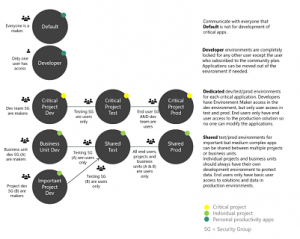

# Power Platform adoption maturity model: Goals and opportunities

The goal of the Power Platform adoption maturity model is to help organizations and their partners to think through how they can improve their capabilities and decide which capabilities matter most to them. These decisions should be based not just on the technology capabilities but the digital transformation strategy of the organization.

Let’s now look at the stages and opportunities in each stage in detail:

## Level 100 – Initial

*(organic, chaotic, ad hoc, individual heroics)*: This phase describes the starting point for use of a new or undocumented process. In the Initial phase the organization has pockets of success or experimentation with Power Platform, but without any visibility into organization-wide adoption and use.  There is no overall strategy or governance approach, apps are largely in the Default environment and no DLP policies have been put in place.  Apps are mostly used by a single team and supported by the makers. Apps primarily use Excel and SharePoint as their data sources. The organization sees the potential of a strategic investment in the Power Platform, but there is no clear path forward for organisation-wide execution.

### Opportunities

:::row:::
   :::column span="":::
      
      Organize [training events](https://aka.ms/powerappsdemos), [hackathons](/power-platform/guidance/adoption/hackathons) and [lunch & learn sessions](/power-platform/guidance/adoption/in-a-day#lunch-and-learn).
   :::column-end:::
   :::column span="":::
   
      Find and [nurture champions](/power-platform/guidance/adoption/champions), recognize early success.
   :::column-end:::
:::column span="":::

      Get key sponsors and teams on board as you review the [roles and responsibilities](/power-platform/guidance/adoption/roles) needed to execute your Power Platform adoption.
   :::column-end:::
:::row-end:::

## Level 200 – Repeatable

*This phase describes a process that is at least documented sufficiently such that repeating the same steps may be attempted.* In the context of the Power Platform, organizations in the repeatable stage are taking what they’ve learned in the Initial stage to put structure around the deployment of Power Platform, often through controls implemented by a central IT team or other team focused on Power Platform.  The CoE Starter Kit is deployed to provide tenant-wide visibility into the use of Power Platform and begin to identify, if not control, applications that are beginning to become broadly used in the organization. Environments are used as needed, but in an ad hoc manner – for example, various Production environments and different DLP policies might be created without a consistent strategy. These organizations sometimes believe that the use of the Power Platform is running “out of control” until they shape their use of the administrative and governance controls available for Power Platform, transitioning to the Defined Stage.

### Opportunities

:::row:::
   :::column span="":::
   
      Gain tenant wide oversight of resources being created in your tenant.
   :::column-end:::
   :::column span="":::
      
      [Establish DLP Policies](/power-platform/guidance/adoption/dlp-strategy) in the default environment and mitigate the risk of apps and flows breaking by performing a [DLP Impact Analysis](/power-platform/guidance/coe/core-components#dlp-editor-v2) first.
   :::column-end:::
:::column span="":::
   
      Embrace new makers with a [Welcome email](/power-platform/guidance/adoption/onboard-makers), informing them of internal training resources and policies.
   :::column-end:::
:::row-end:::

## Level 300 – Defined

*This phase describes a process that is defined/confirmed as a standard business process. *The Defined organization is standardizing the repeatable practices that evolved in the Repeatable phase – for example, Environment and DLP requests are automated, solutions are used to move apps and flows between environments, and makers are starting to share common components. The organization is achieving measurable success with Power Platform to digitally transform and has a defined Power Platform Center of Excellence team.  Much of this transformation may still reflect the organic growth that got the organization to this point, but the Center of Excellence team is working to automate those processes and define standard approaches that will move the organization to the Capable stage.

### Opportunities

:::row:::
   :::column span="":::
      
      Develop an [environment strategy](/power-platform/guidance/adoption/environment-strategy) and configure layers of security in a way that supports productive development in your organization, while securing and organizing resources.
   :::column-end:::
   :::column span="":::
      
     Define [tiers of application support](/power-platform/guidance/adoption/environment-strategy#factors-that-influence-provisioning) – taking into account the level of complexity, how critical the app is, and users impacted by the application.
   :::column-end:::
:::column span="":::
   
      Celebrate your makers and champions by [sharing their success stories](/power-platform/guidance/adoption/show-and-tell), and focus on the business value and impact they have on the organization.
   :::column-end:::
:::row-end:::

## Level 400 – Capable

*This phrase describes a process that is quantitatively managed in accordance with agreed-upon metrics. T*he Capable organization has standard processes for managing and monitoring Power Platform.  These processes, described during the Defined stage, are now largely automated and are well understood by makers.  Power Platform capabilities are being used to transform the business broadly and used for enterprise-critical apps and integrations. Platform Champions have established channels for sharing best practices, training new makers and conducting regular hackathons.  Standard, branded app templates and components are available to all makers. Business Value assessments are carried out to measure and understand the impact of the Power Platform.

### Opportunities

:::row:::
   :::column span="":::
      
      Create an [app catalog](/power-platform/guidance/coe/core-components#app-catalog) to make apps more discoverable and avoid duplication.
Create [shared component libraries](/power-platform/guidance/adoption/reusable) with common design patterns, such as headers and navigation to ensure consistency across apps.
   :::column-end:::
   :::column span="":::
      
     Automate the communication between CoE, IT and Admins through approvals and Microsoft Teams messages.
   :::column-end:::
:::column span="":::
   
      Define [key responsibilities for your CoE](/power-platform/guidance/adoption/coe), Admins and Makers and ensure they are understood and agreed to by everyone.
   :::column-end:::
:::row-end:::

## Level 500 – Efficient

*This phrase describes a process that is quantitatively managed in accordance with agreed-upon metrics.*  In the context of the Power Platform, in the Efficient stage the organization has proven the capabilities of Power Platform to rapidly transform mission critical capabilities.  Standardized, automated processes and an established community of experts allow new digitization opportunities to be implemented rapidly, allowing the organization to recognize value quickly and begin to integrate more advanced capabilities, such as artificial intelligence (AI). Fusion Teams enable legacy capabilities and modern cloud architecture to be used easily within Power Platform unlocking broad use of existing data and automation. In Organizations at the Leading Stage, the Power Platform is key part of the digital transformation strategy and Enterprise Architecture in the organization. Organizations at this stage have exec sponsorship for the Power Platform. Organizations at the Leading stage influence best practices in the community and drive new uses of Power Platform.

### Opportunities

:::row:::
   :::column span="":::
      
      Enable everyone to [submit ideas](/power-platform/guidance/coe/use-innovationbacklog), describe pain points and pick the most valuable ideas for development. Build a portfolio for your career development opportunities. Provide “big picture” dashboards emphasizing the impact of the platform.
   :::column-end:::
   :::column span="":::
      
     [Simplify Application Lifecycle Management](/power-platform/guidance/coe/almaccelerator-components). Make it easier for makers to manage their solutions and deployment.
   :::column-end:::
:::column span="":::
   
      [Tell your story](https://aka.ms/powerplatformstories). Influence our best practices and inspire other leaders to go on the same journey.
   :::column-end:::
:::row-end:::

> [!div class="nextstepaction"]
> [Next step: Details capabilities and characteristics](maturity-model-details.md)
