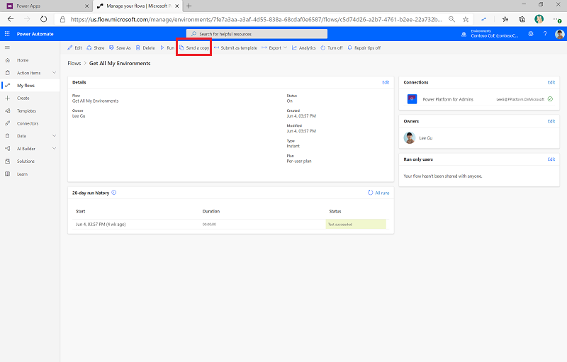
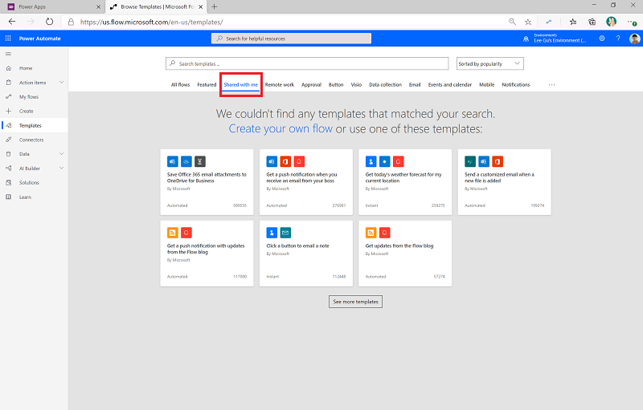

# Share your own templates and reusable components

## Component library

Components are reusable building blocks for canvas apps so that app makers can create custom controls to use inside an app, or across apps using a component library. Components can use advanced features such as custom properties and enable complex capabilities.

[Component libraries](https://docs.microsoft.com/powerapps/maker/canvas-apps/component-library) are containers of component definitions that make it easy to:

- Discover and search components.
- Publish updates.
- Notify app makers of available component updates.

Create component libraries and share them with your makers, both to ensure consistency across apps and to enable makers to focus on the business logic in their app rather than on common components.

Great initial components to include are:

- Header
- Navigation
- Footer
- Success screen
- Home screen
- Search box
- Preloader

Makers who use a shared component library in their app will receive a notification if there are updates to the component library.

## Template catalog for apps

Templates are a great way to learn more about features in Power Apps and a great learning tool where makers can browse and try samples.

Some of your makers will create apps that you might want to reuse in other parts of the organization, or make available in a template gallery for other makers to discover. An example could be a department-specific app that other departments might want to customize and make their own.

Power Apps out of the box doesn't support sharing organizational templates; however, you can export apps and upload them to a shared library.

As a starting point, you could upload the exported app with some metadata like category, description, connectors used, or a short manual of how to customize it to a SharePoint document library.

Once you have a few templates, you could build an app template catalog on top of your SharePoint document library to make it easier for makers to search for, filter, and find available templates.

The [nurture components of the Center of Excellence Starter Kit](https://docs.microsoft.com/power-platform/guidance/coe/nurture-components) contain a starting point:

## Organization gallery for flows

Templates are a popular feature in Power Automate. They are a great learning tool where makers can browse from a wide variety of samples and choose to implement a template that meets their needs.

A feature called **Send a copy** allows you to send a copy of your flow to another recipient.

It works by sending them a link that they can click that will allow them to provision a copy of your flow. Once the flow is shared with them, the flow will also appear in a new tab within the templates feature called **Shared with me**.

When you use the **Send a copy** feature, it also allows you to provide an Office 365 group as the destination recipient. By sharing with this group, everyone in that group will now have access to implement that flow. Naturally, you can include as many people in that group as required. This allows you to create an organizational template gallery of flows.

## Additional guidelines

You might have additional guidelines, such as brand standards, logos and brand pictures, colors, accessibility standards in the form of PDFs, or links on your intranet. Make sure your makers know how to find those, and make them easily available in a template catalog or link list from your [maker community](wiki-community.md).
