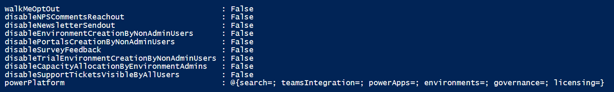
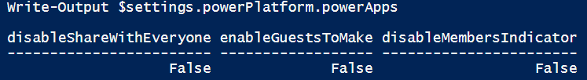

# Secure the default environment

Every employee in your organization has access to the default Power Platform environment. As a Power Platform admin, you need to consider ways to secure that environment while keeping it accessible for makers' personal productivity uses. This article provides suggestions.

## Assign administrator roles judiciously

Consider whether your admin users need to have the Power Platform administrator role. Would the environment admin or system administrator role be more appropriate? In any case, limit the more powerful Power Platform admin role to just a few users. [Learn more about administering Power Platform environments](/power-platform/admin/environments-administration).

## Communicate intent

One of the key challenges for the Power Platform Center of Excellence (CoE) team is communicating how makers should use the default environment. Here are a few ways to make clear the intended uses of the default environment.

### Rename the default environment

The default environment is created with the name ***TenantName* (default)**. You can [change the environment name](/power-platform/admin/edit-properties-environment) to something more descriptive, like *Personal Productivity Environment*, to clearly call out the intent.

### Power Platform hub STOPPED EDITING HERE

In addition to renaming the default environment, the Power Platform CoE team should set up a central Wiki that contains information about the organization's Power Platform service. This can include, but isn't limited to:

- Personal productivity use cases.
- How to build apps and flows?
- Where to build apps and flows?
- How to reach out to the CoE support team?
- Rules around integrating with external services.

The [Microsoft Power Platform hub](/power-platform/guidance/adoption/wiki-community#get-started-with-the-power-platform-hub-template) is a SharePoint communication site designed to provide you with a starting point of content and page templates as you're setting up your internal Power Platform communication site.

### Customizing Power Platform messages

When a maker creates an app that violates the DLP policy, you can customize the displayed error message to display the URL to your organization's specific Power Platform Wiki. You can also add your Power Platform team's contact email address. This redirects makers or users to your Power Platform Wiki. This is especially critical for the default environment since all employees in an organization have access to it. As the CoE team refines the DLP policy over time, you might inadvertently break some existing apps. Ensuring that the DLP policy violation messages contain contact details or URL will provide a way forward for makers.

The following PowerShell scripts allow you to customize these messages:

|Command  |Description  |
|---------|---------|
|Set-PowerAppDlpErrorSettings  |Set governance message   |
|Set-PowerAppDlpErrorSettings  | Update governance message  |

More information: [Power Platform governance error message commands](/power-platform/admin/powerapps-powershell#governance-error-message-content-commands)

## Sharing

Environment makers can distribute the apps they build in an environment to other users in your organization by sharing the app with individual users or security groups. In addition, the platform allows a maker to share an app with  ["Everyone" in the organization](/power-apps/maker/canvas-apps/share-app).

Your organization should consider using a gated process around widely used applications to enforce mandates, such as the following policies and requirements:

- Security review policy.
- Business review policy.
- ALM requirements.
- User experience and branding requirements.

You should consider disabling the **Share with Everyone** feature in Power Platform. Once restricted, only a small group of administrators are allowed to share an application with "Everyone" in the environment.

To prevent sharing apps with everyone in the environment:

1. Use [Get-TenantSettings](/powershell/module/microsoft.powerapps.administration.powershell/get-tenantsettings?view=pa-ps-latest&preserve-view=true) to retrieve the list of tenant settings for your organization. This cmdlet returns an object with the tenant settings.

   

   Within the powerPlatform.PowerApps object you can find three flags:

   

1. Use the following commands to get the settings object and set the variable to share with everyone to false.

   ```powershell
   $settings=Get-TenantSettings 
   $settings.powerPlatform.powerApps.disableShareWithEveryone=$true 
   ```

1. Use the Set-TenantSettings with the settings object to prevent makers from sharing their apps with everyone in the tenant.

   ```powershell
     Set-TenantSettings \$settings
   ```

Once these commands are run, only admins will have the privilege of sharing an app with everyone in the tenant. Makers will be limited to sharing the app with a security group or individuals.

## Data loss prevention policy for default environment

This section covers the recommended configuration when you set up a default environment data loss prevention (DLP) policy.

### Block new connectors in the default environment

New connectors that are added to the platform are added to the non-business group by default. You can configure it such that new connectors land in either the business or blocked data groups. For the default environment DLP, we recommend that the default data group (usually, non-business) is set to **Blocked**. This ensures that if any new connector is introduced, it will remain unusable until a tenant admin manually unblocks that connector.

### Prebuilt connectors

To restrict the access of the employees to only the basic non-block-able connectors and prevent access to the rest of the connectors, classify the prebuilt connectors as follows:

1. Move all the connectors that can't be blocked to the business data group.

1. Move all the block-able connectors to the blocked data group.

### Custom connectors

Custom connectors let you create a connector for your own home grown service. These services are intended for technical consumers like developers. It's preferred to reduce the footprint of APIs (built by the organization) that can be invoked from apps or flows in the default environment. To ensure that makers can't create and use custom connectors for APIs, create a rule to block all URL patterns. If there are APIs that you would like your default environment users to have access to (for example: a service that returns a published list of holidays for the organization), you can configure multiple rules classifying different URL patterns into the business and non-business data groups. Ensure that connections always use the HTTPS protocol. More information: [DLP policy for custom connectors](/power-platform/admin/dlp-custom-connector-parity)

For more information, about Power Platform DLP policies, go to [Create a data loss prevention (DLP) policy](/power-platform/admin/create-dlp-policy).

## Securing integration with Exchange

Power Automate allows you to build automation at scale via low code. This allows any employee in an organization to build large-scale, secure, and scalable workflows. Connectors allow you to create workflows that connect to different systems.

[Office 365 Outlook connector](/connectors/office365/) is one of the standard connectors that can't be blocked. This connector allows an employee to send, delete, and reply to email messages in the mailboxes they have access to. The risk with this connector is also one of its most powerful capabilities: the ability to send an email. A citizen developer might inadvertently end up creating a flow that sends out an email blast. This section addresses how to mitigate this risk.

The Microsoft Exchange administrator in your organization can set up rules on the Exchange Server to prevent emails from being sent from apps. It's also possible to exclude specific flows or apps from the rules set up to block outgoing emails. You can combine this rule with an "allowed list" of email addresses to ensure that outbound mails from apps and flows can only be sent from a small group of mailboxes.

Whenever an app or flow sends an email via the Office 365 Outlook connector, it inserts specific SMTP headers in the email. These headers contain reserved phrases that can be used to identify if the email originated from a flow or an app.

The SMTP header inserted into an email sent from a flow looks like the example below:

```
 x-ms-mail-application: Microsoft Power Automate; 
 User-Agent: azure-logic-apps/1.0 (workflow 2321aaccfeaf4d7a8fb792e29c056b03;version 08585414259577874539) microsoft-flow/1.0
 x-ms-mail-operation-type: Send
 x-ms-mail-environment-id: 0c5781e0-65ec-ecd7-b964-fd94b2c8e71b 
```

Header details

The x-ms-mail-application header can have the following values depending on the service used:

|Service  |Value  |
|---------|---------|
|Power Automate  |  Microsoft Power Automate; User-Agent: azure-logic-apps/1.0 (workflow &lt;GUID&gt;; version &lt;version number&gt;) microsoft-flow/1.0       |
|Power Apps  |  Microsoft Power Apps; User-Agent: PowerApps/ (; AppName= &lt;app name&gt;)       |

The x-ms-mail-operation-type header can use the following values depending on the action being performed:

|Value  |Description  |
|---------|---------|
|Reply     | For reply email operations.    |
|Forward     |  For forward email operations.   |
|Send     | For send email operations including, SendEmailWithOptions and SendApprovalEmail.   |

The x-ms-mail-environment-id header contains the environment ID value. The presence of this header depends on the product you're using:

- In Power Apps, it will always be present.
- In Power Automate, it will be present only in connections created after July 2020.
- In Logic Apps, it will never be present.

### Potential Exchange rules for the default environment

Here are some email actions you might want to block by using Exchange rules.

#### Block outbound emails to external recipients

Block all outbound emails sent to external recipients from Power Automate and Power Apps. This rule will ensure that citizen developers don't send out emails to external recipients (such as partners, vendors or clients) from apps or flows.

#### Block outbound forwarding

Block all outbound emails forwarded to external recipients from Power Automate and Power Apps where the sender isn't from an allowed list of mailboxes

This rule will ensure that users can't create a flow, which will automatically forward inbound emails to an external recipient.

#### Exceptions to consider with email block rules

Here are some potential exceptions to the Exchange rules to block email to add flexibility:

- Exempt specific apps and flows. Add an exemption list to the rules above so that approved apps or flows can send emails to external recipients.
- Organization-level allowlist. In this scenario it makes sense to move the solution into a dedicated environment. If several flows in the environment have to send outbound emails, you can create a blanket exception rule to allow outbound emails from that environment. The maker and admin permission on that environment must be tightly controlled and limited.

## Cross-tenant isolation

Microsoft Power Platform has a system of connectors based on Azure Active Directory (Azure AD) that enable authorized Azure AD users to connect apps and flows to data stores. Tenant isolation allows admins to effectively govern the movement of data from Azure AD authorized data sources to and from their tenant.

Tenant isolation is applied at the tenant level and impacts all environments in the tenant, including the default environment. Since all employees are makers in the default environment, configuring a robust tenant isolation policy is critical to securing the default environment.

As a recommended practice, explicitly configure the tenants that your employees can connect to. All the other tenants should be covered by default rules that block both inbound and outbound flow of data.

> [!NOTE]
> - Power Platform tenant isolation is different from Azure AD-wide tenant restriction because it doesn't impact Azure AD-based access outside of Power Platform.
> - Power Platform tenant isolation works only for connectors using Azure AD-based authentication, such as the Office 365 Outlook and SharePoint connectors.

### See also

[Restrict cross-tenant inbound and outbound access (preview)](/power-platform/admin/cross-tenant-restrictions)

[Get-PowerAppTenantIsolationPolicy (Microsoft.PowerApps.Administration.PowerShell)](/powershell/module/microsoft.powerapps.administration.powershell/get-powerapptenantisolationpolicy?view=pa-ps-latest&preserve-view=true)
