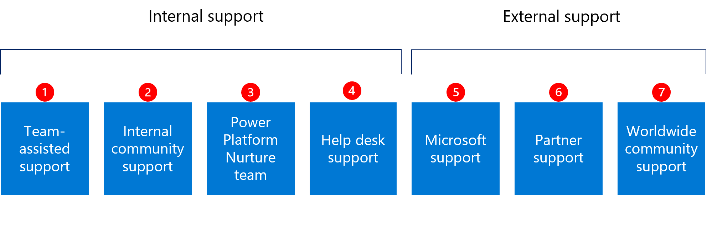

# Maker support

The following section covers technical guidance and support for makers. Activities like building a community, training your makers and co-development assistance can significantly decrease the volume of formal support queries and increase user experience overall. Next to the activities outlined in this article, it's important to establish ongoing [training and learning opportunities](training-strategy.md) for your makers.

The diagram shows some common types of maker support that organizations employ successfully:

| **Type** | **Description** |
| --- | --- |
|  | **Team-assisted support (internal)** is informal. Support occurs when team members learn from each other as they develop Power Platform solutions.  |
|  | **Internal community support (internal)** can be organized informally and formally. It occurs when colleagues interact with each other via internal community channels. It’s often focused on makers solving specific issues as they develop an app or flow.   |
|  | **[Power Platform Nurture team (internal)](roles.md#microsoft-power-platform-nurture-team)** is responsible for enabling Power Platform at the organization. This team may provide mentorship to makers and help them build apps/flows. It will also lead community programs and events, such as hackathons.   |
|  | **Help desk support (internal)** handles formal support issues and requests.  |
|  | **Microsoft support (external)** includes support for users and admins. Makers and users can raise questions through the [Power Apps](https://powerapps.microsoft.com/support/) or [Power Automate](https://flow.microsoft.com/support/) support page. Power Platform and Environment admins can [raise support tickets](/admin/support-overview) through [Power Platform admin center](https://aka.ms/ppac). Based on your [support plan](/admin/support-overview), different technical support and advisory services are available to you. |
|  | **[Partner support (external)](https://powerapps.microsoft.com/partners/)** can complement your internal support offering, and provide training to your makers or handle complex queries from your makers. |
|  | **[Community support (external)](https://powerusers.microsoft.com/)** can help get answers directly from other users. |

Each type of user support introduced above are described in further detail in this article.

## Team-assisted support

Team-assisted support refers to makers learning from each other as they build applications. Makers who emerge as [your champions](champions.md) tend to take on this type of informal support role voluntarily because they have an intrinsic desire to help.

## Internal community support

At the heart of growth is a [community](wiki-community.md), a place for people to collaborate, share ideas, and discover new ways to apply technology to achieve more. A community is a place to ask questions, share knowledge, and expand skill sets.

Internal communities may start as an informal motion, driven by makers who want to share their success with their colleagues; other makers may learn about the community through word of mouth. Often, those communities are formalized as your Power Platform maturity grows—then, new makers are automatically invited to the community, success stories are shared during regular events, and existing champions take on mentorship opportunities to develop their career.

>[!TIP]
>The goal of an internal community is to be self-sustaining, which can lead to reduced formal support demands and costs. However, there will always be a need to monitor, manage, and nurture the internal community. Here are specific tips:
>
> - Set the community up for success by cultivating multiple experts in different topics.
> - Allow the community a chance to respond, but the Center of Excellence (CoE) should also monitor activity and unanswered questions to help out.
> - Document FAQs and make them easily accessible to your community.
> - If makers reach out directly to the dedicated support team or CoE leads, ask them to raise questions in the community instead.

An internal community discussion channel is commonly set up as a Teams channel or a Yammer group. The technology chosen should reflect where users already work, so that the activities occur within their natural workflow.

Use of an internal community discussion channel allows the Center of Excellence to monitor the kind of questions people are asking. It's one way the CoE can understand the issues users are experiencing and shape the future of the CoE based on this input. Monitoring the discussion channel can also reveal more experts and potential champions who were previously unknown to the CoE.

## Help desk support

The help desk is usually run as a shared service, operated by the IT department.

The help desk can:

- Support technical issues that can't be resolved without IT involvement—for example, installation of software like Power Automate Desktop, firewall/network issues or Power Platform service issues that require an admin to [raise support tickets](/admin/support-overview) through the [Power Platform admin center](https://aka.ms/ppac).
- Answer governance-related questions, such as how to create new environments or request connectors.

>[!IMPORTANT]
>Your Power Platform governance decisions will directly impact the volume of help desk requests. For example, if you choose to lock down creation of new environments by everyone, it will result in users submitting help desk tickets. While we recommend limiting environment creation, you must be prepared to satisfy the request quickly to ensure employee and user satisfaction. Automating processes with Power Apps and Power Automate can help make the process efficient. If you delay too long, users will use what they already have, and that may not be the ideal scenario. Promptness is critical for certain help desk requests. As an example, learn [how to use the environment request management components in the CoE Starter Kit](/power-platform/guidance/coe/env-mgmt).

Over time, troubleshooting and problem resolution skills become more effective as help desk personnel expand their knowledge base and experience with Power Platform.

## Microsoft support

Based on your support plan, you may be eligible for advisory support services provided through Premier/Unified support. Learn more about support available to you: [Get Help + Support](../../admin/get-help-support.md)

Refer to the comprehensive [Microsoft Power Platform documentation](../../index.yml). It's an authoritative resource that can aid you with troubleshooting and searching for information.

## Partner support

Many customers choose to work with partners on their Power Platform adoption, including support. This can include development assistance for makers, help in establishing a CoE, and technical support procedures, as well as training for your help desk and makers.

## Community support

Connect with peers and Power Platform technical experts through our [Power Platform community](https://powerusers.microsoft.com/). The community features forums for you to ask questions, trainings, blogs, and sample galleries to take inspiration from.  It can be powerful and exceedingly helpful. However, as is the case with any public forum, it's important to validate the advice and information posted on the forum.

The Power Platform community is vibrant. Every day, a great number of blog posts, articles, webinars, and videos are published. When relying on community information for troubleshooting, watch out for:

- How recent the information is, it may be old and out of date.
- Whether the situation and context of the solution found online truly fits your circumstance.
- The credibility of the information being presented.

## Considerations and key actions

Considerations and key actions you can take to improve your team-assisted support:

- Provide recognition and encouragement to your champions.
- If informal team efforts aren't adequate, consider formalizing the roles you want to enact in this area, and the expected contributions and responsibilities.

Considerations and key actions you can take to improve your internal community support:

- Encourage people to ask questions in the designated community discussion channel. As the habit builds over time, it will become normalized to use that as the first option and the community will evolve to become more self-supporting.
- Ensure that your dedicated Power Platform support team actively monitors this discussion channel. They can step in if a question remains unanswered, improve upon answers, or make corrections when appropriate. They can also post links to additional information to raise awareness of existing resources. Although the goal of the community is to become self-supporting, it still requires dedicated resources to monitor and nurture it.
- Make sure your user population knows the internal community support area exists. Highlight a link to it in regular internal communications and on your intranet pages, and set up automated welcome emails for new makers with a link to the community.
- Set up automation to ensure that all your Power Platform users automatically have access to the community discussion channel.

Considerations and key actions you can take to improve your internal help desk support:

- Determine the initial scope of Power Platform topics that the help desk will handle.
- Assess the readiness level of your help desk to handle support.
- Arrange for more training for help desk staff, based on readiness gaps.
- Determine what the escalation path will be for requests the help desk can’t directly handle.
- Update the help desk knowledge base for known Power Platform topics. Ensure someone is responsible for regular updates to the knowledge base to reflect new and enhanced features over time.
- Be prepared to address specific common issues quickly. For example, a request to use a new connector should be handled quickly. Slow support response may result in users finding workarounds.

Considerations and key actions you can take to improve your Power Platform Nurture team support:

- Create a feedback loop from the help desk to the dedicated support team. When support personnel observe redundancies or inefficiencies, they can communicate that information to the Nurture team, who might choose to update existing internal documentation or provide more training paths for makers.
- Consider offering drop-in sessions or office hours where makers can show up with their questions to get immediate help.
- Consider hosting frequent webinars to share Power Platform maker and development knowledge, such as how to use specific actions in a cloud flow or how to make canvas apps responsive. Record those sessions and make them available on your Power Platform community space.

[!INCLUDE[footer-include](../../includes/footer-banner.md)]
