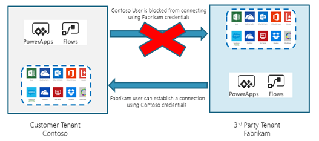

# Enable cross-tenant isolation

Cross-tenant isolation lets you restrict other tenants your makers can connect to. Applied at the API Hub level, cross-tenant isolation blocks inbound or outbound connections for canvas apps and flows.

Enabling cross-tenant isolation for Power Apps and Power Automate requires raising a support ticket in the [Power Platform admin center](https://aka.ms/ppac).

- Restricting outbound connections means a user in your tenant is blocked from connecting to a third-party tenant. Restricting inbound cross-tenant connections requires a support ticket—this restriction then only applies to Power Apps and Power Automate.
- Restricting inbound connections means a user in a third-party tenant is blocked from creating a connection to your tenant. Restricting outbound cross-tenant connections can be done using tenant restrictions that apply to all Azure Active Directory (Azure AD) software as a service (SaaS) cloud apps, or at the API Hub level, which would block outbound connections just for canvas apps and flows.

    

## Azure AD tenant restrictions

Tenant restrictions can also control access to all SaaS cloud applications, based on the Azure AD tenant the applications use for single sign-on. More information: [Use tenant restrictions to manage access to SaaS cloud applications](https://docs.microsoft.com/azure/active-directory/manage-apps/tenant-restrictions)
