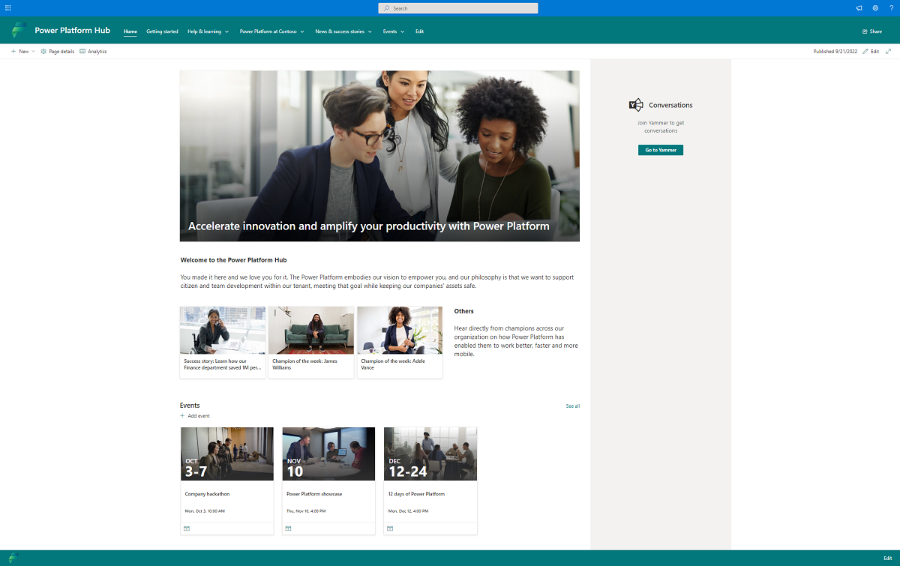

# Create an internal wiki and community

At the heart of growth is a community, a place for people to collaborate, share ideas, and discover new ways to apply technology to achieve more. A community is a safe place to ask questions to share tacit knowledge and expand skill sets. Organizations that have succeeded at creating a growing community of makers provide tools such as Yammer or Microsoft Teams groups, regular events and speaking opportunities, and foster an environment of ongoing learning. 

They make sure that every person in the organization can come together at regular intervals to socialize, share their knowledge, and explore new possibilities. Leaders who want to create a digital culture will put a framework in place for the community inside their organization to break down geographic and organizational silos.

## Create an internal wiki

Set up a SharePoint Hub or Teams site to share rules of engagement and processes with your maker community. This should be a one-stop shop for makers to find out everything they need about getting started with Microsoft Power Platform.

Here are a few tips on what the wiki should include:

- **Training and reusable resources**: Share internal and external training resources, reusable components and templates, and any brand guidelines or naming conventions you want your makers to follow.

- **Community**: Share how to engage with the internal community, how to become a champion, how to find a mentor, and what the benefits of the community are.

- **[Environment strategy](environment-strategy.md)**: Share what environments are available and how to request access to existing environments or request new environments; additionally, ensure makers know the boundaries of environments with regard to licensing, security for environments, and connectors.

- **[Data loss prevention (DLP) policy strategy](dlp-strategy.md)**: Share which connectors are available in which environments and how to request additional connectors or a new environment for a specific project.

- **Responsibilities of a maker**: Share what a maker is responsible for—for example, keeping the tenant tidy by deleting unused resources, ensuring apps are only shared with required end users, supporting their apps in the default environment, or engaging with the Center of Excellence team before implementing a business-important or mission-critical app to plan appropriate support. Ensure makers are educated about the processes you have in place for business-important or mission-critical apps, such as engaging formal support.

- **Support process**: Share how makers and solutions can be supported.

- **License management**: Share what licenses are available and what’s included in those licenses, how to request premium licenses, and who will pay for those premium licenses if cross-charging from IT to business units or teams is in place.

- **UI/UX**: Discussion area on corporate standards/styles and overall best practices around UX.

