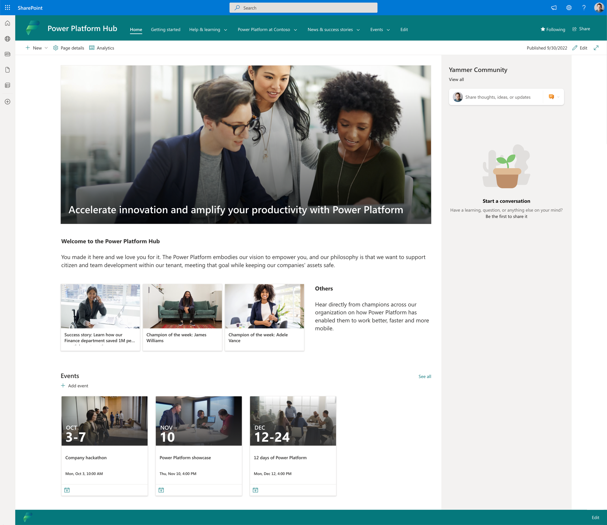

# Create an internal Microsoft Power Platform hub

At the heart of growth is a community, a place for people to collaborate, share ideas, and discover new ways to apply technology to achieve more. A community is a safe place to ask questions to share tacit knowledge and expand skill sets. Organizations that have succeeded at creating a growing community of makers provide tools such as Yammer or Microsoft Teams groups, regular events and speaking opportunities, and foster an environment of ongoing learning.

They make sure that every person in the organization can come together at regular intervals to socialize, share their knowledge, and explore new possibilities. Leaders who want to create a digital culture will put a framework in place for the community inside their organization to break down geographic and organizational silos.

## Create a Power Platform Hub

<<<<<<< HEAD
Set up a SharePoint Hub or Teams site to share rules of engagement and processes with your maker community. It should be a one-stop shop for makers to find out everything they need about getting started with Microsoft Power Platform.
=======
Set up your own SharePoint Hub or Teams site to share success stories, upcoming events, rules of engagement and guidelines with your maker community - or get started with the [Power Platform Hub template](#get-started-with-the-power-platform-hub-template). This site should be a one-stop shop for makers to find out everything they need about getting started with Microsoft Power Platform.
>>>>>>> 0e39522543ef9e51fb8a292565716109b23c5fdb

Here are a few tips on what the wiki should include:

- **Training and reusable resources**: Share internal and external training resources, reusable components and templates, and any brand guidelines or naming conventions you want your makers to follow.

- **Community**: Share how to engage with the internal community, how to become a champion, how to find a mentor, and what the benefits of the community are.

<<<<<<< HEAD
- **[Environment strategy](environment-strategy.md)**: Share what environments are available and how to request access to existing environments or request new environments; additionally, ensure makers know the boundaries of an environments licensing, security, and connectors.
=======
- **[Environment strategy](environment-strategy.md)**: Share what environments are available and how to request access to existing environments or request new environments; additionally, ensure makers know the boundaries of environments with regards to licensing, security for environments, and connectors.
>>>>>>> 0e39522543ef9e51fb8a292565716109b23c5fdb

- **[Data loss prevention (DLP) policy strategy](dlp-strategy.md)**: Share which connectors are available in which environments and how to request more connectors or a new environment for a specific project.

<<<<<<< HEAD
- **Responsibilities of a maker**: Share what a maker is responsible for—for example:

1. Keeping the tenant tidy by deleting unused resources
1. Ensuring apps are only shared with required end users
1. Supporting their apps in the default environment, or engaging with the Center of Excellence team before implementing a business-important or mission-critical app to plan appropriate support. 
1. Ensure makers are educated about the processes you have in place for business-important or mission-critical apps, such as engaging formal support.
=======
- **Responsibilities of a maker**: Share what a maker is responsible for—for example
  - Keeping the tenant tidy by deleting unused resources.
  - Ensuring apps are only shared with required end users.
  - Supporting their apps in the default environment,.
  - Engaging with the Center of Excellence team before implementing a business-important or mission-critical app to plan appropriate support.
  
  Ensure makers are educated about the processes you have in place for business-important or mission-critical apps, such as engaging formal support.
>>>>>>> 0e39522543ef9e51fb8a292565716109b23c5fdb

- **Support process**: Share how makers and solutions can be supported.

- **License management**: Share what licenses are available and what’s included in those licenses, how to request premium licenses, and who will pay for those premium licenses if cross-charging from IT to business units or teams is in place.

- **UI/UX**: Discussion area on corporate standards/styles and overall best practices around UX.



<<<<<<< HEAD
## Deploy the Community Wiki

The community wiki is a SharePoint Online template that is installed to an existing Site Collection by running two PowerShell scripts.
The steps in this section take you through the process of preparing, and running the PowerShell scripts.

> [!NOTE] Your organization may restrict your ability to run PowerShell scripts, or you may need to work with your SharePoint  Online administration team to run the PowerShell script.

### Download the assets

The assets can be [downloaded from GitHub](https://github.com/microsoft/coe-starter-kit/tree/main/CenterofExcellenceResources/Release).  

### Prepare to run the PowerShell scripts

The two PowerShell scripts have a dependency on two PowerShell modules:

1. Microsoft.PowerApps.Administration.PowerShell - which can be downloaded and installed by [following instructions in this document](power-platform/admin/powerapps-powershell#installation).
1. PnP PowerShell - which can be downloaded and installed by [following instructions in this document](https://github.com/pnp/powershell)

> [!IMPORTANT] Before running the script, ensure that you have the SharePoint Online site template files located in an accessible folder.  You'll need to input the path for the $Path script parameter.

The PowerShell commands in the Microsoft.PowerApps.Administration.PowerShell module requires Windows PowerShell version 5.x.

Check the version of PowerShell running on your machine:

```powershell
$PSVersionTable.PSVersion
```

1. Extract the contents of the PowerPlatformHub.zip folder to a location on your PC.

### Update the PowerShell script variables

The PowerShell script contains several variables that should be updated to reflect your organization:

```powershell
$adminTenantName = 'contoso'
$adminURL = 'https://' + $adminTenantName + '-admin.sharepoint.com'
$companyName = 'Contoso'
$lcid = 1033
$newSiteURL = 'https://' + $adminTenantName + '.sharepoint.com/sites/powerplatformhub'
$ownerEmail = 'owner@contoso.com'
$siteTemplate = 'SITEPAGEPUBLISHING#0'
$siteTitle = 'Power Platform Hub'
$timeZone = 2
```

1. **$adminTenantName** - represents your organization name
1. **$companyName** - represents your organization name
1. **$lcid** - defines the language for the SharePoint Online site (note: you can view a list of all locales [here](/openspecs/office_standards/ms-oe376/6c085406-a698-4e12-9d4d-c3b0ee3dbc4a))
1. **$adminTenantName** - replace  '/powerplatformhub' with your community hub name URL
1. **$ownerEmail** - update with admin email address
1. **$siteTitle** - replace with your community wiki name
1. **$timeZone** - an integer representing the time zone for your organization (note: these are listed [here](https://learn.microsoft.com/en-us/dotnet/api/microsoft.sharepoint.spregionalsettings.timezones?view=sharepoint-server))

### Run the PowerShell scripts

1. Select Start > type PowerShell > Run as administrator
1. Navigate to the folder containing the source files
1. Execute (by typing the following name) the following PowerShell scripts:
    1. Deploy-PowerPlatformHub.ps1
    1. Set-PowerPlatformHubAsDLPErrorSettings.ps1

### Test if the deployment was successful

When the scripts have finished executing, you should see a notification message:

"Deployment of Power Platform Hub complete!"

1. Navigate to the URL of your community hub wiki
1. Check that the following lists

## Troubleshooting

The PowerShell scripts have been written to catch any failures. However, if you do see errors, you should check:

### Can't connect to SharePoint Online

It could be caused by PnP PowerShell not being registered.  Your global administrator will need to register by following the steps [in this document](https://pnp.github.io/powershell/articles/authentication.html).

=======
## Get started with the Power Platform Hub template

The Power Platform Hub template is a SharePoint communication site designed to provide you with a starting point of content and page templates as you're setting up your internal Power Platform wiki and hub site. This communication site is designed to be the place where your Power Platform community can find the news and resources they need, including digital governance and compliance guardrails, upcoming events, success stories and more.

### Deployment

### Configuration

The Power Platform Hub contains placeholder text and ideas for your own content. Update this content with your own processes, links and images before the hub is ready for use.

After deployment, navigate to **Site contents > Site Pages** to get started, and modify:

- **Accelerate-innovation-and-amplify-your-productivity-with-Power-Platform.aspx**: This permanent news story is your place to share your strategy and vision for Power Platform with your makers and community. Record a video with your executive sponsor and inspire your makers to achieve more with Microsoft Power Platform!
- **Consultation-and-Development.aspx**: If you have an internal Power Platform development team, provide their contact details, and ways to engage here. If not, delete this page!
- **Data-Loss-Prevention-(DLP)-Policies.aspx**: Share which connectors are available in which environments and how to request more connectors or a new environment for a specific project. We have added content of a typical DLP policy strategy here for you to get started with. Scan the document for placeholders for *Company specific instructions that you need to update with your own processes and guidelines.
    
- **Environments.aspx**: Share what environments are available and how to request access to existing environments or request new environments; additionally, ensure makers know the boundaries of environments with regard to licensing, security for environments, and connectors. We have added content of a typical environment policy strategy here for you to get started with. Scan the document for placeholders for *Company specific instructions that you need to update with your own processes and guidelines.
- **Guided-Learning.aspx**: This page provides a summary of Power Platform learning paths available on Microsoft Learn. If you're running internal training events, add them here.
- **Power-Platform-at-Contoso.aspx**: Share what a maker is responsible for—for example
  - Keeping the tenant tidy by deleting unused resources.
  - Ensuring apps are only shared with required end users.
  - Supporting their apps in the default environment,.
  - Engaging with the Center of Excellence team before implementing a business-important or mission-critical app to plan appropriate support.
  
  Ensure makers are educated about the processes you have in place for business-important or mission-critical apps, such as engaging formal support.
- **Requesting-a-Premium-License.aspx**: Share what licenses are available and what’s included in those licenses, how to request premium licenses, and who will pay for those premium licenses if cross-charging from IT to business units or teams is in place.
- **Internal-Communities.aspx**: Update this page to add links to your Power Platform communities - we recommend including a Yammer web part here.
- **Support.aspx**: Share how makers and solutions can be supported. Learn more: [Develop a support strategy](support-strategy.md).

Once you've modified the existing content, you should also

- Create new pages for extra content you'd like to share with your makers and add them to the navigation by selecting **Edit** in the navigation bar.
    
- Delete the **Adele-Vance.aspx** and **James-Williams.aspx** pages, these pages are templates for how the **Champion of the week** page template can be used. Celebrate your own champions by selecting **New > Page > Champion** from the Power Platform Hub homepage.
  
- Delete the **Success-story--Learn-how-our-Finance-department-saved-1M-per-month-by-automating-processes.aspx** page, this page is a template for how to share a success story. Highlight your own success stories by selecting **New > Page > Story** from the Power Platform Hub homepage.
- Delete the **Research-and-Innovation-hackathon.aspx** page, this page is a template for how to announce an upcoming hackathon event. Announce your own hackathon by selecting **New > Page > Hackathon** from the Power Platform Hub homepage.
>>>>>>> 0e39522543ef9e51fb8a292565716109b23c5fdb

[!INCLUDE[footer-include](../../includes/footer-banner.md)]