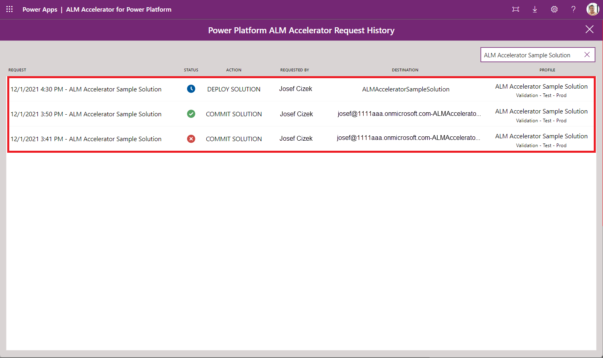

# ALM Accelerator for Power Platform advanced maker experience

## Demo: ALM accelerator advanced maker experience

Watch how to use the ALM Accelerator for Power Platform.
[Demo Videos](https://github.com/microsoft/coe-starter-kit/blob/main/CenterofExcellenceALMAccelerator/WALKTHROUGHS.md)

## Configuration of the ALM accelerator advanced maker user settings

In the following table, you can see how the **User Functions** are configured for the **advanced maker** user settings.

| Field        | Value     | Description |
|--------------|-----------|------------|
| Import Solutions | Allowed  | Allowing this function shows the **Import Solution** command in the app.|
| Delete Solutions | Allowed  | This function shows the **Delete Solution** command in the app.|
| Manage Solutions | Allowed  | This function shows the **Manage Solutions** command in the app.|
| Drillthrough Status | Allowed  | This function allows users to drill into the Azure DevOps pipeline runs for the promote and deploy functionality.|
| Profile Creation | Allowed  | This function provides users with the ability to create new deployment profiles in the app.|
| Profile Updates | Allowed  | This function provides users with the ability to updates deployment profiles in the app.|
| Advanced Promote | Allowed  | This function provides users with the ability to change between using the advanced promote functionality. They can specify a source and target branch, or create a new branch.|
| Advanced Deploy | Allowed  | This function provides users with the ability to switch between using the advanced deploy functionality. They can specify a source and target branch for a pull request.|
| Bypass Prepare | Allowed  | This function provides the user with the ability to skip the preparation step during the promotion of a solution. They can bypass needing to configure deployment settings before committing to source control.|
| Show All Solutions | Allowed  | This function provides the user with the ability to see all solutions in the selected environment.|

The below table shows how the **User Labels** are configured for the **advanced maker** user settings

| Field        | Description |
|--------------|------------|
| Deploy Solution |Setting the value to blank will use the default label. Default label is **DEPLOY SOLUTION**.|
| Commit Solution |Setting the value to blank will use the default label. Default label is **COMMIT SOLUTION**.|
| Import Solution | Setting the value to blank will use the default label. Default label is **IMPORT SOLUTION**.|
| Delete Solution | Setting the value to blank will use the default label. Default label is **DELETE SOLUTION**.|

## Walk-through: ALM accelerator advanced maker experience

> [!IMPORTANT]
> The following user experience has been configured by using the Power Platform ALM Accelerator Administration app, which is installed with the ALM accelerator. For more information on how to use the administration app and configure and share experiences, go to [Creating user settings and profiles](setup-deployment-user-profiles.md).

1. After you've installed and configured the app, start it from your environment by selecting **Apps** > **ALM Accelerator for Power Platform**.

1. When you're prompted to create connections and grant consent, create the necessary connections or accept the consent dialog.

1. If you're prompted to create an HTTP with Azure Active Directory (AD) connection, enter **https&semi;\/\/graph&period;microsoft&period;com** for both the **Base Resource URL** and **Azure AD Resource URI**.

1. Select **Create** for each connection when prompted.

1. The first time you open the app, a dialog opens and you're asked to select an **Environment**. Next time you open the app, it will remember which environment you were working on.

1. After the environment is selected, the main screen displays a list of all the unmanaged solutions in the environment. Depending on the *user deployment settings* your user has assigned, you'll be able to see the following options for each solution:

   - **Commit Solution**: Commits all the changes you've made within the solution in your version control system. Additionally, the commit will create your deployment pipelines in Azure DevOps as part of the commit process.
   - **Deploy Solution**: Allows you to move the changes across environment.
   - **Choose a Profile**: Allows you to configure what organization, project, repository, target branch, and environments your solution can be deployed to.
   - **Delete Solution**: Deletes the solution allowing you to reimport if necessary from source control again with the latest changes.
   - **Import Solution**: Imports an unmanaged solution into your maker environment from source control.
   - **Request History**: (right arrow icon): Provides a list of requests (commits and deployments) requested and completed for that solution.

    :::image type="content" source="media/aa4pp-main-screen.png" alt-text="Solution list":::

1. You can now create a new solution from the make.powerapps.com or import an unmanaged solution from an existing Azure DevOps project to begin making changes to it. To import a solution, select **Import Solution**, and then select a **Profile, Solution Source, Solution Folder**, and **Configuration**.

   - **Profile**: the configured profiles your user has access to, this profile points to an organization and project in Azure DevOps.

   - **Solution Source**: is based on the branches in Azure DevOps for the project you selected in the configuration.

   - **Solution Folder**: is a list of folders in the selected branch that contain a **SolutionPackage folder** from a previous export.

   - **Configuration** (Optional): is a directory under the config directory in the **Solution Folder** that contains deployment settings and configuration data. For more information about configuration settings, go to the [Deployment Configuration Guide](setup-data-deployment-configuration.md).

    > [!NOTE]
    > You're either pulling the latest changes from the solution branch or you'll want to pull another makers branch into your own environment. The configuration allows you to ensure that all of the necessary post solution import configuration and data exists in your environment.

   :::image type="content" source="media/aa4pp-solution-import.png" alt-text="Import a solution from a branch in Azure DevOps.":::

1. After you've created or imported your solution, you're going to choose a profile for the sImport a solution from a branch in Azure DevOps.olution so you can associate the solution to a specific organization, project, repository, target branch, and environments where you'll be able to deploy the solution.

   - Select **Choose a Profile** for your solution in the solution list.
   - In the solution profile dialog, select a **Profile**, and then select **Save**.

    > [!NOTE]
    > If you're an admin, you'll be able to create new deployment profiles from here. If you're a maker, an administrator from your organization might have made some profiles available for you to choose from. If the profile you want isn't available, contact your administrator to request a new profile.

1. After you have a profile associated, you can begin to configure your solution for deployment. Select the **Configure Deployment Settings** link under the name of the solution. On the configuration deployment page, the following items appear:

   - **Deployment Environment List** (for example, validation, test, and production)

     - The environments listed are the ones configured in the deployment steps in the deployment profiles created by the administrator.

   - **Connection References**

      :::image type="content" source="media/aa4pp-deployment-settings-connection-references.png" alt-text="Connection Reference configuration.":::

      - This screen lists all of the connection references in your solution and allows users to create connections in their downstream environments to hook up the connection references in the target environment.
      - To create a new connection, select **+**.
      - After creating a new connection, select **Refresh** in the upper-right corner to get the latest list of connections.
      - To select an existing connection in the target environment, select a connection from the dropdown list.
      - To locate the connection in the target environment, select the name or the status of the connection.

   - **Environment Variables**

      :::image type="content" source="media/aa4pp-deployment-settings-environment-vars.png" alt-text="Environment Variables configuration.":::

      - This screen lists all of the environment variables in your solution and allows users to set the value of the environment variables in the downstream environment.
      - For standard environment variables—such as string, number, or JSON—enter the value in the text box to the right of the environment variable name.
      - For data source environment variables, use the dropdown lists to select the appropriate data source to use in the downstream environment.

   - **Canvas Apps**

      :::image type="content" source="media/aa4pp-deployment-settings-app-sharing.png" alt-text="App Sharing configuration.":::

      - This screen lists all of the apps in your solution and allows users to share the apps in the downstream environment with an Azure Active Directory (Azure AD) Group.
      - Use  the dropdown list to select the **Azure AAD group** with which you'd like to share the app.
      - To view the group details, select the details icon. This button opens a new browser tab with a link to the Azure AD Group in the Azure portal.
      - To set the permissions, select the permissions dropdown list and set the permissions to either **Can View**, **Can Edit**, or **Can View and Share**.

   - **Group Teams**

      :::image type="content" source="media/aa4pp-deployment-settings-group-teams.png" alt-text="Group Teams configuration":::

      - This screen allows the user to configure new Dataverse Teams of type AAD Security Group that can be used for sharing Flows and Custom Connectors
      - Select the **'+'** icon to add a new Group Team configuration
      - Enter a **Team Name**, select an **AAD Group** that the team should be linked to and select **Security Roles** as required. The list of security roles is based on the roles available in the currently selected, development environment. Make sure to add any custom security roles to the solution to ensure the security roles are available in the target environment.
      - Users can add multiple Group Team configurations by clicking the **'+'** to add additional rows

   - **Flows**

      :::image type="content" source="media/aa4pp-deployment-settings-flows.png" alt-text="Deployment settings flows":::

      - This screen lists all of the flows in your solution. Users can configure the owner of the flow, Dataverse Team sharing of the flow, the user with which to activate the flow, whether a flow should be activated or not, and, the sequence of flow activation in the downstream environment.
      - To view the flow, select the name of the flow to open a new tab with the flow definition.
      - Use the **Owner** dropdown list to select a Dataverse user to own the flow in the downstream environment.
      - Use the **Team Sharing** dropdown list to select the Dataverse Team to share the flow to. Note, this dropdown will list Dataverse Teams in the downstream environment and Dataverse teams configured in the Group Teams configuration.
      - Use the **Activation User** dropdown list to select the user that will be used to activate the flow
      - In the **Flows to Activate and Order** column, the checkbox can be used to configure whether a specific flow should be activated or not. The up and down arrows can be used to organize the rows into the desired sequence in which the flows will be activated. The sequencing of activation is particularly useful if the solution includes parent and child flows where child flows must be activated before parent flows.

   - **Custom Connectors**

      :::image type="content" source="media/aa4pp-deployment-settings-custom-connectors.png" alt-text="Deployment settings custom connectors.":::

      - This screen lists all the custom connectors in the solution. Users can configure sharing of customer connectors to Dataverse Teams in the downstream environment
      - Use the **Sharing** dropdown list to select the Dataverse Team to share the custom connector to. Note, this dropdown will list Dataverse Teams in the downstream environment and Dataverse teams configured in the Group Teams configuration.
  
1. After you've configured your solution, you can push your changes to Git by using the **Commit Solution** command for your solution. Depending on the permissions you're given, a **Show Advanced** toggle might appear. You can select **Show Advanced** to choose an existing branch or to create a new one with a specific naming convention. If you haven't been granted permissions to these options, the app creates a new branch based on your username and deployment profile data.

   > [!NOTE]
   > Be sure to publish any app changes before initiating the push.

1. Select **Commit Solution**.

1. In the **Commit Solution** dialog, select an existing branch, or create a new branch based on an existing branch and enter a comment. Use the hashtag notation (for example, **#123**) to link the changes to a specific work item in Azure DevOps, and then select **Prepare Solution**.

   - After configuring and confirming your solution configuration as described in the previous step, select **Commit Solution**.
   - When the push begins, a waiting indicator appears. When the push is successful, a checkbox appears; otherwise, a red X is displayed. To see the progress of your push, select the progress indicator, which takes you to the running pipeline in Azure DevOps.
   - Repeat the pushes as you iterate on your solution.

   > [!NOTE]
   > Using the progress icons links to visualize what's happening in the pipelines in Azure DevOps can be disabled for makers.

1. After you've finished the changes in your solution and you're ready to deploy them across other environments, select the **Deploy Solution** button.

    > [!NOTE]
    > Be sure to publish any app changes before initiating the push.

    If permissions allow, the **Advanced Settings** toggle is displayed.

    - With the **Advanced Settings** toggle off, choose the environment you want to deploy to and use the **Deploy Solution** button.

    - Using the **Advanced Settings**, specify the **Source** and **Target** branch, enter a **Title** and **Comment** for your pull request, and then select **Deploy Solution**.

1. After you deploy the solution, the next steps depend on the approval type of the deployment step.

     - **Pull Request**: A pull request is created for your changes. The remaining steps to merge and release to the test environment occur in Azure DevOps. Depending on the branch policies and triggers configured for your target branch, an Azure DevOps user can approve or reject your pull request based on their findings in the submitted changes. The status of the pull request appears in the app.

     - **Environment**: The pipeline to deploy the solution to the target environment will be triggered. The remaining approval steps will occur in Azure DevOps.

1. To initiate a solution upgrade in the target environment, you can tag a pull request with the **solution-upgrade** tag.

1. Approving the pull request or the pipeline execution (depending on the approval type selected for the step/environment) starts the deployment of your solution to the selected environment. If you get the approval for either your pull request or pipeline execution, the progress indicator states the deployment has started. You can select the right angle bracket (**>**) to visualize the request history.

      

1. For production, you can either go into **Advanced settings** for the deployment and choose the main branch used to trigger the deployment to production, or create the pull request directly in Azure DevOps.

[!INCLUDE[footer-include](../../includes/footer-banner.md)]
