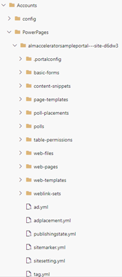

# Configuring and using the ALM accelerator for Power Pages

ALM Accelerator components enable makers to apply source-control strategies with Azure DevOps and use automated builds and deployment of solutions to their environments without the need for manual intervention by the maker, administrator, developer, or tester. In addition, the ALM accelerator helps makers work without intimate knowledge of downstream technologies and switch quickly from developing solutions to source-controlling the solution and, ultimately, pushing their apps to other environments with as few interruptions to their work as possible.

With the ALM Accelerator, you can source control your Power Pages websites, transport them to downstream environments, and include them during solution commit.

## Prerequisites for Power Pages website ALM

- An active website created using [Power Pages](/power-pages/introduction).
- [ALM Accelerator for Power Platform app](overview.md)

## Include the website during solution commit

Follow these steps to include Power Pages website during solution commit:

1. During the solution commit, on the **COMMIT SOLUTION** pane, enable **Include Power Pages**.
1. Select the website from the **Website** list and select **COMMIT SOLUTION**.

   :::image type="content" source="media/setup-almacceleratorpowerplatform/IncludingPortalWebsite-solution-commit.png" alt-text="Include Power Apps portal or Power Pages website":::

1. After the commit is successful, a folder with downloaded website contents with convention "Solution_name\PowerPages\Site_Name" gets created under the Repository branch.

   

## Upload the changes using deployment profile

When working with multiple different environments, you may consider using deployment profiles to ensure the changes are uploaded to the correct environment using deployment profiles.

There are two ways you can provide deployment profile(s) in ALM Accelerator.

### Upload deployment profiles from the Deployment Settings of ALM Accelerator

From the ALM Accelerator application, open the **Deployment Settings** of a solution and upload the deployment profile file for each environment.

:::image type="content" source="media/setup-almacceleratorpowerplatform/upload-deployment-profile-yml-files.png" alt-text="Upload the deployment profile.":::

### Add deployment profiles manually to the solution branch

Follow these steps to use deployment profiles, along with the Power Pages website, in the ALM Accelerator:

1. After committing the solution by including Power Pages website, open the solution branch.
1. Create a folder named **deployment-profiles**, under **PowerPages** folder > **Website** folder.
1. In the **deployment-profiles** folder, create a deployment YAML file that contains environment-specific changes. The deployment YAML filename must start with your [Environment] name. For example, a development environment can be called "dev.deployment.yml" and a validation environment can be called "validation.deployment.yml".

   :::image type="content" source="media/setup-almacceleratorpowerplatform/deployment-profile-yml-files.png" alt-text="Power Pages website deployment profiles":::

Go to [Portal CLI documentation](../../developer/cli/reference/paportal.md) on the usage and preparation of deployment profiles.

When the **deployment-profiles** folder is present in your repository, the ALM Accelerator automatically checks for the deployment YAML file starting with the environment name during deployment.

## Upload website to downstream environments

No other steps are required to upload Power Pages website to downstream environments. Use the [ALM Accelerator for Power Platform app](overview.md) **DEPLOY SOLUTION** option to upload the website to your downstream environments.

## Complete website setup post deployment

Follow these steps to update the website record once the website has been deployed to your downstream environments:

1. Open [Power Platform admin center](https://admin.powerplatform.microsoft.com).
1. Select the downstream environment, and under **Resources**, select **Power Pages sites**.
1. You are redirected to **Power Pages sites** page. Select the website and select **Manage**.
1. Under the **Site Details** section, select **Edit**.
1. From **Website Record** list, select the website that got transported from your maker/ or dev environment, and select **Save**.

   :::image type="content" source="media/setup-almacceleratorpowerplatform/Portal-Update-Bindings.png" alt-text="Power Pages website update website":::

## Be aware of configuration cache

If your changes aren't reflected on the website post deployment, you'll need to clear the configuration cache. There are multiple options to clear the configuration cache.

### Restart the portal in the Power Apps portal admin center

If you're an administrator, this is the easiest option.

1. Open **[Power Apps portals admin center](/power-apps/maker/portals/overview)**.
1. Navigate to **Portal Actions** > **Restart**.

### Service page for site administrator users

This requires more setup and planning but is the safest option.

1. Authenticate to the site and assign the resulting contact record the Administrator Web Role. Navigate to the Site URL + **/_services/about** in your web browser where you can select the **Clear cache** button.

   :::image type="content" source="media/setup-almacceleratorpowerplatform/Portal-Clear-Cache.png" alt-text="Power Apps portal or Power Pages website clear cache":::

1. Refresh the website in your browser to see the changes.
