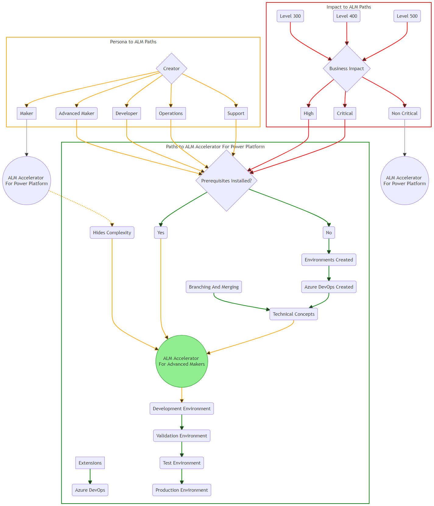

# CoE ALM Maturity model

The [Power CAT adoption maturity model](../../adoption/maturity-model.md) provides a set of levels and capabilities that can be used to evaluate usage of the application lifecycle management (ALM) and how the ALM Accelerator for Power Platform can assist.

## Quick start

The ALM Accelerator is a good match when you verify whether the following apply:

1. What is the impact of the solution?
   - Are the applications classified as critical or high [business impact](#business-impact)?
   - Who is using the application?
      - Is this a productivity application used by everyone in your organization?
      - Is it used by senior leadership to make business impact decisions?
      - Is it integrated with external users, for example, partners and customers who rely on the solution as part of an external process?
   - Are there specific compliance and auditing needs?
      - How important is tracking and auditing who is using the application?
      - Is there compliance and auditing requirements of the solution?

1. Do you have the prerequisites in place?
   - Do you have a defined environment strategy for development, validation, test, and production?
   - Do you use Azure DevOps or can you integrate with Azure DevOps for source control and build pipelines?
   - Do you have license prerequisites in place?
     - Do you have Basic or above Azure DevOps licenses for makers?
     - Per App or Per User Power Apps licenses to access the ALM Accelerator maker solution?

1. Are you looking to move to Level 300 - Defined or beyond?

1. Administration
    - Do you have an environment strategy in place?
    - What is the request strategy for environments?
      - Do you have a process to create development, test, and production environments?
      - Is the process automated to request environments?

1. Are source control concepts understood?
    - Is [branching and merging](/azure/devops/repos/git/git-branching-guidance) understood?
    - Are [pull requests](/azure/devops/repos/git/git-branching-guidance?#review-and-merge-code-with-pull-requests) used to review and merge changes?
    - Are [build pipelines](/azure/devops/pipelines/get-started/key-pipelines-concepts) used to integrate and deploy between validation, test, and production environments?

1. Are [fusion development](/learn/paths/transform-business-applications-with-fusion-development/) teams engaged to include low code and pro-code teams?

1. Are your professional development teams familiar with branching and merging strategies and able to assist makers?

1. Do your pro code and operations teams manage Azure Pipelines?

1. Are you a pro-code team creating components in JavaScript?

1. Are you integrating with OpenAPI enabled Web APIs?

1. Are you using or planning to creating [plugins](/powerapps/developer/data-platform/plug-ins) to extend business process in Microsoft Dataverse?

1. Support
   - Who is supporting the application and solution?
   - Do you have formal support team to manage issues for the solution?

## Addressing gaps

Where some gaps exist from the leading questions, consider what proactive training and or workshops can help grow the maturity of people, process, and technology to assist them in moving toward advanced maker integration inside your organization.

## Leading questions

### Alignment

The following questions may help with qualifying alignment:

1. Is innovation driven by business areas, such as a bottom up strategy?

1. Is there a common vision between IT and business?

1. Is there a dedicated Power Platform product owner?

1. Is there an established [Center of Excellence team](../../adoption/coe.md)?

1. Is Power Platform a key part of the digital transformation strategy?

### Impact

The following questions may help with qualifying impact:

1. Is the Power Platform targeting low complexity scenarios?

1. Is there limited reuse of common components and services?

1. Do applications allow bottom up and top down innovation?

1. Do applications focus on increased delivery efficiency, supporting rapidly changing business needs?

1. Are there organization-wide initiatives to deliver large-scale integrated apps?

### Strategy

The following questions may help with qualifying strategy:

1. Is the Power Platform strategy defined?

1. Is there a demand management process in place?

1. Is there a defined understanding of Power Platform's role in your organization’s IT portfolio?

1. Are business plans shared across departments?

1. Is vision and strategy understood by all?

1. Do enterprise architecture decisions include Power Platform capabilities?

### Business value

Evaluate the business value looking at:

### Business strategy viability

Leading questions to consider:

1. What business outcomes will this solution realize?

1. What is the expected time frame?

1. What do you do well today?

1. What do you want to do today better?

1. What thing do you want to do differently?

## Technological viability

Leading questions to consider:

1. What are manual steps vs automated steps?

1. How measurable are the qualitative and quantitative outcomes?

1. What is the dashboard and report capability to allow stakeholders to visualize and drill into and tack action on data?

1. How available are analytics?

1. On what frequency are analytics updated?

1. How frequently are changes required?

1. What is the technical debt that needs to be accounted for?

1. What are the security implications?

## Financial viability

Leading questions to consider:

1. What is the economic value added?

1. Does this address current market model or is a new model being developed?

1. What is the time horizon for implementation?

1. What investment model is required?

## Business impact

### Critical

Production, operations, or deployment deadlines will be severely affected, or there will be a severe impact on production or profitability. Multiple users or services are affected.

Initial response time less than 60 minutes with 24x7 access.

Issues demand an immediate response and require 24x7 operation, every day.

### High

The system has moderate business impact and can be dealt with during business hours. The expected usage could be by multiple users, single users, or customers.

Initial response time one hour, four hours, or next day, business hours access with 24x7 available support.

### Non-critical

The system has minimal business impact. The issue is important but does not have a significant current service or productivity impact. Acceptable workarounds will be considered.

Initial response time four to eight hours or greater with business hours access and support. (For example, 9:00AM - 5:00PM.)

#### Administration and governance

Leading questions to consider:

1. Who can create environments?

1. What [data loss prevention (DLP)](../../../admin/wp-data-loss-prevention.md) policies are in place?

1. [Power Platform Service Admin](../../../admin/overview-role-powerapps-admin.md) roles exist to administer Power Platform tenants and environments?

1. Are tenants/environments isolated from each other?

1. Is there monitoring in place?
   - Has the [CoE Starter Kit – Core](../../coe/core-components.md) been installed?
   - Does [license, capacity, and consumption monitoring](../../adoption/capacity-and-licenses.md) inform decision making?
   - Has the [CoE Starter Kit – Governance Module](../../coe/governance-components.md) been adopted to gain compliance insights and archive resources?
   - Does telemetry help identify business-critical apps and makers?

1. Are custom environments used for specific use cases and ALM scenarios?

### Support

Leading questions to consider:

1. Are apps created by makers supported by a help desk or dedicated team?

1. Has application and solution risk profile been defined detailing what level of support will be received?

1. Is there an ongoing continuous improvement plan for the application?

1. Are there clearly defined roles and responsibilities for the solution?

1. Do the roles and responsibilities include ownership to build and operate the solution?

#### Nurture citizen developers (makers)

Leading questions to consider:

1. Do you have a [training and upskilling](../../adoption/training-strategy.md) program for your makers to help them learn key concepts to grow your pool of makers?

1. Do you have an internal [champions](../../adoption/champions.md) community established?

1. Do you have the [CoE Starter Kit – Nurture](../../coe/nurture-components.md) module adopted?

1. Do you have show and tell sessions to demonstrate advanced maker concepts?

1. Do you have an adoption campaign to demonstrate how fusion development processes work?

1. Do you have a career path option for makers?

1. Have you built a community of mentors to share advanced maker concepts and best practices?

1. Do you have a common development strategy and goals for citizen and professional developers?

### Automation

1. Do you have environment and DLP connector policy requests that are automated?

1. Do you have communication about processes and compliance between admin and makers? Is this process automated?

### Fusion teams

1. Do you have [standard libraries, custom connectors, and components](../../adoption/reusable.md) to be consumed by makers?

1. Do you have the need for fusion teams to manage source control and app lifecycle? For example, build, verification, test, and production.

1. Do you have cross-functional teams that plan and execute work jointly, including makers, testers, and operational teams?

1. Do you have a common development strategy and goals for citizen and pro developers needed for new projects?

[!INCLUDE[footer-include](../../../includes/footer-banner.md)]
