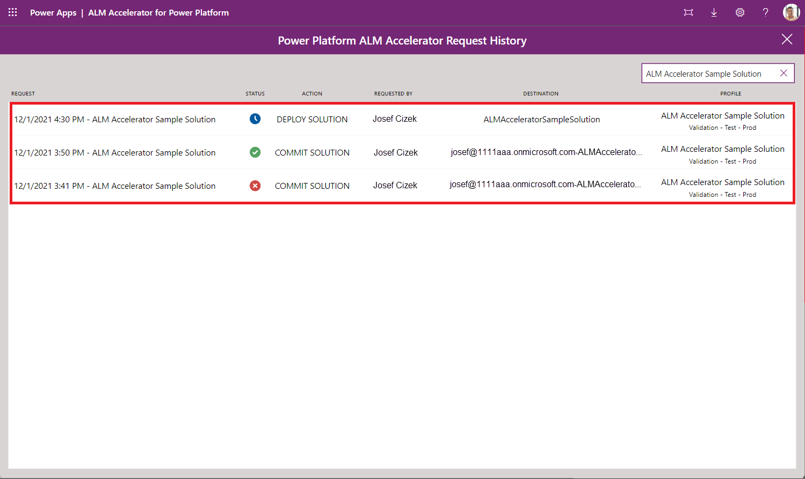

# ALM Accelerator for Power Platform new maker experience

## Demo: The ALM Accelerator for Power Platform app new maker experience

Watch how to use the ALM Accelerator for Power Platform app.
[Demo Videos](https://github.com/microsoft/coe-starter-kit/blob/main/CenterofExcellenceALMAccelerator/WALKTHROUGHS.md)

## Configuration of the ALM accelerator new maker user settings

In the following table you can see how the **User Functions** are configured for the **maker** user settings.

| Field        | Value     | Description |
|--------------|-----------|------------|
| Import Solutions | Not Allowed  | Setting this to Not Allowed hides the **Import Solution** command in the app.|
| Delete Solutions | Not Allowed  | Setting this to Not Allowed hides the **Delete Solution** command in the app.|
| Manage Solutions | Allowed  | This function shows the **Manage Solutions** command in the app.|
| Drillthrough Status | Not Allowed  | Setting this to Not Allowed disables the click through capability to drill into the Azure DevOps pipeline runs for the promote and deploy functionality.|
| Profile Creation | Not Allowed  | Setting this to Not Allowed disables the capability to create new deployment profiles in the app.|
| Profile Updates | Not Allowed  | Setting this to Not Allowed disables the capability to update deployment profiles in the app. This setting will also block the user to create new profiles in the app.  |
| Advanced Promote | Not Allowed  | Setting this to Not Allowed disables the capability to use the advanced promote functionality. Changes will be committed to the default branch for the user|
| Advanced Deploy | Not Allowed  | Setting this to Not Allowed disables the capability use the advanced deploy functionality. Use can select between target environments that are enabled for deployment|
| Bypass Prepare | Not Allowed  | Setting this to Not Allowed will force the user to go through the prepare step during the promotion of a solution.|
| Show All Solutions | Not Allowed  |  Setting this to Not Allowed will only show solutions for which the user has a deployment profile in the user settings. |

The below table shows how the **User Labels** are configured for the **maker** user settings

| Field        | Value     | Description |
|--------------|-----------|------------|
| Deploy Solution | - | Setting the value to blank will use the default label. Default label is **DEPLOY SOLUTION**.|
| Commit Solution | Save Solution  | The commit solution button will be labeled **SAVE SOLUTION**.|
| Import Solution | - | Setting the value to blank will use the default label. Default label is **IMPORT SOLUTION**. This button is hidden due to the configuration above|
| Delete Solution |-  | Setting the value to blank will use the default label. Default label is **DELETE SOLUTION**. This button is hidden due to the configuration above|

## Walk-through: The ALM Accelerator for Power Platform app new maker experience

> [!IMPORTANT]
> The following user experience has been configured with the Power Platform ALM Accelerator Administration app, which is installed with the ALM Accelerator. For information about how to use the administration app and configure and share experiences, see [Creating user settings and profiles](setup-deployment-user-profiles.md).

1. After you've installed and configured the app, open it from your environment by selecting **Apps** > **ALM Accelerator for Power Platform**.

1. When prompted to create connections and grant consent, create the necessary connections or accept the consent dialog.

1. If prompted to create an HTTP with Azure AD connection, enter `https://graph.microsoft.com` for both the **Base Resource URL** and **Azure AD Resource URI**.

1. Select **Create** for each connection when prompted.

1. The first time you open the app, a dialog opens and you're asked to select an environment. Next time you open the app, it remembers which environment you were working on.

1. After the environment is selected, the main screen displays a list of all the unmanaged solutions in the environment. You can refresh the list by selecting **Refresh** if you don't see new solutions you've created:

    - **Save Solution**: Saves the current state of the solution into version control so all changes done to the solution can be tracked. Additionally, the save will create your deployment pipelines in Azure DevOps as part of the save process.
    - **Publish Solution**: Allows you to request to move the solution across environments.
    - **Choose a Profile**: Allows you to select a **Solution profile** to associate a solution to a **Repository** in a given **Organization** and **Project**. If you're unsure what profile to select, ask your administrator to provide the name of the solution profile for your solution.
    - **Request History** (**>**): Provides a list of requests (saves and deployments) done for that solution.

1. Choose a **Solution Profile** for the solution so you can associate it to a specific repository in a given organization and project in Azure DevOps. This selection will determine which environments you can deploy the solution into:

   1. Select **Choose a Profile** for your solution in the solution list.
   1. In the **Solution Profile** dialog, select a **Profile**, and then select **Save**.

    > [!NOTE]
    > If you don't find a solution profile that suits your needs, contact an administrator to get it created.

1. Configure the deployment setting by selecting the **Configure Deployment Settings** link under the name of the solution. On the configuration deployment page, you'll see the following items:

   - **Deployment Environment List** (for example, validation, test, and production)

     These environments are the ones specified in the **Solution Profile**. They correspond with the environments in which your solution will be available after you publish.

   - **Connection References**

      :::image type="content" source="media/aa4pp-deployment-settings-connection-references.png" alt-text="Connection Reference configuration":::

      This screen lists all of the connection references in your solution and allows users to create connections in their downstream environments to hook up the connection references in the target environment.

      - If you have permissions to create connections in the target environment, the **+** button is displayed.
         - To create a new connection, select **+**.
         After creating a new connection, select **Refresh** in the upper-right corner to get the latest list of connections.
         - To select an existing connection in the target environment, select a connection from the dropdown list.
         - To open the connection in the target environment, select the name or the status of the connection.

      - If you don't have permission to create connections in the target environment, the **+** button will be disabled and you'll have to request a connection be created by another user.
         1. Select **Request a Connection**.
         1. Enter the name of the team member you need to create the connection, and select the user.
         1. To open the preformatted email, select **Send**.
         The preformatted email includes a link for the recipient to create the required connection.

   - **Environment Variables**

      :::image type="content" source="media/aa4pp-deployment-settings-environment-vars.png" alt-text="Environment Variables configuration.":::

      This screen lists all of the environment variables in your solution and allows users to set the value of the environment variables in the downstream environment.
      - For standard environment variables, such as string, number, or JSON, enter the value in the text box to the right of the environment variable name.
      - For data source environment variables, select the appropriate data source from the dropdown lists to use in the downstream environment.

   - **Canvas Apps**

      :::image type="content" source="media/aa4pp-deployment-settings-app-sharing.png" alt-text="App Sharing configuration.":::

      This screen lists all of the apps in your solution and allows users to share the apps in the downstream environment with an Azure AD Group.
      - Use  the dropdown list to select the Azure AD group with which you'd like to share the app.
      - To view the group details, select **Details**. This button opens a new browser tab with a link to the Azure AD group in the Azure portal.
      - To set the permissions, select the permissions dropdown list and set the permissions to either **Can View**, **Can Edit**, or **Can View and Share**.

   - **Group Teams**

      :::image type="content" source="media/aa4pp-deployment-settings-group-teams.png" alt-text="Group Teams configuration":::

      - This screen allows the user to configure new Dataverse Teams of type AAD Security Group that can be used for sharing Flows and Custom Connectors
      - Click the **'+'** icon to add a new Group Team configuration
      - Enter a **Team Name**, select an **AAD Group** that the team should be linked to and select **Security Roles** as required. The list of security roles is based on those available in the currently selected development environment. Make sure to add any custom security roles to the solution to ensure the security roles are available in the target environment.
      - Users can add multiple Group Team configurations by clicking the **'+'** to add additional rows

   - **Flows**

      :::image type="content" source="media/aa4pp-deployment-settings-flows.png" alt-text="Deployment settings flows.":::

      - This screen lists all of the flows in your solution. Users can configure the owner of the flow, Dataverse Team sharing of the flow, the user with which to activate the flow, whether a flow should be activated or not, and, the sequence of flow activation in the downstream environment.
      - To view the flow, select the name of the flow to open a new tab with the flow definition.
      - Use the **Owner** dropdown list to select a Dataverse user to own the flow in the downstream environment.
      - Use the **Team Sharing** dropdown list to select the Dataverse Team to share the flow to. Note, this dropdown will list Dataverse Teams in the downstream environment and Dataverse teams configured in the Group Teams configuration.
      - Use the **Activation User** dropdown list to select the user that will be used to activate the flow
      - In the **Flows to Activate and Order** column, the checkbox can be used to configure whether a specific flow should be activated or not. The up and down arrows can be used to organize the rows into the desired sequence in which the flows will be activated. The sequencing of activation is particularly useful if the solution includes parent and child flows where child flows must be activated before parent flows.

   - **Custom Connectors**

      :::image type="content" source="media/aa4pp-deployment-settings-custom-connectors.png" alt-text="Deployment settings custom connectors.":::

      - This screen lists all the custom connectors in the solution. Users can configure sharing of customer connectors to Dataverse Teams in the downstream environment
      - Use the **Sharing** dropdown list to select the Dataverse Team to share the custom connector to. Note, this dropdown will list Dataverse Teams in the downstream environment and Dataverse teams configured in the Group Teams configuration.

1. After you select the **Solution Profile** and configure the **Deployment Settings**, push your changes to Git by selecting **Save Solution**. In the background, the app pushes your change to version control, automatically creating a branch. Repeat the pushes as you make changes to your solution so your change history is kept.

    Be sure to publish any app changes before initiating the saving of the solution. During this step you'll be asked to configure the deployment settings, which will require the same information as detailed in the previous step.

    > [!NOTE]
    > When the publishing begins, a waiting indicator appears. When the push is successful, a checkbox appears; otherwise, a red X appears.

1. Use **Deploy Solution** to publish your solution to other environments. Provide a **Title** and **Notes**. This information is added to the pull request created in Azure DevOps. Select the **Environment** you want to deploy the solution into.

1. Depending on the **Solution Profile** configuration, the application either creates a pull request that needs to be completed in Azure DevOps or triggers a pipeline that someone must approve before it can run and complete the publishing. You'll see the progress indicator state that the deployment has started. You can also use the right angle bracket (**>**) to visualize the request history.

      

[!INCLUDE[footer-include](../../includes/footer-banner.md)]
