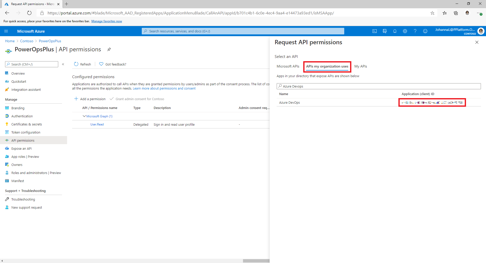
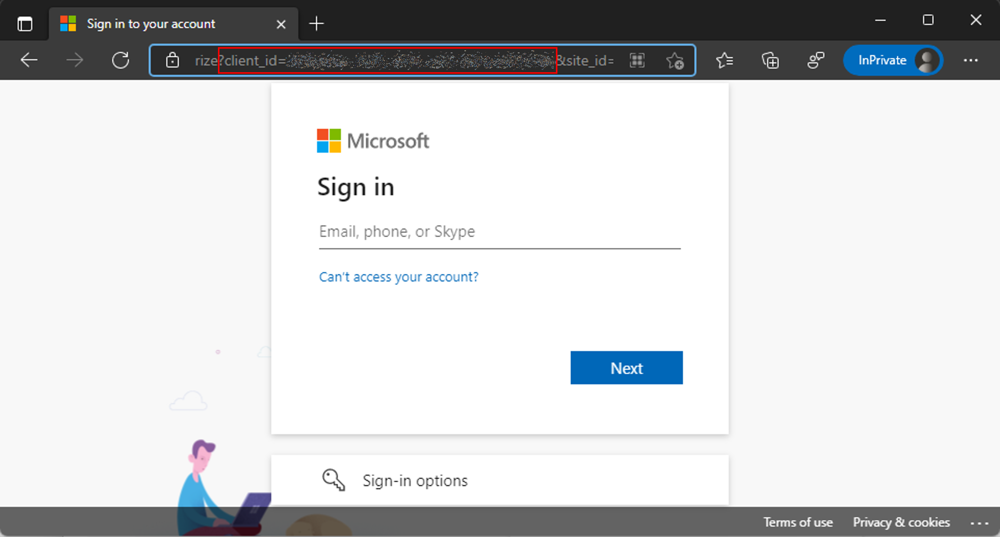
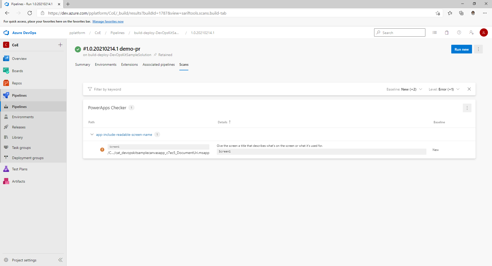
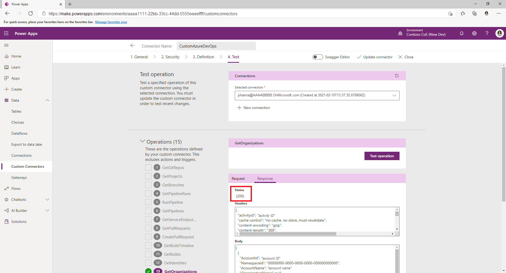

# Set up ALM accelerator for Microsoft Power Platform

The ALM Accelerator for Microsoft Power Platform components enable makers to apply source-control strategies with Azure DevOps, and use automated builds and deployment of solutions to their environments without the need for manual intervention by the maker, administrator, developer, or tester. In addition, the ALM accelerator helps makers work without intimate knowledge of the downstream technologies and be able to switch quickly from developing solutions to source-controlling the solution and, ultimately, pushing their apps to other environments with as few interruptions to their work as possible.

The ALM accelerator doesn't have a dependency on other components of the CoE Starter Kit. It can be used independently.

## Document structure

This setup guide is structured into seven main sections:

- [**Prerequisites**](#prerequisites): Considerations and requirements to complete the setup.
- [**Azure AD App Registration setup**](#azure-ad-app-registration-setup): This section walks through the base setup of the ALM accelerator for Microsoft Power Platform. The base setup consists of the steps and configurations required.
- [**Installing Azure DevOps extensions**](#install-azure-devops-extensions): This section list the required Azure DevOps extensions and how to install them.
- [**Importing the solution and configuring the app**](#importing-the-solution-and-configuring-the-app): These are the steps required to import the actual ALM Accelerator for Power Platform canvas app and configure the included custom connector.
- [**Set up your first Azure DevOps project for use with ALM Accelerator for Power Platform**](#set-up-your-first-azure-devops-project-for-use-with-alm-accelerator-for-power-platform): Walk through of using the Azure DevOps Projects Wizard to create and configure an Azure DevOps project to be used with ALM Accelerator for Power Platform.
- [**Set up makers to use the ALM Accelerator for Power Platform app**](#set-up-makers-to-use-the-alm-accelerator-for-power-platform-app): A short introduction to using the ALM Accelerator for Power Platform canvas app.

## Prerequisites

### Dataverse environments

The ALM accelerator for Microsoft Power Platform must be installed into a Power Platform environment with a Microsoft Dataverse database. From this environment, the ALM Accelerator for Power Platform app can be used to deploy solutions from development to validation to testing to production. All of these environments will also require a Dataverse database to deploy your solutions.

> [!NOTE]
> Currently, the ALM accelerator isn't compatible with Dataverse for Teams. Both the ALM Accelerator for Power Platform app and the associated Azure DevOps pipelines assume that the full version of Dataverse is being used in all environments.
You'll need to create an environment in which to set up the ALM accelerator for Microsoft Power Platform. We recommend that you install the accelerator in the same environment as other CoE Starter Kit solutions. For more information about how to decide on the best strategy for your organization, go to [Establishing an environment strategy for Microsoft Power Platform](../adoption/environment-strategy.md) and [Environment strategy for ALM](../../alm/environment-strategy-alm.md).

### Azure DevOps organization

The ALM accelerator uses Azure DevOps for source control and deployments (pipelines). You can sign up for Azure DevOps for free for up to five users on the [Azure DevOps](https://azure.microsoft.com/services/DevOps/) site.

### Users and permissions

To complete the steps in this section, you need the following users and permissions in Microsoft Power Platform, Azure DevOps, and Azure:

- A licensed Azure user with permissions to create and view Azure AD groups, create app registrations, and grant admin consent to app registrations in Azure AD.
- A licensed Azure DevOps user with permissions to create and manage pipelines, service connections, repos, and extensions.
- A licensed Microsoft Power Platform user with permissions to create application users and grant administrative permissions to the application user.

### Connectors and data loss prevention policy

For the ALM Accelerator for Power Platform canvas app to work, the following connectors must be available to be used together in the environment into which the ALM accelerator is imported:

- [Dataverse (legacy)](/connectors/commondataservice/)
- HTTP
- [Power Apps for Makers](/connectors/powerappsforappmakers/)
- [HTTP with Azure AD](/connectors/webcontents/) (with endpoint access to <https://graph.microsoft.com>)
- ALM Accelerator Custom DevOps (this connector is created as part of the [accelerator solution import](#importing-the-solution-and-configuring-the-app))
- [Office 365 Users](/connectors/office365users/)
- HTTP

### Creator Kit

The ALM Accelerator includes features that required the installation of the **Creator Kit** in the environment where you install ALM Accelerator for Power Platform.

To install the **Creator Kit** follow steps described here: [Install Creator Kit](/power-platform/guidance/creator-kit/setup)

## Azure AD App Registration setup

The following steps guide you through setting up the Azure Active Directory App Registration for use with the ALM Accelerator for Power Platform. These steps are general to the functionality of the ALM accelerator, and aren't project-specific or solution-specific.

### Create an app registration in your Azure AD environment

Creating an app registration for the ALM accelerator is a one-time setup step to grant permissions to the app and the associated pipelines, permissions required to perform operations in Azure DevOps and Power Apps or Dataverse. The following steps show how to create a single app registration with permissions for both Dataverse and Azure DevOps. However, you might want to separate responsibilities specifically into Dataverse and Azure DevOps by creating separate app registrations.

> [!NOTE]
> When separating the responsibilities of Azure App registration you should consider both maintenance and security aspect. Read the [Considerations for App Registrations](app-registration-strategy.md) page to understand more.

1. Sign in to the [Azure portal](https://portal.azure.com).

2. Go to **Azure Active Directory** > **App registrations**.

3. Select **New registration**, and then give the registration a name, such as **ALMAcceleratorServicePrincipal**. Leave all other options as default, and then select **Register**.

4. Select **API permissions** > **+ Add a permission**.

5. Select **Dynamics CRM**, and configure permissions as follows:

    - Select **Delegated permissions**.
    - Select **user_impersonation**.

6. Select **Add permissions**.

7. Repeat the preceding steps for the following permissions:
    - **PowerApps-Advisor (Analysis All)**. This is required for running static analysis via the [app checker](../../alm/checker-api/overview.md). This permission can be found under **APIs my organization uses**.

    - **DevOps**. This is required for connecting to Azure DevOps via the custom connector in the ALM accelerator app. This permission can either be found under Microsoft APIs or under **APIs my organization uses**.

      If adding the Azure DevOps permissions from the APIs my organization uses list, you should copy the **Application (client) ID** for later use.

        > [!IMPORTANT]
        > You'll use this value later and specifically call it out as the **DevOps Application (client) ID**, which is different from the **Application (client) ID** you'll copy in step 12 of this procedure.
      

      If you can't find the Azure DevOps permissions in the **APIs my organization uses** you can get the **DevOps Application (client) ID** by following these steps:

      1. Open a private browser session and go to `https://dev.azure.com/[your devops organization]/_apis`
      2. After being redirected to the sign-in page, copy the value of the **client_id** parameter in the url on the sign-in page

      

8. After adding permissions in your app registration, select **Grant Admin consent for (your tenant)**.

9. Select **Certificates & Secrets**, and then select **New client secret**.

10. Set the **Expiration**, and then select **Add**.

11. After adding the secret, copy the value and store it for safekeeping to be used later.

12. Return to the **Overview** section of your app registration, and copy the **Application (client) ID** and **Directory (tenant) ID**.

     > [!IMPORTANT]
     > You'll use this value later and call it out as the **Application (client) ID**, which is different from the **DevOps Application (client) ID** you copied earlier in step 7.
13. Select **Add a Redirect URI** > **Add a Platform** > **Web**.

14. Set the **Redirect URI** to `https://global.consent.azure-apim.net/redirect`.

    > [!NOTE]
    > You might need to update this later when configuring your custom connector after you've installed the app, if this URL is different from the **Redirect URI** populated in the custom connector.
15. Select **Configure**.

### Give Power App Management Permission to your App

In order for the pipelines to perform certain actions against the environments (for example, Sharing Apps and setting component ownership) in your Power Platform tenant you'll need to grant Power App Management permissions to your App registration. To do so, you'll need to run the following PowerShell cmdlet as an interactive user that has Power Apps administrative privileges. You'll need to run this command once, using an interactive user, in PowerShell after your app registration has been created. The command gives permissions to the Service Principal to be able to execute environment related functions including querying for environments and connections via [Microsoft.PowerApps.Administration.PowerShell](/powershell/module/microsoft.powerapps.administration.powershell/new-powerappmanagementapp). Learn more: [**New-PowerAppManagementApp** cmdlet](/powershell/module/microsoft.powerapps.administration.powershell/new-powerappmanagementapp)

> [!IMPORTANT]
> Currently this cmdlet gives elevated permissions (for example, Power Platform Admin) to the app registration. Your organization's security policies may not allow for these types of permissions. Ensure that these permissions are allowed before continuing. In the case that these elevated permissions are not allowed certain capabilities won't work in the AA4PP pipelines.

```powershell
Install-Module -Name Microsoft.PowerApps.Administration.PowerShell
Install-Module -Name Microsoft.PowerApps.PowerShell -AllowClobber
New-PowerAppManagementApp -ApplicationId [the Application (client) ID you copied when creating your app registration]
```

### Install Azure DevOps extensions

The ALM accelerator uses several Azure DevOps extensions, including some third-party extensions that are available in the Azure DevOps marketplace. Under **Organization settings** in Azure DevOps, install the extensions described in the following procedure. For more information about Azure DevOps extensions from Microsoft and others, go to [Evaluate a Marketplace extension publisher](/azure/devops/marketplace/trust). In addition, each of the third-party extension's webpages and the link to their source code are provided in the following list.

1. Go to <https://dev.azure.com>, and select **Organization settings**.

1. Select **General** > **Extension**.

1. Install the following extensions:

   - **Power Platform Build Tools (required)**: This extension contains the Microsoft build tasks for Microsoft Power Platform. (<https://marketplace.visualstudio.com/items?itemName=microsoft-IsvExpTools.PowerPlatform-BuildTools>)

   - **Replace Tokens (required)**: This extension is used by the pipelines to replace tokens in configuration files to be able to store secure values in private variables configured for a pipeline. (<https://marketplace.visualstudio.com/items?itemName=qetza.replacetokens> | <https://github.com/qetza/vsts-replacetokens-task>)

   - **SARIF SAST Scans Tab (optional)**: This extension can be used to visualize the SARIF files that are generated by the Solution Checker during a build. ([SARIF SAST Scans Tab - Visual Studio Marketplace](https://marketplace.visualstudio.com/items?itemName=sariftools.scans))

      

## Importing the solution and configuring the app

### Install the ALM accelerator in Dataverse

1. Download the latest managed solution file from [GitHub](https://github.com/microsoft/coe-starter-kit/releases): CenterofExcellenceALMAccelerator_`[latest version]`_managed.zip.

1. Go to [Power Apps](https://make.powerapps.com) and select the environment you want to use to host the ALM Accelerator for Power Platform app.

1. On the left pane, select **Solutions**.

1. Select **Import**, and browse to the location of the managed solution you downloaded.

1. Select **Next**, and then select **Next** again.

1. On the **Connections** page, select or create a new connection to use to connect to Dataverse for the **CDS DevOps connection**.

    > [!NOTE]
    > When creating a connection for **HTTP with Azure AD**, use **[Microsoft Graph](https://graph.microsoft.com)** for both parameters.
1. Select **Import**, and wait for the solution to complete the import process.

### Configure the DevOps custom connector

1. In [Power Apps](https://make.powerapps.com), select your environment, and then select **Data** > **Custom Connectors** > **CustomAzureDevOps**.

1. Select **Edit**, go to the **Security** section, select **Edit**, and then set the following fields.

   | Name | Value |
   |--|--|
   | **Authentication Type** | **OAuth 2.0** |
   | **Identity provider** | **Azure Active Directory** |
   | **Client ID** | The **Application (client) ID** you copied when [creating the app registration](#create-an-app-registration-in-your-azure-ad-environment) |
   | **Client secret** | The **Application (client) Secret** you copied when [creating the app registration](#create-an-app-registration-in-your-azure-ad-environment) |
   | **Tenant ID** | Leave as the default, **common** |
   | **Resource URL** | The **DevOps Application (client) ID** you copied when [adding permissions to your app registration](#create-an-app-registration-in-your-azure-ad-environment) |

1. Select **Update connector**.

1. Verify that the **Redirect URL** is populated on the **Security** page with the URL `https://global.consent.azure-apim.net/redirect`. If the redirect URL is other than `https://global.consent.azure-apim.net/redirect`, copy the URL and [return to the app registration your created](#create-an-app-registration-in-your-azure-ad-environment) and update the redirect URI you set earlier to the updated URL.

1. After you've completed the preceding steps, verify the connector from the **Test** menu:

    1. Open the **Test** menu.

    1. Select **New Connection**, and then follow the prompts to create a new connection.

    1. In [Power Apps](https://make.powerapps.com), select your environment, and then select **Dataverse** > **Custom Connectors** > **CustomAzureDevOps**.

    1. Select **Edit**, go to the **Test** section, and then find the **GetOrganizations** operation.

    1. Select **Test operation**, and verify that the **Response Status** returned is **200** and that the **Response Body** is json representation of your Azure DevOps organization.

    

## Set up your first Azure DevOps project for use with ALM Accelerator for Power Platform

The ALM Accelerator for Power Platform includes a guided wizard to help you set up your Azure DevOps project to support deployment of Power Platform solutions via ALM Accelerator for Power Platform.

To set up a new project for use with ALM Accelerator for Power Platform, follow these steps:

1. Open the **ALM Accelerator for Power Platform Administration** app.
1. select **Projects** in the Azure DevOps group in the left side navigation.
1. If prompted to update **Release Tags**, select **Okay**. The app downloads the available release tags from the ALM Accelerator Github repository.
1. Select an Azure DevOps organization in the **Organization** drop-down.
1. In the **Projects List**, select **New** and select **Project Wizard**
1. In the **Project** step, enter the name of your project, a description (optional), enable preview features (optional), and select **Next**. Alternatively you can select to configure an existing empty project.
1. In the **Pipeline Templates** step, select **Next** to install templates into your new project. The app installs the pipeline templates into a new repository in the Project created in the previous step. Alternatively you can configure the Project to use templates from another project that has the templates installed already
1. In the **Service Connections** steps, select the environments for which you want to create a **Service Connection**. You can select multiple environments and create service connections for all of them at the same time. If you want to use different app registrations for your environments, you need to create a service connection per app registration. Once you've configure **Service Connections** for an app registration, select **Add**. When you've configured all the **Service Connections**, you need select **Next**.
1. In the **Generic Pipelines** step, select **Next**. This creates the required pipelines, variable group, and set the required permissions in ADO for the project to support ALM Accelerator for Power Platform functionality.

## Set up makers to use the ALM Accelerator for Power Platform app

### Create an app user in your Dataverse environments

Each environment (development, validation, test, and production) needs an application user for the pipelines to connect to Dataverse. For each of your environments, follow these steps to set up the application user.

1. Go to [Power Platform admin center](https://aka.ms/ppac).

1. Select your environment, and then select **Settings**.

1. Select **Users + permissions** > **Application users**.

1. Select **New app user** to add a new application user.

1. Select the Azure app registration you created, **Business Unit**, and **Security Role**.

    > [!NOTE]
    > We recommend that you give this user system administrator security role privileges, so the user can perform the required functions in each of the environments.

Repeat the previous steps for each of your environments (development, validation, test, and production).

### Configure user permissions and accounts for a maker

- See [Configuring user permissions](setup-app-user-permissions.md) for the recommended setup of a maker's user account in Dataverse and Azure DevOps.

- See [Configuring deployment user settings and profiles](setup-deployment-user-profiles.md) for how to configure the user experience in the app, and grant access to solutions and deployment profiles.

## Read more

- [Use the ALM Accelerator for Power Platform app](overview.md)
- [Configuring deployment user settings and profiles](setup-deployment-user-profiles.md)
- [Configuration and data deployment in pipelines](setup-data-deployment-configuration.md)
- [Configuring pipeline sync](setup-pipeline-sync.md)

[!INCLUDE[footer-include](../../includes/footer-banner.md)]
