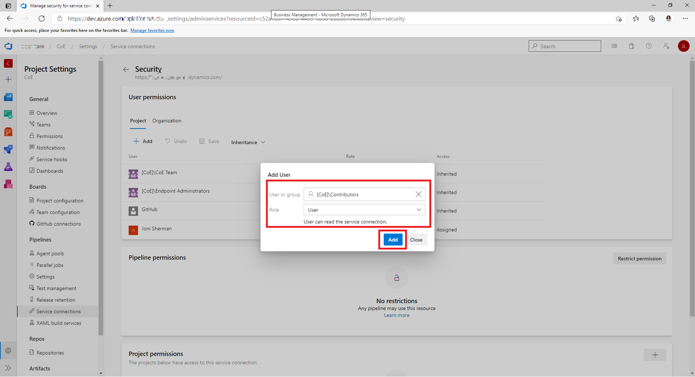

# Configuring the ALM Accelerator for Power Platform app user permissions

The ALM Accelerator for Power Platform app is intended to be used by makers to increase productivity while developing solutions in Power Platform. The following instructions are for setting up a maker's user account in Microsoft Dataverse and Azure DevOps.

## Dataverse user setup

For users to be able to access resources in Dataverse when running the ALM Accelerator for Power Platform app, they need to be assigned the appropriate roles. To assign roles, we recommend that you create a group team in Dataverse to which all of your makers will be added and assign the appropriate roles to the team. Set up a group team as described in the following steps, and you'll be able to manage your makers with Azure Active Directory by adding and removing them from a group.

1. Sign in to the [Power Platform admin center](https://admin.powerplatform.microsoft.com/).

1. Select the environment in which the user exists.

1. In the **Access** section under **Teams**, select **See all**.

1. Select **Create team**.

1. Enter a **Team name**, **Business unit**, and **Administrator**.

1. Select **AAD Security Group** as the **Team type**.

1. Enter and select the name of the **AAD Security Group** that you want to provide access to the ALM Accelerator for Power Platform app.

1. Select members for **Membership type**, and then select **Next**.

1. On the **Manage security roles** page, select the **ALM Power App Access** and **Basic User** roles, and then select **Save**.

> [!TIP]
> Repeat the steps above to create a group team to assign permissions to the ALM Accelerator Admin app and include the **ALM Power App Deployment Configuration** security role as a role on the group team. To learn more about team management, go to [Microsoft Dataverse teams management](/power-platform/admin/manage-teams).

## Azure DevOps user setup

For users to use the service connection from the ALM Accelerator for Power Platform app, the service connections must provide user privileges to all users who need access to the service connections. Update privileges as follows for environments that users need to access from the app (for example, development environments):

1. Go to Azure DevOps.

1. Open your project, and then in the lower-left corner, select **Organization settings** to access project settings.

1. Select **Service connections**, and then select the service connection to be shared with users from the **Service Connections** list.

1. Select **More (...)** in the upper-right corner, and then select **Security**.

1. Select the group or user you want to provide user permissions to in the **User or group** list.

1. Select the **User** for the **Role**, and then select **Add**.

   

Repeat the preceding steps for each of the service connections you want to share.

## Permissions for downstream environments

The AA4PP has different scenarios that need to list the environments. For each scenario, the currently logged-in user will need different roles. To list the environments, the user has access to, the AA4PP uses the "Power Apps for Makers" connector.

> [!NOTE]
> The "Power Apps for Makers" connector will list all environments the user has "Environment Maker" role or is Owner or Co-Owner of an App (can edit any app). When you change the role of a user, in an environment, there is a sync process that might take some time to replicate the changes. To test if the changes has been sync you can create a test Canvas App and call the "Power Apps for Maker" connector and validate the retrieved list of environments.  

The following table lists the permissions needed for each scenario in AA4PP:

| Scenario                    | Dataverse Role    | Description           |
| --------------------------- | ----------------- | --------------------- |
| Select Maker environment    | Environment Maker or permission to edit any app | The logged-in user will be able to list all the environments where can import solutions or list solutions to commit |
| Create a Deployment Profile | Environment Maker or permission to edit any app | The logged-in user will be able to get the list of all environments the solution can be deployed to. In case you only provide the url you might have limited functionality in the "Deployment Settings" regarding "Connections References". |
| Configure the deployment settings | Basic User | If the logged-in user needs to create/list connections, list "Teams" for sharing in "Flows", and list of "Teams" to share in "Custom connector" the user will need a "Basic user" role in the corresponding environment, otherwise no permission is needed |

The deployment process of the solutions to the downstream environment isn't based on the currently logged-in user, the service principle is used by the Azure DevOps pipelines. For more information about different strategies, [follow this link](/power-platform/guidance/coe/almaccelerator-app-registrations).

To see the full overview of the different security roles and the respective permissions,[follow this link](/power-platform/admin/database-security#environments-with-a-dataverse-database).

## Next steps
>
> [!div class="nextstepaction"]
> [Configure ALM Accelerator Pipelines](./configure-azuredevops-pipelines.md)

[!INCLUDE[footer-include](../../includes/footer-banner.md)]
