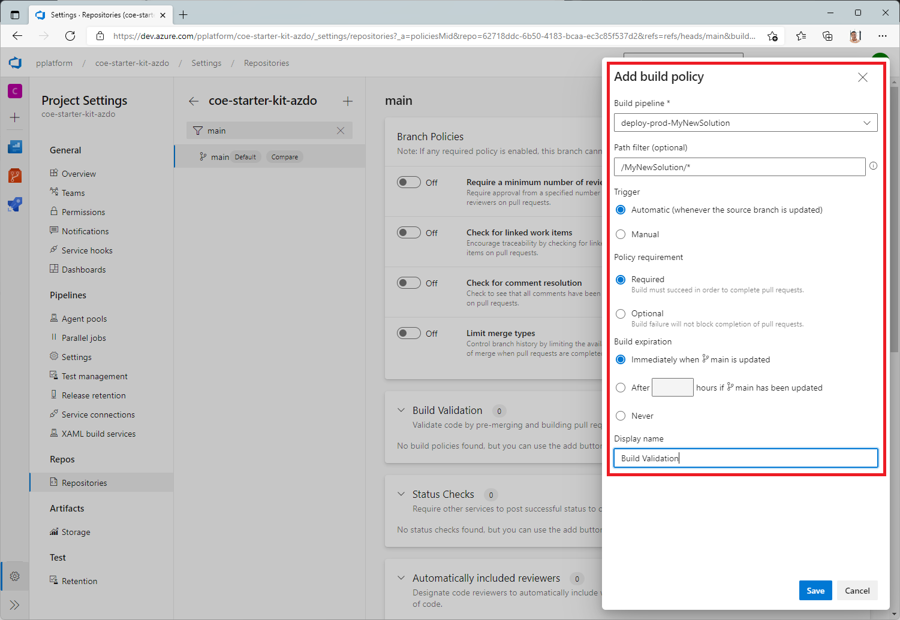

# Configure the ALM Accelerator manually

You can configure the components of the ALM Accelerator for Power Platform either using the accompanying [administration app](setup-admin-tasks.md) or manually. This article guides you through configuring the app manually and is structured in seven sections:

- [**Prerequisites**](#prerequisites)
- [**Foundational setup**](#foundational-setup)
- [**Development project setup**](#development-project-setup)
- [**Solution setup**](#solution-setup)
- [**Importing the solution and configuring the app**](#importing-the-solution-and-configuring-the-app)
- [**Set up makers to use the ALM Accelerator for Power Platform app**](#set-up-makers-to-use-the-alm-accelerator-for-power-platform-app)
<!-- - **Troubleshooting** -- Missing from this article-->

## Prerequisites

Before you install the ALM Accelerator for Power Platform, make sure you've met the following prerequisites.

- The ALM Accelerator must be installed in a Power Platform environment that has a Microsoft Dataverse database. All the environments you use the ALM Accelerator to deploy solutions to also require a Dataverse database.

  > [!NOTE]
  > The ALM Accelerator isn't compatible with Dataverse for Teams. Both the ALM Accelerator app and the associated pipelines assume that you're using the full version of Dataverse in all environments.

  We recommend you install the ALM Accelerator in the same environment as other CoE Starter Kit solutions. Learn more about how to determine the best strategy for your organization:

  - [Establishing an environment strategy for Microsoft Power Platform](../adoption/environment-strategy.md)
  - [Environment strategy for ALM](../../alm/environment-strategy-alm.md)

- The ALM Accelerator uses Azure DevOps for source control and deployments. If you don't have an Azure DevOps organization, sign up for free for up to five users on the [Azure DevOps site](https://azure.microsoft.com/services/DevOps/).

- To complete the steps in this section, you need the following users and permissions in Azure, Azure DevOps, and Power Platform:

  - A licensed Azure user with permissions to create and view Azure Active Directory (Azure AD) groups, create app registrations, and grant admin consent to app registrations in Azure AD
  - A licensed Azure DevOps user with permissions to create and manage pipelines, service connections, repos, and extensions
  - A licensed Power Platform user with permissions to create application users and grant them administrative permissions

- The following connectors must be available to be used together in the environment into which the ALM Accelerator is imported:

  - [Dataverse (legacy)](/connectors/commondataservice/)
  - HTTP
  - [Power Apps for Makers](/connectors/powerappsforappmakers/)
  - [HTTP with Azure AD](/connectors/webcontents/) (with endpoint access to <https://graph.microsoft.com>)
  - ALM Accelerator Custom DevOps (this connector is created as part of the [accelerator solution import](#import-the-solution-and-configure-the-app))
  - [Office 365 Users](/connectors/office365users/)
  - HTTP

- [Install the Creator Kit](/power-platform/guidance/creator-kit/setup) in the environment where you install the ALM Accelerator.

## Configure Azure AD app registrations

The following steps are general to the functionality of the ALM Accelerator and aren't specific to any project or solution.

### Create an app registration in your Azure AD environment

Create an app registration for the ALM Accelerator to grant the app and associated pipelines permissions required to perform operations in Azure DevOps and Power Apps or Dataverse. You only need to do this once.

The following steps show how to create a single app registration with permissions for both Dataverse and Azure DevOps. However, you might want to create separate app registrations to divide responsibilities. You should [consider how separate app registrations affect both maintenance and security](app-registration-strategy.md) before you decide on an app registration strategy.

#### Create the app registration

1. Sign in to the [Azure portal](https://portal.azure.com).

1. Select **Azure Active Directory** > **App registrations**.

1. Select **+ New registration**, and then give the registration a name, such as *ALMAcceleratorServicePrincipal*.

1. Leave all other options at their default values, and select **Register**.

#### Add permissions to the app registration

1. In the left side panel, select **API permissions**.

1. Select **+ Add a permission**.

1. Select **Dynamics CRM**, and then select **Delegated permissions** and **user_impersonation**.

1. Select **Add permissions** to add the Dynamics CRM API user_impersonation permission to the app registration.

1. Select **+ Add a permission** again.

1. Select the **APIs my organization uses** tab. Search for and select **PowerApps-Advisor**, and then select **Delegated permissions** and **Analysis.All** (admin consent not required).

    This permission is required to run static analysis through the [app checker](../../alm/checker-api/overview.md).

1. Select **Add permissions** to add the PowerApps-Advisor API Analysis.All permission to the app registration.

1. Select **+ Add a permission** again.

1. On either the **Microsoft APIs** tab or the **APIs my organization uses** tab, select **Azure DevOps**, and then select **Delegated permissions** and **user_impersonation**.

    This permission is required for connecting to Azure DevOps through the custom connector in the ALM Accelerator app.

1. If you added the Azure DevOps permission from the **APIs my organization uses** tab, copy the **Application (client) ID** for use later in this procedure.

   You'll use it as the **DevOps Application (client) ID**, which is different from the **Application (client) ID** you'll copy later in this procedure.

    :::image type="content" source="media/almacceleratorpowerplatform-components/image-4c6d6244-004e-4ac9-9034-79274f9be4c8.png" alt-text="Screenshot of the Request API permissions window, with the APIs my organization uses tab and Application (client) ID highlighted.":::<!-- EDITOR'S NOTE: Please crop and rename the screenshot IAW our [screenshot guidelines](/bacx/screenshots-for-bap?branch=main) -->

    If you can't find the Azure DevOps permission on the **APIs my organization uses** tab, follow these steps to get the **DevOps Application (client) ID**:

      1. Open a private browser window and go to `https://dev.azure.com/<your devops organization>/_apis`.
      1. On the sign-in page, copy the value of the **client_id** parameter in the URL.

      :::image type="content" source="media/almacceleratorpowerplatform-components/aa4pp-devops-clientid.png" alt-text="Screenshot of an Azure DevOps organization sign-in page, with the client_id parameter in the URL highlighted.":::<!-- EDITOR'S NOTE: Please crop the screenshot IAW our [screenshot guidelines](/bacx/screenshots-for-bap?branch=main) -->

1. Select **Add permissions** to add the Azure DevOps API user_impersonation permission to the app registration.

1. Select **Grant admin consent for \<*your tenant*\>**.

#### Configure the client secret and redirect URI

1. In the left side panel, select **Certificates & secrets**.

1. Select **+ New client secret**.

1. Select an expiration date, and then select **Add**.

1. Copy the client secret **Value** for use later. *This is the only time you can copy the value.* Be sure to do so before you leave the page.

1. In the left side panel, select **Overview**.

1. Copy the **Application (client) ID** and **Directory (tenant) ID**.

1. Select **Add a Redirect URI**.

1. Select **+ Add a Platform**, and then select **Web**.

1. For the redirect URI of the application, enter *`https://global.consent.azure-apim.net/redirect`*.

    You might need to change this value after you install the ALM Accelerator app and configure the Azure DevOps custom connector. If the redirect URI that's populated in the custom connector is different from what you enter here, change this URI to match the one in the custom connector.

1. Select **Configure**.

### Give Power App Management permission to your app registration

Grant [Power App Management](/powershell/module/microsoft.powerapps.administration.powershell/new-powerappmanagementapp) permissions to your app registration so that the pipelines can perform the actions they need to in your environments. To do that, run the following PowerShell cmdlet as an interactive user that has Power Apps administrative privileges. You only need to run this command once, after you create your app registration.

> [!IMPORTANT]
> The following PowerShell cmdlet gives the app registration elevated permissions like Power Platform Admin. Your organization's security policies may not allow these types of permissions. Make sure they're allowed before you continue. If they aren't allowed, certain capabilities don't work in the ALM Accelerator pipelines.

```powershell
Install-Module -Name Microsoft.PowerApps.Administration.PowerShell
Install-Module -Name Microsoft.PowerApps.PowerShell -AllowClobber
New-PowerAppManagementApp -ApplicationId <the Application (client) ID you copied when you created the app registration>
```

### Install Azure DevOps extensions

The ALM Accelerator uses several Azure DevOps extensions, including some third-party extensions that are available in the Azure DevOps marketplace. The website of each third-party extension and a link to their source code are provided in the following instructions. [Learn how to evaluate a Marketplace extension publisher](/azure/devops/marketplace/trust).

1. Sign in to [Azure DevOps](https://dev.azure.com).

1. Select **Organization settings**.

1. Select **General** > **Extensions**.

1. Search for and install the following extensions:

   - **Power Platform Build Tools (required)**: This extension contains the Microsoft build tasks for Power Platform. (<https://marketplace.visualstudio.com/items?itemName=microsoft-IsvExpTools.PowerPlatform-BuildTools>)

   - **Replace Tokens (required)**: The pipelines use this extension to replace tokens in configuration files and store secure values in private variables configured for a pipeline. (<https://marketplace.visualstudio.com/items?itemName=qetza.replacetokens> | <https://github.com/qetza/vsts-replacetokens-task>)

   - **SARIF SAST Scans Tab (optional)**: Use this extension to visualize the SARIF files the solution checker generates during a build. ([SARIF SAST Scans Tab - Visual Studio Marketplace](https://marketplace.visualstudio.com/items?itemName=sariftools.scans))

      :::image type="content" source="media/almacceleratorpowerplatform-components/image-20210217102344719.png" alt-text="Screenshot of the SARIF SAST Scans tab in Azure DevOps.":::<!-- EDITOR'S NOTE: Please crop and rename the screenshot IAW our [screenshot guidelines](/bacx/screenshots-for-bap?branch=main) -->

<a name="clone-the-yaml-pipelines-from-github-to-your-devops-instance"></a>

### Clone the YAML pipelines from GitHub to your Azure DevOps instance

1. Go to [https://aka.ms/coe-alm-accelerator-templates-latest-release](https://aka.ms/coe-alm-accelerator-templates-latest-release) and copy the URL of the most recent release.

1. Sign in to [Azure DevOps](https://dev.azure.com/).

1. Create a project or select an existing project.

1. Select **Repos**, and then select **Import repository** in the repository list.

1. Paste the URL you copied in step 1 as the **Clone URL**, and then select **Import**.

1. Confirm the default branch for the repo is *main*. Select **Repos** and **Branches** and make sure the *main* branch is tagged as the default.

   If it isn't, select the three vertical dots (**&vellip;**) corresponding to the *main* branch, and from the **More options** menu, select **Set as default branch**.

> [!NOTE]
> This repo is where the solution pipeline templates and the export/import pipelines run. Later, when you create the pipelines for your solutions, you might need to refer to this specific project and repo if you choose to use a different repo for source control for your solutions.

### Create pipelines for import, delete, and export of solutions

Create import, delete, and export pipelines based on the YAML in the Azure DevOps repo. These pipelines run when you use the app to commit a solution to Git, import a solution, or delete a solution.

> [!NOTE]
> If you expect all your exports to perform the same actions regardless of the solution for which the pipeline is running, you can create a single export pipeline as described in this section. However, you might need different export actions based on the solution. In that case, you can append the solution name to the export-solution-to-git pipeline, like *export-solution-to-git-SampleSolution*, to have the app execute your specific solution pipelines when you perform the actions in the app.

The following table shows the correspondence between the YAML file in the repo and its accompanying pipeline.

| YAML File | Pipeline Name |
| --------- | ------------- |
| export-solution-to-git.yml |export-solution-to-git |
| import-unmanaged-to-dev-environment.yml | import-unmanaged-to-dev-environment |
| delete-unmanaged-solution-and-components.yml | delete-unmanaged-solution-and-components |

1. In Azure DevOps, go to **Pipelines** > **Create a New Pipeline**.

1. Select **Azure Repos Git** for your code repository, and then point to the Azure DevOps repo you created and seeded with the pipeline templates in the earlier steps.

1. On the **Configure your pipeline** page, select **Existing Azure Pipelines YAML file** and point to **/Pipelines/export-solution-to-git.yml**, **/Pipelines/import-unmanaged-to-dev-environment.yml** or **/Pipelines/delete-unmanaged-solution-and-components.yml**.

1. Select **Continue**, and then select **Save**.

1. Select the **More** menu (**&hellip;**) next to **Run Pipeline**, and then select **Rename/Move**.

1. Change the pipeline name to **export-solution-to-git**, **import-unmanaged-to-dev-environment**, or **delete-unmanaged-solution-and-components**, as appropriate.

1. Select **Save**.

### Create export pipeline variables (optional)

You may set pipeline variables on the export-solution-to-git pipeline to control what information is persisted to source control. To apply these settings globally, set the variables on your export-solution-to-git pipeline. To apply the settings to specific solutions on export, create an export pipeline for your solution as described in the note in the previous section, and set the variables on that pipeline.

To make sure the current values of environment variables are never committed to source control during the export process, create the **DoNotExportCurrentEnvironmentVariableValues** variable on your export-solution-to-git pipeline and set its value to True.

> [!IMPORTANT]
> This pipeline variable is recommended so that you can use the deployment configuration functionality in the ALM Accelerator.

To make sure the values of specific default environment variables are set during the export of a solution, create the **VerifyDefaultEnvironmentVariableValues** variable on your export-solution-to-git pipeline and set its value to True. Set the values of default environment variables in the customDeploymentSettings.json as described in the [deployment configuration guide](setup-data-deployment-configuration.md).

1. In Azure DevOps, select **Pipelines** > **Library** > **Create a new Variable Group**.<!-- EDITOR'S NOTE: Please confirm the capitalization in the UI. -->

1. Name the new variable group *alm-accelerator-variable-group*, exactly as given here.

   The pipelines refer to this specific variable group, so it must be named exactly as shown. If you decide to use a different naming convention for your variable group, you need to modify parts of the pipelines to refer to the name you use instead.

1. Add the following variables to the variable group:

    | Name | Description | Value |
    | -- | -- |
    | AADHost | The Azure Active Directory authorization endpoint | For public clouds, use *login.microsoftonline.com*. For government clouds, use the appropriate authorization URL. |
    | ProcessCanvasApps | Whether canvas apps are unpacked during export or packed during builds | If False, then the canvas apps won't be unpacked during export or packed during builds. The [canvas app unpack and pack functionality is in preview](https://aka.ms/paccanvas) and isn't recommended for use in production environments at this time. However, you can't view canvas source code in source control unless you set this variable to True. |

1. (**Optional**) If you use canvas studio test automation in your pipelines, add the following variables to the variable group:

    | Name | Value |
    | -- | -- |
    | TestAutomationLoginMethod | *CloudIdentity* |
    | TestAutomationMakerPortalUrl | The URL from the Power Apps maker portal, typically `*https://make.powerapps.com*` |
    | TestAutomationUsername | The user account used to execute the automated tests |
    | TestAutomationPassword | The password for the user account used to execute the automated tests |

1. (**Optional**) By default, the global variables are restricted and you need to configure access for each pipeline. You can simplify that and allow access for any pipeline. Under the **Variable group** (**Pipelines** > **Library** > **alm-accelerator-variable-group**), select **Pipeline permissions** in the top menu, select (**&hellip;**), and then select **Open access**.

### Set permissions for the project build service

> [!IMPORTANT]
> Azure DevOps contains a number of "Build Service" accounts, and it might be confusing as you follow the steps in this section. Pay close attention to the names and format specified in steps 3 and 5. You might need to search for the specific account if it doesn't show up in the initial list.

1. In Azure DevOps, select **Project settings**.

1. Select **Repositories** > **Security**.

1. Under **Users**, search for and select **Project Collection Build Service (*Your Organization Name*)**.

   > [!NOTE]
   > You might not see *Your Organization Name* after the **Project Collection Build Service** user. It may be just a unique identifier. In this case, use the search function to find the user, and then select it.

1. Set the following permissions for the build service user:

   | Permission | Value |
   | -- | -- |
   | Contribute | Allow |
   | Contribute to pull requests | Allow |
   | Create branch | Allow |
   | Edit policies | Allow |

1. Under **Users**, search for and select ***Your Project Name* Build Service (*Your Organization Name*)**.

1. Set the same values as in step 4.

1. Select **Pipelines**, select the three dots (**&hellip;**) in the upper-right corner, and then select **Manage Security**.

1. Set the following permissions for the ***Your Project Name* Build Service (*Your Organization Name*)** user:

   | Permission | Value |
   | ---------- | ----- |
   | Edit build pipeline | Allow |
   | Edit build quality | Allow |
   | Manage build queue | Allow |
   | Override check-in validation by build | Allow |
   | Update build information | Allow |
   | View builds pipeline | Allow |
   | View builds | Allow |

1. Select **Project settings** > **Agent pools**, select **Security**, and then select **Add**.

1. Search for and select ***Your Project Name* Build Service (*Your Organization Name*)**.

1. Set the **Role** to **Reader**.

1. Select **Add**.

1. **(Optional)** By default, the pipeline permissions for each repository are restricted and you need to configure them individually. You can simplify that and allow access for any pipeline. Under **Project Settings** > **Repositories**, select each repository in turn. Select **Security** in the top menu. Find the **Pipeline permissions** block, select (**&hellip;**), and then select **Open access**.

## Development project setup

The following section guides you through the steps required to set up each of the development projects you support. In this context, a development project comprises the infrastructure and configuration that supports healthy application lifecycle management (ALM), including the configuration of the Dataverse environment that supports the ALM process itself.

### Create service connections for Azure DevOps to access Power Platform<a name="create-service-connections-for-azure-devops-to-access-power-platform"></a>

Each Dataverse environment&mdash;development, validation, test, and production&mdash;must have a Power Platform service connection in Azure DevOps. Perform the following steps for each of your environments.

> [!NOTE]
> ALM Accelerator app users see only environments in which they have either a user or administrator role on the service connection in Azure DevOps. If they work in personal development environments, makers must have a user or administrator role on the service connection for their personal development environment. Validation, test, and production environment service connections like the build service only need permissions granted to pipelines.

1. Sign in to [Azure DevOps](https://dev.azure.com), and then select your project.

1. Select **Project settings** > **Service connections**, and then select **Create service connection**.

1. Search for and select the **Power Platform** service connection type.

1. Select **Next**.

1. For **Server URL**, enter your environment URL; for example, `https://myorg.crm.dynamics.com/`.

   > [!IMPORTANT]
   > You must include the trailing forward slash (`/`) in the URL; that is, after *.com* in this example.

1. For **Service Connection Name**, enter the same URL you entered in step 4, including the training forward slash (`/`).

1. Enter the **Tenant ID**, **Application (client) ID**, and **Client Secret** you copied from Azure AD when you [created the app registration](#create-the-app-registration).

1. Select **Grant access permissions to all pipelines**.

1. Select **Save**.

The service connections must provide user permissions to all users in all environments that users need to be able to access from the app (for example, maker environments).

1. In the **Service Connections** list, select the service connection to be shared with users.

1. Select **More** (**&hellip;**) in the upper-right corner, and then select **Security**.

1. In the **Group or User** list, select the user or group you want to provide user permissions to.

1. Select the **User**, select a **Role**, and then select **Add**.

Repeat the steps in this section for each of your development, validation, test, and production environments.

### Set permissions for the project build service to use the service connections

1. In Azure DevOps, select **Project settings** > **Service connections**.

1. Select (**&hellip;**) in the upper-right corner, select **Security**, and then select **Add**.

1. Search for and select ***Your Project Name* Build Service (*Your Organization Name*)**.

1. Set the **Role** to **Administrator**, and then select **Add**.

### Create an app user in your Dataverse environments

Create an application user in your environments to allow the pipelines to connect to Dataverse. Do this in each environment you plan to use the ALM Accelerator to deploy to.

1. Sign in to the [Power Platform admin center](https://aka.ms/ppac).

1. Select your development environment, and then select **Settings**.

1. Select **Users + permissions** > **Application users**.

1. Select **+ New app user**.

1. Select **+ Add an app**, select the app registration you created earlier, and then select **Add**.

1. Select the **Business Unit**.

1. Select the pencil icon to the right of **Security roles**, and then select security roles for the app user.

    We recommend you give the app user system administrator security role privileges, so the user can perform the required functions in each environment.

1. Select **Create**.

Repeat these steps in your validation, test, and production environments.

## Solution setup

When you create a solution in Dataverse, you need to create pipelines specifically for that solution. The following sample pipelines are included in the *Pipelines* directory in the *coe-alm-templates* repository:

- <https://github.com/microsoft/coe-alm-accelerator-templates/blob/main/Pipelines/build-deploy-validation-SampleSolution.yml>
- <https://github.com/microsoft/coe-alm-accelerator-templates/blob/main/Pipelines/build-deploy-test-SampleSolution.yml>
- <https://github.com/microsoft/coe-alm-accelerator-templates/blob/main/Pipelines/build-deploy-prod-SampleSolution.yml>

The sample pipelines provide flexibility for organizations to store their pipeline templates in a separate project or repo from the specific solution pipeline YAML. Follow the steps in this section to configure your solution pipeline. Repeat these steps for each solution for which you're using the ALM Accelerator for source control.

> [!IMPORTANT]
> The YAML for your solution pipeline is always stored in the same repo you use for source control for your solution. However, the pipeline templates&mdash;that is, the folder *Pipeline\Templates*&mdash;can exist either in the same repo as your solution pipeline YAML or in a separate repo or project.

### Create the solution build and deployment pipelines

Solution pipelines are used to build and deploy your source-controlled solutions to environments in your tenant. The sample pipelines assume you're using only three environments: validation, test, and production. However, you can create as many solution pipelines as needed based on your organization's environment strategy.

The sample deployment pipelines are triggered by changes to a branch (that is, test and production) or as a part of a branch policy in Azure DevOps (that is, validation). [Learn more about setting branch policies for pull request validation](#setting-branch-policies-for-pull-request-validation). You can also run pipelines manually, without a trigger.

Follow the steps in this section to create deployment pipelines from the sample pipeline YAML. The following table describes the pipeline configuration.

> [!IMPORTANT]
> The pipeline name must be exactly as shown in the following table, with the name of your solution in place of *MyNewSolution*.

| Pipeline YAML File Name | Pipeline Name | Branch Policy Enabled | Required |
| ----------------------- | ------------- | --------------------- | -------- |
| build-deploy-validation-*MyNewSolution*.yml | deploy-validation-*MyNewSolution* | Yes | Yes |
| build-deploy-test-*MyNewSolution*.yml | deploy-test-*MyNewSolution* | No | Yes |
| build-deploy-prod-*MyNewSolution*.yml | deploy-prod-*MyNewSolution* | No | No (Go to the next section) |

> [!NOTE]
> The following steps create build and deploy pipelines for the validation, test, and production environments. However, you might want to build and deploy to validation and test and then deploy the artifacts from the test build to production. If that's the case, follow the steps in this section for only your validation and test environments. Then, skip to [Create the solution deployment pipeline](#create-the-solution-deployment-pipeline-optional) to configure your release pipeline.

1. In Azure DevOps, go to the repo that contains the [pipelines folder you committed](#clone-the-yaml-pipelines-from-github-to-your-devops-instance), and select the **Pipelines** folder.

1. Open one of the three sample deployment pipelines and copy the YAML to use in your new pipeline.

1. Note the name of the repo for use in your pipeline.

1. Go to the repo that you want to use for source control for your solution.

1. Create a branch based on your default branch and name it for your solution; for example, *MyNewSolution*.

   This branch becomes the next version (v-next) branch for your solution. All development work must be branched from this branch to a developer's personal working branch, and then merged into the v-next branch to push to validation and testing. Later, when a release is ready, the v-next branch can be merged into the main or default branch.

1. Select **New** from the top menu, and then select **Folder**.

1. Give the new folder the same name as your solution.

1. Give the new pipeline YAML file a name, such as **build-deploy-validation-SampleSolution.yml**, **build-deploy-test-SampleSolution.yml**, or **build-deploy-prod-SampleSolution.yml**.

1. Select **Create**.

1. Paste the YAML you copied in step 2 into the new pipeline file.

1. Change the following values in the new pipeline YAML:

   - Change the **Resources** > **Repositories** > **Name** to the name of the repo that contains your pipeline templates. I STOPPED EDITING HERE

   If your template repository is in another Azure DevOps project, you can use the format **projectname/reponame**. In this example, the repo is named **coe-alm-accelerator-templates** and it exists in the same project as our **MyNewSolution** repo. Additionally, you can specify a branch for where your templates live by using the `ref` parameter if necessary.

   - Change any value that references **SampleSolutionName** to the unique name of your solution. For example *MyNewSolution*.

1. Select **Commit** to save your changes.

1. In Azure DevOps, go to **Pipelines**, and then select **Create a New Pipeline**.

1. Select **Azure Repos Git** for your code repository.

1. Select the **DevOps repo**, which contains the deployment pipeline YAML.

1. On the **Configure your pipeline** page, select **Existing Azure Pipelines YAML file**, point to the YAML file in your repo that you created previously, and then select **Continue**.

1. On the next screen, select **Save**, select **...** next to **Run Pipeline**, and then select **Rename/Move**.

1. Update the pipeline name to **deploy-validation-MyNewSolution**, **deploy-test-MyNewSolution**, or **deploy-prod-MyNewSolution** where *MyNewSolution* is the name of your solution—and then select **Save**.

1. Update the **Default branch for manual and scheduled builds**. More information: [Configure pipeline triggers](/azure/devops/pipelines/process/pipeline-triggers?tabs=YAML#branch-considerations-for-pipeline-completion-triggers).

      > [!NOTE]
      > If your new pipeline wasn't created in the default branch of the repo, you might need to update the **Default branch for manual and scheduled builds**. Go to [Configure pipeline triggers](/azure/devops/pipelines/process/pipeline-triggers?tabs=YAML#branch-considerations-for-pipeline-completion-triggers) for more information about **Default branch for manual and scheduled builds**.

      - Select **Edit** on your new pipeline.

      - Select **...** in the upper-right corner, and then select **Triggers**.

      - Select the **YAML** tab, and then select **Get Sources**.

      - Update the **Default branch for manual and scheduled builds** to point to your solution branch.

1. Repeat the preceding steps to create a deployment pipeline for each of your environments referencing the sample deployment pipeline YAML from the **coe-alm-accelerator-templates repo** (deploy-validation-SampleSolution.yml, deploy-test-SampleSolution.yml, and deploy-prod-SampleSolution.yml).

1. Select **Save and Queue**, and then select **Save**.

### Create the solution deployment pipeline (optional)

As mentioned in the preceding note, the previous section allows you to create pipelines that build and deploy for each environment (validation, test, and production). However, if you want to only build and deploy for validation and test, and then deploy the artifacts from the test build to production, you can follow these instructions to create your production deployment pipeline after you've created your build and deploy pipeline for validation and test. For reference, your pipeline will be configured as follows.

> [!IMPORTANT]
> The following pipeline name must be exactly as shown. You'll replace *MyNewSolution* with the name of your solution.

| Pipeline YAML file name       | Pipeline name             | Branch policy enabled |
| ----------------------------- | ------------------------- | --------------------- |
| deploy-prod-MyNewSolution.yml | deploy-prod-MyNewSolution | No                    |

1. In Azure DevOps, go to the repo that contains the [pipelines folder you committed](#clone-the-yaml-pipelines-from-github-to-your-devops-instance) and select the **Pipelines** folder.

1. Open the sample deployment pipeline (**deploy-prod-pipelineartifact-SampleSolution.yml**), and copy the YAML to use in your new pipeline.

1. Note the name of this repo for use in your pipeline.

1. Go to the repo where you want to source-control your solution.

1. Select **New** from the top menu, and then select **File**.

1. Give the new pipeline YAML file a name. For example *deploy-prod-MyNewSolution.yml*. Select **Create**.

1. Paste the YAML from **deploy-prod-pipelineartifact-SampleSolution.yml** into your new pipeline YAML file.

1. Update the following values in your new pipeline YAML:

   - Update the **Trigger** > **Branches** > **Include** to the branches for which changes would trigger a deployment to production.

   - Change the **Resources** > **Repositories** > **Name** to the name of the repo that contains your pipeline templates. If your template repository is in another Azure DevOps project, you can use the format **projectname/reponame**. In this example, the repo is named **coe-alm-accelerator-templates** and it exists in the same project as the **MyNewSolution** repo. Additionally, you can specify a branch for where your templates live by using the `ref` parameter if necessary.

   - Update **Resources** > **Pipelines** > **Source** to specify the build pipeline that contains the artifacts to be deployed by this pipeline. In this case, we're going to deploy the artifacts from the test pipeline created earlier, which built and deployed our solution to the test environment.

   - Change any value that references **SampleSolutionName** to the unique name of your solution (in this example, *MySolutionName*).

1. Repeat steps 9 through 17 from the previous section for **deploy-validation-ALMAcceleratorSampleSolution** and **deploy-test-ALMAcceleratorSampleSolution**, to create a pipeline from the new production pipeline YAML named **deploy-prod-ALMAcceleratorSampleSolution**.

### Setting deployment pipeline variables

**EnvironmentName** and **ServiceConnection** variables are required for each pipeline. These pipeline variables are set for each deployment pipeline you've configured earlier, based on the environment to which your pipeline deploys.

#### Create environment and service connection variables (required)

These variables are required by every deployment pipeline. The environment variable is **EnvironmentName** and the service connection variable is **ServiceConnection**.

The **EnvironmentName** variable is used to specify the Azure DevOps environment being deployed, to enable tracking deployment history and set permissions and approvals for deployment to specific environments. Depending on the environment to which you're deploying, set this value to **Validate**, **Test**, or **Production**. For more information on environments in Azure DevOps, go to [Create and target an environment](/azure/devops/pipelines/process/environments).

The **ServiceConnection** variable is used to specify how the deployment pipeline connects to Microsoft Power Platform. The values used for the service connection variable are the names of the service connections you created earlier in [Create service connections for Azure DevOps to access Microsoft Power Platform](#create-service-connections-for-azure-devops-to-access-power-platform).

- Select **Edit** on each of the deployment pipelines.
- Select the **Variables** button on the deployment pipeline definition, this action opens the Variables Editor.
- To add the above variables, select the **(+)** button and give the name of the variable and the appropriate value for the variable.

#### Create the EnableFlows variable (optional)

You can optionally set a pipeline variable on your deployment pipelines to turn off the automatic enabling of flows after your solution is imported. This variable is **EnableFlows**. Setting **EnableFlows** to false results in the pipeline skipping the steps to enable Power Automate flows as part of your deployment. The default value of the **EnableFlows** variable is true.

> [!NOTE]
> You only need to set the **EnableFlows** variable if you want to skip enabling flows after your solution is imported.

### Setting branch policies for pull request validation

To execute the build pipeline for your solution when a pull request is created, you'll need to create a branch policy to execute the pipeline you created in the previous step. Use the following steps to set your branch policy. More information: [Branch policies](/azure/devops/repos/git/branch-policies)

1. In Azure DevOps, go to **Repos**, and then select the **Branches** folder.

1. Locate the target branch on which you want to run the pull request policy, select **...** to the right of the target branch, and then select **Branch Policies**.

1. On the **Branch Policies** page, go to **Build Validation**.

1. Select **+** to add a new branch policy.

1. Select the pipeline you created from the **Build pipeline** dropdown list.

1. Specify a **Path filter** (if applicable). The path filter ensures that only changes to the path specified will trigger the pipeline for your pull request.

1. Set the **Trigger** to **Automatic**.

1. Set the **Policy requirement** to **Required**.

1. Set the **Build expiration** to **Immediately**.

1. Set a **Display name** for your branch policy, for example *PR Build Validation*.

1. Select **Save**.

   

### Setting resource access permissions for pipelines

For Pipelines to run they need to be able to access required resources, such as repositories, variable groups and service connections. To allow access you have the following three options:

1. You can assign access when prompted on first run of a pipeline that requires access to a resource that the pipeline isn't already permitted to access.
To do so, trigger the pipeline and open the pipeline run in Azure DevOps. Select the **View** button on the permission required banner. Select the **Permit** button for each required resource
1. You can give explicit permissions for each of your pipelines to access required resources such as repositories, variable groups and service connections.

   To give explicit permissions to repositories, follow these steps:

   1. Open **Project Settings**, select **Repositories and select the repository for which you want to set pipeline access.
   2. Select the **Security** tab.
   3. Scroll down to **Pipeline permissions** and select the **+** button.
   4. Select the pipeline that you want to give access to the repository.

   To give explicit permissions to variable groups, follow these steps:

   1. Open the **Pipelines** menu, select **Library** and select the relevant variable group.
   2. Select **Pipeline permissions**.
   3. Select **+** and select the pipeline that you want to give access to the variable group.

   To give explicit permissions to service connections, follow these steps:

   1. Open **Project Settings** and select **Service Connections**.
   2. Select the **Service Connection** for which you want to give access, select the **More actions** button and select **Security**
   3. In the Pipeline permissions section, select the **+** button and select the pipeline that you want to give access to the service connection.

1. You can give access to all pipelines (existing and future) to access a repository, variable groups and service connections.

   To give all pipelines access a repository, follow these steps:

   1. Open **Project Settings**, select **Repositories** and select the repository for which you want to set pipeline access.
   2. Select the **Security** tab.
   3. Scroll down to **Pipeline permissions**.
   4. Select the **More actions** button, select **Open access** and confirm.

   To give all pipelines access to a variable group, follow these steps:

   1. Open the **Pipelines** menu, select **Library** and select the relevant variable group.
   2. Select **Pipeline permissions**
   3. Select the **More actions** button, select **Open access** and confirm.

   To give all pipelines access to a service connection, follow these steps:

   1. Open **Project Settings** and select **Service Connections**.
   2. Select the **Service Connection** for which you want to give access, select the **More actions** button and select **Security**
   3. In the **Pipeline permissions** section, select the **More actions** button, select **Open access** and confirm.

### Create deployment configuration (optional)

There are several configurations that need to be made in a target environment after a solution is deployed. These configurations are specific to the environment into which the solution is being deployed. Included are connection references, environment variables, and setting permissions for Azure AD Groups and Dataverse teams, in addition to sharing canvas apps and updating the ownership of solution components such as Power Automate flows. In addition to these configurations, sample or configuration data associated with Dataverse tables in the solution is frequently required in a target environment, to provide a full end-to-end ALM experience.

If your solution requires these other configuration settings or data, follow the [deployment configuration guide](setup-data-deployment-configuration.md) to configure your pipelines based on the environments to which you're deploying.

## Import the solution and configure the app

Import the ALM Accelerator canvas app into your Power Platform environment, and then configure the included custom connector for Azure DevOps.

### Install the ALM Accelerator in Dataverse

1. The ALM Accelerator solution depends on the [Creator Kit](/power-platform/guidance/creator-kit/overview). [Install the Creator Kit](/power-platform/guidance/creator-kit/setup) now.

1. Download the latest managed solution file from [GitHub](https://github.com/microsoft/coe-starter-kit/releases). Scroll down to **Assets** and select *CenterofExcellenceALMAccelerator_\<latest version\>_managed.zip*.

1. Sign in to [Power Apps](https://make.powerapps.com), and then select the environment you want to host the ALM Accelerator app.

1. In the left side panel, select **Solutions**.

1. Select **Import solution** > **Browse**, and then browse to the location of the managed solution you downloaded and select the file.

1. Select **Next**, and then select **Next** again.

1. On the **Connections** page, select or create a connection to connect the **CDS DevOps connection** to Dataverse.

    When you create a connection for **HTTP with Azure AD**, use **[Microsoft Graph](https://graph.microsoft.com)** for both parameters.

1. Select **Import**.

### Configure the DevOps custom connector

1. Select **Data** > **Custom Connectors** > **CustomAzureDevOps**.

1. Select **Edit**. On the **Security** page, select **Edit**, and then set the following fields:

   | Name | Value |
   |--|--|
   | **Authentication Type** | **OAuth 2.0** |
   | **Identity provider** | **Azure Active Directory** |
   | **Client ID** | The **Application (client) ID** you copied when you [created the app registration](#create-the-app-registration) |
   | **Client secret** | The **Application (client) secret value** you copied when you [created the app registration](#create-the-app-registration) |
   | **Tenant ID** | Leave the default value, **common** |
   | **Resource URL** | The **DevOps Application (client) ID** you copied when you [added permissions to your app registration](#create-the-app-registration) |

1. Select **Update connector**.

1. Confirm that the **Redirect URL** on the **Security** page is `https://global.consent.azure-apim.net/redirect`.

    If it isn't, copy the URL. [Return to the app registration you created](#create-an-app-registration-in-your-azure-ad-environment) earlier and replace the redirect URI there with the copied URL.

#### Test the custom connector

1. Open the **Test** menu.

1. Select **New Connection**, and then follow the prompts to create a connection.

1. In [Power Apps](https://make.powerapps.com), select your environment, and then select **Dataverse** > **Custom Connectors** > **CustomAzureDevOps**.

1. Select **Edit**, go to the **Test** page, and then find the **GetOrganizations** operation.

1. Select **Test operation**.

1. Confirm the **Response Status** returned is **200** and that the **Response Body** is a JSON representation of your Azure DevOps organization.

    :::image type="content" source="media/almacceleratorpowerplatform-components/image-20210222135128137.png" alt-text="Screenshot of test security settings for a custom Azure DevOps connector.":::<!-- EDITOR'S NOTE: Please crop and rename the screenshot IAW our [screenshot guidelines](/bacx/screenshots-for-bap?branch=main) -->

## Set up makers to use the ALM Accelerator app

- [Configure user permissions](setup-app-user-permissions.md) for a maker's account in Dataverse and Azure DevOps.

- [Configure deployment user settings](setup-deployment-user-settings.md) to set up the app's user experience and grant access to solutions and deployment profiles.

## Read more

- [ALM Accelerator for Power Platform](overview.md)
- [Configure deployment profiles](setup-deployment-user-profiles.md)
- [Configuration and data deployment in pipelines](setup-data-deployment-configuration.md)
- [Configuration and data deployment in pipelines](setup-data-deployment-configuration.md)
- [Configure pipeline sync](setup-pipeline-sync.md)

[!INCLUDE [footer-include](../../includes/footer-banner.md)]
