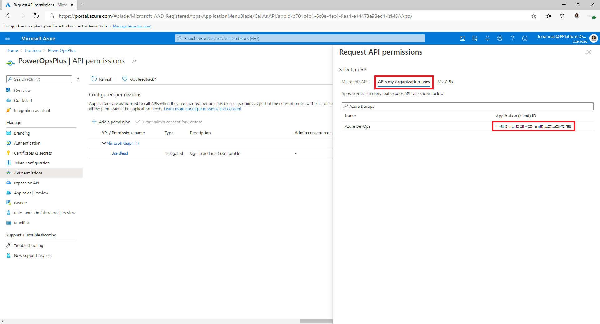
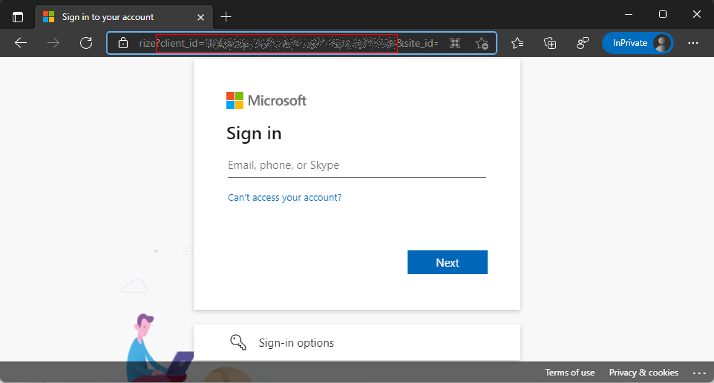

# Set up ALM accelerator for Power Platform components manually

The ALM Accelerator for Microsoft Power Platform components enable makers to apply source-control strategies with Azure DevOps, and use automated builds and deployment of solutions to their environments without the need for manual intervention by the maker, administrator, developer, or tester. In addition, the ALM accelerator helps makers work without intimate knowledge of the downstream technologies and be able to switch quickly from developing solutions to source-controlling the solution and, ultimately, pushing their apps to other environments with as few interruptions to their work as possible.

The ALM accelerator doesn't have a dependency on other components of the CoE Starter Kit. It can be used independently.

## Setup options

Two setup options are available for the ALM accelerator for Microsoft Power Platform:

- Set up by using the [ALM Accerator admin app](setup-admin-tasks.md).

- Set up manually by using the step-by-step walk-through described in this article.

## Document structure

This setup guide is structured into seven main sections:

- [**Prerequisites**](#prerequisites): Considerations and requirements to complete the setup.
- [**Foundational setup**](#foundational-setup): This section walks through the base setup of the ALM accelerator for Microsoft Power Platform. The base setup consists of the steps and configurations required.
- [**Development project setup**](#development-project-setup): This section includes the steps required to set up a new development project covering project-specific setup of Azure DevOps, generic build and deployment pipelines, Service connections, Power Platform environments, and application users.
- [**Solution setup**](#solution-setup): These steps are specific to each solution you wish to support with the ALM accelerator. The section covers setting up the solution-specific pipelines, branch policies, deployment variables to support connections references, environment variables, and Azure AD group sharing.
- [**Importing the solution and configuring the app**](#importing-the-solution-and-configuring-the-app): These are the steps required to import the actual ALM Accelerator for Power Platform canvas app and configure the included custom connector.
- [**Set up makers to use the ALM Accelerator for Power Platform app**](#set-up-makers-to-use-the-alm-accelerator-for-power-platform-app): A short introduction to using the ALM Accelerator for Power Platform canvas app.
<!-- - **Troubleshooting**: A few pointers on some known issues and how to remediate them. -- Missing from this article-->

## Prerequisites

### Dataverse environments

The ALM accelerator for Microsoft Power Platform must be installed into a Power Platform environment with a Microsoft Dataverse database. From this environment, the ALM Accelerator for Power Platform app can be used to deploy solutions from development to validation to testing to production. All of these environments will also require a Dataverse database to deploy your solutions.

> [!NOTE]
> Currently, the ALM accelerator isn't compatible with Dataverse for Teams. Both the ALM Accelerator for Power Platform app and the associated Azure DevOps pipelines assume that the full version of Dataverse is being used in all environments.

You'll need to create an environment in which to set up the ALM accelerator for Microsoft Power Platform. We recommend that you install the accelerator in the same environment as other CoE Starter Kit solutions. For more information about how to decide on the best strategy for your organization, go to [Establishing an environment strategy for Microsoft Power Platform](../adoption/environment-strategy.md) and [Environment strategy for ALM](../../alm/environment-strategy-alm.md).

### Azure DevOps organization

The ALM accelerator uses Azure DevOps for source control and deployments (pipelines). You can sign up for Azure DevOps for free for up to five users on the [Azure DevOps](https://azure.microsoft.com/services/DevOps/) site.

### Users and permissions

To complete the steps in this section, you'll need the following users and permissions in Microsoft Power Platform, Azure DevOps, and Azure:

- A licensed Azure user with permissions to create and view Azure AD groups, create app registrations, and grant admin consent to app registrations in Azure AD.
- A licensed Azure DevOps user with permissions to create and manage pipelines, service connections, repos, and extensions.
- A licensed Microsoft Power Platform user with permissions to create application users and grant administrative permissions to the application user.

### Connectors and data loss prevention policy

For the ALM Accelerator for Power Platform canvas app to work, the following connectors must be available to be used together in the environment into which the ALM accelerator is imported:

- [Dataverse (legacy)](/connectors/commondataservice/)
- [Power Apps for Makers](/connectors/powerappsforappmakers/)
- [HTTP with Azure AD](/connectors/webcontents/) (with endpoint access to <https://graph.microsoft.com>)
- ALM Accelerator Custom DevOps (this connector is created as part of the [accelerator solution import](#importing-the-solution-and-configuring-the-app))
- [Office 365 Users](/connectors/office365users/)
- HTTP

### Creator Kit

The ALM Accelerator includes features that required the installation of the **Creator Kit** in the environment where you install ALM Accelerator for Power Platform.

To install the **Creator Kit**, follow the steps described in [Install Creator Kit](/power-platform/guidance/creator-kit/setup).

## Foundational setup

The following steps guide you through setting up the foundations of the ALM accelerator for Microsoft Power Platform. These steps are general to the functionality of the ALM accelerator, and aren't project-specific or solution-specific.

### Create an app registration in your Azure AD environment

Creating an app registration for the ALM accelerator is a one-time setup step to grant permissions to the app and the associated pipelines, permissions required to perform operations in Azure DevOps and Power Apps or Dataverse. The following steps show how to create a single app registration with permissions for both Dataverse and Azure DevOps. However, you might want to separate responsibilities specifically into Dataverse and Azure DevOps by creating separate app registrations.

> [!NOTE]
> When separating the responsibilities of Azure App registration you should consider both maintenance and security aspect. Read the [Considerations for App Registrations](app-registration-strategy.md) page to understand more.

1. Sign in to the [Azure portal](https://portal.azure.com).

2. Go to **Azure Active Directory** > **App registrations**.

3. Select **New registration**, and then give the registration a name, such as **ALMAcceleratorServicePrincipal**. Leave all other options as default, and then select **Register**.

4. Select **API permissions** > **+ Add a permission**.

5. Select **Dynamics CRM**, and configure permissions as follows:

    - Select **Delegated permissions**.
    - Select **user_impersonation**.

6. Select **Add permissions**.

7. Repeat the preceding steps for the following permissions:
    - **PowerApps-Advisor (Analysis All)**. This is required for running static analysis via the [app checker](../../alm/checker-api/overview.md). This permission can be found under **APIs my organization uses**.

    - **DevOps**. This is required for connecting to Azure DevOps via the custom connector in the ALM accelerator app. This permission can either be found under Microsoft APIs or under **APIs my organization uses**.

      If adding the Azure DevOps permissions from the **APIs my organization uses** list you should copy the **Application (client) ID** for later use.

        > [!IMPORTANT]
        > You'll use this value later and specifically call it out as the **DevOps Application (client) ID**, which is different from the **Application (client) ID** you'll copy in step 12 of this procedure.

      

      If you can't find the Azure DevOps permissions in the **APIs my organization uses** you can get the **DevOps Application (client) ID** by following these steps:

      1. Open a private browser session and go to `https://dev.azure.com/[your devops organization]/_apis`
      2. After being redirected to the sign-in page, copy the value of the **client_id** parameter in the url on the sign-in page

      

8. After adding permissions in your app registration, select **Grant Admin consent for (your tenant)**.

9. Select **Certificates & Secrets**, and then select **New client secret**.

10. Set the **Expiration**, and then select **Add**.

11. After adding the secret, copy the value and store it for safekeeping to be used later.

12. Return to the **Overview** section of your app registration, and copy the **Application (client) ID** and **Directory (tenant) ID**.

     > [!IMPORTANT]
     > You'll use this value later and call it out as the **Application (client) ID**, which is different from the **DevOps Application (client) ID** you copied earlier in step 7.

13. Select **Add a Redirect URI** > **Add a Platform** > **Web**.

14. Set the **Redirect URI** to `https://global.consent.azure-apim.net/redirect`.

    > [!NOTE]
    > You might need to update this later when configuring your custom connector after you've installed the app, if this URL is different from the **Redirect URI** populated in the custom connector.

15. Select **Configure**.

### Give Power App Management Permission to your App

In order for the pipelines to perform certain actions against the environments (for example, Sharing Apps and setting component ownership) in your Power Platform tenant you'll need to grant Power App Management permissions to your App registration. To do so, you'll need to run the following PowerShell cmdlet as an interactive user that has Power Apps administrative privileges. You'll need to run this command once, using an interactive user, in PowerShell after your app registration has been created. The command gives permissions to the Service Principal to be able to execute environment related functions including querying for environments and connections via [Microsoft.PowerApps.Administration.PowerShell](/powershell/module/microsoft.powerapps.administration.powershell/new-powerappmanagementapp). Learn more: [**New-PowerAppManagementApp** cmdlet](/powershell/module/microsoft.powerapps.administration.powershell/new-powerappmanagementapp)

> [!IMPORTANT]
> Currently this cmdlet gives elevated permissions (for example, Power Platform Admin) to the app registration. Your organization's security policies may not allow for these types of permissions. Ensure that these permissions are allowed before continuing. In the case that these elevated permissions are not allowed certain capabilities won't work in the AA4PP pipelines.

```powershell
Install-Module -Name Microsoft.PowerApps.Administration.PowerShell
Install-Module -Name Microsoft.PowerApps.PowerShell -AllowClobber
New-PowerAppManagementApp -ApplicationId [the Application (client) ID you copied when creating your app registration]
```

### Install Azure DevOps extensions

The ALM accelerator uses several Azure DevOps extensions, including some third-party extensions that are available in the Azure DevOps marketplace. Under **Organization settings** in Azure DevOps, install the extensions described in the following procedure. For more information about Azure DevOps extensions from Microsoft and others, go to [Evaluate a Marketplace extension publisher](/azure/devops/marketplace/trust). In addition, each of the third-party extension's webpages and the link to their source code are provided in the following list.

1. Go to <https://dev.azure.com>, and select **Organization settings**.

1. Select **General** > **Extension**.

1. Install the following extensions:

   - **Power Platform Build Tools (required)**: This extension contains the Microsoft build tasks for Microsoft Power Platform. (<https://marketplace.visualstudio.com/items?itemName=microsoft-IsvExpTools.PowerPlatform-BuildTools>)

   - **Replace Tokens (required)**: This extension is used by the pipelines to replace tokens in configuration files to be able to store secure values in private variables configured for a pipeline. (<https://marketplace.visualstudio.com/items?itemName=qetza.replacetokens> | <https://github.com/qetza/vsts-replacetokens-task>)

   - **SARIF SAST Scans Tab (optional)**: This extension can be used to visualize the SARIF files that are generated by the Solution Checker during a build. ([SARIF SAST Scans Tab - Visual Studio Marketplace](https://marketplace.visualstudio.com/items?itemName=sariftools.scans))

      

<a name="clone-the-yaml-pipelines-from-github-to-your-devops-instance"></a>

### Clone the YAML pipelines from GitHub to your Azure DevOps instance

1. Go to <https://dev.azure.com/> and sign in to **DevOps (AzDO)**.

1. Create a new project or select an existing project.

1. Go to **Repos**, and then select **Import repository** from the repository dropdown list.

1. Get the URL of the tag for the latest release, heading to [https://aka.ms/coe-alm-accelerator-templates-latest-release](https://aka.ms/coe-alm-accelerator-templates-latest-release) and copying the address you're redirected to, and use as the **Clone URL**—and then select **Import**.

1. Check that the default branch for this repo is `main`. Choose **Repos** and **Branches** and ensure that the `main` branch is tagged as the default.
   If it isn't, select the three vertical dots (**&vellip;**) corresponding to the `main` branch, and from the **More options** menu, select **Set as default branch**.

   > [!NOTE]
   > The Azure DevOps repo you created will be where the solution pipeline templates and the export/import pipelines will run. Later, when you create the pipelines for your solutions, you might need to reference this specific project/repo if you choose to use another repo in Azure DevOps for source control for your solutions.

### Create pipelines for import, delete, and export of solutions

Follow the steps in this section to create the following pipelines based on the YAML in the Azure DevOps repo. These pipelines will run when you **Commit to Git**, **Import a Solution**, or **Delete a Solution** from the app, respectively.

> [!NOTE]
> If all your exports are expected to perform the same actions regardless of the solution for which the pipeline is running, it's sufficient to create a single export pipeline as described in this section. However, there might be circumstances where you want to do things differently when exporting, based on the specific solution. In such a case, you can append the solution name to the export-solution-to-git pipeline to have the app execute your specific solution pipelines when you perform the actions in the app, such as *export-solution-to-git-SampleSolution*.

| YAML file                                    | Pipeline name                            |
| -------------------------------------------- | ---------------------------------------- |
| export-solution-to-git.yml                   | export-solution-to-git                   |
| import-unmanaged-to-dev-environment.yml      | import-unmanaged-to-dev-environment      |
| delete-unmanaged-solution-and-components.yml | delete-unmanaged-solution-and-components |

1. In Azure DevOps, go to **Pipelines** > **Create a New Pipeline**.

1. Select **Azure Repos Git** for your code repository and point to the Azure DevOps repo you created and seeded with the pipeline templates in the preceding steps.

1. On the **Configure your pipeline** page, select **Existing Azure Pipelines YAML file** and point to **/Pipelines/export-solution-to-git.yml**, **/Pipelines/import-unmanaged-to-dev-environment.yml** or **/Pipelines/delete-unmanaged-solution-and-components.yml**. Select **Continue**.

1. On the next screen,  select **Save**, select the three dots **(...)** next to **Run Pipeline**, and then select **Rename/Move**.

1. Update the pipeline name to **export-solution-to-git**, **import-unmanaged-to-dev-environment**, or **delete-unmanaged-solution-and-components**. Select **Save**.

### Create export pipeline variables (optional)

There are a few optional pipeline variables that can be set on the export-solution-to-git pipeline to control what information is persisted to source control. If you want to apply these settings globally, you can set the following variables on your export-solution-to-git pipeline. Or, if you want to apply these settings to specific solutions on export, create a specific export pipeline for your solution as described earlier and set the following variables on your solution-specific export pipeline.

The **DoNotExportCurrentEnvironmentVariableValues** variable can be used to ensure that the current values of environment variables are never committed to source control during the export process. To enable this feature, create a new pipeline variable for your export-solution-to-git pipeline and set the value to true.

> [!IMPORTANT]
> This pipeline variable is recommended so that you can use the deployment configuration functionality in the ALM Accelerator for Power Platform app.

The **VerifyDefaultEnvironmentVariableValues** can be used to ensure that specific default environment variable values are set during the export of a solution. The default environment variable values can be configured as part of the customDeploymentSettings.json configuration in the [deployment configuration guide](setup-data-deployment-configuration.md). To enable this feature, create a new pipeline variable for your export-solution-to-git pipeline and set the value to true.

### Create pipeline global variables

1. In Azure DevOps, select **Pipelines** > **Library** > **Create a new Variable Group**.

1. Name the variable group **alm-accelerator-variable-group**.

    > [!NOTE]
    > The pipelines reference this specific variable group, so it must be named exactly as shown. If you decide to use a different naming convention for your variable group, you'll need to modify parts of the pipelines to reference the name you use instead.

1. Add the following variables to the variable group.

    |Name| Value |
    |--|--|
    | AADHost | The Azure Active Directory authorization endpoint, for public cloud use: **login.microsoftonline.com**, for government clouds use the appropriate authorization url. |
    | ProcessCanvasApps            | If false, then the canvas apps won't be unpacked during export or packed during builds. The [canvas unpack and pack functionality is currently in preview](https://aka.ms/paccanvas), therefore it's not recommended for use in production environments at this time. However, you won't be able to view canvas source code in source control unless you set this variable to true. |
1. **Optional**. When using Canvas studio Test Automation in your pipelines, the following variables are also required in the variable group.

    |Name| Value |
    |--|--|
    | TestAutomationLoginMethod | **`CloudIdentity`** |
    | TestAutomationMakerPortalUrl | The URL from the Power Apps maker portal, typically **`https://make.powerapps.com`** |
    | TestAutomationUsername | The user account used to execute the automated tests. |
    | TestAutomationPassword | The password for the user account to execute the automated tests. |

1. **Optional**. By default, the global variables are restricted and access for each pipeline must be configured. Is possible to simplify, and allow access to any pipeline. To configure **Open access**, under the **Variable group** (Pipelines->Library->alm-accelerator-variable-group) select **Pipeline permissions** in the top menu. Select ... and select **Open access**.

### Update permissions for the project build service

> [!IMPORTANT]
> There are a number of "Build Service" accounts in Azure DevOps that might be confusing as you follow these steps. Pay close attention to the names and format specified in steps 3 and 5. You might need to search for the specific account if it doesn't show up in the initial list.

1. In Azure DevOps on the left pane, select **Project settings**.

1. Select **Repositories** > **Security**.

1. Find and select **Project Collection Build Service ([Your Organization Name])** under **Users**.

   > [!NOTE]
   > In some cases, you might not see Your *Organization Name* after the **Project Collection Build Service** user. In these cases, it might just be a unique identifier and you might need to use the search function to find this user. Select this user.

1. Set the following permissions for the build service user.

   | Permission | Value |
   |--|--|
   | Contribute | Allow |
   | Contribute to pull requests | Allow |
   | Create branch | Allow |
   | Edit policies | Allow |

1. Find and select the username **[Your Project Name] Build Service ([Your Organization Name])** under **Users**, and then set the same values as in the previous step.

1. Select **Pipelines**, select the three dots (**...**) in the upper-right corner, and then select **Manage Security**.

1. Set the following permissions for **[Your Project Name] Build Service ([Your Organization Name])** user.

   | Permission                            | Value |
   | ------------------------------------- | ----- |
   | Edit build pipeline                   | Allow |
   | Edit build quality                    | Allow |
   | Manage build queue                    | Allow |
   | Override check-in validation by build | Allow |
   | Update build information              | Allow |
   | View builds pipeline                   | Allow |
   | View builds                           | Allow |

1. Select **Project settings** - **Agent pools** and select **Security**, and then select **Add**.

1. Find and select the username **[Your Project Name] Build Service ([Your Organization Name])**, and then set the **Role** to Reader. Select **Add**.

1. **Optional**. By default, the pipeline permissions for each repository are restricted and needs to be configured individually. To give access to  any pipeline open the repository (Project Settings -> Repositories), select each repository and select **Security** from the top menu. Find the **Pipeline permissions** block and select ... and select **Open access**.

## Development project setup

The following section guides you through the setup steps required for each of the development projects you support. In this context, a development project signifies the required infrastructure and configuration needed to support healthy ALM, including configuration of your Dataverse environment that supports the ALM process.

### Create service connections for Azure DevOps to access Microsoft Power Platform<a name="create-service-connections-for-azure-devops-to-access-power-platform"></a>

Each Dataverse environment—development, validation, test, or production—must have a Power Platform service connection in Azure DevOps. For each of your environments, follow these steps to set up the service connection.

> [!NOTE]
> Users of the ALM Accelerator for Power Platform app only see environments for which they have either a user or administrator role on the service connection in Azure DevOps. If they're using personal development environments, all developers must have a user or administrator role for the service connection for their own development environment. Validation, test, and production environment service connections only need permissions granted to pipelines (for example, the build service).

1. Go to <https://dev.azure.com> and select your **Project**.

1. Under **Project settings** in your Azure DevOps project, select **Service connections**.

1. Select **Create/New service connection**, search for Power Platform, and then select the **Power Platform** service connection type. Select **Next**.

1. In the **Server URL**, enter your environment URL, for example `https://myorg.crm.dynamics.com/`.
   > [!IMPORTANT]
   > You must include the trailing forward slash after the URL (**.com/**, in the preceding example).

1. For the **Service Connection Name**, enter the same URL that you used in step 4.

   > [!IMPORTANT]
   >
   > - The ALM accelerator will use the service connection name to identify the service connection to use for each environment, so this needs to be the same URL you entered in step 4.
   > - You must include the trailing forward slash after the URL. In the preceding example, this is **.com/**.

1. Enter the **Tenant ID**, **Application (client) ID**, and **Client Secret** you copied from Azure AD when you created your app registration, and then select **Grant access permissions to all pipelines**. Select **Save**.

1. In order for users to be able to use the service connection from the ALM Accelerator for Power Platform app, the service connections must provide user permissions to all users. Update permissions as follows for environments that users need to be able to access from the app (for example, maker environments):

    1. From the **Service Connections** list, select the service connection to be shared with users

    1. Select **More (...)** in the upper-right corner, and then select **Security**.

    1. Select the **Group or User** you want to provide user permissions to in the dropdown list.

    1. Select the **User**, select a **Role**, and then select **Add**.

Repeat these steps for each of your environments—development, validation, test, and production.

### Update permissions for the project build service to use the Service Connections

1. In Azure DevOps on the left pane, select **Project settings**.

1. Select **Service connections**, select **...** in the upper-right corner, and then select **Security**. Select **Add**.

1. Find and select the username **[Your Project Name] Build Service ([Your Organization Name])**, and then set the **Role** to Administrator. Select **Add**.

### Create an app user in your Dataverse environments

Each environment—development, validation, test, and production—needs an application user. For each of your environments, follow these steps to set up the application user.

1. Go to [Power Platform admin center](https://aka.ms/ppac).

1. Select your environment, and then select **Settings**.

1. Select **Users + permissions** > **Application users**.

1. Select **New app user** to add a new application user.

1. Select the Azure app registration you created, **Business Unit**, and **Security Role**.

    > [!NOTE]
    > We recommend that you give this user system administrator security role privileges, so the user can perform the required functions in each of the environments.

Repeat the previous steps for each of your environments—development, validation, test, and production.

## Solution setup

When you create a solution in Dataverse, you need to create pipelines specifically for that solution. Follow these steps for creating pipelines for your solution in Azure DevOps. There are sample pipelines included in the **Pipelines** directory in the CoE ALM templates repo.

- <https://github.com/microsoft/coe-alm-accelerator-templates/blob/main/Pipelines/build-deploy-validation-SampleSolution.yml>
- <https://github.com/microsoft/coe-alm-accelerator-templates/blob/main/Pipelines/build-deploy-test-SampleSolution.yml>
- <https://github.com/microsoft/coe-alm-accelerator-templates/blob/main/Pipelines/build-deploy-prod-SampleSolution.yml>

The sample pipelines provide flexibility for organizations to store their pipeline templates in a separate project or repo from the specific solution pipeline YAML. Follow the steps in this section to configure your solution pipeline. Repeat the steps for each of the solutions you are source-controlling with the ALM accelerator.

> [!IMPORTANT]
> The pipeline YAML for your solution pipeline will always be stored in the same repo you'll be using for source control for your solution. However, the pipeline templates—that is, the folder Pipeline\Templates—can exist either in the same repo as your solution pipeline YAML or in a separate repo or project.

### Create the solution build and deployment pipelines

Solution pipelines are used to build and deploy your source-controlled solutions to environments in your tenant. You can create as many solution pipelines as needed based on your organization's environment strategy. The sample pipelines provided assume that there are only three environments: validation, test, and production. However, you can create more as needed, with specific triggers in the pipelines or without triggers that can be run manually as well. The sample deployment pipelines are triggered off of changes to a branch (that is, test and production) or as a part of a branch policy in Azure DevOps (that is, validation). For more information about branch policies, go to [Setting branch policies for pull request validation](#setting-branch-policies-for-pull-request-validation).

The following steps show how to create a pipeline from the sample pipeline YAML. Follow these steps to create all of your deployment pipelines. For reference, your pipelines follow this configuration.
> [!IMPORTANT]
> The pipeline name must be exactly as shown in the following table. You'll replace *MyNewSolution* with the name of your solution.

| Pipeline YAML file name                   | Pipeline name                   | Branch policy enabled | Required              |
| ----------------------------------------- | ------------------------------- | --------------------- | --------------------- |
| build-deploy-validation-MyNewSolution.yml | deploy-validation-MyNewSolution | Yes                   | Yes                   |
| build-deploy-test-MyNewSolution.yml       | deploy-test-MyNewSolution       | No                    | Yes                   |
| build-deploy-prod-MyNewSolution.yml       | deploy-prod-MyNewSolution       | No                    | No (Go to the next section) |

> [!NOTE]
> The following steps create pipelines that build and deploy for each environment (validation, test, and production). However, you might want to only build and deploy for validation and test, and then deploy the artifacts from the test build to production. Instructions for doing this are included in the [Create the solution deployment pipeline](#create-the-solution-deployment-pipeline-optional) section. If this is your preferred method of setting up the pipelines, follow the steps in this section for only your validation and test environments. Then, skip to the next section to see how to configure your release pipeline.

1. In Azure DevOps, go to the repo that contains the [pipelines folder you committed](#clone-the-yaml-pipelines-from-github-to-your-devops-instance), and select the **Pipelines** folder.

1. Open the sample deployment pipeline (that is, **build-deploy-validation-SampleSolution.yml**, **build-deploy-test-SampleSolution.yml**, or **build-deploy-prod-SampleSolution.yml**) and copy the YAML to use in your new pipeline.

1. Note the name of the repo for use in your pipeline.

1. Go to the repo that you want to use for source control for your solution.

1. Create a new branch based on your default branch in the repo with the name of your solution. For example *MyNewSolution*.

    > [!NOTE]
    > This branch will be your next version (v-next) branch for your solution in the repo. All development work must be branched from this branch to a developer's personal working branch, and then merged into the v-next branch in order to push to validation and testing. Later, when a release is ready, the v-next branch can be merged into the main or default branch.

1. Select **New** from the top menu, and then select **Folder**.

1. Give the new folder the same name as your solution, such as *MyNewSolution*, and the new pipeline YAML file a name, such as **build-deploy-validation-SampleSolution.yml**, **build-deploy-test-SampleSolution.yml**, or **build-deploy-prod-SampleSolution.yml**). Select **Create**.

1. Paste the YAML from **build-deploy-validation-SampleSolution.yml**, **build-deploy-test-SampleSolution.yml**, or **build-deploy-prod-SampleSolution.yml** into your new pipeline YAML file.

1. Update the following values in your new pipeline YAML:

   - Change the **Resources** > **Repositories** > **Name** to the name of the repo that contains your pipeline templates. If your template repository is in another Azure DevOps project, you can use the format **projectname/reponame**. In this example, the repo is named **coe-alm-accelerator-templates** and it exists in the same project as our **MyNewSolution** repo. Additionally, you can specify a branch for where your templates live by using the `ref` parameter if necessary.

   - Change any value that references **SampleSolutionName** to the unique name of your solution. For example *MyNewSolution*.

1. Select **Commit** to save your changes.

1. In Azure DevOps, go to **Pipelines**, and then select **Create a New Pipeline**.

1. Select **Azure Repos Git** for your code repository.

1. Select the **DevOps repo**, which contains the deployment pipeline YAML.

1. On the **Configure your pipeline** page, select **Existing Azure Pipelines YAML file**, point to the YAML file in your repo that you created previously, and then select **Continue**.

1. On the next screen, select **Save**, select **...** next to **Run Pipeline**, and then select **Rename/Move**.

1. Update the pipeline name to **deploy-validation-MyNewSolution**, **deploy-test-MyNewSolution**, or **deploy-prod-MyNewSolution** where *MyNewSolution* is the name of your solution—and then select **Save**.

1. Update the **Default branch for manual and scheduled builds**. More information: [Configure pipeline triggers](/azure/devops/pipelines/process/pipeline-triggers?tabs=YAML#branch-considerations-for-pipeline-completion-triggers).

      > [!NOTE]
      > If your new pipeline wasn't created in the default branch of the repo, you might need to update the **Default branch for manual and scheduled builds**. Go to [Configure pipeline triggers](/azure/devops/pipelines/process/pipeline-triggers?tabs=YAML#branch-considerations-for-pipeline-completion-triggers) for more information about **Default branch for manual and scheduled builds**.

      - Select **Edit** on your new pipeline.

      - Select **...** in the upper-right corner, and then select **Triggers**.

      - Select the **YAML** tab, and then select **Get Sources**.

      - Update the **Default branch for manual and scheduled builds** to point to your solution branch.

1. Repeat the preceding steps to create a deployment pipeline for each of your environments referencing the sample deployment pipeline YAML from the **coe-alm-accelerator-templates repo** (deploy-validation-SampleSolution.yml, deploy-test-SampleSolution.yml, and deploy-prod-SampleSolution.yml).

1. Select **Save and Queue**, and then select **Save**.

### Create the solution deployment pipeline (optional)

As mentioned in the preceding note, the previous section allows you to create pipelines that build and deploy for each environment (validation, test, and production). However, if you want to only build and deploy for validation and test, and then deploy the artifacts from the test build to production, you can follow these instructions to create your production deployment pipeline after you've created your build and deploy pipeline for validation and test. For reference, your pipeline will be configured as follows.

> [!IMPORTANT]
> The following pipeline name must be exactly as shown. You'll replace *MyNewSolution* with the name of your solution.

| Pipeline YAML file name       | Pipeline name             | Branch policy enabled |
| ----------------------------- | ------------------------- | --------------------- |
| deploy-prod-MyNewSolution.yml | deploy-prod-MyNewSolution | No                    |

1. In Azure DevOps, go to the repo that contains the [pipelines folder you committed](#clone-the-yaml-pipelines-from-github-to-your-devops-instance) and select the **Pipelines** folder.

1. Open the sample deployment pipeline (**deploy-prod-pipelineartifact-SampleSolution.yml**), and copy the YAML to use in your new pipeline.

1. Note the name of this repo for use in your pipeline.

1. Go to the repo where you want to source-control your solution.

1. Select **New** from the top menu, and then select **File**.

1. Give the new pipeline YAML file a name. For example *deploy-prod-MyNewSolution.yml*. Select **Create**.

1. Paste the YAML from **deploy-prod-pipelineartifact-SampleSolution.yml** into your new pipeline YAML file.

1. Update the following values in your new pipeline YAML:

   - Update the **Trigger** > **Branches** > **Include** to the branches for which changes would trigger a deployment to production.

   - Change the **Resources** > **Repositories** > **Name** to the name of the repo that contains your pipeline templates. If your template repository is in another Azure DevOps project, you can use the format **projectname/reponame**. In this example, the repo is named **coe-alm-accelerator-templates** and it exists in the same project as the **MyNewSolution** repo. Additionally, you can specify a branch for where your templates live by using the `ref` parameter if necessary.

   - Update **Resources** > **Pipelines** > **Source** to specify the build pipeline that contains the artifacts to be deployed by this pipeline. In this case, we're going to deploy the artifacts from the test pipeline created earlier, which built and deployed our solution to the test environment.

   - Change any value that references **SampleSolutionName** to the unique name of your solution (in this example, *MySolutionName*).

1. Repeat steps 9 through 17 from the previous section for **deploy-validation-ALMAcceleratorSampleSolution** and **deploy-test-ALMAcceleratorSampleSolution**, to create a pipeline from the new production pipeline YAML named **deploy-prod-ALMAcceleratorSampleSolution**.

### Setting deployment pipeline variables

**EnvironmentName** and **ServiceConnection** variables are required for each pipeline. These pipeline variables are set for each deployment pipeline you've configured earlier, based on the environment to which your pipeline deploys.

#### Create environment and service connection variables (required)

These variables are required by every deployment pipeline. The environment variable is **EnvironmentName** and the service connection variable is **ServiceConnection**.

The **EnvironmentName** variable is used to specify the Azure DevOps environment being deployed, to enable tracking deployment history and set permissions and approvals for deployment to specific environments. Depending on the environment to which you're deploying, set this value to **Validate**, **Test**, or **Production**. For more information on environments in Azure DevOps, go to [Create and target an environment](/azure/devops/pipelines/process/environments).

The **ServiceConnection** variable is used to specify how the deployment pipeline connects to Microsoft Power Platform. The values used for the service connection variable are the names of the service connections you created earlier in [Create service connections for Azure DevOps to access Microsoft Power Platform](#create-service-connections-for-azure-devops-to-access-power-platform).

- Select **Edit** on each of the deployment pipelines.
- Select the **Variables** button on the deployment pipeline definition, this action opens the Variables Editor.
- To add the above variables, select the **(+)** button and give the name of the variable and the appropriate value for the variable.

#### Create the EnableFlows variable (optional)

You can optionally set a pipeline variable on your deployment pipelines to turn off the automatic enabling of flows after your solution is imported. This variable is **EnableFlows**. Setting **EnableFlows** to false results in the pipeline skipping the steps to enable Power Automate flows as part of your deployment. The default value of the **EnableFlows** variable is true.

> [!NOTE]
> You only need to set the **EnableFlows** variable if you want to skip enabling flows after your solution is imported.

### Setting branch policies for pull request validation

To execute the build pipeline for your solution when a pull request is created, you'll need to create a branch policy to execute the pipeline you created in the previous step. Use the following steps to set your branch policy. More information: [Branch policies](/azure/devops/repos/git/branch-policies)

1. In Azure DevOps, go to **Repos**, and then select the **Branches** folder.

1. Locate the target branch on which you want to run the pull request policy, select **...** to the right of the target branch, and then select **Branch Policies**.

1. On the **Branch Policies** page, go to **Build Validation**.

1. Select **+** to add a new branch policy.

1. Select the pipeline you created from the **Build pipeline** dropdown list.

1. Specify a **Path filter** (if applicable). The path filter ensures that only changes to the path specified will trigger the pipeline for your pull request.

1. Set the **Trigger** to **Automatic**.

1. Set the **Policy requirement** to **Required**.

1. Set the **Build expiration** to **Immediately**.

1. Set a **Display name** for your branch policy, for example *PR Build Validation*.

1. Select **Save**.

   

### Setting resource access permissions for pipelines

For Pipelines to run they need to be able to access required resources, such as repositories, variable groups and service connections. To allow access you have the following three options:

1. You can assign access when prompted on first run of a pipeline that requires access to a resource that the pipeline isn't already permitted to access.
To do so, trigger the pipeline and open the pipeline run in Azure DevOps. Select the **View** button on the permission required banner. Select the **Permit** button for each required resource
1. You can give explicit permissions for each of your pipelines to access required resources such as repositories, variable groups and service connections.

   To give explicit permissions to repositories, follow these steps:

   1. Open **Project Settings**, select **Repositories and select the repository for which you want to set pipeline access.
   2. Select the **Security** tab.
   3. Scroll down to **Pipeline permissions** and select the **+** button.
   4. Select the pipeline that you want to give access to the repository.

   To give explicit permissions to variable groups, follow these steps:

   1. Open the **Pipelines** menu, select **Library** and select the relevant variable group.
   2. Select **Pipeline permissions**.
   3. Select **+** and select the pipeline that you want to give access to the variable group.

   To give explicit permissions to service connections, follow these steps:

   1. Open **Project Settings** and select **Service Connections**.
   2. Select the **Service Connection** for which you want to give access, select the **More actions** button and select **Security**
   3. In the Pipeline permissions section, select the **+** button and select the pipeline that you want to give access to the service connection.

1. You can give access to all pipelines (existing and future) to access a repository, variable groups and service connections.

   To give all pipelines access a repository, follow these steps:

   1. Open **Project Settings**, select **Repositories** and select the repository for which you want to set pipeline access.
   2. Select the **Security** tab.
   3. Scroll down to **Pipeline permissions**.
   4. Select the **More actions** button, select **Open access** and confirm.

   To give all pipelines access to a variable group, follow these steps:

   1. Open the **Pipelines** menu, select **Library** and select the relevant variable group.
   2. Select **Pipeline permissions**
   3. Select the **More actions** button, select **Open access** and confirm.

   To give all pipelines access to a service connection, follow these steps:

   1. Open **Project Settings** and select **Service Connections**.
   2. Select the **Service Connection** for which you want to give access, select the **More actions** button and select **Security**
   3. In the **Pipeline permissions** section, select the **More actions** button, select **Open access** and confirm.

### Create deployment configuration (optional)

There are several configurations that need to be made in a target environment after a solution is deployed. These configurations are specific to the environment into which the solution is being deployed. Included are connection references, environment variables, and setting permissions for Azure AD Groups and Dataverse teams, in addition to sharing canvas apps and updating the ownership of solution components such as Power Automate flows. In addition to these configurations, sample or configuration data associated with Dataverse tables in the solution is frequently required in a target environment, to provide a full end-to-end ALM experience.

If your solution requires these other configuration settings or data, follow the [deployment configuration guide](setup-data-deployment-configuration.md) to configure your pipelines based on the environments to which you're deploying.

## Importing the solution and configuring the app

### Install the ALM accelerator in Dataverse

1. The ALM Accelerator solution has a dependency on the [Creator Kit](/power-platform/guidance/creator-kit/overview). To install the Creator, go to [Install the Creator Kit](/power-platform/guidance/creator-kit/setup).

1. Download the latest managed solution file from [GitHub](https://github.com/microsoft/coe-starter-kit/releases): CenterofExcellenceALMAccelerator_`[latest version]`_managed.zip.

1. Go to [Power Apps](https://make.powerapps.com) and select the environment you want to use to host the ALM Accelerator for Power Platform app.

1. On the left pane, select **Solutions**.

1. Select **Import**, and browse to the location of the managed solution you downloaded.

1. Select **Next**, and then select **Next** again.

1. On the **Connections** page, select or create a new connection to use to connect to Dataverse for the **CDS DevOps connection**.

    > [!NOTE]
    > When creating a connection for **HTTP with Azure AD**, use **[Microsoft Graph](https://graph.microsoft.com)** for both parameters.

1. Select **Import**, and wait for the solution to complete the import process.

### Configure the DevOps custom connector

1. In [Power Apps](https://make.powerapps.com), select your environment, and then select **Data** > **Custom Connectors** > **CustomAzureDevOps**.

1. Select **Edit**, go to the **Security** section, select **Edit**, and then set the following fields.

   | Name | Value |
   |--|--|
   | **Authentication Type** | **OAuth 2.0** |
   | **Identity provider** | **Azure Active Directory** |
   | **Client ID** | The **Application (client) ID** you copied when [creating the app registration](#create-an-app-registration-in-your-azure-ad-environment) |
   | **Client secret** | The **Application (client) Secret** you copied when [creating the app registration](#create-an-app-registration-in-your-azure-ad-environment) |
   | **Tenant ID** | Leave as the default, **common** |
   | **Resource URL** | The **DevOps Application (client) ID** you copied when [adding permissions to your app registration](#create-an-app-registration-in-your-azure-ad-environment) |

1. Select **Update connector**.

1. Verify that the **Redirect URL** is populated on the **Security** page with the URL `https://global.consent.azure-apim.net/redirect`. If the redirect URL is other than `https://global.consent.azure-apim.net/redirect`, copy the URL and [return to the app registration your created](#create-an-app-registration-in-your-azure-ad-environment) and update the redirect URI you set earlier to the updated URL.

1. After you've completed the preceding steps, verify the connector from the **Test** menu:

    1. Open the **Test** menu.

    1. Select **New Connection**, and then follow the prompts to create a new connection.

    1. In [Power Apps](https://make.powerapps.com), select your environment, and then select **Dataverse** > **Custom Connectors** > **CustomAzureDevOps**.

    1. Select **Edit**, go to the **Test** section, and then find the **GetOrganizations** operation.

    1. Select **Test operation**, and verify that the **Response Status** returned is **200**.

    

## Set up makers to use the ALM Accelerator for Power Platform app

- Go to [Configuring user permissions](setup-app-user-permissions.md) for the recommended setup of a maker's user account in Dataverse and Azure DevOps.

- Go to [Configuring deployment user settings and profiles](setup-deployment-user-profiles.md) for how to configure the user experience in the app and grant access to solutions and deployment profiles.

## Read more

- [Use the ALM Accelerator for Power Platform app](overview.md)
- [Configuring deployment user settings and profiles](setup-deployment-user-profiles.md)
- [Configuring user permissions](setup-app-user-permissions.md)
- [Configuration and data deployment in pipelines](setup-data-deployment-configuration.md)
- [Configuring pipeline sync](setup-pipeline-sync.md)

[!INCLUDE[footer-include](../../includes/footer-banner.md)]
